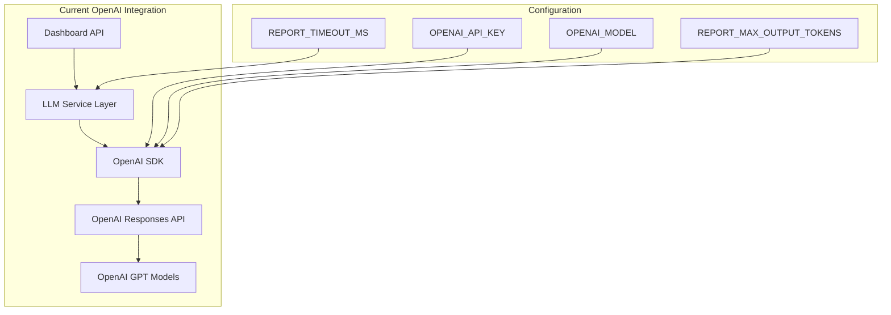
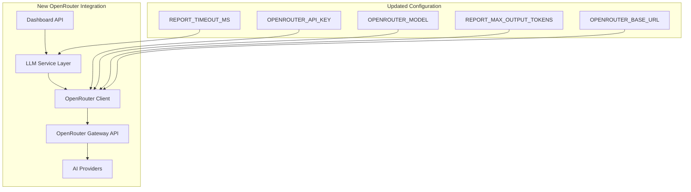
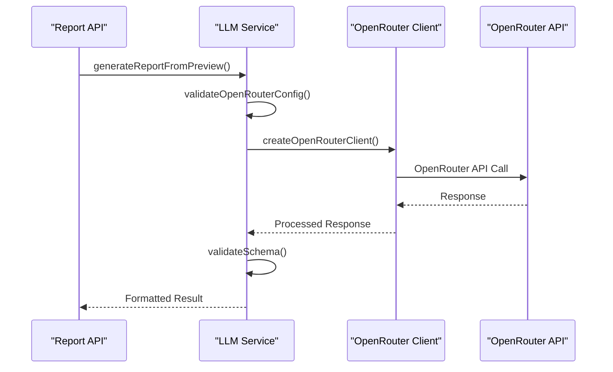
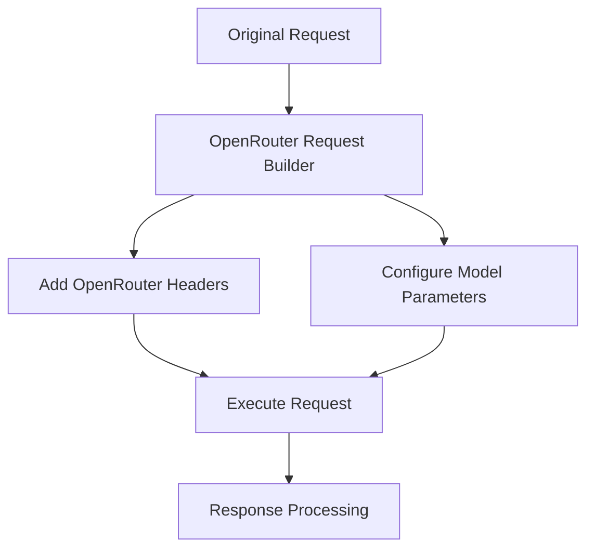
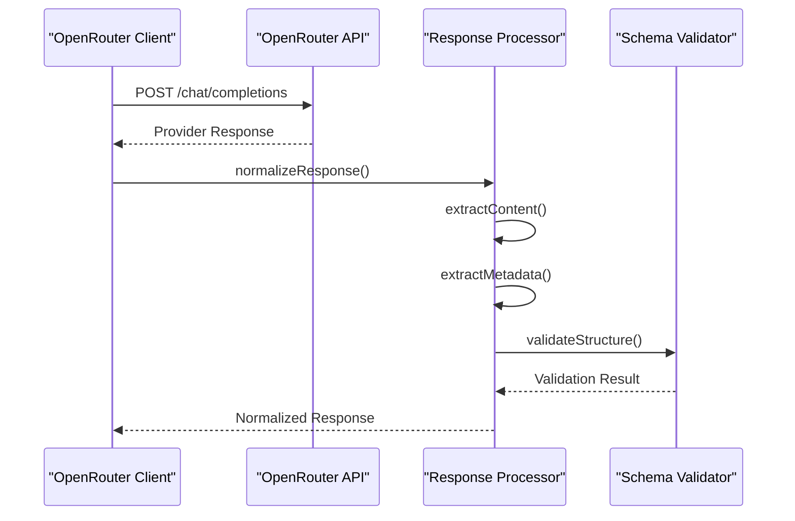
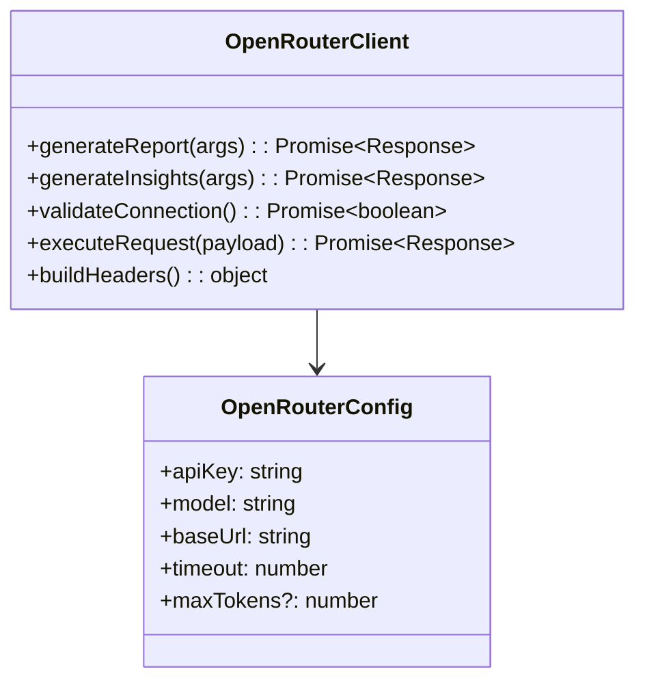
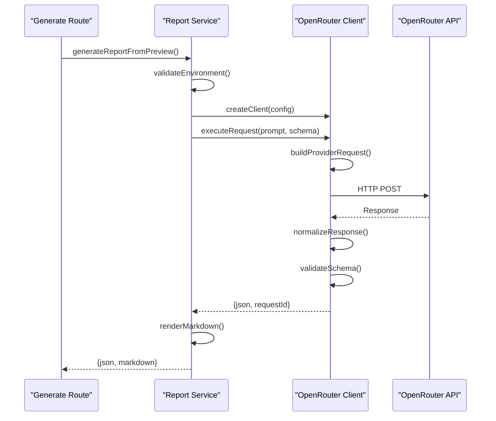
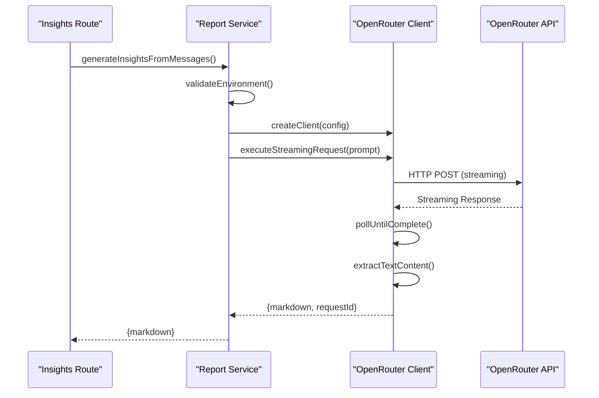

# Switch OpenAI to OpenRouter Integration

## Overview

This design outlines the migration strategy from OpenAI's direct API integration to OpenRouter service for the Telegram dashboard's LLM-powered report generation system. OpenRouter serves as a unified gateway that provides access to multiple AI models through a single API interface, offering better cost optimization and competitive pricing.

The current system uses OpenAI's Responses API with structured JSON schema validation for generating daily digests and insights from Telegram chat data. The migration will maintain existing functionality while leveraging OpenRouter's cost advantages.

## Architecture

### Current System Architecture

### Target OpenRouter Architecture

## Migration Strategy

### Direct OpenRouter Integration

Complete replacement of OpenAI with OpenRouter, updating all configuration and implementation to use the new provider exclusively.

#### Environment Configuration Changes
Replace OpenAI configuration with OpenRouter equivalents:

| Old Configuration Variable | New Configuration Variable | Purpose |
|---------------------------|---------------------------|----------|
| `OPENAI_API_KEY` | `OPENROUTER_API_KEY` | Authentication credential |
| `OPENAI_MODEL` | `OPENROUTER_MODEL` | Model identifier |
| - | `OPENROUTER_BASE_URL` | API endpoint (optional, defaults to api.openrouter.ai) |
| `REPORT_TIMEOUT_MS` | `REPORT_TIMEOUT_MS` | Request timeout (unchanged) |
| `REPORT_MAX_OUTPUT_TOKENS` | `REPORT_MAX_OUTPUT_TOKENS` | Output token limit (unchanged) |

### OpenRouter Integration Implementation

#### Request Format Adaptation
OpenRouter uses OpenAI-compatible API format:

#### Response Processing
Ensure response format compatibility with existing system:

### Cost Optimization
Leverage OpenRouter's competitive pricing:

| Feature | Implementation | Benefit |
|---------|---------------|----------|
| Flexible Model Selection | Easy model switching via config | Cost reduction |
| Request Optimization | Optimize prompt length and parameters | Token usage optimization |
| Usage Monitoring | Track token consumption and costs | Cost transparency |

## Technical Implementation Details

### Client Configuration Interface

Simplified OpenRouter-only client configuration:

### Error Handling Strategy

Update error handling for OpenRouter:

| Error Type | Old Handling | New Handling |
|------------|--------------|---------------|
| Authentication | missing_openai_key | missing_openrouter_key |
| Model Config | missing_openai_model | missing_openrouter_model |
| Timeout | openai_timeout | openrouter_timeout |
| Rate Limiting | HTTP 429 passthrough | HTTP 429 with OpenRouter context |
| Empty Response | openai_empty_content | openrouter_empty_content |

### Request/Response Flow

#### Report Generation Flow

#### Insights Generation Flow

This migration design provides a straightforward approach to switch from OpenAI to OpenRouter for cost optimization while maintaining system functionality.