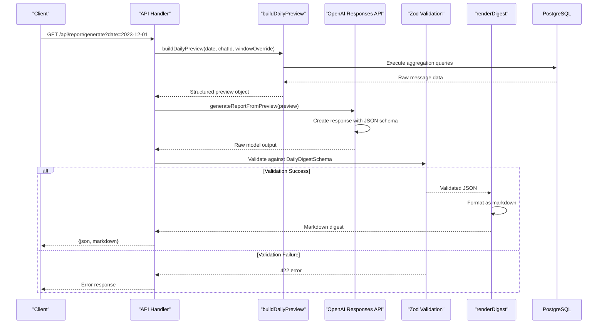

# API Endpoints

<cite>
**Referenced Files in This Document**   
- [app/api/overview/route.ts](file://app/api/overview/route.ts)
- [app/api/report/generate/route.ts](file://app/api/report/generate/route.ts)
- [app/api/report/insights/route.ts](file://app/api/report/insights/route.ts)
- [app/api/report/preview/route.ts](file://app/api/report/preview/route.ts)
- [lib/report/digest_schema.ts](file://lib/report/digest_schema.ts)
- [lib/llm/report.ts](file://lib/llm/report.ts)
- [lib/report/slice.ts](file://lib/report/slice.ts)
- [lib/llm/shared.ts](file://lib/llm/shared.ts)
- [lib/report/digest_render.ts](file://lib/report/digest_render.ts)
</cite>

## Table of Contents
1. [Introduction](#introduction)
2. [GET /api/overview](#get-apioverview)
3. [GET /api/report/generate](#get-apireportgenerate)
4. [GET /api/report/insights](#get-apireportinsights)
5. [GET /api/report/preview](#get-apireportpreview)
6. [Authentication and Environment Assumptions](#authentication-and-environment-assumptions)
7. [Error Handling](#error-handling)

## Introduction

This document provides comprehensive API documentation for the backend endpoints of the `tg-vibecoders-dashboard` application. The system exposes several RESTful endpoints under the `/api` prefix, primarily focused on analytics and AI-powered reporting for Telegram chat data. Key functionalities include real-time overview statistics, daily digest generation using OpenAI, insight extraction, and data preparation for LLM processing.

The architecture follows a Next.js App Router pattern with server-side logic implemented in TypeScript. Data is stored in PostgreSQL and retrieved via the `pg` library. AI integration is handled through the OpenAI Responses API, with strict schema enforcement using Zod. The endpoints are designed to support both direct UI consumption and programmatic access for automation scripts.

All endpoints return JSON responses and follow standard HTTP status codes for error conditions. Query parameters are used extensively to control data filtering and time windowing.

## GET /api/overview

Retrieves a comprehensive analytics overview for a specified time window and optional chat filter. This endpoint aggregates key performance indicators (KPIs), user activity, content trends, and entity rankings from PostgreSQL-backed message data.

### Endpoint Details
- **HTTP Method**: GET
- **URL Pattern**: `/api/overview`
- **Runtime**: Node.js (`runtime = 'nodejs'`)
- **Response Format**: JSON

### Request Parameters
| Parameter | Type | Required | Default | Description |
|---------|------|----------|---------|-------------|
| `days` | integer | No | 1 | Number of days to include in the analysis window (1-30) |
| `chat_id` | string | No | null | Specific chat ID to filter results; if omitted or "all", aggregates across all chats |

### Response Schema
The response includes multiple aggregated data sections:
```json
{
  "chats": [...],
  "selected_chat_id": "...",
  "kpi": { "total_msgs": 0, "unique_users": 0, ... },
  "hourly": [...],
  "daily": [...],
  "topUsers": [...],
  "topLinks": [...],
  "topWords": [...],
  "topThreads": [...],
  "unanswered": [...],
  "topHelpers": [...],
  "topErrors": [...],
  "artifacts": [...],
  "topHashtags": [...],
  "topMentions": [...],
  "forwardedFrom": [...],
  "since": "...",
  "until": "...",
  "window_days": 1,
  "summaryBullets": [...]
}
```

### Aggregation Logic
The endpoint executes multiple parallel PostgreSQL queries to compute aggregations:

1. **KPI Calculation**: Single query computes total messages, unique users, replies, and link-containing messages using `COUNT` and `COUNT(DISTINCT)` operations.
2. **Temporal Analysis**: Separate queries for hourly and daily message counts using `date_trunc` grouping.
3. **Entity Rankings**: 
   - Top users by message count with username normalization
   - Top links extracted via regex pattern matching on message text
   - Top words filtered through stopword elimination and length validation
   - Top threads identified by reply chains with root message previews
4. **Specialized Analytics**:
   - Unanswered questions detected via heuristic patterns and absence of replies
   - Helper leaderboard computed through recursive CTE identifying cross-thread contributions
   - Error tokens extracted using regex patterns for technical terms
   - Artifacts identified by domain matching and code block presence

The implementation uses efficient batching with `Promise.all()` for concurrent query execution and client-side aggregation for text processing tasks like word frequency counting.

**Section sources**
- [app/api/overview/route.ts](file://app/api/overview/route.ts#L1-L522)

## GET /api/report/generate

Generates a structured daily digest report using OpenAI's Responses API. This endpoint orchestrates data preparation, LLM processing with schema validation, and response formatting.

### Endpoint Details
- **HTTP Method**: GET
- **URL Pattern**: `/api/report/generate`
- **Dynamic Rendering**: Enabled (`dynamic = 'force-dynamic'`)
- **Runtime**: Node.js (`runtime = 'nodejs'`)
- **Response Format**: JSON containing both structured data and rendered markdown

### Request Parameters
| Parameter | Type | Required | Description |
|---------|------|----------|-------------|
| `date` | string (YYYY-MM-DD) | Yes | Target date for report generation |
| `chat_id` | string | No | Specific chat ID; falls back to `DEFAULT_CHAT_ID` environment variable |
| `since` | ISO timestamp | No | Custom start time override (requires `until`) |
| `until` | ISO timestamp | No | Custom end time override (requires `since`) |

### Processing Flow


**Diagram sources**
- [app/api/report/generate/route.ts](file://app/api/report/generate/route.ts#L1-L51)
- [lib/llm/report.ts](file://lib/llm/report.ts#L16-L96)
- [lib/report/slice.ts](file://lib/report/slice.ts#L100-L344)

### OpenAI Integration
The endpoint uses OpenAI's Responses API with strict JSON schema enforcement:
- **Model Configuration**: Uses `OPENAI_MODEL` environment variable
- **Input Construction**: Builds prompt using `buildDigestUserPrompt` with trimmed message payload
- **Schema Enforcement**: Employs `DailyDigestJsonSchemaForLLM` for strict mode validation
- **Timeout Handling**: Implements race condition with timeout promise (default 120 seconds)

### Zod Validation
The response undergoes rigorous schema validation using `DailyDigestSchema`:
- Ensures required fields (`discussions`, `resources`, `unanswered_questions`, `stats`)
- Validates nested structures (discussion items must have topic, question, participants, outcome)
- Allows passthrough of additional numeric fields in `stats`
- Returns detailed validation errors on schema mismatch

**Section sources**
- [app/api/report/generate/route.ts](file://app/api/report/generate/route.ts#L1-L51)
- [lib/llm/report.ts](file://lib/llm/report.ts#L16-L96)
- [lib/report/digest_schema.ts](file://lib/report/digest_schema.ts#L11-L63)

## GET /api/report/insights

Generates LLM-powered insights from message previews using polling-based retrieval. Unlike the generate endpoint, this returns free-form text insights rather than structured data.

### Endpoint Details
- **HTTP Method**: GET
- **URL Pattern**: `/api/report/insights`
- **Dynamic Rendering**: Enabled (`dynamic = 'force-dynamic'`)
- **Runtime**: Node.js (`runtime = 'nodejs'`)
- **Response Format**: JSON with markdown-formatted insights

### Request Parameters
Identical to `/api/report/generate`:
- `date` (required)
- `chat_id` (optional)
- `since` and `until` (optional time window overrides)

### Insight Generation Process
```mermaid
flowchart TD
    Start([Request Received]) --> ValidateParams["Validate date parameter"]
    ValidateParams --> CheckEnv["Check OPENAI_API_KEY"]
    CheckEnv --> PrepareData["buildDailyPreview"]
    PrepareData --> ConstructPrompt["buildInsightsUserPrompt"]
    ConstructPrompt --> InitLLM["client.responses.create()"]
    InitLLM --> PollLoop["Poll response.status"]
    PollLoop --> IsComplete{"Status == completed?"}
    IsComplete -->|No| Wait["Wait 300ms"]
    Wait --> PollLoop
    IsComplete -->|Yes| ExtractText["Extract output_text"]
    ExtractText --> Fallback["Try alternative extraction methods"]
    Fallback --> HasContent{"Content exists?"}
    HasContent -->|No| ReturnError["Return 502