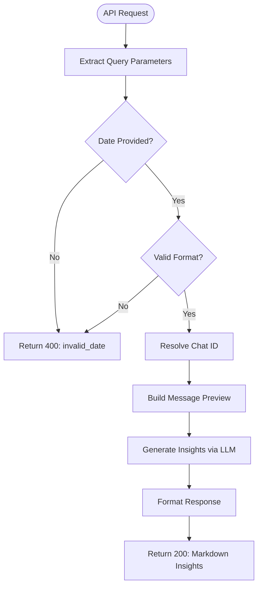
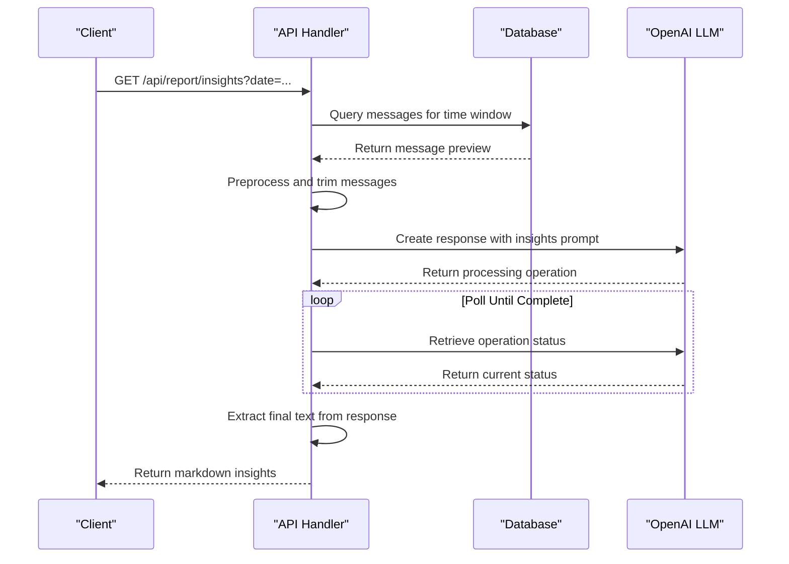
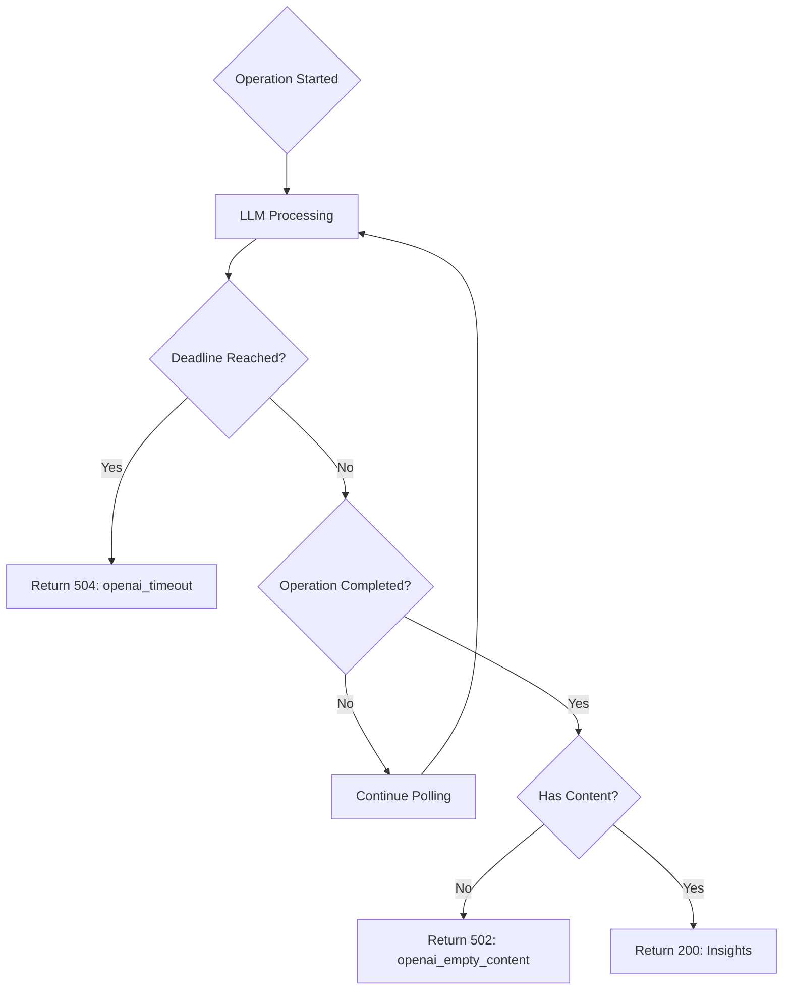

# Insights Generation API

<cite>
**Referenced Files in This Document**   
- [route.ts](file://app/api/report/insights/route.ts)
- [route.ts](file://app/api/report/generate/route.ts)
- [report.ts](file://lib/llm/report.ts)
- [shared.ts](file://lib/llm/shared.ts)
- [slice.ts](file://lib/report/slice.ts)
- [digest_schema.ts](file://lib/report/digest_schema.ts)
- [digest_render.ts](file://lib/report/digest_render.ts)
- [smoke-insights.mjs](file://scripts/smoke-insights.mjs)
</cite>

## Table of Contents
1. [Introduction](#introduction)
2. [Endpoint Parameters and Usage](#endpoint-parameters-and-usage)
3. [Core Dependencies and Configuration](#core-dependencies-and-configuration)
4. [Insight Generation Pipeline](#insight-generation-pipeline)
5. [Response Format and Structure](#response-format-and-structure)
6. [Error Handling and Timeout Management](#error-handling-and-timeout-management)
7. [Asynchronous Processing and Polling Mechanism](#asynchronous-processing-and-polling-mechanism)
8. [Comparison with /generate Endpoint](#comparison-with-generate-endpoint)
9. [Use Cases and Analytical Applications](#use-cases-and-analytical-applications)
10. [Testing and Validation](#testing-and-validation)

## Introduction
The `/api/report/insights` endpoint in the tg-vibecoders-dashboard provides behavioral insights from Telegram chat messages using large language model (LLM) analysis. Unlike structured daily digests, this endpoint generates free-form analytical summaries focused on key themes, unresolved questions, and interaction patterns within a specified time window. The API processes message data through an LLM pipeline to extract meaningful insights suitable for team retrospectives, content strategy planning, and communication pattern analysis.

**Section sources**
- [route.ts](file://app/api/report/insights/route.ts#L1-L52)

## Endpoint Parameters and Usage
The `/api/report/insights` endpoint accepts query parameters identical to the `/generate` endpoint:
- `date`: Required ISO date string (YYYY-MM-DD) specifying the analysis date
- `chat_id`: Optional chat identifier; defaults to environment-specified chat or most active chat
- `since`: Optional UTC timestamp for custom time window start
- `until`: Optional UTC timestamp for custom time window end

These parameters are used to construct a time window for message retrieval and analysis. When `since` and `until` are provided together, they override the default 24-hour window defined by the `date` parameter.



**Diagram sources**
- [route.ts](file://app/api/report/insights/route.ts#L10-L20)

**Section sources**
- [route.ts](file://app/api/report/insights/route.ts#L10-L20)
- [slice.ts](file://lib/report/slice.ts#L100-L344)

## Core Dependencies and Configuration
The endpoint relies on several critical environment variables and external services:
- `OPENAI_API_KEY`: Required authentication key for OpenAI API access
- `OPENAI_MODEL`: Specifies the LLM model to use for insight generation
- `DATABASE_URL`: Connection string for PostgreSQL database containing chat messages
- `DEFAULT_CHAT_ID`: Optional fallback chat identifier when none is specified

The system requires proper configuration of these environment variables to function correctly. Missing `OPENAI_API_KEY` results in a 503 Service Unavailable response, preventing unauthorized or misconfigured deployments from attempting LLM processing.

```mermaid
graph TB
Client[Client Application] --> API[/api/report/insights]
API --> Env[Environment Variables]
API --> DB[(PostgreSQL Database)]
API --> OpenAI[OpenAI API]
Env --> |OPENAI_API_KEY| OpenAI
Env --> |DATABASE_URL| DB
Env --> |DEFAULT_CHAT_ID| API
DB --> |Message Data| API
OpenAI --> |Insight Generation| API
```

**Diagram sources**
- [route.ts](file://app/api/report/insights/route.ts#L22-L25)
- [report.ts](file://lib/llm/report.ts#L100-L103)

**Section sources**
- [route.ts](file://app/api/report/insights/route.ts#L22-L25)
- [report.ts](file://lib/llm/report.ts#L100-L103)

## Insight Generation Pipeline
The insight generation process follows a multi-stage pipeline that transforms raw message data into analytical summaries:

1. **Message Retrieval**: Fetch relevant messages from the database based on date and chat criteria
2. **Data Preprocessing**: Filter and format messages for LLM input, removing empty messages
3. **Token Optimization**: Trim message history to stay within LLM token limits (last 400 messages, reduced to 250 if needed)
4. **Prompt Construction**: Create a structured prompt with message context and analytical instructions
5. **LLM Processing**: Submit the prompt to OpenAI's Responses API for insight generation
6. **Response Extraction**: Parse and validate the generated insights from the API response

The pipeline uses different system prompts and processing logic compared to the digest generation endpoint, focusing on narrative insights rather than structured JSON output.



**Diagram sources**
- [report.ts](file://lib/llm/report.ts#L98-L144)
- [shared.ts](file://lib/llm/shared.ts#L24-L29)

**Section sources**
- [report.ts](file://lib/llm/report.ts#L98-L144)
- [shared.ts](file://lib/llm/shared.ts#L24-L29)
- [shared.ts](file://lib/llm/shared.ts#L48-L62)

## Response Format and Structure
The endpoint returns insights in a simple JSON structure containing only a markdown field:

```json
{
  "markdown": "## Key Themes\n\n- Team alignment improved on project timeline...\n- Several unanswered questions remain about deployment strategy...\n- Notable increase in cross-functional collaboration observed..."
}
```

The markdown content typically includes:
- Key discussion themes and emerging patterns
- Summary of resolved issues and decisions made
- Identification of outstanding questions and concerns
- Observations about communication dynamics and participation
- Notable links or resources shared during the period

Unlike the `/generate` endpoint which returns structured JSON with validation, this endpoint produces free-form text optimized for readability in messaging applications like Telegram, with a target length of 800-1200 characters.

**Section sources**
- [report.ts](file://lib/llm/report.ts#L98-L144)
- [shared.ts](file://lib/llm/shared.ts#L24-L29)

## Error Handling and Timeout Management
The endpoint implements comprehensive error handling for various failure scenarios:

- **400 Bad Request**: Missing or invalid date parameter
- **503 Service Unavailable**: Missing `OPENAI_API_KEY` environment variable
- **504 Gateway Timeout**: LLM processing exceeds timeout threshold (90 seconds)
- **500 Internal Server Error**: Unhandled exceptions during processing
- **502 Bad Gateway**: Empty or invalid content from LLM

Timeouts are handled through both client-side abort signals and server-side polling loops. The system sets a deadline based on the timeout parameter and periodically checks the status of the LLM operation. If the operation doesn't complete within the allotted time, a 504 response is returned with context about the timeout.



**Diagram sources**
- [route.ts](file://app/api/report/insights/route.ts#L40-L50)
- [report.ts](file://lib/llm/report.ts#L115-L144)

**Section sources**
- [route.ts](file://app/api/report/insights/route.ts#L40-L50)
- [report.ts](file://lib/llm/report.ts#L115-L144)

## Asynchronous Processing and Polling Mechanism
The endpoint employs an asynchronous polling mechanism to handle potentially long-running LLM operations:

1. Initiate the LLM response creation operation
2. Enter a polling loop that checks the operation status every 300ms
3. Continue polling until completion or timeout threshold
4. Extract the final output from the completed operation

This approach allows the system to handle extended processing times while maintaining control over resource usage and response latency. The polling interval (300ms) balances responsiveness with API call efficiency, minimizing the number of status check requests while providing timely updates.

The implementation includes safeguards against infinite loops and excessive processing time, ensuring that clients receive a response even if the LLM processing takes longer than expected.

**Section sources**
- [report.ts](file://lib/llm/report.ts#L115-L130)

## Comparison with /generate Endpoint
While both endpoints share similar parameter interfaces and preprocessing steps, they differ significantly in their outputs and processing pipelines:

| Feature | `/api/report/insights` | `/api/report/generate` |
|--------|----------------------|-----------------------|
| Output Format | Free-form markdown text | Structured JSON with schema validation |
| Primary Function | Behavioral insights and analysis | Daily digest summary |
| LLM Prompt Type | INSIGHTS_SYSTEM_PROMPT | SYSTEM_PROMPT |
| Response Structure | { markdown: string } | { json: DailyDigest, markdown: string } |
| Processing Method | Polling-based async | Promise.race with timeout |
| Timeout Duration | 90 seconds | 120 seconds |
| Output Constraints | 800-1200 characters | Strict JSON schema |

The insights endpoint focuses on qualitative analysis of communication patterns, while the generate endpoint produces quantitative summaries with specific structural requirements.

```mermaid
classDiagram
    class InsightsEndpoint {
        +GET /api/report/insights
        +Parameters: date, chat_id, since, until
        +Output: {markdown: string}
        +Timeout: 90s
        +Polling: Enabled
    }
    
    class GenerateEndpoint {
        +GET /api/report/generate
        +Parameters: date, chat_id, since, until
        +Output: {json: DailyDigest, markdown: string}
        +Timeout: 120s
        +Polling: Disabled
    }
    
    InsightsEndpoint ..|>