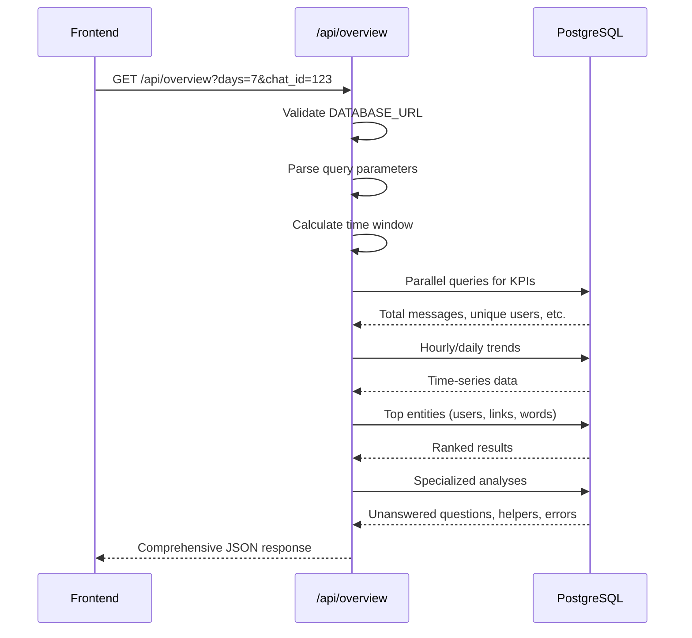

# Overview API

<cite>
**Referenced Files in This Document**   
- [route.ts](file://app/api/overview/route.ts)
- [DashboardShell.tsx](file://app/components/DashboardShell.tsx)
- [KpiRow.tsx](file://app/components/atoms/KpiRow.tsx)
</cite>

## Table of Contents
1. [Introduction](#introduction)
2. [Endpoint Specification](#endpoint-specification)
3. [Query Parameters](#query-parameters)
4. [Database Connection and Query Execution](#database-connection-and-query-execution)
5. [Response Structure](#response-structure)
6. [SQL Queries for Key Metrics](#sql-queries-for-key-metrics)
7. [Error Handling](#error-handling)
8. [Frontend Integration](#frontend-integration)
9. [Usage Examples](#usage-examples)

## Introduction

The `/api/overview` endpoint serves as the primary analytics engine for the tg-vibecoders-dashboard application, providing comprehensive insights into Telegram group chat activity. This API endpoint aggregates message data from a PostgreSQL database to generate time-windowed analytics that power the dashboard's visual components. The endpoint processes query parameters to filter data by time window and specific chat, executes multiple SQL queries to calculate key performance indicators (KPIs), and returns structured JSON containing engagement metrics, trend analysis, and specialized insights.

**Section sources**
- [route.ts](file://app/api/overview/route.ts#L0-L523)

## Endpoint Specification

The GET `/api/overview` endpoint provides comprehensive analytics for Telegram chat messages stored in a PostgreSQL database. It connects to the database using a connection pool configured with the `DATABASE_URL` environment variable and executes time-windowed aggregations based on the provided query parameters. The endpoint returns a rich JSON response containing KPIs, trend data, top entities, and specialized analyses that power the dashboard interface.

The API follows RESTful principles with query parameters controlling the scope of data retrieval. It implements efficient data fetching through parallel execution of independent database queries using `Promise.all()`, optimizing performance for complex analytics. The response includes both raw metrics and derived insights, enabling the frontend to display a comprehensive view of chat activity without requiring additional processing.



**Diagram sources**
- [route.ts](file://app/api/overview/route.ts#L39-L519)

**Section sources**
- [route.ts](file://app/api/overview/route.ts#L39-L519)

## Query Parameters

The `/api/overview` endpoint accepts two query parameters that control data filtering and analysis scope:

- **days**: An integer parameter specifying the time window for analysis in days. The parameter has a default value of 1 and accepts values in the range of 1-30 days. Values outside this range are normalized to 1 day. This parameter determines the historical depth of the analytics, with the system calculating a "since" timestamp by subtracting the specified number of days from the current time.

- **chat_id**: A string parameter that filters the analysis to a specific Telegram chat. When provided, the endpoint restricts all queries to messages from the specified chat ID. If not provided or set to "all", the analysis encompasses all available chats. The parameter is case-insensitive and trimmed of whitespace before use.

These parameters are extracted from the request URL and validated within the endpoint handler. The `days` parameter undergoes type conversion from string to integer with fallback to the default value if parsing fails or the value is out of range. The `chat_id` parameter enables conditional SQL query construction, with the WHERE clause dynamically including chat filtering when a valid chat ID is provided.

**Section sources**
- [route.ts](file://app/api/overview/route.ts#L45-L52)

## Database Connection and Query Execution

The endpoint establishes a connection to PostgreSQL through a connection pool created with the `pg` library. The pool is configured using the `DATABASE_URL` environment variable, with optional SSL configuration controlled by the `PGSSL` environment variable. This connection pooling approach ensures efficient database resource management and supports concurrent requests.

The data retrieval process follows a structured workflow:
1. Connection acquisition from the pool
2. Time window calculation based on the `days` parameter
3. Construction of base WHERE clauses for temporal and chat filtering
4. Parallel execution of independent queries using `Promise.all()`
5. Sequential execution of dependent queries requiring preliminary results
6. Data transformation and aggregation in memory
7. Connection release and response generation

Key SQL operations include message volume counting, user engagement analysis, thread structure identification, and content pattern detection. The implementation uses parameterized queries with placeholders ($1, $2, etc.) to prevent SQL injection vulnerabilities. For queries requiring large IN clauses (such as message ID lookups), the code implements chunking logic to avoid exceeding PostgreSQL's parameter limit.

**Section sources**
- [route.ts](file://app/api/overview/route.ts#L3-L44)
- [route.ts](file://app/api/overview/route.ts#L53-L100)

## Response Structure

The endpoint returns a comprehensive JSON object containing multiple sections of analytics data:

```json
{
  "chats": [
    {
      "chat_id": "string",
      "title": "string|null",
      "cnt": "integer"
    }
  ],
  "selected_chat_id": "string|null",
  "kpi": {
    "total_msgs": "integer",
    "unique_users": "integer",
    "avg_per_user": "number",
    "replies": "integer",
    "with_links": "integer"
  },
  "hourly": [
    {
      "hour": "string (ISO datetime)",
      "cnt": "integer"
    }
  ],
  "daily": [
    {
      "day": "string (ISO datetime)",
      "cnt": "integer"
    }
  ],
  "topUsers": [
    {
      "user": "string",
      "cnt": "integer"
    }
  ],
  "topLinks": [
    {
      "url": "string",
      "cnt": "integer"
    }
  ],
  "topWords": [
    {
      "word": "string",
      "cnt": "integer"
    }
  ],
  "topThreads": [
    {
      "root_id": "string",
      "replies": "integer",
      "root_preview": "string"
    }
  ],
  "unanswered": [
    {
      "id": "string",
      "preview": "string",
      "text": "string",
      "hours": "integer"
    }
  ],
  "topHelpers": [
    {
      "user": "string",
      "cnt": "integer"
    }
  ],
  "topErrors": [
    {
      "token": "string",
      "cnt": "integer"
    }
  ],
  "artifacts": [
    {
      "id": "string",
      "url": "string|null",
      "hasCode": "boolean|null",
      "preview": "string"
    }
  ],
  "topHashtags": [
    {
      "token": "string",
      "cnt": "integer"
    }
  ],
  "topMentions": [
    {
      "token": "string",
      "cnt": "integer"
    }
  ],
  "forwardedFrom": [
    {
      "chat_id": "string",
      "title": "string|null",
      "username": "string|null",
      "cnt": "integer",
      "url": "string|null"
    }
  ],
  "since": "string (ISO datetime)",
  "until": "string (ISO datetime)",
  "window_days": "integer",
  "summaryBullets": ["string"]
}
```

**Section sources**
- [route.ts](file://app/api/overview/route.ts#L480-L515)

## SQL Queries for Key Metrics

The endpoint executes several specialized SQL queries to extract different aspects of chat analytics:

### Message Volume and User Engagement
```sql
SELECT COUNT(*)::int AS cnt FROM messages WHERE sent_at >= $1 AND sent_at < $2
SELECT COUNT(DISTINCT user_id)::int AS cnt FROM messages WHERE sent_at >= $1 AND sent_at < $2
SELECT COUNT(*)::int AS cnt FROM messages WHERE sent_at >= $1 AND sent_at < $2 AND raw_message ? 'reply_to_message'
SELECT COUNT(*)::int AS cnt FROM messages WHERE sent_at >= $1 AND sent_at < $2 AND text ILIKE '%http%'
```

### Temporal Trends
```sql
SELECT date_trunc('hour', sent_at) AS hour, COUNT(*)::int AS cnt FROM messages WHERE sent_at >= $1 AND sent_at < $2 GROUP BY 1 ORDER BY 1 ASC
SELECT date_trunc('day', sent_at) AS day, COUNT(*)::int AS cnt FROM messages WHERE sent_at >= $1 AND sent_at < $2 GROUP BY 1 ORDER BY 1 ASC
```

### Thread Analysis
```sql
WITH RECURSIVE chain AS (
  SELECT m.message_id::text AS reply_id,
         m.user_id AS reply_user_id,
         m.message_id::text AS current_id,
         (m.raw_message->'reply_to_message'->>'message_id')::text AS parent_id
  FROM messages m
  WHERE sent_at >= $1 AND sent_at < $2 AND m.raw_message ? 'reply_to_message'
  UNION ALL
  SELECT chain.reply_id,
         chain.reply_user_id,
         p.message_id::text AS current_id,
         (p.raw_message->'reply_to_message'->>'message_id')::text AS parent_id
  FROM chain
  JOIN messages p ON p.message_id::text = chain.parent_id
)
SELECT c.reply_user_id AS helper_user_id,
       COALESCE(NULLIF(TRIM(u.username), ''), NULL) AS username,
       COALESCE(NULLIF(TRIM(u.first_name), ''), NULL) AS first_name,
       COALESCE(NULLIF(TRIM(u.last_name), ''), NULL) AS last_name,
       COUNT(*)::int AS cnt
FROM (
  SELECT reply_id, reply_user_id, current_id AS root_id
  FROM chain
  WHERE parent_id IS NULL
) c
JOIN messages root_msg ON root_msg.message_id::text = c.root_id
LEFT JOIN users u ON u.id = c.reply_user_id
WHERE c.reply_user_id <> root_msg.user_id
GROUP BY c.reply_user_id, username, first_name, last_name
ORDER BY cnt DESC
LIMIT 10
```

### Error Pattern Detection
```sql
SELECT message_id AS id,
       text,
       user_id,
       sent_at,
       (raw_message->'reply_to_message'->>'message_id') AS reply_to_message_id
FROM messages 
WHERE sent_at >= $1 AND sent_at < $2
```

**Section sources**
- [route.ts](file://app/api/overview/route.ts#L62-L65)
- [route.ts](file://app/api/