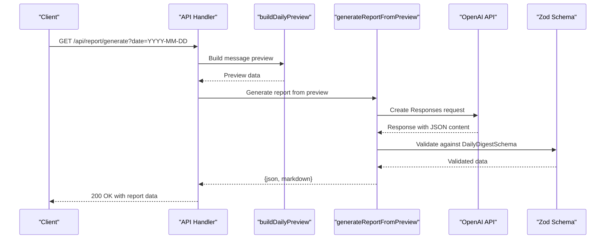
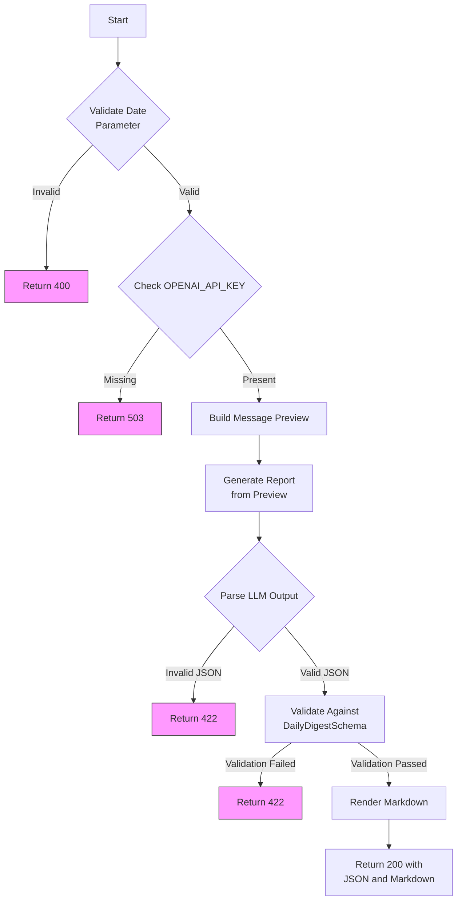
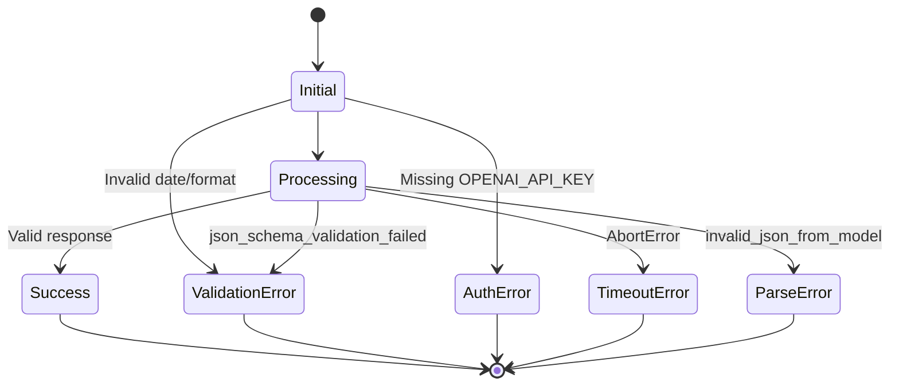

# Report Generation API

<cite>
**Referenced Files in This Document**   
- [app/api/report/generate/route.ts](file://app/api/report/generate/route.ts)
- [lib/llm/report.ts](file://lib/llm/report.ts)
- [lib/report/digest_schema.ts](file://lib/report/digest_schema.ts)
- [lib/report/slice.ts](file://lib/report/slice.ts)
</cite>

## Table of Contents
1. [Introduction](#introduction)
2. [Endpoint Overview](#endpoint-overview)
3. [Request Parameters](#request-parameters)
4. [Authentication Requirements](#authentication-requirements)
5. [Processing Workflow](#processing-workflow)
6. [Response Structure](#response-structure)
7. [Error Handling](#error-handling)
8. [Performance and Reliability](#performance-and-reliability)
9. [Caching Strategy](#caching-strategy)

## Introduction

The `/api/report/generate` endpoint is a core component of the tg-vibecoders-dashboard system, responsible for generating structured daily digest reports from chat message data. This API leverages OpenAI's Responses API to transform raw message previews into human-readable summaries with insights, recommendations, and analytics. The system combines database querying, preprocessing, LLM orchestration, and strict schema validation to deliver consistent, reliable report generation.

**Section sources**
- [app/api/report/generate/route.ts](file://app/api/report/generate/route.ts#L1-L52)

## Endpoint Overview

The GET `/api/report/generate` endpoint generates comprehensive daily digest reports by analyzing chat message data and processing it through an LLM pipeline. The endpoint orchestrates multiple stages: data retrieval, preprocessing, LLM inference, and response formatting. It returns structured JSON output that includes both parsed data and rendered markdown content suitable for display.



**Diagram sources**
- [app/api/report/generate/route.ts](file://app/api/report/generate/route.ts#L1-L52)
- [lib/llm/report.ts](file://lib/llm/report.ts#L16-L96)

**Section sources**
- [app/api/report/generate/route.ts](file://app/api/report/generate/route.ts#L1-L52)

## Request Parameters

The endpoint accepts several query parameters to customize report generation:

| Parameter | Required | Format | Description |
|---------|--------|-------|-----------|
| `date` | Yes | YYYY-MM-DD | Target date for report generation in UTC |
| `chat_id` | No | string | Specific chat ID to analyze; defaults to top chat or environment default |
| `since` | No | ISO 8601 | Custom start time for analysis window override |
| `until` | No | ISO 8601 | Custom end time for analysis window override |

When `since` and `until` parameters are provided together, they override the default UTC day window calculation, enabling custom time window analysis. The `chat_id` parameter allows focusing on specific conversations, with fallback behavior to environment-specified defaults or the most active chat.

**Section sources**
- [app/api/report/generate/route.ts](file://app/api/report/generate/route.ts#L10-L20)
- [lib/report/slice.ts](file://lib/report/slice.ts#L100-L344)

## Authentication Requirements

The endpoint requires the `OPENAI_API_KEY` environment variable to be configured for authentication with OpenAI's API. Without this key, the service returns a 503 Service Unavailable status. Additional environment variables control the LLM integration:

- `OPENAI_MODEL`: Specifies the model to use for report generation
- `REPORT_TIMEOUT_MS`: Sets the timeout duration for OpenAI requests (default: 120,000ms)
- `REPORT_MAX_OUTPUT_TOKENS`: Limits the maximum output tokens from the LLM
- `DEFAULT_CHAT_ID`: Provides a fallback chat ID when none is specified

The authentication check occurs early in the request lifecycle, preventing unnecessary processing when credentials are missing.

**Section sources**
- [app/api/report/generate/route.ts](file://app/api/report/generate/route.ts#L18-L22)
- [lib/llm/report.ts](file://lib/llm/report.ts#L20-L24)

## Processing Workflow

The report generation process follows a structured workflow with distinct phases:



**Diagram sources**
- [app/api/report/generate/route.ts](file://app/api/report/generate/route.ts#L1-L52)
- [lib/llm/report.ts](file://lib/llm/report.ts#L16-L96)
- [lib/report/digest_schema.ts](file://lib/report/digest_schema.ts#L11-L23)

### Data Preprocessing

The `buildDailyPreview` function retrieves and processes raw message data from the database, creating a structured preview object. This includes calculating KPIs, hourly message distribution, top threads, unanswered questions, and extracting links and error patterns. The function handles custom time windows through the `windowOverride` parameter and resolves chat IDs with fallback logic.

**Section sources**
- [lib/report/slice.ts](file://lib/report/slice.ts#L100-L344)

### LLM Integration

The `generateReportFromPreview` function orchestrates communication with OpenAI's Responses API. It constructs a request with system prompt, user input derived from the preview data, and a strict JSON schema definition. The function implements timeout handling using `Promise.race` to prevent hanging requests and includes request ID propagation for debugging purposes.

**Section sources**
- [lib/llm/report.ts](file://lib/llm/report.ts#L16-L96)

### Validation Pipeline

After receiving the LLM response, the system performs two-stage validation:
1. JSON parsing validation to ensure syntactic correctness
2. Zod schema validation against `DailyDigestSchema` to verify semantic structure

The validation process captures detailed error information, including field paths and messages, which are returned in 422 responses to aid debugging.

**Section sources**
- [lib/llm/report.ts](file://lib/llm/report.ts#L70-L85)
- [lib/report/digest_schema.ts](file://lib/report/digest_schema.ts#L11-L23)

## Response Structure

The endpoint returns a JSON object with the following structure:

```json
{
  "json": {
    "discussions": [
      {
        "topic": "string",
        "question": "string",
        "participants": ["string"],
        "outcome": "string"
      }
    ],
    "resources": ["string"],
    "unanswered_questions": ["string"],
    "stats": {
      "messages_count": 0,
      "participants_count": 0
    },
    "insights": ["string"]
  },
  "markdown": "string"
}
```

The `json` field contains the structured data conforming to the `DailyDigest` type, while the `markdown` field provides a formatted version suitable for direct rendering in UI components.

**Section sources**
- [lib/report/digest_schema.ts](file://lib/report/digest_schema.ts#L11-L23)
- [lib/llm/report.ts](file://lib/llm/report.ts#L86-L88)

## Error Handling

The API implements comprehensive error handling with appropriate HTTP status codes and debugging information:

| Error Type | Status Code | Response Body | Cause |
|----------|------------|--------------|------|
| Missing date | 400 | `{error: "missing_date"}` | No date parameter |
| Invalid date format | 400 | `{error: "invalid_date"}` | Date not YYYY-MM-DD |
| Missing API key | 503 | `{error: "missing_openai_key"}` | OPENAI_API_KEY not set |
| LLM timeout | 504 | `{error: "openai_timeout", request_id}` | Request exceeded timeout |
| Validation failure | 422 | `{error: "json_schema_validation_failed: ...", request_id}` | Invalid LLM output structure |
| Internal error | 500 | `{error: "internal_error", detail, request_id}` | Unexpected server error |

All errors include request ID propagation when available, enabling correlation with server logs for debugging. The catch block in the route handler normalizes various error types into consistent client-facing responses.



**Diagram sources**
- [app/api/report/generate/route.ts](file://app/api/report/generate/route.ts#L40-L52)

**Section sources**
- [app/api/report/generate/route.ts](file://app/api/report/generate/route.ts#L40-L52)

## Performance and Reliability

The system incorporates several reliability features to handle the inherent variability of LLM APIs:

- **Timeout Management**: Configurable timeouts with default 120-second limit
- **Request ID Propagation**: Unique identifiers for tracing requests across systems
- **Graceful Degradation**: Returns meaningful errors instead of crashing
- **Race Condition Handling**: Uses `Promise.race` to enforce timeout limits
- **Retry Logic**: While not explicitly implemented, the stateless nature enables client-side retries

The timeout mechanism uses `Promise.race` between the OpenAI request and a setTimeout promise, ensuring requests don't hang indefinitely. Environment variables allow tuning performance characteristics based on deployment requirements.

**Section sources**
- [lib/llm/report.ts](file://lib/llm/report.ts#L40-L55)

## Caching Strategy

Although the current implementation doesn't include explicit caching, the architecture supports several caching approaches for expensive LLM calls:

1. **Response Caching**: Cache complete responses by date/chat_id combination
2. **Preview Caching**: Cache the output of `buildDailyPreview` to avoid repeated database queries
3. **CDN Caching**: Deploy behind a CDN with TTL-based caching for frequently accessed reports

Given the computational cost of LLM inference, implementing a caching layer would significantly improve performance for repeated requests. The deterministic nature of the input parameters (date, chat_id, time window) makes the endpoint well-suited for caching strategies.

**Section sources**
- [app/api/report/generate/route.ts](file://app/api/report/generate/route.ts#L1-L52)
- [lib/llm/report.ts](file://lib/llm/report.ts#L16-L96)