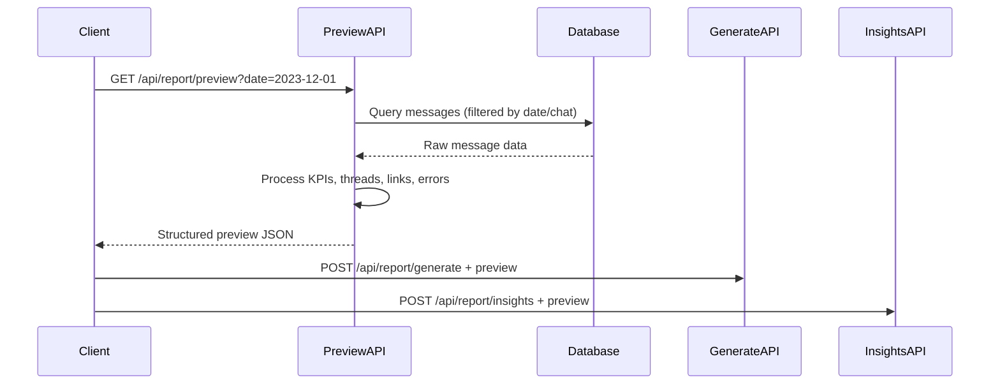
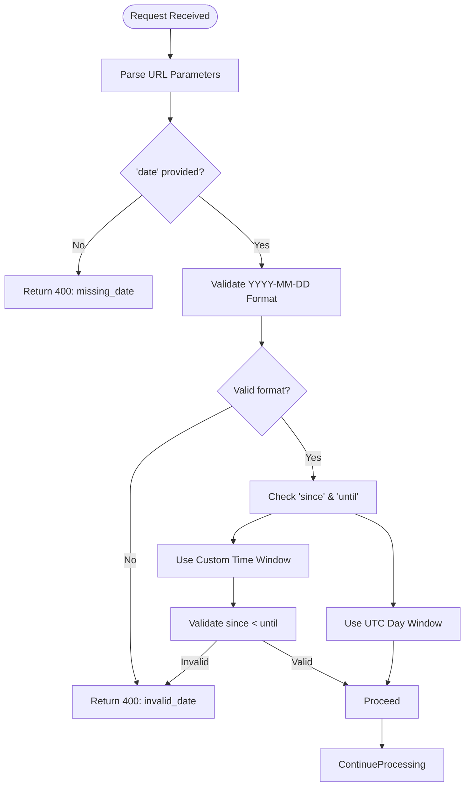
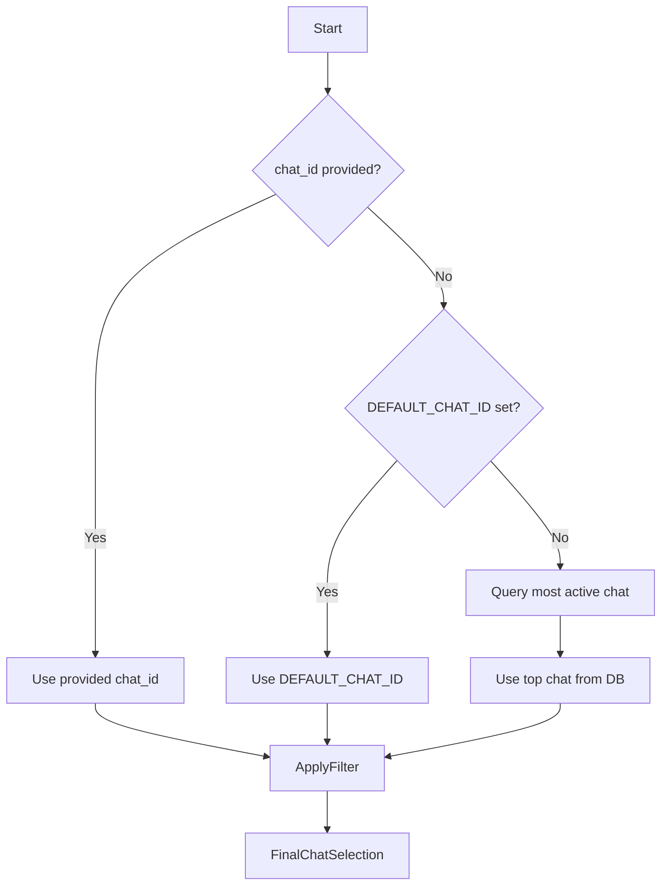

# Report Preview API

<cite>
**Referenced Files in This Document**   
- [route.ts](file://app/api/report/preview/route.ts)
- [slice.ts](file://lib/report/slice.ts)
- [schema.ts](file://lib/report/schema.ts)
- [generate/route.ts](file://app/api/report/generate/route.ts)
- [insights/route.ts](file://app/api/report/insights/route.ts)
- [report.ts](file://lib/llm/report.ts)
</cite>

## Table of Contents
1. [Introduction](#introduction)
2. [Endpoint Overview](#endpoint-overview)
3. [Parameter Validation and Handling](#parameter-validation-and-handling)
4. [Chat Filtering and Default Selection](#chat-filtering-and-default-selection)
5. [Data Extraction with buildDailyPreview](#data-extraction-with-builddailypreview)
6. [Response Structure and Schema](#response-structure-and-schema)
7. [Integration with LLM Endpoints](#integration-with-llm-endpoints)
8. [Error Handling](#error-handling)
9. [Performance Considerations](#performance-considerations)

## Introduction
The `GET /api/report/preview` endpoint in the tg-vibecoders-dashboard serves as a foundational data preparation step for downstream LLM-powered report generation and insights extraction. It extracts structured message data from a specified time window, formats it into a consistent preview structure, and provides metadata necessary for subsequent processing by `/generate` and `/insights` endpoints. This document details its implementation, behavior, integration points, and operational considerations.

## Endpoint Overview
The `/api/report/preview` endpoint is responsible for generating a comprehensive preview of daily chat activity, which acts as input for AI-driven summarization and insight generation. It supports flexible time window selection through query parameters and ensures robust handling of edge cases such as missing or invalid inputs.



**Diagram sources**
- [route.ts](file://app/api/report/preview/route.ts#L1-L40)
- [generate/route.ts](file://app/api/report/generate/route.ts#L1-L52)
- [insights/route.ts](file://app/api/report/insights/route.ts#L1-L53)

**Section sources**
- [route.ts](file://app/api/report/preview/route.ts#L1-L40)

## Parameter Validation and Handling
The endpoint accepts four primary parameters: `date`, `chat_id`, `since`, and `until`. The `date` parameter is mandatory and must conform to the `YYYY-MM-DD` format, validated using a strict regular expression `/^\d{4}-\d{2}-\d{2}$/`.

If `since` and `until` are provided, they override the default 24-hour UTC window derived from the `date` parameter. These values are parsed as ISO timestamps and validated to ensure `until` occurs after `since`. Invalid date formats trigger a `400 Bad Request` response with the error code `invalid_date`.



**Diagram sources**
- [route.ts](file://app/api/report/preview/route.ts#L10-L20)
- [slice.ts](file://lib/report/slice.ts#L92-L96)

**Section sources**
- [route.ts](file://app/api/report/preview/route.ts#L10-L20)
- [slice.ts](file://lib/report/slice.ts#L41-L43)

## Chat Filtering and Default Selection
The `chat_id` parameter allows filtering messages from a specific chat. If omitted or empty, the system applies fallback logic:
1. Use the `DEFAULT_CHAT_ID` environment variable if set.
2. Otherwise, dynamically determine the most active chat within the requested time window via database query.

This fallback mechanism ensures meaningful data is returned even when no explicit chat is specified, enhancing usability for dashboard views.



**Diagram sources**
- [slice.ts](file://lib/report/slice.ts#L125-L138)

**Section sources**
- [slice.ts](file://lib/report/slice.ts#L125-L138)

## Data Extraction with buildDailyPreview
The core logic resides in the `buildDailyPreview` function, which orchestrates data retrieval and transformation. It performs multiple parallel queries against the PostgreSQL database to extract key metrics:

- **KPIs**: Total messages, unique users, replies, and link counts.
- **Hourly Distribution**: Message count per hour (UTC), ensuring exactly 24 data points.
- **Top Threads**: Most replied-to messages with truncated previews.
- **Unanswered Messages**: Messages without replies, sorted by age.
- **Top Links and Errors**: Extracted from message text using regex patterns.
- **Message List**: Full list of messages with author formatting.

All queries use parameterized SQL to prevent injection and are executed concurrently using `Promise.all()` for optimal performance.

**Section sources**
- [slice.ts](file://lib/report/slice.ts#L100-L344)

## Response Structure and Schema
The response conforms to the `PreviewSchema` defined in `schema.ts`, which uses Zod for type safety. Key components include:

- **kpi**: Aggregated statistics including peak activity hour.
- **hourly**: Array of 24 hourly message counts.
- **topThreads**, **unanswered**, **topLinks**, **topErrors**: Ranked lists with limited entries.
- **messages**: Full message list used for LLM context.
- **meta**: Metadata including date, resolved chat ID, and generation timestamp.

Example excerpt:
```json
{
  "kpi": {
    "total_msgs": 142,
    "unique_users": 23,
    "avg_per_user": 6.17,
    "replies": 45,
    "with_links": 12,
    "peak_hour_utc": "14:00",
    "window_utc": ["2023-12-01T00:00:00.000Z", "2023-12-02T00:00:00.000Z"]
  },
  "topThreads": [
    {
      "root_id": "12345",
      "replies": 8,
      "root_preview": "Can anyone help me understand how the new API works…"
    }
  ],
  "messages": [
    {
      "id": "12345",
      "user_id": "u789",
      "sent_at": "2023-12-01T09:15:30.000Z",
      "text": "Here's the documentation link: https://example.com/api-guide",
      "reply_to": null,
      "author": "Alice @alice_dev"
    }
  ],
  "meta": {
    "date": "2023-12-01",
    "chat_id": "c123",
    "generated_at": "2023-12-02T01:20:00.000Z"
  }
}
```

**Section sources**
- [schema.ts](file://lib/report/schema.ts#L1-L57)

## Integration with LLM Endpoints
The preview data serves as direct input to two LLM-powered endpoints:
- `/api/report/generate`: Uses `generateReportFromPreview` to create structured daily digests.
- `/api/report/insights`: Uses `generateInsightsFromMessages` to extract thematic insights.

Both endpoints import and invoke `buildDailyPreview` identically, ensuring consistency in data preprocessing before LLM invocation. This modular design separates data extraction from AI processing, enabling reuse and independent optimization.

```mermaid
graph TB
A[/api/report/preview] --> |Provides preview| B[/api/report/generate]
A --> |Provides preview| C[/api/report/insights]
B --> D[OpenAI: generateReportFromPreview]
C --> E[OpenAI: generateInsightsFromMessages]
```

**Diagram sources**
- [generate/route.ts](file://app/api/report/generate/route.ts#L1-L52)
- [insights/route.ts](file://app/api/report/insights/route.ts#L1-L53)
- [report.ts](file://lib/llm/report.ts#L1-L147)

**Section sources**
- [generate/route.ts](file://app/api/report/generate/route.ts#L1-L52)
- [insights/route.ts](file://app/api/report/insights/route.ts#L1-L53)

## Error Handling
The endpoint implements comprehensive error handling:
- `400 Bad Request`: For missing `date` (`missing_date`) or invalid format (`invalid_date`).
- `500 Internal Server Error`: For unexpected server issues (`internal_error`).
- `500 Missing Database`: When `DATABASE_URL` is not configured (`missing_database_url`).

Errors are standardized across the API surface for consistent client-side handling.

**Section sources**
- [route.ts](file://app/api/report/preview/route.ts#L30-L40)
- [slice.ts](file://lib/report/slice.ts#L100-L105)

## Performance Considerations
Due to potentially large message sets, the endpoint employs several optimizations:
- **Connection Pooling**: Reuses PostgreSQL connections via a singleton pool.
- **Parallel Queries**: Executes all data-fetching queries concurrently.
- **In-Memory Processing**: Handles link and error extraction in Node.js to reduce SQL complexity.
- **Truncation**: Limits result sizes (e.g., top 10 links) to control payload size.

For very large chats, consider implementing pagination or time-window restrictions. The current design assumes daily windows are manageable in memory, but streaming or chunked responses may be needed for larger datasets.

**Section sources**
- [slice.ts](file://lib/report/slice.ts#L100-L344)
- [slice.ts](file://lib/report/slice.ts#L30-L39)