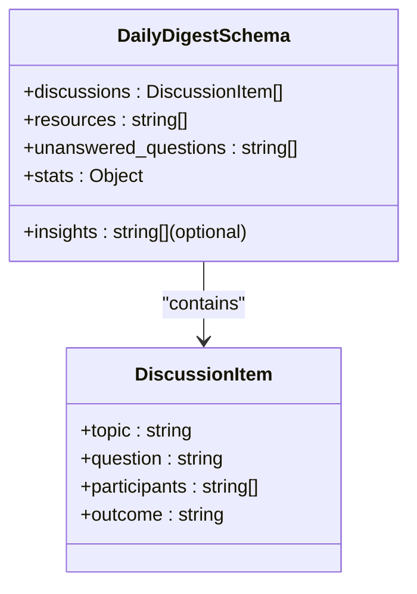
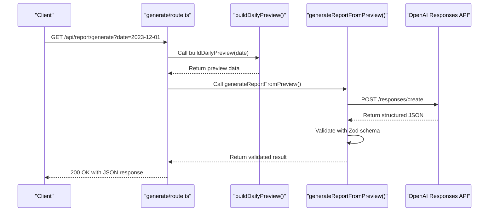
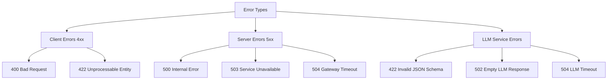

# Backend Architecture

<cite>
**Referenced Files in This Document**   
- [app/api/overview/route.ts](file://app/api/overview/route.ts)
- [app/api/report/generate/route.ts](file://app/api/report/generate/route.ts)
- [app/api/report/insights/route.ts](file://app/api/report/insights/route.ts)
- [app/api/report/preview/route.ts](file://app/api/report/preview/route.ts)
- [lib/report/digest_schema.ts](file://lib/report/digest_schema.ts)
- [lib/llm/report.ts](file://lib/llm/report.ts)
- [lib/report/slice.ts](file://lib/report/slice.ts)
</cite>

## Table of Contents
1. [Introduction](#introduction)
2. [API Route System Overview](#api-route-system-overview)
3. [Database Integration and Query Patterns](#database-integration-and-query-patterns)
4. [LLM Pipeline and Schema Enforcement](#llm-pipeline-and-schema-enforcement)
5. [Error Handling and Resilience](#error-handling-and-resilience)
6. [Security and Configuration Management](#security-and-configuration-management)
7. [Architecture Diagram](#architecture-diagram)

## Introduction

This document provides comprehensive architectural documentation for the backend services of the tg-vibecoders-dashboard application, with a focus on the API route system located in `app/api/`. The system exposes several endpoints that aggregate chat analytics from PostgreSQL and integrate with OpenAI's Responses API to generate structured reports. Key endpoints include `/api/overview`, `/api/report/generate`, `/api/report/insights`, and `/api/report/preview`. These routes implement robust data aggregation, LLM integration with strict schema enforcement, and comprehensive error handling to ensure reliable operation.

## API Route System Overview

The API route system is organized under the `app/api/` directory with a clear structure separating different functionality domains. Each route file implements a GET handler that processes incoming requests, validates parameters, queries the database, and returns structured JSON responses. The system uses Next.js App Router features including dynamic routing and server-side runtime configuration.

```mermaid
graph TD
A[Client Request] --> B{Route Dispatcher}
B --> C[/api/overview]
B --> D[/api/report/generate]
B --> E[/api/report/insights]
B --> F[/api/report/preview]
C --> G[Aggregate Chat Analytics]
D --> H[Generate LLM Report]
E --> I[Generate LLM Insights]
F --> J[Preview Daily Report]
G --> K[Return JSON Response]
H --> K
I --> K
J --> K
```

**Diagram sources**
- [app/api/overview/route.ts](file://app/api/overview/route.ts)
- [app/api/report/generate/route.ts](file://app/api/report/generate/route.ts)
- [app/api/report/insights/route.ts](file://app/api/report/insights/route.ts)
- [app/api/report/preview/route.ts](file://app/api/report/preview/route.ts)

**Section sources**
- [app/api/overview/route.ts](file://app/api/overview/route.ts)
- [app/api/report/generate/route.ts](file://app/api/report/generate/route.ts)
- [app/api/report/insights/route.ts](file://app/api/report/insights/route.ts)
- [app/api/report/preview/route.ts](file://app/api/report/preview/route.ts)

## Database Integration and Query Patterns

The backend services integrate with PostgreSQL using the `pg` client library to query chat analytics data. Database connections are managed through connection pooling with configurable SSL settings. The system implements efficient query patterns to aggregate message volume, user engagement, link sharing, and other metrics.

### Connection Management

Database connections are established using environment-controlled configuration with optional SSL support:

```mermaid
classDiagram
class Pool {
+connectionString : string
+ssl : boolean | {rejectUnauthorized : boolean}
+max : number
+connect() : Promise~PoolClient~
+end() : Promise~void~
}
class PoolClient {
+query(query : string, params : any[]) : Promise~QueryResult~
+release() : void
}
Pool --> PoolClient : "creates"
```

**Diagram sources**
- [app/api/overview/route.ts](file://app/api/overview/route.ts#L4-L7)
- [lib/report/slice.ts](file://lib/report/slice.ts#L30-L39)

### Query Implementation

The system implements several key query patterns to extract analytics data:

#### Message Aggregation Queries
- Total message count with date filtering
- Unique user identification through DISTINCT operations
- Reply thread analysis using JSON path operators (`raw_message ? 'reply_to_message'`)
- Link extraction via text pattern matching (`text ILIKE '%http%'`)

#### Temporal Analysis
- Hourly message distribution using `date_trunc('hour', sent_at)`
- Daily trends with `date_trunc('day', sent_at)`
- Time window filtering based on UTC boundaries

#### Entity Relationships
- User information joining from separate `users` table
- Message threading through `reply_to_message_id` references
- Forwarded content analysis from `forward_from_chat` and `forward_origin` fields

The queries use parameterized statements with `$1`, `$2` placeholders to prevent SQL injection and leverage PostgreSQL's JSON operators for efficient filtering of message metadata.

**Section sources**
- [app/api/overview/route.ts](file://app/api/overview/route.ts)
- [lib/report/slice.ts](file://lib/report/slice.ts)

## LLM Pipeline and Schema Enforcement

The system implements a sophisticated LLM integration pipeline that generates structured reports using OpenAI's Responses API with strict schema enforcement via Zod.

### Schema Definition and Validation

The response structure is defined using Zod with `DailyDigestSchema` which specifies the exact shape of the generated JSON:



**Diagram sources**
- [lib/report/digest_schema.ts](file://lib/report/digest_schema.ts)

### LLM Integration Flow

The LLM pipeline follows a multi-step process:



**Diagram sources**
- [app/api/report/generate/route.ts](file://app/api/report/generate/route.ts)
- [lib/llm/report.ts](file://lib/llm/report.ts)
- [lib/report/slice.ts](file://lib/report/slice.ts)

The pipeline enforces strict schema compliance by:
1. Using OpenAI's Responses API with `format.type = 'json_schema'` and `strict: true`
2. Converting Zod schema to JSON Schema format compatible with OpenAI
3. Validating the parsed response against the original Zod schema
4. Returning detailed validation errors when schema requirements are not met

**Section sources**
- [lib/report/digest_schema.ts](file://lib/report/digest_schema.ts)
- [lib/llm/report.ts](file://lib/llm/report.ts)

## Error Handling and Resilience

The system implements comprehensive error handling across all components to ensure reliability and provide meaningful feedback.

### Error Classification

The system categorizes errors into several types:



**Diagram sources**
- [app/api/report/generate/route.ts](file://app/api/report/generate/route.ts)
- [lib/llm/report.ts](file://lib/llm/report.ts)

### Error Handling Patterns

Each route implements consistent error handling with appropriate status codes:

- **Missing required parameters**: 400 Bad Request
- **Invalid date format**: 400 Bad Request
- **Missing OpenAI API key**: 503 Service Unavailable
- **Invalid JSON from LLM**: 422 Unprocessable Entity with request ID
- **LLM timeout**: 504 Gateway Timeout
- **Database connection issues**: 500 Internal Server Error
- **Empty LLM response**: 502 Bad Gateway

The system preserves request IDs from OpenAI responses to facilitate debugging and correlation of issues.

**Section sources**
- [app/api/report/generate/route.ts](file://app/api/report/generate/route.ts#L38-L50)
- [app/api/report/insights/route.ts](file://app/api/report/insights/route.ts#L38-L48)
- [lib/llm/report.ts](file://lib/llm/report.ts)

## Security and Configuration Management

The system implements security best practices for configuration management and access control.

### Environment Variable Usage

Sensitive configuration is managed through environment variables:

- `DATABASE_URL`: PostgreSQL connection string (required)
- `OPENAI_API_KEY`: OpenAI authentication token (required)
- `OPENAI_MODEL`: Specifies the LLM model to use
- `PGSSL`: Controls SSL configuration for database connections
- `DEFAULT_CHAT_ID`: Fallback chat identifier when not specified

### SSL Configuration

Database SSL is configurable via the `PGSSL` environment variable:
- When set to 'disable': SSL disabled (`ssl: false`)
- When not set or any other value: SSL enabled with certificate verification disabled (`ssl: { rejectUnauthorized: false }`)

This allows flexibility in deployment environments while maintaining security by default.

### Rate Limiting Considerations

While explicit rate limiting middleware is not implemented in the provided code, the system includes inherent protections:
- Connection pooling limits database connections
- Timeouts on LLM requests prevent hanging operations
- Input validation reduces processing of malformed requests
- Parameterized queries prevent SQL injection

For production deployments, additional rate limiting at the infrastructure level (e.g., API gateway) is recommended.

**Section sources**
- [app/api/overview/route.ts](file://app/api/overview/route.ts#L4-L7)
- [lib/report/slice.ts](file://lib/report/slice.ts#L30-L39)

## Architecture Diagram

The overall architecture integrates multiple components into a cohesive system:

```mermaid
graph TD
    subgraph "Client