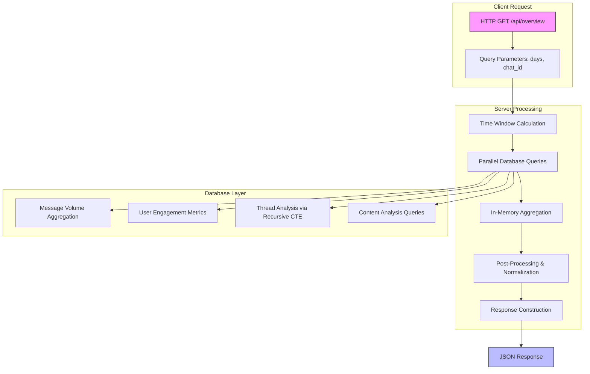
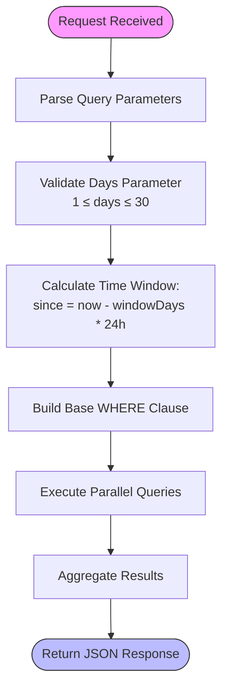
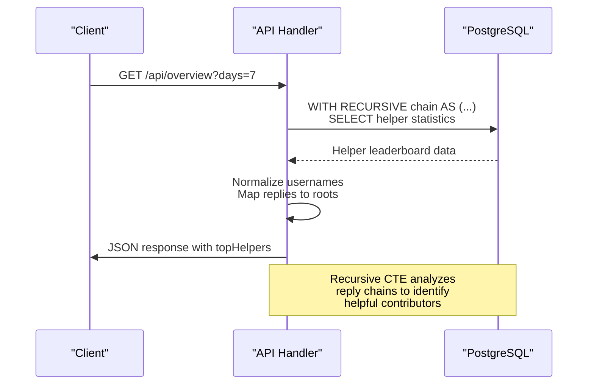
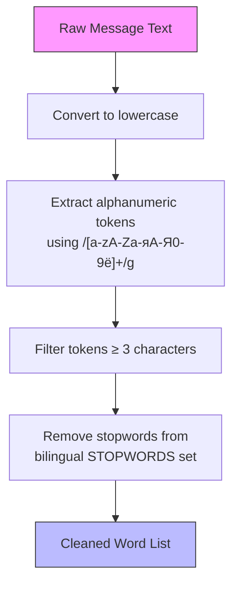
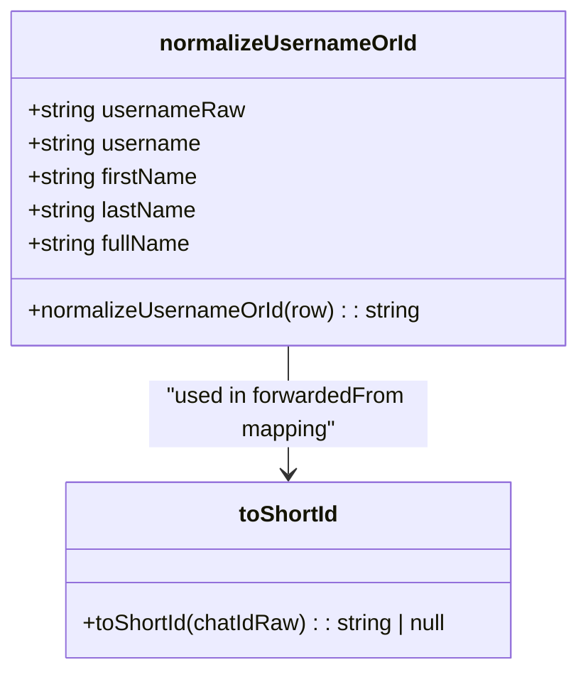
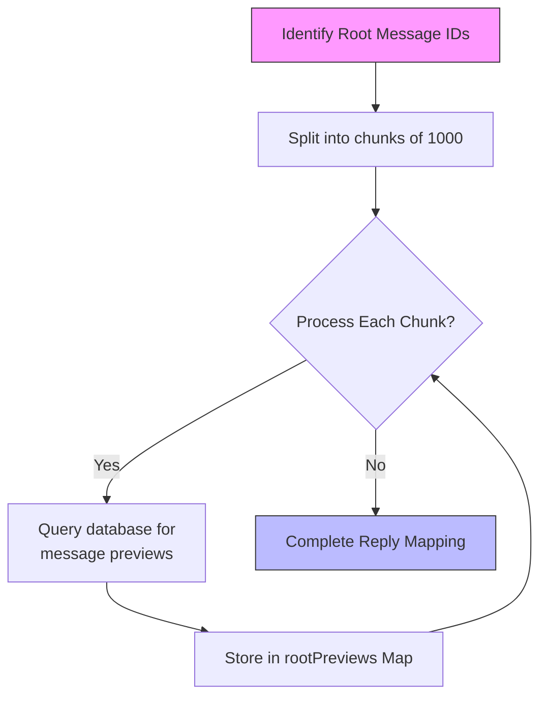
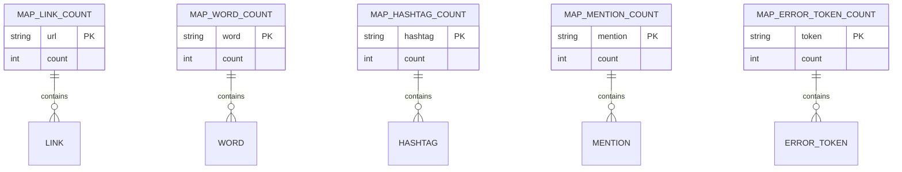

# Data Processing Engine

<cite>
**Referenced Files in This Document**   
- [route.ts](file://app/api/overview/route.ts)
- [schema.ts](file://lib/report/schema.ts)
- [digest_schema.ts](file://lib/report/digest_schema.ts)
</cite>

## Table of Contents
1. [Introduction](#introduction)
2. [Core Components](#core-components)
3. [Architecture Overview](#architecture-overview)
4. [Detailed Component Analysis](#detailed-component-analysis)
5. [Performance Considerations](#performance-considerations)
6. [Conclusion](#conclusion)

## Introduction

The data processing engine powering the tg-vibecoders-dashboard analytics platform is a sophisticated server-side system responsible for transforming raw Telegram message data into meaningful insights. This document provides comprehensive documentation of the `/api/overview` route implementation, detailing how it executes complex PostgreSQL queries to aggregate key metrics across configurable time windows. The engine combines advanced SQL constructs with efficient Node.js post-processing to deliver real-time analytics on message volume, user engagement, link sharing, top entities, unanswered questions, helper leaderboard, error patterns, artifacts, hashtags, mentions, and forwarded content.

## Core Components

The data processing engine consists of several core components working in concert to extract, transform, and present analytics data. The primary entry point is the GET handler in the overview route, which orchestrates the entire data aggregation process. Client-side post-processing functions handle word extraction, link parsing, and normalization logic. The system leverages PostgreSQL's advanced features including Common Table Expressions (CTEs) and recursive queries for thread analysis, while implementing performance optimizations such as chunked queries for reply mapping and efficient in-memory aggregation using Maps.

**Section sources**
- [route.ts](file://app/api/overview/route.ts#L39-L519)
- [route.ts](file://app/api/overview/route.ts#L9-L19)
- [route.ts](file://app/api/overview/route.ts#L21-L25)

## Architecture Overview

**Diagram sources **
- [route.ts](file://app/api/overview/route.ts#L39-L519)

**Section sources**
- [route.ts](file://app/api/overview/route.ts#L39-L519)

## Detailed Component Analysis

### Message Aggregation and Time Window Processing

The data processing engine begins by calculating the time window based on the `days` parameter provided in the request. This configurable window supports analysis from 1 to 30 days, enabling both short-term and long-term trend analysis. The system creates a base WHERE clause that filters messages within the specified time range, with optional filtering by chat ID when the `chat_id` parameter is provided.

**Diagram sources **
- [route.ts](file://app/api/overview/route.ts#L55-L70)

**Section sources**
- [route.ts](file://app/api/overview/route.ts#L55-L85)

### Advanced SQL Constructs for Thread Analysis

The engine employs a recursive Common Table Expression (CTE) to analyze message threads and identify helpers who contribute answers in other people's threads. This recursive query traverses the reply chain from each message back to its root, enabling the system to determine the original message author and identify cases where users are helping others by replying to messages they didn't originate.

**Diagram sources **
- [route.ts](file://app/api/overview/route.ts#L247-L280)

**Section sources**
- [route.ts](file://app/api/overview/route.ts#L247-L280)

### Client-Side Post-Processing and Normalization

After retrieving raw data from the database, the engine performs extensive client-side post-processing to extract meaningful information from message text. This includes word extraction with stopword filtering, link parsing, username normalization, and detection of various content types such as errors, artifacts, hashtags, and mentions.

#### Word Extraction and Stopword Filtering

**Diagram sources **
- [route.ts](file://app/api/overview/route.ts#L32-L37)
- [route.ts](file://app/api/overview/route.ts#L27-L30)

#### Username and Entity Normalization

**Diagram sources **
- [route.ts](file://app/api/overview/route.ts#L9-L19)
- [route.ts](file://app/api/overview/route.ts#L331-L336)

**Section sources**
- [route.ts](file://app/api/overview/route.ts#L9-L19)
- [route.ts](file://app/api/overview/route.ts#L21-L25)
- [route.ts](file://app/api/overview/route.ts#L32-L37)
- [route.ts](file://app/api/overview/route.ts#L27-L30)

### Performance Optimizations and Scalability

The data processing engine implements several performance optimizations to handle large datasets efficiently. These include parallel execution of independent database queries, chunked processing of reply mappings to avoid overwhelming the database, and in-memory aggregation using JavaScript Maps for high-performance counting operations.

#### Chunked Reply Mapping

**Diagram sources **
- [route.ts](file://app/api/overview/route.ts#L176-L194)

#### In-Memory Aggregation with Maps

**Diagram sources **
- [route.ts](file://app/api/overview/route.ts#L154-L160)
- [route.ts](file://app/api/overview/route.ts#L163-L168)
- [route.ts](file://app/api/overview/route.ts#L298-L304)
- [route.ts](file://app/api/overview/route.ts#L307-L310)

**Section sources**
- [route.ts](file://app/api/overview/route.ts#L154-L160)
- [route.ts](file://app/api/overview/route.ts#L163-L168)
- [route.ts](file://app/api/overview/route.ts#L298-L304)
- [route.ts](file://app/api/overview/route.ts#L307-L310)

### Specialized Analytics Features

The engine implements several specialized analytics features that provide deep insights into community dynamics and content patterns.

#### Unanswered Questions Detection
The system uses heuristic-based detection to identify unanswered questions by looking for question marks and specific Russian keywords like "как"