# Entity Ranking Engine

<cite>
**Referenced Files in This Document**   
- [app/api/overview/route.ts](file://app/api/overview/route.ts)
- [lib/report/slice.ts](file://lib/report/slice.ts)
</cite>

## Table of Contents
1. [Introduction](#introduction)
2. [SQL-Based Entity Ranking](#sql-based-entity-ranking)
3. [In-Memory Aggregation and Text Processing](#in-memory-aggregation-and-text-processing)
4. [Specialized Ranking Logic](#specialized-ranking-logic)
5. [Text Normalization and Filtering](#text-normalization-and-filtering)
6. [Scalability Considerations](#scalability-considerations)

## Introduction

The entity ranking engine processes Telegram message data to identify top users, links, words, threads, helpers, errors, hashtags, and mentions. It combines SQL-based aggregation for structured data with in-memory processing for text analysis, enabling comprehensive insights from chat activity. The system is implemented across two primary files: `app/api/overview/route.ts` handles real-time analytics endpoints, while `lib/report/slice.ts` provides reusable reporting functionality.

**Section sources**
- [app/api/overview/route.ts](file://app/api/overview/route.ts#L1-L50)
- [lib/report/slice.ts](file://lib/report/slice.ts#L1-L50)

## SQL-Based Entity Ranking

The engine uses SQL GROUP BY clauses combined with ORDER BY and LIMIT to extract ranked lists from raw message data. This approach efficiently aggregates data at the database level before transmission to the application layer.

For user ranking, a LEFT JOIN between messages and users tables groups by user identifiers, counting messages per user and ordering by frequency:

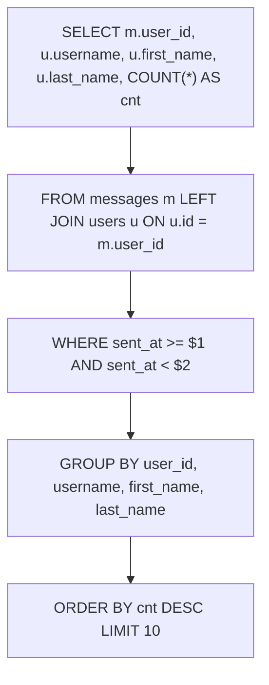

**Diagram sources**
- [app/api/overview/route.ts](file://app/api/overview/route.ts#L92-L123)

Forwarded content analysis employs Common Table Expressions (CTEs) with UNION ALL to consolidate data from different forwarding fields in the JSON message structure, then groups by chat or user identifiers:

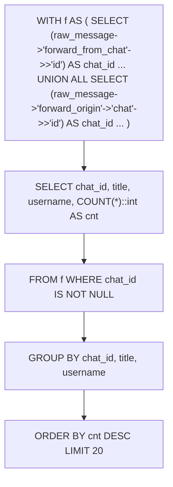

**Diagram sources**
- [app/api/overview/route.ts](file://app/api/overview/route.ts#L294-L329)
- [app/api/overview/route.ts](file://app/api/overview/route.ts#L407-L435)

KPI calculations use aggregate functions with FILTER clauses to compute multiple metrics in a single query, improving efficiency:

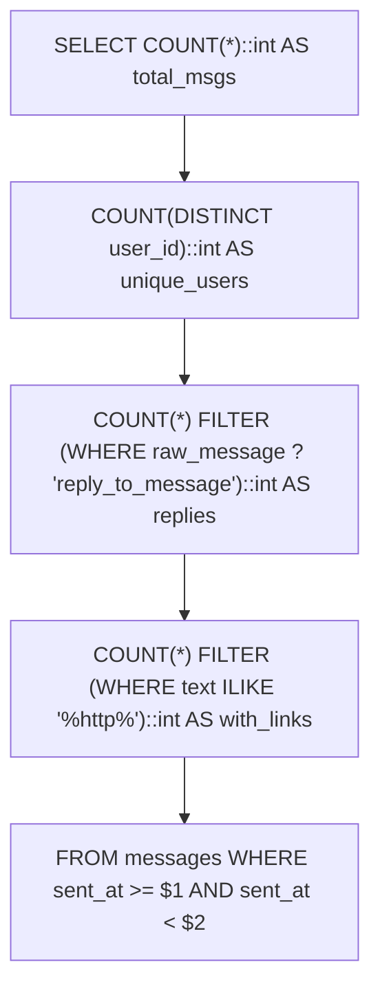

**Diagram sources**
- [lib/report/slice.ts](file://lib/report/slice.ts#L145-L176)

## In-Memory Aggregation and Text Processing

After retrieving relevant message text data via SQL queries, the engine performs in-memory aggregation using Map objects for word frequency counting and link extraction.

Word frequency analysis follows this process:
1. Extract all alphanumeric tokens using regex matching
2. Convert to lowercase for case normalization
3. Filter by minimum length and stopword removal
4. Count frequencies using Map object
5. Sort and limit results

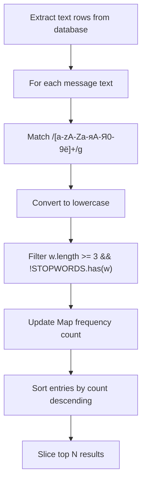

**Diagram sources**
- [app/api/overview/route.ts](file://app/api/overview/route.ts#L125-L137)
- [app/api/overview/route.ts](file://app/api/overview/route.ts#L27-L37)

Link extraction uses regex parsing to identify URLs within message text, with additional normalization to standardize URL formats:

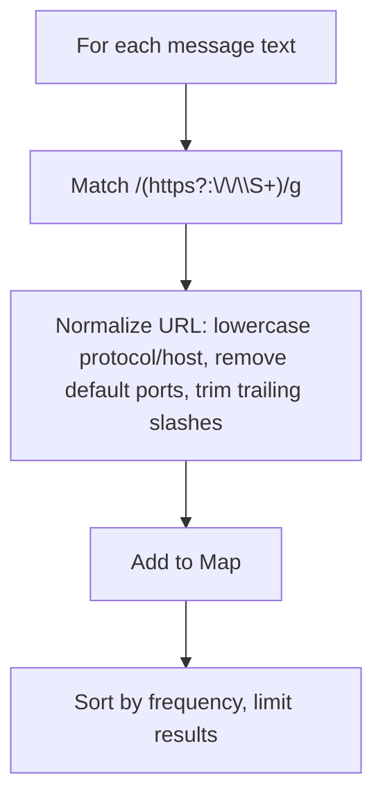

**Diagram sources**
- [lib/report/slice.ts](file://lib/report/slice.ts#L51-L83)
- [app/api/overview/route.ts](file://app/api/overview/route.ts#L21-L25)

## Specialized Ranking Logic

The engine implements specialized ranking logic for complex entities like threads, helpers, and unanswered questions.

Thread depth analysis uses recursive CTEs to trace reply chains back to their root messages, enabling accurate thread popularity measurement:

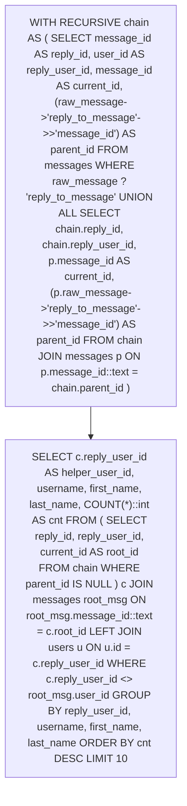

**Diagram sources**
- [app/api/overview/route.ts](file://app/api/overview/route.ts#L444-L470)

Helper identification applies heuristic-based logic to distinguish genuine contributions from self-replies by ensuring the helper user ID differs from the thread originator:

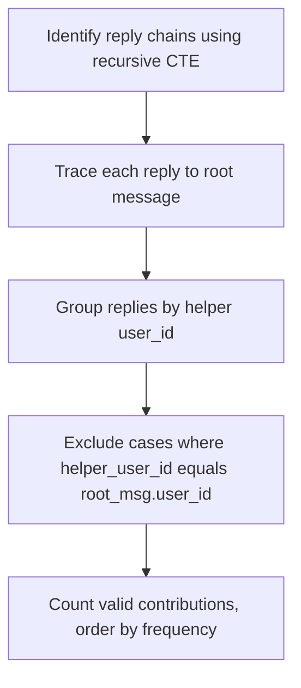

**Diagram sources**
- [app/api/overview/route.ts](file://app/api/overview/route.ts#L444-L470)

Error token detection employs pattern matching with regular expressions to identify technical issues mentioned in messages:

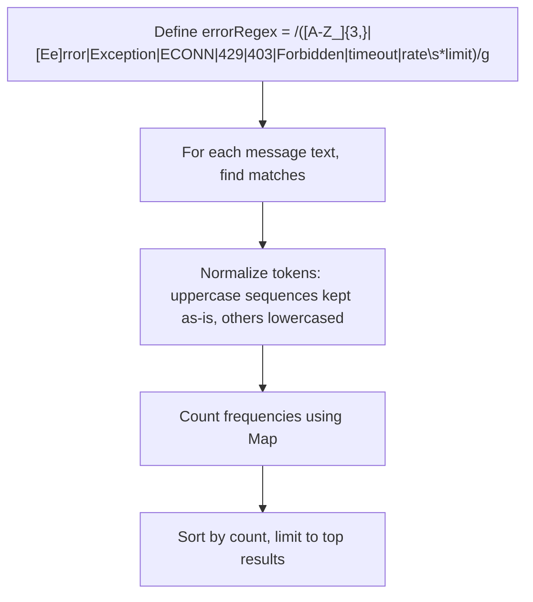

**Diagram sources**
- [lib/report/slice.ts](file://lib/report/slice.ts#L85-L90)
- [app/api/overview/route.ts](file://app/api/overview/route.ts#L444-L470)

## Text Normalization and Filtering

The engine applies several text processing techniques to improve ranking quality.

Stopword filtering removes common words that lack analytical value using a predefined set of English and Russian stopwords:

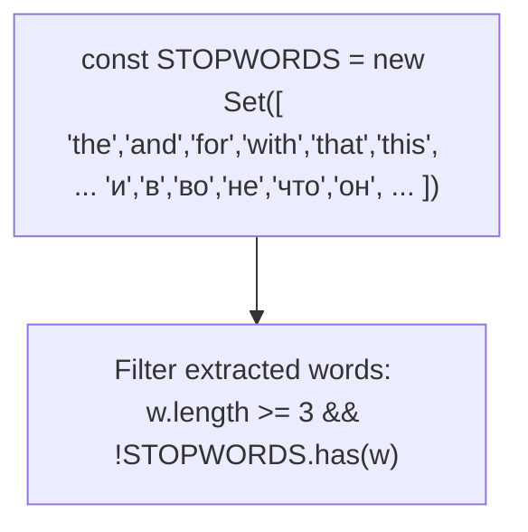

**Diagram sources**
- [app/api/overview/route.ts](file://app/api/overview/route.ts#L27-L37)

Case normalization ensures consistent token comparison by converting all text to lowercase before analysis:

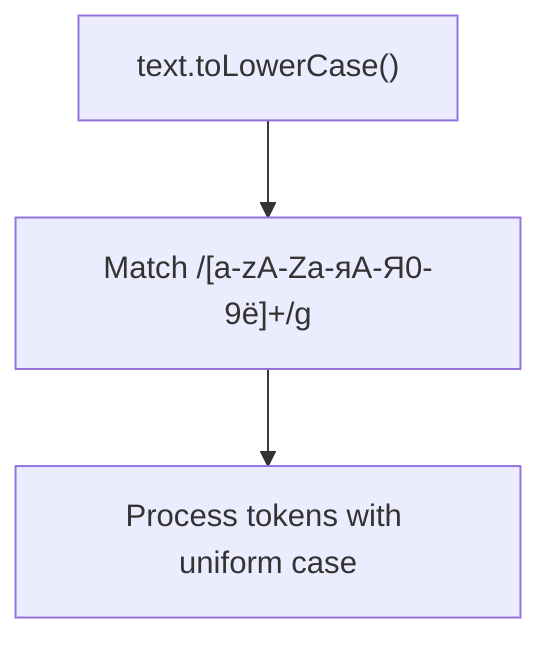

**Diagram sources**
- [app/api/overview/route.ts](file://app/api/overview/route.ts#L32-L37)

Preview truncation improves UI performance by limiting text display length with ellipsis handling:

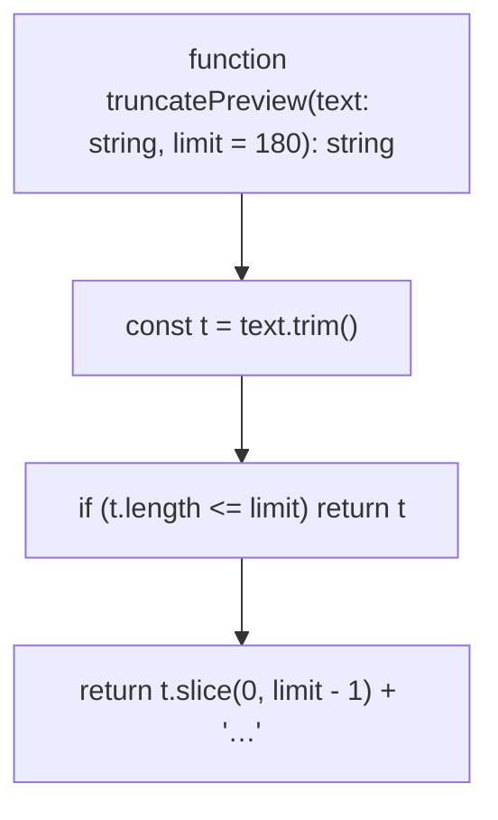

**Diagram sources**
- [lib/report/slice.ts](file://lib/report/slice.ts#L73-L77)

## Scalability Considerations

The entity ranking engine addresses scalability concerns through several design patterns when processing large message volumes.

Query optimization uses parameterized queries with date-based filtering to limit result sets:

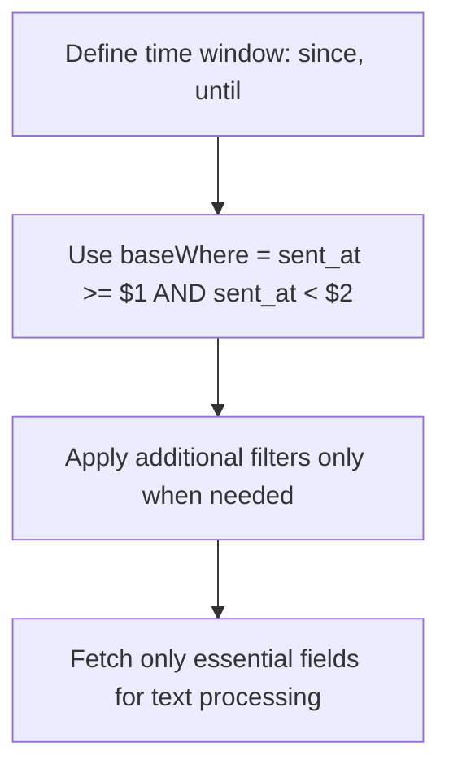

**Diagram sources**
- [lib/report/slice.ts](file://lib/report/slice.ts#L145-L176)

Memory-efficient processing batches operations to avoid excessive memory consumption:

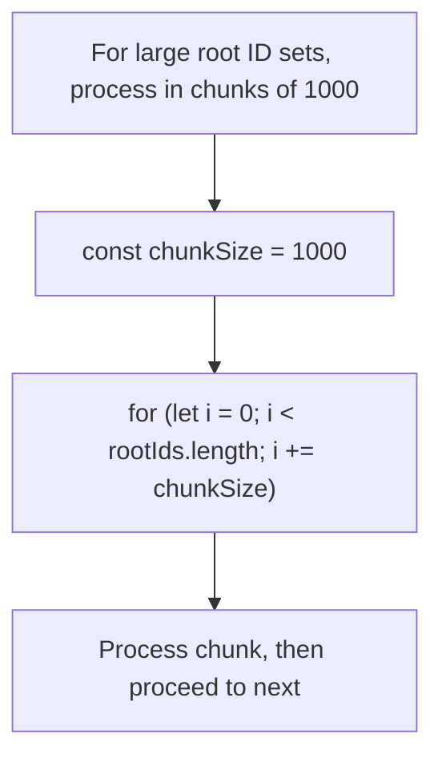

**Diagram sources**
- [app/api/overview/route.ts](file://app/api/overview/route.ts#L139-L163)

Connection pooling manages database resources efficiently:

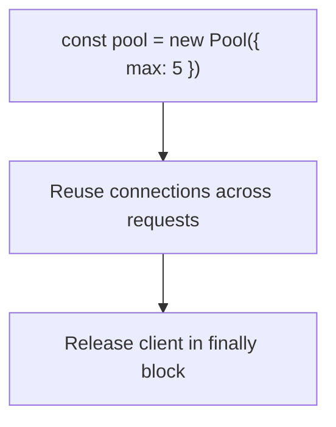

**Diagram sources**
- [lib/report/slice.ts](file://lib/report/slice.ts#L10-L15)