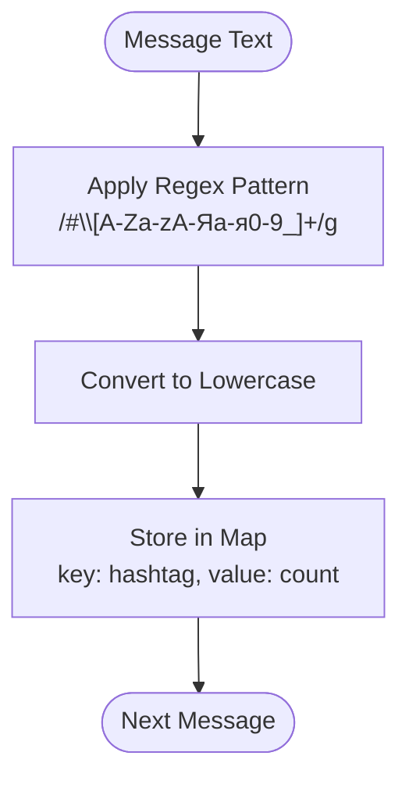
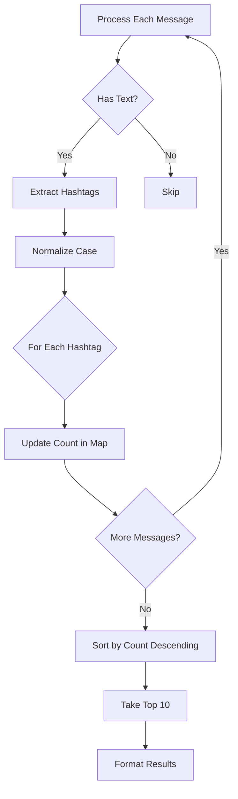

# Hashtags Analysis

<cite>
**Referenced Files in This Document**   
- [HashtagsTable.tsx](file://app/components/tables/HashtagsTable.tsx)
- [route.ts](file://app/api/overview/route.ts)
</cite>

## Table of Contents
1. [Introduction](#introduction)
2. [Hashtag Extraction Logic](#hashtag-extraction-logic)
3. [Data Processing and Aggregation](#data-processing-and-aggregation)
4. [Result Formatting and Component Integration](#result-formatting-and-component-integration)
5. [Use Cases and Applications](#use-cases-and-applications)
6. [Challenges and Limitations](#challenges-and-limitations)

## Introduction

The hashtags analysis feature enables trend monitoring and community topic tracking by extracting, normalizing, and ranking #tags used across messages in the system. This functionality is implemented within the analytics dashboard to provide insights into popular topics and user engagement patterns. The system processes message text to identify hashtags using regular expressions, aggregates their usage counts, and presents them in a ranked format for visualization.

**Section sources**
- [route.ts](file://app/api/overview/route.ts#L280-L292)

## Hashtag Extraction Logic

The hashtag extraction process begins with a regex pattern that identifies all substrings starting with the '#' character followed by alphanumeric characters (including Cyrillic) and underscores. The implementation uses the JavaScript `match()` method with the global flag `/g` to capture all occurrences within each message.

The regex pattern `/#[A-Za-zА-Яа-я0-9_]+/g` specifically targets:
- Latin letters (both uppercase and lowercase)
- Cyrillic letters (covering Russian and other Cyrillic-based languages)
- Numbers
- Underscores

This multi-language support allows the system to effectively process hashtags in both English and Russian contexts. After extraction, all identified hashtags are normalized to lowercase to ensure case-insensitive counting and prevent duplicate entries due to capitalization differences.



**Diagram sources**
- [route.ts](file://app/api/overview/route.ts#L280-L284)

**Section sources**
- [route.ts](file://app/api/overview/route.ts#L280-L284)

## Data Processing and Aggregation

The system employs an in-memory processing approach using JavaScript `Map` objects to aggregate hashtag occurrences. For each message processed, extracted hashtags are iterated through, and their counts are incremented in the `hashtagCounts` map. If a hashtag doesn't exist in the map, it's initialized with a count of 1; otherwise, its existing count is incremented.

After processing all messages, the aggregated data is sorted by frequency in descending order using the `sort((a, b) => b[1] - a[1])` comparison function, where `a[1]` and `b[1]` represent the count values of each hashtag. The top 10 most frequently used hashtags are then selected using `.slice(0, 10)` and transformed into an array of objects with `token` and `cnt` properties for consistent data structure.

This in-memory aggregation approach provides efficient processing without requiring additional database queries or external storage, making it suitable for real-time analytics within the specified time window.



**Diagram sources**
- [route.ts](file://app/api/overview/route.ts#L284-L292)

**Section sources**
- [route.ts](file://app/api/overview/route.ts#L284-L292)

## Result Formatting and Component Integration

The processed hashtag data is formatted as an array of objects containing `token` (the hashtag string) and `cnt` (usage count) properties, which is then passed to the frontend component for display. The `HashtagsTable` React component receives this data through its props and renders a responsive table showing the top hashtags and their respective counts.

The component implements conditional rendering, returning `null` when no hashtag data is available (`rows.length === 0`). It utilizes the `useNumberFormatter` hook to properly format large numbers for better readability. The UI displays hashtags in a scrollable panel with appropriate styling, including column headers for "#Хэштег" (Hashtag) and "Кол-во" (Count), maintaining consistency with the application's design language.

```mermaid
classDiagram
class HashtagsTable {
+formatNumber : Function
+rows : {token : string, cnt : number}[]
+render() : JSX.Element
}
HashtagsTable --> useNumberFormatter : "uses"
```

**Diagram sources**
- [HashtagsTable.tsx](file://app/components/tables/HashtagsTable.tsx#L7-L23)

**Section sources**
- [HashtagsTable.tsx](file://app/components/tables/HashtagsTable.tsx#L7-L23)

## Use Cases and Applications

The hashtags analysis feature serves multiple valuable use cases for community management and content strategy:

1. **Trend Monitoring**: Identifying emerging topics and viral content by tracking rapidly increasing hashtag usage over time.
2. **Community Topic Tracking**: Understanding the primary discussion themes within a chat or channel by analyzing persistent popular hashtags.
3. **Engagement Analysis**: Measuring user participation in specific campaigns or events promoted through dedicated hashtags.
4. **Content Strategy Optimization**: Informing content creators about which topics generate the most discussion and engagement.
5. **Moderation Support**: Detecting potentially problematic or spammy hashtag patterns that may require moderation attention.

These insights help administrators and community managers make data-driven decisions about content promotion, user engagement strategies, and community guidelines enforcement.

## Challenges and Limitations

While the current implementation provides effective hashtag analysis, several challenges and limitations should be acknowledged:

1. **Multi-language Hashtags**: Although the regex supports both Latin and Cyrillic characters, edge cases may arise with mixed-script hashtags or other non-Latin scripts not explicitly covered in the pattern.

2. **Compound Tags**: The system treats compound hashtags (e.g., #machinelearning) as single entities rather than decomposing them into constituent words, potentially missing semantic relationships.

3. **Spammy Tag Inflation**: Users may artificially inflate hashtag popularity through repetitive posting, which the current simple counting mechanism does not mitigate.

4. **Contextual Understanding**: The analysis focuses on frequency without considering the sentiment or context in which hashtags are used, limiting deeper semantic interpretation.

5. **Performance Considerations**: For very large datasets, the in-memory processing approach could encounter memory constraints, though this is mitigated by the time-windowed data retrieval.

Future enhancements could address these limitations through more sophisticated natural language processing techniques, spam detection algorithms, and expanded character set support for additional languages.