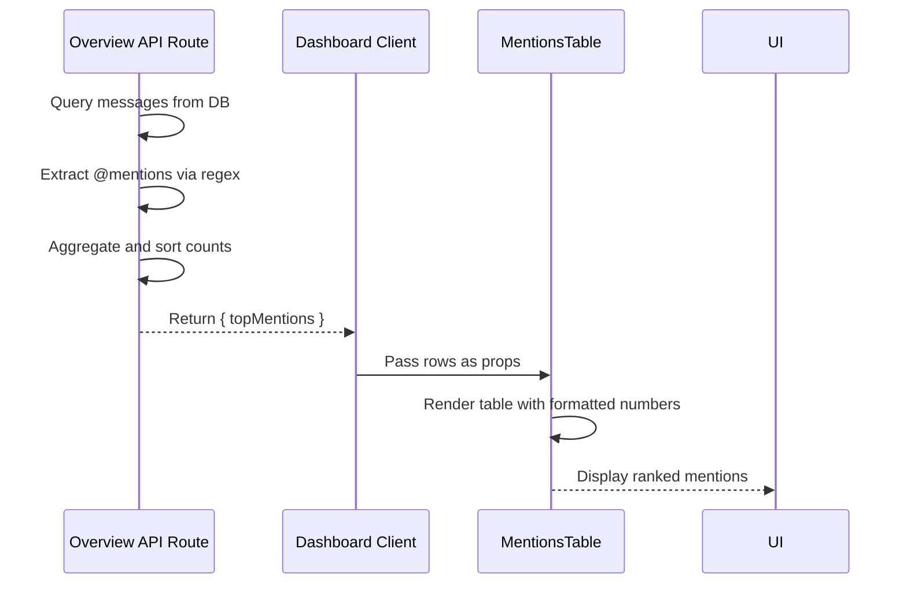

<cite>
**Referenced Files in This Document**
- [app/api/overview/route.ts](file://app/api/overview/route.ts)
- [app/components/tables/MentionsTable.tsx](file://app/components/tables/MentionsTable.tsx)
</cite>

## Mentions Analysis

The mentions analysis feature enables tracking of user references across chat messages by identifying @username patterns, aggregating their frequency, and presenting them in a ranked format. This functionality provides insights into social dynamics, influence, and visibility within the community.

### Regex-Based Mention Extraction

Mention detection is implemented through regular expression parsing directly on message text content. The system scans each message for substrings matching the pattern `@[A-Za-zА-Яа-я0-9_]+`, which captures usernames containing Latin or Cyrillic letters, digits, and underscores. This regex ensures robust identification of valid Telegram-style mentions while excluding malformed or incomplete tags.

The extraction occurs during the data processing phase in the `/api/overview` route, where all messages within a specified time window are retrieved from the database. For each message, the regex is applied to extract potential mentions, which are then normalized to lowercase to ensure case-insensitive counting.

```mermaid
flowchart TD
A[Retrieve Messages] --> B{Process Each Message}
B --> C[Apply Regex: @[A-Za-zА-Яа-я0-9_]+]
C --> D[Normalize to Lowercase]
D --> E[Aggregate Count per Mention]
E --> F[Sort by Frequency]
F --> G[Return Top 10 Mentions]
```

**Diagram sources**
- [app/api/overview/route.ts](file://app/api/overview/route.ts#L285-L293)

**Section sources**
- [app/api/overview/route.ts](file://app/api/overview/route.ts#L285-L293)

### Username Normalization and Aggregation

After extraction, mentions are aggregated using a case-insensitive map to count occurrences per unique username. The top 10 most frequently mentioned users are selected and sorted in descending order of mention count. This list is included in the API response under the `topMentions` field, with each entry containing the normalized token (e.g., `@username`) and its associated count.

Normalization ensures consistency in representation, preventing duplicates due to capitalization differences (e.g., `@User` vs `@user`). Unlike user identifiers derived from message metadata, these mentions are purely textual and may include references to users outside the current chat or even non-existent accounts.

### Integration with MentionsTable Component

The frontend renders the mention data via the `MentionsTable` React component, which receives the processed `topMentions` array as a prop. The component displays a scrollable table with two columns: the mentioned username and the total number of times it was referenced.

The table formatting uses a number formatter hook to enhance readability, particularly for high-frequency mentions. If no mentions are present in the dataset, the component returns null, ensuring clean UI rendering without empty states.



**Diagram sources**
- [app/api/overview/route.ts](file://app/api/overview/route.ts#L285-L293)
- [app/components/tables/MentionsTable.tsx](file://app/components/tables/MentionsTable.tsx#L7-L23)

**Section sources**
- [app/components/tables/MentionsTable.tsx](file://app/components/tables/MentionsTable.tsx#L7-L23)

### Applications in Community Analytics

Mention frequency serves as a proxy for influence and engagement within the chat community. Users who are frequently referenced—either for advice, tagging in discussions, or being highlighted—are likely central figures in information flow. This metric complements other indicators like message volume or reply leadership to form a more complete picture of social structure.

Organizations can use this data to identify key contributors, detect emerging influencers, or assess the reach of announcements and campaigns. It also helps surface informal leadership roles that may not be evident from posting frequency alone.

### Edge Case Handling

The implementation includes several considerations for edge cases:

- **Fake or Invalid Mentions**: The system does not validate whether a mentioned username corresponds to an actual user in the chat or on Telegram. This allows tracking of intentional references (including humorous or hypothetical ones) but may introduce noise.
- **Escaped Characters**: The regex operates on raw message text, so escaped `@` symbols (if any) would not trigger a match, depending on how the client handles escaping.
- **Cross-Chat Ambiguity**: Mentions are analyzed within the context of a single chat or across all chats based on filtering parameters. However, the same username may refer to different individuals across different communities, introducing potential ambiguity in cross-chat analyses.

These limitations are balanced against the goal of capturing perceived relevance rather than strict identity verification, making the feature useful for qualitative social analysis despite its technical simplifications.