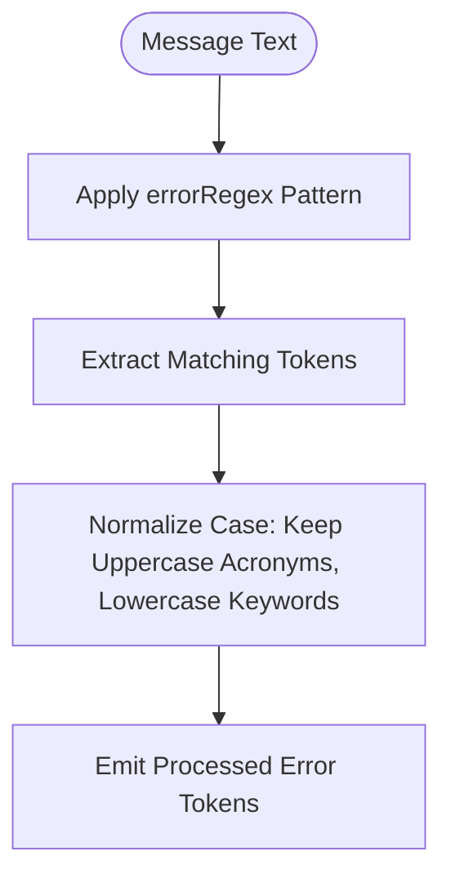
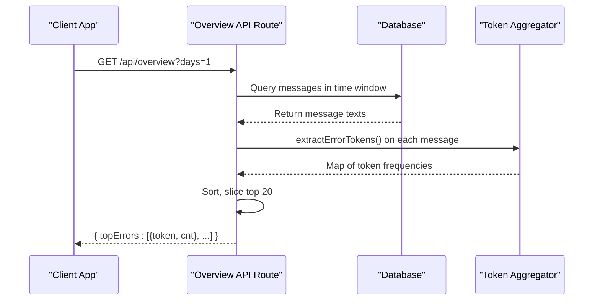

# Top Errors Ranking

<cite>
**Referenced Files in This Document**  
- [app/api/overview/route.ts](file://app/api/overview/route.ts)
- [lib/report/slice.ts](file://lib/report/slice.ts)
- [app/components/tables/TopErrorsTable.tsx](file://app/components/tables/TopErrorsTable.tsx)
</cite>

## Table of Contents
1. [Introduction](#introduction)
2. [Heuristic-Based Error Detection](#heuristic-based-error-detection)
3. [Error Token Extraction and Classification](#error-token-extraction-and-classification)
4. [Frequency Aggregation and Data Flow](#frequency-aggregation-and-data-flow)
5. [Integration with TopErrorsTable Component](#integration-with-toperrorstable-component)
6. [Noise Reduction and False Positive Mitigation](#noise-reduction-and-false-positive-mitigation)
7. [Potential Improvements](#potential-improvements)

## Introduction

The Top Errors Ranking feature is designed to detect, categorize, and rank error messages within chat logs by identifying common error patterns using heuristic-based pattern matching. This functionality enables users to quickly identify recurring issues in communication channels by scanning message content for predefined error tokens, classifying them into meaningful categories, and aggregating their frequency for display. The system integrates seamlessly with the `TopErrorsTable` component to present a ranked list of detected errors, supporting operational visibility and incident response workflows.

## Heuristic-Based Error Detection

The error detection mechanism relies on a regular expression pattern that captures a wide range of common error indicators found in technical communication. These include uppercase acronyms (e.g., `ECONNRESET`, `TIMEOUT`), general error keywords (e.g., `Error`, `Exception`), HTTP status codes (e.g., `429`, `403`), and contextual terms like `Forbidden`, `timeout`, or `rate limit`. The implementation uses case-insensitive matching for descriptive terms while preserving case for structured identifiers such as all-caps error codes.

This approach ensures broad coverage across different types of error expressions without requiring prior knowledge of specific error formats. The heuristic design allows the system to adapt to various domains and technologies where standardized error reporting may not be enforced, making it particularly effective in informal or developer-focused chat environments.



**Diagram sources**  
- [lib/report/slice.ts](file://lib/report/slice.ts#L85-L90)

**Section sources**  
- [lib/report/slice.ts](file://lib/report/slice.ts#L85-L90)

## Error Token Extraction and Classification

Error token extraction is implemented through the `extractErrorTokens` function located in `lib/report/slice.ts`. This utility processes raw message text and applies a global regular expression to capture all relevant substrings that match known error patterns. Each matched token is then normalized—uppercase acronyms are preserved, while generic keywords like "error" or "exception" are converted to lowercase to ensure consistent aggregation.

The classification logic does not rely on external taxonomies but instead derives categories directly from the textual representation of the error. This means that each unique token becomes its own category, enabling fine-grained tracking of specific error types. For example, both `NetworkError` and `TypeError` would be captured separately due to their distinct lexical forms, allowing downstream analysis to distinguish between different kinds of exceptions.

```mermaid
classDiagram
class extractErrorTokens {
+text? : string | null
+return : string[]
+if !text → []
+match against errorRegex
+normalize case per token
}
class errorRegex {
+pattern : /([A-Z_]{3,}|[Ee]rror|Exception|ECONN|429|403|Forbidden|timeout|rate\\s*limit)/g
}
extractErrorTokens --> errorRegex : "uses"
```

**Diagram sources**  
- [lib/report/slice.ts](file://lib/report/slice.ts#L85-L90)

**Section sources**  
- [lib/report/slice.ts](file://lib/report/slice.ts#L85-L90)

## Frequency Aggregation and Data Flow

Once error tokens are extracted from individual messages, they are aggregated by frequency using a `Map<string, number>` structure. As the system iterates over all messages in the selected time window, each detected token increments its corresponding counter in the map. After processing all messages, the results are sorted in descending order by count and limited to the top 20 entries before being returned as part of the API response.

In the `/api/overview/route.ts` file, this aggregation occurs after retrieving message texts from the database. The same pipeline also handles other analytics such as top links, hashtags, and unanswered questions, ensuring efficient batch processing of multiple metrics in a single request cycle.



**Diagram sources**  
- [app/api/overview/route.ts](file://app/api/overview/route.ts#L280-L292)
- [lib/report/slice.ts](file://lib/report/slice.ts#L279-L308)

**Section sources**  
- [app/api/overview/route.ts](file://app/api/overview/route.ts#L280-L292)
- [lib/report/slice.ts](file://lib/report/slice.ts#L279-L308)

## Integration with TopErrorsTable Component

The `TopErrorsTable` React component consumes the aggregated error data and renders it in a tabular format within the dashboard UI. It accepts a `rows` prop containing objects with `token` and `cnt` fields, which correspond directly to the output of the backend aggregation process. If no errors are detected (`rows.length === 0`), the component returns `null`, effectively hiding the section when there is no data to display.

The table displays two columns: one for the error token (e.g., `429`, `timeout`) and another showing the occurrence count, formatted using the `useNumberFormatter` hook for locale-aware presentation. The component is styled as a scrollable panel with a maximum height constraint, ensuring usability even when displaying long lists of errors.

```mermaid
classDiagram
class TopErrorsTable {
+rows : Array<{token : string, cnt : number}>
+formatNumber : Function
+if empty → null
+render table with token & count
}
class useNumberFormatter {
+locale : string
+formatNumber(value) : string
}
TopErrorsTable --> useNumberFormatter : "uses"
```

**Diagram sources**  
- [app/components/tables/TopErrorsTable.tsx](file://app/components/tables/TopErrorsTable.tsx#L7-L23)

**Section sources**  
- [app/components/tables/TopErrorsTable.tsx](file://app/components/tables/TopErrorsTable.tsx#L7-L23)

## Noise Reduction and False Positive Mitigation

To minimize noise and reduce false positives, the system employs several filtering strategies:
- **Case normalization**: Generic error terms are lowercased to avoid treating variations like "Error", "error", and "ERROR" as separate entities.
- **Length filtering**: Only tokens meeting minimum length criteria (implied via regex structure) are considered, reducing spurious matches.
- **Contextual exclusions**: While not currently implemented, future enhancements could exclude non-error uses of keywords (e.g., “no errors today”) via negation rules or ML-based disambiguation.
- **Frequency thresholding**: Although not applied in current logic, low-frequency tokens could be filtered out client-side or during aggregation to focus on significant trends.

Additionally, the use of word boundary-aware patterns helps prevent partial matches within larger words, though the current regex operates on substring matching rather than full-word alignment.

## Potential Improvements

Several improvements can enhance the accuracy and utility of the error ranking system:

### Enhanced Parsing with Log Libraries
Integrating established log parsing libraries (e.g., `logform`, `winston`, or custom parsers for structured logs) could allow recognition of stack traces, timestamped entries, and nested exception hierarchies. This would enable richer categorization beyond simple keyword matching.

### Machine Learning-Based Classification
Implementing a lightweight ML model—such as a rule-based classifier enhanced with embeddings or a small transformer model—could classify errors into semantic categories (e.g., network, authentication, rate limiting). Such models could be trained on historical chat data to improve relevance and reduce ambiguity.

### Structured Error Schema Mapping
Mapping detected tokens to a canonical error schema (e.g., mapping `429`, `rate limit`, and `TooManyRequests` to a unified `RATE_LIMIT_EXCEEDED` type) would improve consistency and support cross-platform monitoring.

### Real-Time Streaming Analysis
Extending the system to support real-time error tracking via WebSocket streams or incremental updates would provide immediate feedback on emerging issues, enhancing responsiveness in fast-moving discussions.

These enhancements would build upon the existing heuristic foundation, transforming the feature from a basic frequency tracker into a sophisticated diagnostic tool capable of guiding proactive troubleshooting efforts.