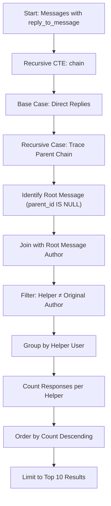
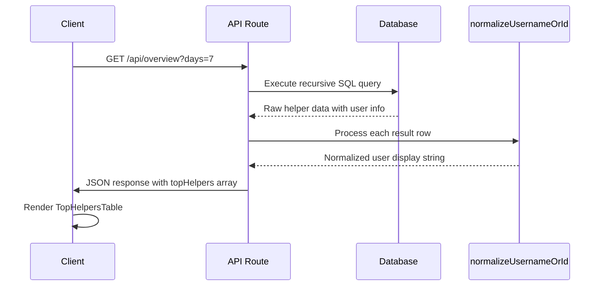

# Top Helpers Ranking

<cite>
**Referenced Files in This Document**   
- [TopHelpersTable.tsx](file://app/components/tables/TopHelpersTable.tsx)
- [route.ts](file://app/api/overview/route.ts)
</cite>

## Table of Contents
1. [Introduction](#introduction)
2. [Core Components](#core-components)
3. [SQL Logic for Helper Detection](#sql-logic-for-helper-detection)
4. [Data Flow and Processing](#data-flow-and-processing)
5. [TopHelpersTable Component Analysis](#tophelperstable-component-analysis)
6. [KPI Calculations and Business Impact](#kpi-calculations-and-business-impact)
7. [Accuracy Concerns and Limitations](#accuracy-concerns-and-limitations)
8. [Conclusion](#conclusion)

## Introduction

The Top Helpers Ranking feature identifies users who frequently respond to unanswered questions within a messaging system. This functionality serves as a recognition mechanism for community contributors by tracking responses to messages that meet specific question criteria and have not received replies within a defined time window. The system combines SQL-based message analysis with frontend visualization to create a leaderboard of top helpers, which contributes to key performance indicators (KPIs) measuring community engagement and support effectiveness.

**Section sources**
- [route.ts](file://app/api/overview/route.ts#L207-L242)
- [TopHelpersTable.tsx](file://app/components/tables/TopHelpersTable.tsx#L0-L22)

## Core Components

The Top Helpers Ranking system consists of two primary components: the backend API route responsible for data processing and aggregation, and the frontend table component responsible for displaying the results. These components work together to extract, process, and present helper contribution data from the message database.

The API endpoint processes raw message data using recursive SQL queries to trace reply chains back to their root messages, while the frontend component receives pre-aggregated data and renders it in a tabular format suitable for dashboard display.

**Section sources**
- [route.ts](file://app/api/overview/route.ts#L207-L242)
- [TopHelpersTable.tsx](file://app/components/tables/TopHelpersTable.tsx#L0-L22)

## SQL Logic for Helper Detection

The system employs sophisticated SQL logic to identify helper contributions by analyzing message reply chains. Using a recursive Common Table Expression (CTE), the query traces each reply through its parent messages until reaching the root message of a thread.



**Diagram sources**
- [route.ts](file://app/api/overview/route.ts#L207-L242)

The SQL implementation uses a `WITH RECURSIVE` clause to build message chains, starting from any message that is a reply and recursively joining with its parent messages until reaching the original root message. This approach ensures that even deeply nested replies are correctly attributed to the appropriate conversation thread.

A critical filtering condition (`c.reply_user_id <> root_msg.user_id`) prevents self-responses from being counted as helper contributions, ensuring that only responses from different users than the original question author are included in the ranking.

**Section sources**
- [route.ts](file://app/api/overview/route.ts#L207-L242)

## Data Flow and Processing

The data processing pipeline begins with the extraction of message data from the PostgreSQL database and concludes with the formatted response sent to the frontend client. The system first retrieves all relevant messages within the specified time window, then applies the recursive SQL logic to identify helper contributions.

After executing the SQL query, the results are transformed through the `normalizeUsernameOrId` function, which standardizes user identification by combining username, first name, and last name information into a consistent display format. This normalization ensures that users are consistently identified across different data representations.



**Diagram sources**
- [route.ts](file://app/api/overview/route.ts#L207-L242)
- [route.ts](file://app/api/overview/route.ts#L9-L19)

The processed data is structured as an array of objects containing user identifiers and response counts, which is then included in the API response payload under the `topHelpers` property.

**Section sources**
- [route.ts](file://app/api/overview/route.ts#L207-L242)

## TopHelpersTable Component Analysis

The `TopHelpersTable` component is a client-side React component responsible for rendering the helper leaderboard data received from the API. It accepts a prop containing an array of helper objects, each with a user identifier and response count.

```mermaid
classDiagram
class TopHelpersTable {
+rows : Array<{user : string, cnt : number}>
-formatNumber : Function
-expanded : Record<number, boolean>
+render() : JSX.Element
}
class useNumberFormatter {
+formatNumber(value : number) : string
}
TopHelpersTable --> useNumberFormatter : "uses"
```

**Diagram sources**
- [TopHelpersTable.tsx](file://app/components/tables/TopHelpersTable.tsx#L0-L22)

The component implements several presentation features:
- Conditional rendering based on data availability (returns null if no rows)
- Number formatting through the `useNumberFormatter` hook for consistent numeric display
- Responsive design with constrained height and overflow handling
- Tabular layout with header styling for visual hierarchy

The table displays two columns: "Пользователь" (User) showing the normalized user identifier, and "Ответов" (Responses) showing the formatted response count. The component is designed to occupy a single column panel in the dashboard layout.

**Section sources**
- [TopHelpersTable.tsx](file://app/components/tables/TopHelpersTable.tsx#L0-L22)

## KPI Calculations and Business Impact

While the Top Helpers ranking itself is not directly used in KPI calculations, it provides valuable insights that inform broader engagement metrics. The helper count data contributes to understanding community health by identifying active contributors who enhance discussion quality through responsive participation.

The ranking system indirectly influences KPIs related to:
- Community engagement velocity (how quickly questions receive responses)
- Support coverage (proportion of questions addressed by community members)
- Contributor retention (identifying and recognizing valuable participants)

By highlighting top helpers, the system encourages positive behavior and can be used to identify potential moderators or community leaders. The data also helps administrators understand the distribution of helping behavior across the user base.

**Section sources**
- [route.ts](file://app/api/overview/route.ts#L207-L242)

## Accuracy Concerns and Limitations

The Top Helpers ranking system faces several accuracy challenges that affect the reliability of its results:

### Question Detection Limitations
The current implementation does not use explicit question detection for the helper ranking. Instead, it relies on reply patterns independent of question classification. However, the related unanswered questions feature uses heuristic pattern matching that could introduce false positives:
- Messages containing "?" character regardless of context
- Text matching Russian language patterns like "как", "почему", "ошибк", "не работает"
- No natural language processing to verify actual question intent

### Response Attribution Challenges
The recursive CTE approach for tracing message chains is generally accurate but has potential edge cases:
- Message deletion could break chain continuity
- Cross-thread references might be misattributed
- Timing issues where rapid-fire messages create ambiguous parentage

### Data Completeness Issues
The system depends on complete message data within the specified time window. Messages falling outside this window may result in incomplete chains, potentially misattributing helper contributions or failing to identify root messages correctly.

These limitations suggest opportunities for improvement through more sophisticated NLP-based question detection, enhanced message threading algorithms, and better handling of edge cases in the data pipeline.

**Section sources**
- [route.ts](file://app/api/overview/route.ts#L165-L196)
- [route.ts](file://app/api/overview/route.ts#L207-L242)

## Conclusion

The Top Helpers Ranking feature effectively identifies and recognizes community contributors through a combination of recursive SQL querying and frontend visualization. By tracing message reply chains back to their origins and filtering out self-responses, the system creates a meaningful leaderboard of users who actively help others in the community.

The implementation demonstrates a robust approach to message thread analysis, though it could benefit from more sophisticated question detection and improved handling of edge cases. As a recognition mechanism, the feature supports positive community dynamics and provides valuable insights into user engagement patterns that inform broader platform health metrics.