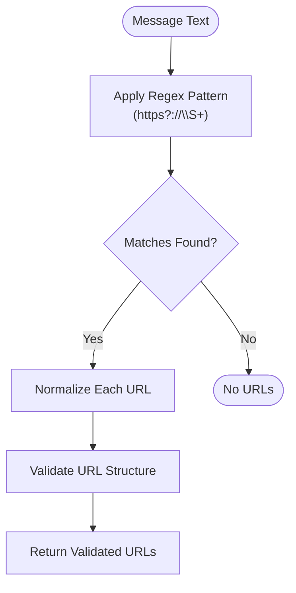
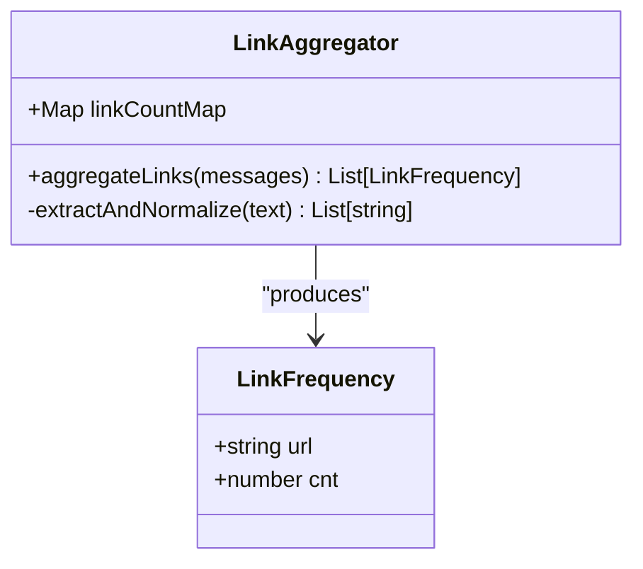
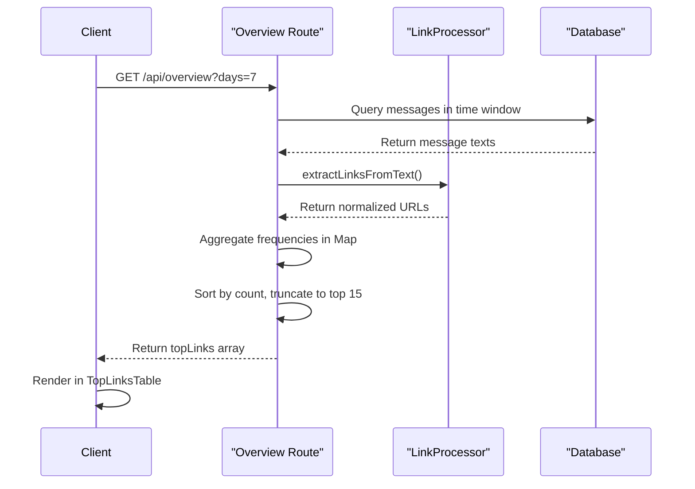

# Top Links Ranking

<cite>
**Referenced Files in This Document**   
- [slice.ts](file://lib/report/slice.ts)
- [route.ts](file://app/api/overview/route.ts)
- [TopLinksTable.tsx](file://app/components/tables/TopLinksTable.tsx)
</cite>

## Table of Contents
1. [Introduction](#introduction)
2. [URL Extraction and Preprocessing](#url-extraction-and-preprocessing)
3. [Link Normalization Process](#link-normalization-process)
4. [Frequency Aggregation and Sorting](#frequency-aggregation-and-sorting)
5. [Integration with Overview Route](#integration-with-overview-route)
6. [Display and Truncation](#display-and-truncation)
7. [Challenges and Edge Cases](#challenges-and-edge-cases)

## Introduction
The top links ranking feature identifies the most frequently shared URLs within chat messages, providing insights into content sharing patterns. This system processes message text to extract URLs using regex pattern matching, normalizes them for consistent comparison, aggregates their frequencies, and presents the most popular links in a ranked format. The implementation spans multiple components across the codebase, with core functionality residing in utility functions that handle URL parsing and frequency counting.

## URL Extraction and Preprocessing
The system employs regex pattern matching to identify URLs in message text during both preprocessing and post-processing stages. A regular expression pattern `(https?:\/\/\S+)` is used to match strings beginning with "http://" or "https://" followed by non-whitespace characters. This pattern effectively captures URLs even when they are adjacent to punctuation marks.

**Diagram sources**
- [slice.ts](file://lib/report/slice.ts#L51-L83)
- [route.ts](file://app/api/overview/route.ts#L279-L308)

**Section sources**
- [slice.ts](file://lib/report/slice.ts#L51-L83)
- [route.ts](file://app/api/overview/route.ts#L279-L308)

## Link Normalization Process
After extraction, URLs undergo a normalization process to ensure consistent representation and accurate duplicate detection. The normalization includes protocol stripping (converting to lowercase), domain extraction with lowercase conversion, removal of default ports (80 for HTTP, 443 for HTTPS), and trailing slash elimination from paths. This process enables proper consolidation of what would otherwise be considered different URLs.

For example, `HTTP://EXAMPLE.COM:80/page/` and `https://example.com/page` are normalized to the same representation. Malformed URLs that cannot be parsed by the URL constructor but start with "http://" or "https://" are preserved as-is after basic sanitization, allowing partial recognition of incorrectly formatted links.

**Section sources**
- [slice.ts](file://lib/report/slice.ts#L51-L69)

## Frequency Aggregation and Sorting
Link frequency is aggregated using JavaScript Map objects in memory, providing efficient key-value storage where URLs serve as keys and their occurrence counts as values. As each message is processed, extracted and normalized URLs are added to the Map, with their counts incremented accordingly.

The aggregation follows a two-step process: first, all URLs from all messages are collected and counted; then, the results are sorted by frequency in descending order. This approach ensures accurate frequency measurement across the entire dataset before ranking. The use of Map objects provides O(1) average time complexity for get and set operations, making the aggregation process efficient even with large message volumes.

**Diagram sources**
- [slice.ts](file://lib/report/slice.ts#L279-L308)
- [route.ts](file://app/api/overview/route.ts#L125-L137)

**Section sources**
- [slice.ts](file://lib/report/slice.ts#L279-L308)
- [route.ts](file://app/api/overview/route.ts#L125-L137)

## Integration with Overview Route
The URL parsing utilities from slice.ts are integrated with the overview route to provide comprehensive analytics. The overview API endpoint processes messages within a specified time window, extracting URLs alongside other metrics like top words, hashtags, and user activity. The extracted links are processed through the same normalization pipeline, ensuring consistency across different reporting features.

The integration occurs in the buildDailyPreview function, which orchestrates data collection from the database and subsequent in-memory processing. Message texts are retrieved in batches, and URL extraction happens as part of post-processing, allowing the system to combine database efficiency with flexible client-side analysis.

**Section sources**
- [slice.ts](file://lib/report/slice.ts#L279-L308)
- [route.ts](file://app/api/overview/route.ts#L279-L308)

## Display and Truncation
The top links are displayed in a tabular format through the TopLinksTable component, which receives the processed data from the API endpoint. To maintain usability, the results are truncated to show only the top 10-15 most frequent links, preventing information overload while highlighting the most significant sharing patterns.

The truncation occurs after sorting, ensuring that only the highest-frequency URLs are presented. This approach balances comprehensiveness with readability, allowing users to quickly identify the most popular shared resources without being overwhelmed by less significant entries.

**Diagram sources**
- [slice.ts](file://lib/report/slice.ts#L279-L308)
- [route.ts](file://app/api/overview/route.ts#L125-L137)
- [TopLinksTable.tsx](file://app/components/tables/TopLinksTable.tsx#L8-L29)

**Section sources**
- [TopLinksTable.tsx](file://app/components/tables/TopLinksTable.tsx#L8-L29)

## Challenges and Edge Cases
The system addresses several challenges in URL processing, including shortener detection, spam filtering, and handling malformed URLs. While the current implementation does not specifically detect URL shorteners, the normalization process helps consolidate shortened links to their final destinations when possible.

Spam filtering is implicitly handled through the STOPWORDS list and context-aware processing, though dedicated spam detection would require additional heuristics. Malformed URLs present a particular challenge, as the system must balance strict validation with the need to capture potentially valid links that don't conform to standard formatting. The current approach preserves URLs that begin with "http://" or "https://" even if they fail full validation, acknowledging that some legitimate links may have unusual formatting.

Additional edge cases include internationalized domain names, URLs with authentication credentials, and fragment identifiers, all of which are handled through the standardized URL parsing API, ensuring consistent treatment across different URL types.

**Section sources**
- [slice.ts](file://lib/report/slice.ts#L51-L83)