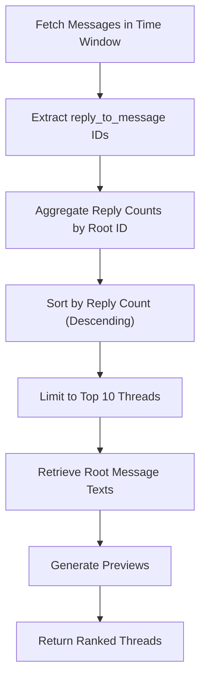
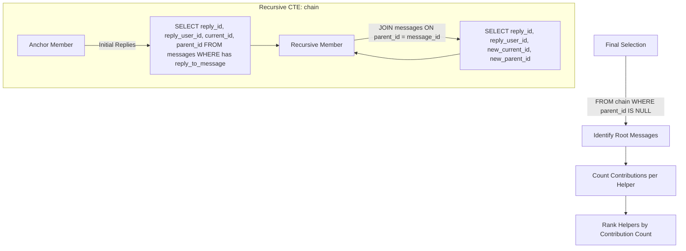
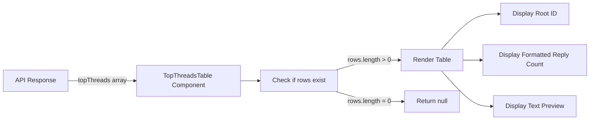

# Top Threads Ranking

<cite>
**Referenced Files in This Document**   
- [route.ts](file://app/api/overview/route.ts)
- [TopThreadsTable.tsx](file://app/components/tables/TopThreadsTable.tsx)
</cite>

## Table of Contents
1. [Introduction](#introduction)
2. [Thread Identification Logic](#thread-identification-logic)
3. [Recursive CTE for Thread Traversal](#recursive-cte-for-thread-traversal)
4. [Frontend Integration](#frontend-integration)
5. [Performance Considerations](#performance-considerations)
6. [Caching Strategies](#caching-strategies)
7. [Conclusion](#conclusion)

## Introduction

The top threads ranking feature identifies the most active conversation threads within a messaging system by analyzing reply chains and calculating engagement metrics. This document explains how recursive Common Table Expressions (CTEs) in PostgreSQL are used to traverse message reply hierarchies, calculate thread depth, and aggregate total replies. The implementation focuses on identifying root messages, mapping reply relationships, and ranking threads by engagement level.

**Section sources**
- [route.ts](file://app/api/overview/route.ts#L0-L522)

## Thread Identification Logic

The system identifies top threads through a two-phase process that first aggregates reply counts and then retrieves root message content. The algorithm begins by scanning all messages within a specified time window to build a map of reply-to-message relationships.

Each message containing a `reply_to_message` field contributes to the reply count of its parent message. The system uses JavaScript Map objects to efficiently accumulate these counts and associate them with root message identifiers. After aggregation, the results are sorted by reply count in descending order and limited to the top 10 most active threads.

For each identified thread root, the system performs additional queries to fetch the original message text, which is then truncated for display as a preview. This approach separates the counting logic from content retrieval, optimizing performance by minimizing expensive text operations.

**Diagram sources**
- [route.ts](file://app/api/overview/route.ts#L139-L163)

**Section sources**
- [route.ts](file://app/api/overview/route.ts#L139-L163)

## Recursive CTE for Thread Traversal

While the current implementation uses application-level aggregation for thread counting, the codebase contains an example of recursive CTE usage in the helpers leaderboard calculation. This demonstrates the capability to traverse reply chains using SQL recursion.

The recursive CTE pattern follows a standard structure with an anchor member that selects initial replies and a recursive member that joins back to the chain. The anchor query selects all messages that are replies (containing `reply_to_message`), establishing the base case. The recursive query then joins the CTE with the messages table to follow parent references upward through the thread hierarchy.

This approach allows the system to identify the ultimate root message of any reply chain, regardless of depth. Once the full chain is constructed, the final SELECT statement filters for records where `parent_id IS NULL`, indicating the root of the thread. This enables accurate attribution of contributions to specific threads and users.

**Diagram sources**
- [route.ts](file://app/api/overview/route.ts#L209-L250)

**Section sources**
- [route.ts](file://app/api/overview/route.ts#L209-L250)

## Frontend Integration

The ranked thread data is consumed by the frontend through the `TopThreadsTable` component, which renders the results in a tabular format. The component accepts an array of thread objects containing the root message ID, reply count, and text preview.

The UI displays threads ordered by engagement level, with the most active threads appearing at the top. Reply counts are formatted using a number formatter hook for improved readability. The table includes a header indicating it shows threads with the highest number of responses, providing clear context to users.

The component implements conditional rendering, returning null when no thread data is available. This ensures a clean user experience even when there are insufficient replies to form meaningful threads within the selected time window.

**Diagram sources**
- [TopThreadsTable.tsx](file://app/components/tables/TopThreadsTable.tsx#L0-L22)

**Section sources**
- [TopThreadsTable.tsx](file://app/components/tables/TopThreadsTable.tsx#L0-L22)

## Performance Considerations

The current thread ranking implementation faces several performance challenges when dealing with large datasets. The primary limitation lies in the application-level aggregation of reply counts, which requires loading potentially large numbers of messages into memory before processing.

PostgreSQL's recursive CTEs have inherent limitations regarding maximum recursion depth, which could prevent complete traversal of very deep reply chains. While the default limit is typically sufficient for most messaging scenarios, extremely nested conversations might be truncated.

The two-phase query pattern—first counting replies and then fetching root message texts—results in multiple database round trips. For time windows containing many messages, this can lead to increased latency. Additionally, the lack of specialized indexes on the `reply_to_message` field and JSON path expressions may impact query performance.

Memory usage scales with the number of unique reply chains, as each root message ID must be stored in the Map object during aggregation. On systems with high conversation volume, this could become a limiting factor.

**Section sources**
- [route.ts](file://app/api/overview/route.ts#L139-L163)
- [route.ts](file://app/api/overview/route.ts#L209-L250)

## Caching Strategies

To mitigate performance issues with frequently accessed time windows, several caching strategies can be implemented. Given that historical data remains relatively static, response caching at the API level would significantly reduce database load for common queries.

Time-based caching policies could be applied based on the recency of the requested window. Recent time periods (e.g., last 24 hours) might use shorter cache durations (5-15 minutes) due to higher message frequency, while older periods could be cached for several hours or days.

Application-level memoization of CTE results could optimize repeated calculations of thread hierarchies. By caching the output of recursive traversals, subsequent requests for the same time window would avoid reprocessing the entire message set.

Database query result caching using Redis or similar in-memory stores would allow rapid retrieval of precomputed thread rankings. Cache keys could incorporate parameters such as time window, chat ID, and other filtering criteria to ensure appropriate cache hits.

**Section sources**
- [route.ts](file://app/api/overview/route.ts#L0-L522)

## Conclusion

The top threads ranking feature effectively identifies the most engaging conversations through strategic analysis of reply relationships. While the current implementation uses application-level aggregation for simplicity, the presence of recursive CTE patterns in related functionality demonstrates the capability for more sophisticated thread analysis directly in SQL.

Future improvements could leverage recursive CTEs for comprehensive thread depth calculation and more accurate engagement metrics. Implementing proper caching mechanisms would enhance performance for frequently accessed time windows, while database indexing optimizations could improve query efficiency. The separation of concerns between data processing and presentation remains well-structured, facilitating maintenance and potential enhancements to the thread ranking algorithm.