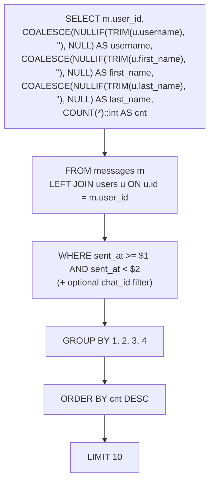
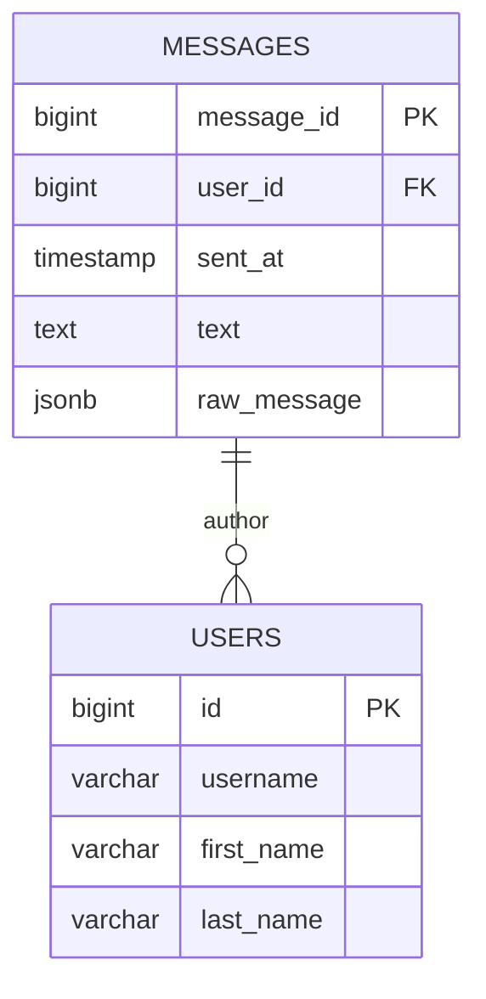
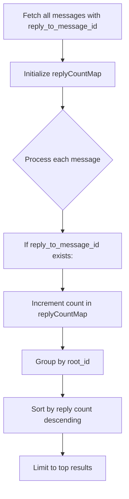

# Top Users Ranking

<cite>
**Referenced Files in This Document**  
- [route.ts](file://app/api/overview/route.ts)
- [slice.ts](file://lib/report/slice.ts)
</cite>

## Table of Contents
1. [Introduction](#introduction)
2. [Core SQL Query Implementation](#core-sql-query-implementation)
3. [Message Aggregation and User Join Logic](#message-aggregation-and-user-join-logic)
4. [Reply Metrics via Self-Joins and In-Memory Processing](#reply-metrics-via-self-joins-and-in-memory-processing)
5. [API Response Formatting and KPI Derivation](#api-response-formatting-and-kpi-derivation)
6. [Edge Case Handling](#edge-case-handling)
7. [Performance Optimization Strategies](#performance-optimization-strategies)

## Introduction
The top users ranking feature calculates user engagement by aggregating message counts and analyzing reply interactions within a specified time window. The system implements this functionality through SQL queries that aggregate messages per user with JOINs against participant data, using ORDER BY clauses to rank users by message volume. Reply metrics are processed both through database queries and in-memory JavaScript logic to capture thread engagement patterns. Key performance indicators (KPIs) such as total messages, unique users, and average messages per user are derived from these rankings and formatted for API consumption.

**Section sources**
- [route.ts](file://app/api/overview/route.ts#L92-L123)
- [slice.ts](file://lib/report/slice.ts#L145-L176)

## Core SQL Query Implementation
The ranking system employs SQL SELECT statements with COUNT() and GROUP BY clauses to aggregate message counts per user. The query structure begins with selecting the user_id field from the messages table, then performs a LEFT JOIN with the users table to retrieve associated username and name information. The COUNT(*)::int AS cnt expression aggregates the total number of messages for each user, which serves as the primary engagement metric.

**Diagram sources**
- [route.ts](file://app/api/overview/route.ts#L92-L108)

**Section sources**
- [route.ts](file://app/api/overview/route.ts#L92-L108)

## Message Aggregation and User Join Logic
The system implements message aggregation through a LEFT JOIN between the messages and users tables, enabling the correlation of message records with user profile information. This join operation allows the system to display user identifiers alongside their corresponding usernames and real names when available. The aggregation uses parameterized WHERE clauses that filter messages based on temporal boundaries (sent_at >= $1 AND sent_at < $2) and optionally by chat_id when a specific chat context is requested.

The GROUP BY clause groups results by user_id and user identification fields (username, first_name, last_name), ensuring that each user appears only once in the results with their total message count aggregated. The ORDER BY cnt DESC clause sorts users in descending order of message count, creating the ranking hierarchy where the most active users appear first.

**Diagram sources**
- [route.ts](file://app/api/overview/route.ts#L92-L108)

**Section sources**
- [route.ts](file://app/api/overview/route.ts#L92-L108)

## Reply Metrics via Self-Joins and In-Memory Processing
While direct message counting occurs in SQL, reply interaction metrics are primarily calculated through in-memory processing after retrieving message data. The system executes a preliminary query to fetch all messages within the time window with their reply_to_message_id metadata, then processes this dataset in JavaScript to count reply chains.

The implementation uses a Map data structure to accumulate reply counts, iterating through each message and incrementing the count for its parent message ID when present. For more complex thread analysis like identifying top threads, the system employs recursive Common Table Expressions (CTEs) with self-joins to trace entire conversation chains from replies back to root messages.

**Diagram sources**
- [route.ts](file://app/api/overview/route.ts#L139-L163)
- [slice.ts](file://lib/report/slice.ts#L178-L211)

**Section sources**
- [route.ts](file://app/api/overview/route.ts#L139-L163)
- [slice.ts](file://lib/report/slice.ts#L178-L211)

## API Response Formatting and KPI Derivation
The system formats the ranking data for API consumption by transforming database results into structured JSON responses. After executing the SQL queries, the raw row data undergoes transformation where user identification fields are normalized into display-friendly formats using the normalizeUsernameOrId function. This function intelligently combines username, first name, and last name fields into coherent display strings.

KPIs are derived from parallel database queries that calculate total messages, unique users, reply counts, and link-containing messages. These metrics are combined with the top users data to provide contextual insights about community engagement levels. The final API response includes both the ranked list of top users and supplementary analytics that help interpret the significance of the rankings.

```mermaid
sequenceDiagram
participant Client
participant API as "API Endpoint"
participant DB as "Database"
Client->>API : GET /api/overview?days=1&chat_id=...
API->>DB : Execute multiple queries in parallel
DB-->>API : Return kpi, topUsers, texts data
API->>API : Process texts to extract reply counts
API->>API : Normalize user display names
API->>API : Calculate derived KPIs
API-->>Client : JSON response with topUsers array
```

**Diagram sources**
- [route.ts](file://app/api/overview/route.ts#L61-L90)
- [route.ts](file://app/api/overview/route.ts#L92-L123)

**Section sources**
- [route.ts](file://app/api/overview/route.ts#L61-L123)

## Edge Case Handling
The system incorporates several mechanisms to handle edge cases in user ranking calculations. For inactive users or those without complete profile information, the LEFT JOIN ensures they remain in results while COALESCE functions provide fallback values for missing username or name fields. Users are displayed using a hierarchical identification system that prioritizes @username format, falls back to full name, and ultimately displays user_id as identifier when no other information is available.

Tie-breaking logic is implicitly handled by the database's sorting behavior when multiple users have identical message counts—the order becomes deterministic based on the secondary sort criteria inherent in the database engine. The system also handles cases where message threads span beyond the current time window by fetching root message previews in batches, with appropriate truncation and placeholder text for messages outside the analyzed period.

**Section sources**
- [route.ts](file://app/api/overview/route.ts#L354-L389)
- [route.ts](file://app/api/overview/route.ts#L407-L435)

## Performance Optimization Strategies
To ensure efficient ranking calculations, the system implements several performance optimization strategies. Database queries are executed in parallel using Promise.all() to minimize total response time, with independent aggregations for KPIs, hourly distributions, top threads, and message texts occurring simultaneously.

For large datasets, the system employs chunked processing when resolving root message previews, breaking down requests into manageable batches of 1,000 messages to avoid overwhelming the database with excessively long IN clauses. Index optimization is implied through the use of timestamp-based filtering on the sent_at column and user_id-based grouping, suggesting the presence of appropriate database indexes on these frequently queried fields.

The architecture separates concerns between database-level aggregation (for simple counts) and application-level processing (for complex thread analysis), allowing each layer to operate at peak efficiency. This hybrid approach leverages SQL for what it does best—set-based operations and aggregations—while utilizing JavaScript for more sophisticated data transformations that would be cumbersome in pure SQL.

**Section sources**
- [route.ts](file://app/api/overview/route.ts#L61-L90)
- [route.ts](file://app/api/overview/route.ts#L139-L163)