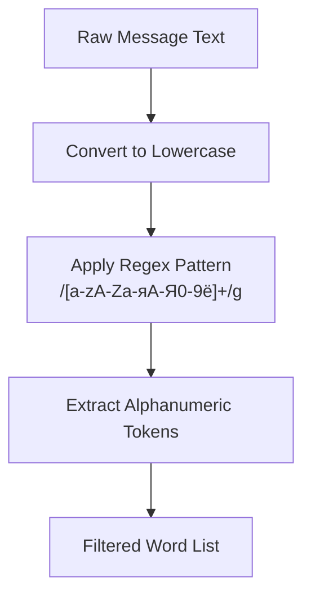
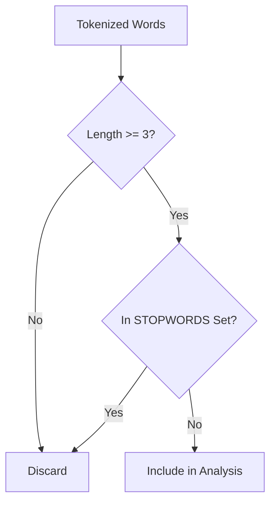
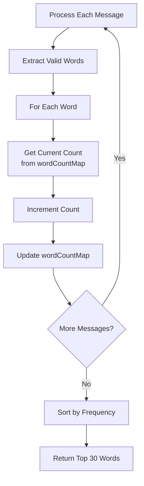
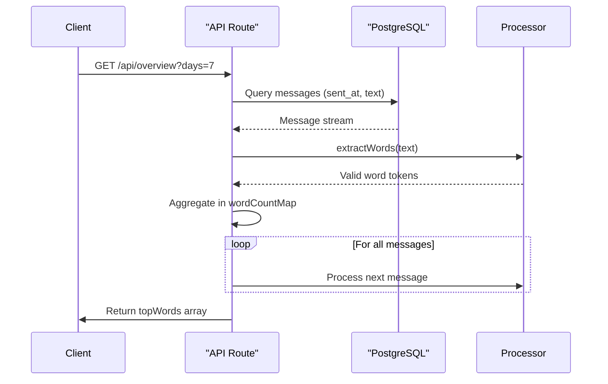

# Top Words Ranking

<cite>
**Referenced Files in This Document**   
- [overview/route.ts](file://app/api/overview/route.ts)
- [slice.ts](file://lib/report/slice.ts)
</cite>

## Table of Contents
1. [Introduction](#introduction)
2. [Tokenization and Normalization Process](#tokenization-and-normalization-process)
3. [Stopword Filtering and Minimum Length Thresholds](#stopword-filtering-and-minimum-length-thresholds)
4. [In-Memory Word Frequency Aggregation](#in-memory-word-frequency-aggregation)
5. [Backend Integration and Data Flow](#backend-integration-and-data-flow)
6. [UI Display Truncation and Sorting](#ui-display-truncation-and-sorting)
7. [Performance Considerations for High-Volume Chats](#performance-considerations-for-high-volume-chats)
8. [Potential Enhancements](#potential-enhancements)

## Introduction

The Top Words Ranking feature analyzes message content across Telegram chat datasets to identify the most frequently used words. This functionality provides insights into community language patterns, trending topics, and communication dynamics by processing large volumes of text data through a pipeline that includes tokenization, normalization, filtering, and frequency counting. The system efficiently handles multilingual content with support for both Latin and Cyrillic scripts, making it suitable for diverse user bases.

**Section sources**
- [overview/route.ts](file://app/api/overview/route.ts#L1-L523)

## Tokenization and Normalization Process

The word extraction process begins with comprehensive text preprocessing to ensure consistent analysis. Message text undergoes systematic transformation through several normalization steps before tokenization occurs. First, all text is converted to lowercase to eliminate case sensitivity in word matching. Then, a regular expression pattern `/[a-zA-Zа-яА-Я0-9ё]+/g` extracts alphanumeric sequences while preserving both English and Russian characters, including the Cyrillic letter 'ё'.

This regex-based approach effectively isolates words while automatically removing punctuation, special characters, and whitespace. The tokenizer recognizes word boundaries based on non-alphanumeric transitions, ensuring that contractions, hyphenated terms, and other complex formations are appropriately segmented. By focusing only on alphabetic and numeric characters, the system inherently strips away common punctuation marks such as periods, commas, exclamation points, and quotation marks without requiring separate cleanup operations.

**Diagram sources**
- [overview/route.ts](file://app/api/overview/route.ts#L120-L125)

**Section sources**
- [overview/route.ts](file://app/api/overview/route.ts#L120-L125)

## Stopword Filtering and Minimum Length Thresholds

After tokenization, the system applies two critical filtering mechanisms to refine the word list: stopword elimination and minimum length requirements. The implementation uses a predefined set of common words (stopwords) that are filtered out to prevent high-frequency but low-information terms from dominating the rankings. This multilingual stopword list includes 130+ entries spanning both English and Russian languages, covering articles, prepositions, pronouns, conjunctions, and common auxiliary verbs.

The STOPWORDS set is implemented as a JavaScript Set for O(1) lookup performance, enabling efficient filtering even with large token streams. In addition to stopwords, the system enforces a minimum word length threshold of three characters. This eliminates short, potentially meaningless tokens like "is", "it", "в", "и", while preserving meaningful short words that meet the length requirement.

**Diagram sources**
- [overview/route.ts](file://app/api/overview/route.ts#L123-L125)

**Section sources**
- [overview/route.ts](file://app/api/overview/route.ts#L115-L125)

## In-Memory Word Frequency Aggregation

The core counting mechanism leverages JavaScript Map objects for efficient in-memory aggregation of word frequencies across large datasets. For each processed message, the extracted and filtered words are iterated through, with their occurrence counts maintained in a central `wordCountMap`. This Map-based approach provides optimal performance characteristics with O(1) average time complexity for both lookups and updates.

The aggregation process follows a simple but effective pattern: for each valid word, the system checks if it already exists in the map using `get()`, increments the existing count or initializes it to 1 using `set()`. This atomic operation ensures thread-safe counting within the Node.js event loop context. After processing all messages, the Map entries are converted to an array, sorted by frequency in descending order, and truncated to return only the top 30 results for UI display.

**Diagram sources**
- [overview/route.ts](file://app/api/overview/route.ts#L130-L137)

**Section sources**
- [overview/route.ts](file://app/api/overview/route.ts#L130-L137)

## Backend Integration and Data Flow

The top words functionality is integrated within the API route handler at `/api/overview`, which orchestrates the entire data processing pipeline. The workflow begins with database queries to retrieve message texts from the PostgreSQL store, specifically selecting only the fields needed for word analysis to minimize memory usage. These messages are fetched within configurable time windows (1-30 days) and optionally filtered by specific chat IDs.

The backend processing occurs entirely in memory after the initial database retrieval, following a sequential execution pattern where word extraction runs concurrently with other analytics like link detection and user activity tracking. The `extractWords` utility function is called for each message text, feeding results into the shared `wordCountMap`. This integration demonstrates a balanced approach between database efficiency (minimizing query scope) and application-level processing (handling text analysis in JavaScript rather than SQL).

**Diagram sources**
- [overview/route.ts](file://app/api/overview/route.ts#L130-L137)
- [slice.ts](file://lib/report/slice.ts#L51-L80)

**Section sources**
- [overview/route.ts](file://app/api/overview/route.ts#L130-L137)

## UI Display Truncation and Sorting

Before transmission to the frontend, the ranked word list undergoes final processing to optimize for UI presentation. The system returns exactly 30 top words, truncating longer lists while preserving the highest-frequency terms. Each result includes both the word string and its associated count, formatted as `{word: string, cnt: number}` objects that can be directly consumed by visualization components.

The sorting algorithm prioritizes frequency as the primary criterion, arranging words in strict descending order by occurrence count. In cases of tied frequencies, the natural iteration order of the Map determines positioning, which corresponds to first-seen order in the message stream. This deterministic sorting ensures consistent results across identical datasets while emphasizing the most prominent vocabulary items in the analyzed conversation history.

**Section sources**
- [overview/route.ts](file://app/api/overview/route.ts#L135-L137)

## Performance Considerations for High-Volume Chats

The implementation incorporates several optimizations to maintain responsiveness when processing high-volume chat data. The use of streaming database queries prevents memory exhaustion by avoiding full dataset loading, while the incremental Map-based counting allows processing of arbitrarily large message sets within fixed memory bounds relative to unique word diversity rather than total message volume.

However, performance scales with both message count and lexical diversity. Extremely active chats may experience increased processing latency due to the linear-time complexity of iterating through all messages. Potential bottlenecks include regex execution on very long messages and Map memory overhead when encountering highly varied vocabulary. The current architecture processes data synchronously within the request lifecycle, meaning extended execution times could lead to timeout issues under extreme loads.

To mitigate these risks, the system limits analysis to maximum 30-day windows and could benefit from additional optimizations such as message sampling, worker threads for CPU-intensive tasks, or caching of recent results to avoid redundant computation.

**Section sources**
- [overview/route.ts](file://app/api/overview/route.ts#L130-L137)

## Potential Enhancements

Several improvements could extend the analytical capabilities of the top words feature. Implementing stemming algorithms would allow related word forms (e.g., "running", "runs", "ran") to be consolidated under their root form, providing more accurate semantic analysis. Similarly, lemmatization could normalize words to their dictionary forms, enhancing cross-context comparability.

Additional linguistic processing could include sentiment tagging to identify emotionally charged vocabulary, part-of-speech tagging to distinguish between nouns, verbs, and adjectives, or named entity recognition to highlight people, organizations, and locations. The system could also incorporate dynamic stopword learning, automatically identifying and filtering locally common but semantically empty terms specific to particular communities.

From an architectural perspective, moving the word frequency computation to background jobs with result caching would improve API response times. Implementing incremental updates—where new messages update existing counts rather than recomputing from scratch—would enable real-time dashboards with minimal latency.

**Section sources**
- [overview/route.ts](file://app/api/overview/route.ts#L115-L137)