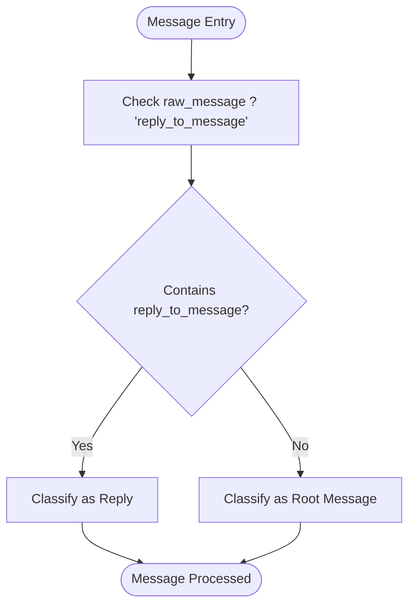
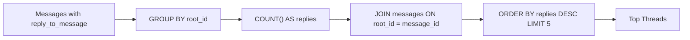
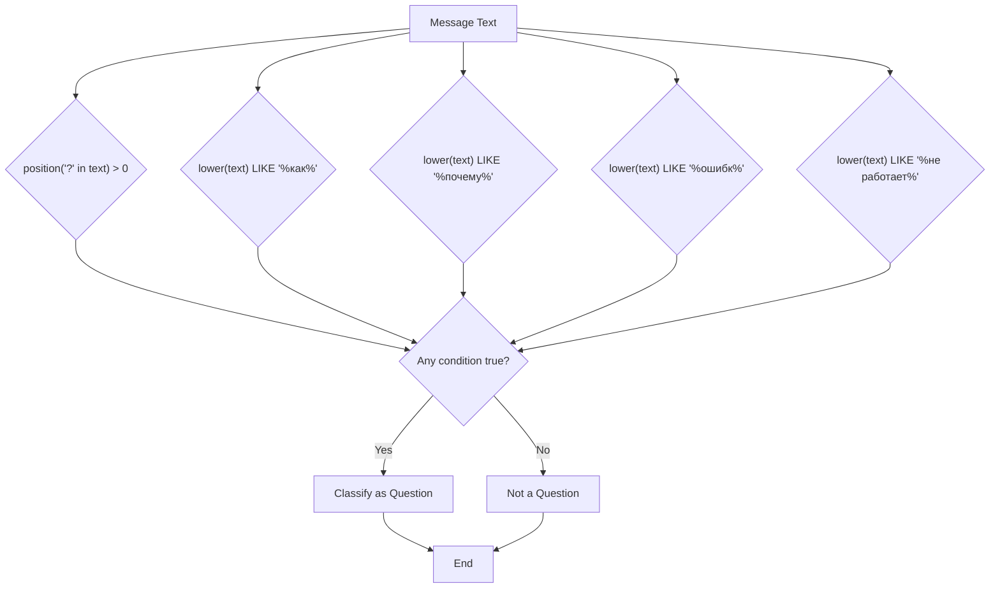
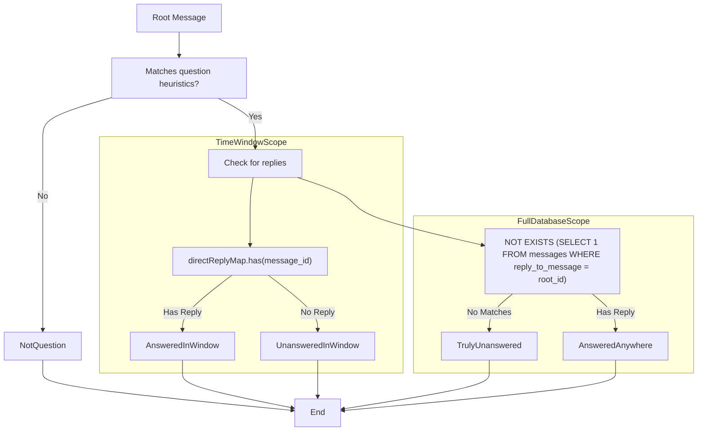
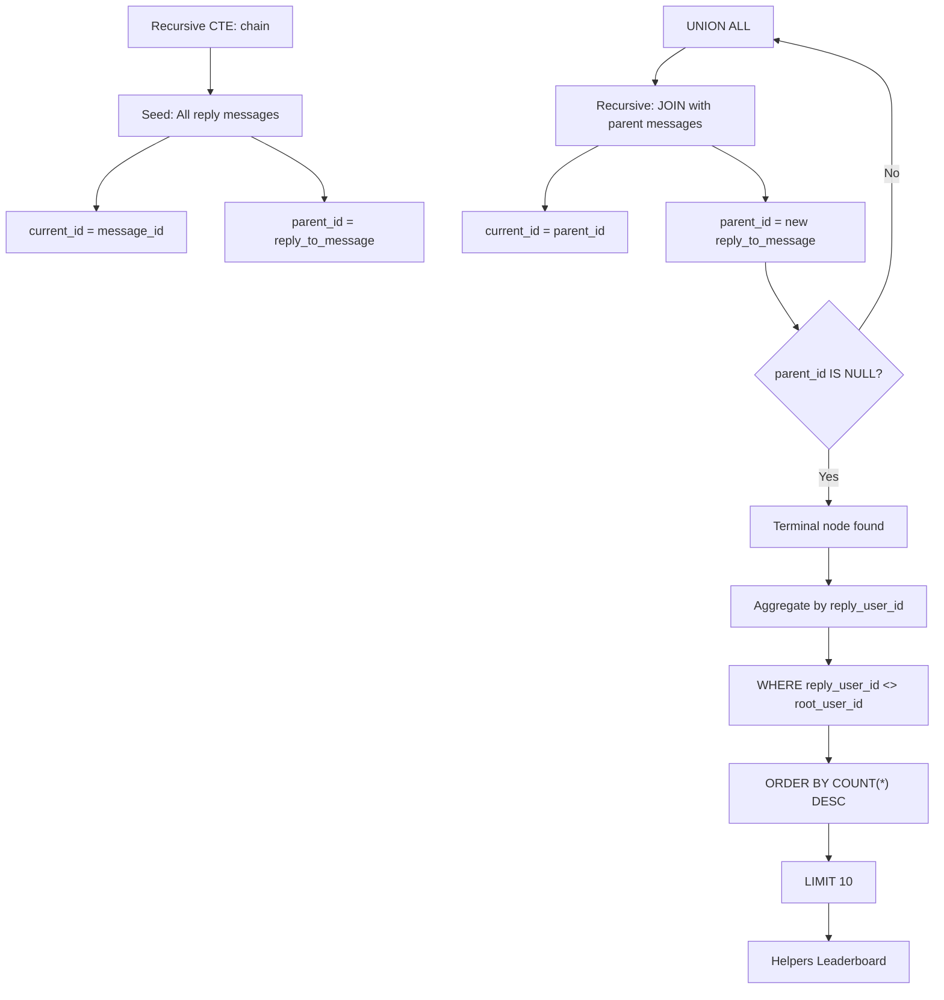

# Interaction Rate Metrics

<cite>
**Referenced Files in This Document **   
- [overview/route.ts](file://app/api/overview/route.ts)
- [slice.ts](file://lib/report/slice.ts)
</cite>

## Table of Contents
1. [Introduction](#introduction)
2. [Reply Detection Using JSON Path Conditions](#reply-detection-using-json-path-conditions)
3. [Thread Identification and Top Threads Query](#thread-identification-and-top-threads-query)
4. [Question Detection Heuristics](#question-detection-heuristics)
5. [Unanswered Questions Logic](#unanswered-questions-logic)
6. [Helpers Leaderboard with Recursive CTE](#helpers-leaderboard-with-recursive-cte)
7. [Performance Considerations](#performance-considerations)

## Introduction
This document details the implementation of interaction rate metrics within the Telegram analytics dashboard, focusing on three core engagement indicators: replies, threads, and unanswered questions. The system leverages PostgreSQL's JSON path capabilities to analyze message structures, implements recursive queries for thread chain resolution, and applies heuristic-based detection for identifying question messages. These metrics provide insights into community responsiveness, discussion depth, and support backlog.

**Section sources**
- [overview/route.ts](file://app/api/overview/route.ts)
- [slice.ts](file://lib/report/slice.ts)

## Reply Detection Using JSON Path Conditions
The system identifies reply messages by examining the `raw_message` JSON field in the messages table using PostgreSQL's containment operator (`?`). A message is classified as a reply when its `raw_message` contains the key `reply_to_message`, indicating it references another message in the thread.

**Diagram sources **
- [overview/route.ts](file://app/api/overview/route.ts#L167-L183)
- [slice.ts](file://lib/report/slice.ts#L179-L194)

**Section sources**
- [overview/route.ts](file://app/api/overview/route.ts#L165-L183)
- [slice.ts](file://lib/report/slice.ts#L179-L194)

## Thread Identification and Top Threads Query
Thread identification is implemented through aggregation of reply chains. The system counts direct replies to each root message (identified by the absence of `reply_to_message`) and ranks threads by reply count. The top threads query uses a Common Table Expression (CTE) to first aggregate reply counts by root ID, then joins with the messages table to retrieve root message content for display.

**Diagram sources **
- [slice.ts](file://lib/report/slice.ts#L179-L194)

**Section sources**
- [slice.ts](file://lib/report/slice.ts#L179-L194)

## Question Detection Heuristics
Question detection employs multiple heuristics to identify potential questions in message text. The primary indicator is the presence of a question mark character, detected using PostgreSQL's `position()` function. Additional language-specific patterns target common Russian question starters such as "как" (how), "почему" (why), "ошибк" (error-related), and "не работает" (not working). This multi-condition approach increases recall for non-standard question formatting.

**Diagram sources **
- [overview/route.ts](file://app/api/overview/route.ts#L167-L183)

**Section sources**
- [overview/route.ts](file://app/api/overview/route.ts#L167-L183)

## Unanswered Questions Logic
The system implements two distinct approaches for identifying unanswered questions based on scope requirements. For time-window analysis (e.g., recent unanswered questions), it checks for the absence of replies within the same time window using a direct lookup map. For comprehensive backlog analysis, it uses a `NOT EXISTS` subquery to verify no replies exist anywhere in the database, ensuring truly unanswered status regardless of timeframe.

**Diagram sources **
- [overview/route.ts](file://app/api/overview/route.ts#L167-L183)
- [slice.ts](file://lib/report/slice.ts#L197-L211)

**Section sources**
- [overview/route.ts](file://app/api/overview/route.ts#L165-L196)
- [slice.ts](file://lib/report/slice.ts#L197-L211)

## Helpers Leaderboard with Recursive CTE
The helpers leaderboard implements a recursive Common Table Expression (CTE) to trace reply chains back to their original thread roots. This allows accurate attribution of helpfulness to users who respond in others' threads, even when those responses are themselves replied to. The recursive query starts with all reply messages and iteratively follows parent references until reaching root messages (where parent_id is NULL), enabling proper classification of contributors versus original authors.

**Diagram sources **
- [overview/route.ts](file://app/api/overview/route.ts#L208-L241)

**Section sources**
- [overview/route.ts](file://app/api/overview/route.ts#L208-L241)

## Performance Considerations
The implementation balances real-time computation with performance constraints through several strategies. The recursive CTE for helper tracking, while powerful, has logarithmic complexity relative to thread depth and should be monitored for very deep conversation trees. The system prefers pre-aggregation for frequently accessed metrics like reply counts, using CTEs and grouped queries rather than real-time traversal. For question detection, simple string operations (LIKE patterns, position checks) are favored over more expensive full-text search or regex operations. The unanswered question logic demonstrates a trade-off between accuracy and performance: the time-window check uses an efficient in-memory map after a single database pass, while the comprehensive check requires a correlated subquery that may benefit from indexing on the `reply_to_message` path. Future optimizations could include materialized views for thread metadata and indexed expressions on commonly queried JSON paths.

**Section sources**
- [overview/route.ts](file://app/api/overview/route.ts)
- [slice.ts](file://lib/report/slice.ts)