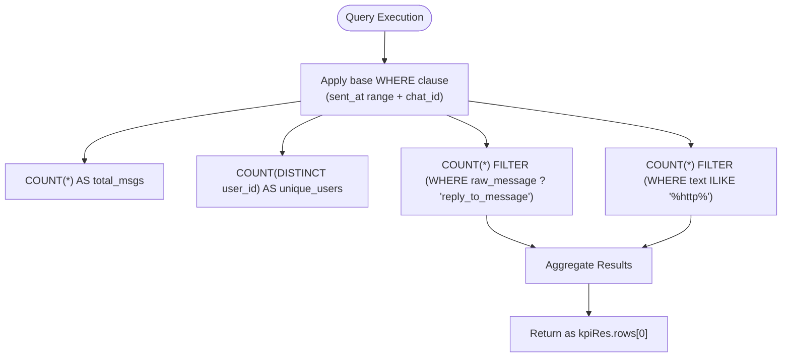
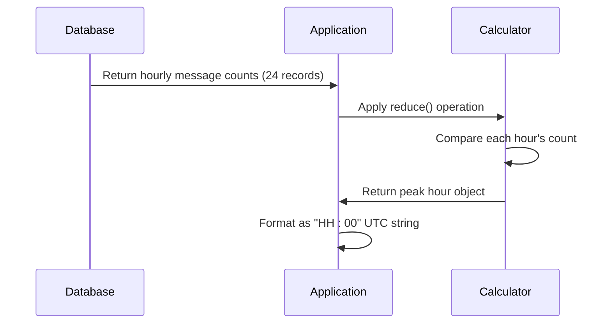

# KPI Metrics Processing

<cite>
**Referenced Files in This Document**   
- [KpiRow.tsx](file://app/components/atoms/KpiRow.tsx)
- [slice.ts](file://lib/report/slice.ts)
</cite>

## Table of Contents
1. [Introduction](#introduction)
2. [Core KPI Metrics Overview](#core-kpi-metrics-overview)
3. [PostgreSQL Query Implementation](#postgresql-query-implementation)
4. [Data Aggregation and Calculation Logic](#data-aggregation-and-calculation-logic)
5. [Parameterized Query Structure](#parameterized-query-structure)
6. [Result Normalization and Edge Case Handling](#result-normalization-and-edge-case-handling)
7. [Performance Considerations](#performance-considerations)

## Introduction

The KPI metrics processing module is responsible for calculating core analytics from message data within configurable time windows. This document details the implementation of key metrics including total messages, unique users, reply rates, link sharing statistics, average messages per user, and peak hour detection. The system leverages PostgreSQL queries to aggregate data efficiently while handling edge cases and ensuring consistent numeric formatting.

## Core KPI Metrics Overview

The KPI metrics processing module calculates five primary analytics displayed through the dashboard interface:

- **Total Messages**: Count of all messages within the specified time window
- **Unique Users**: Distinct count of users who sent messages
- **Average Messages per User**: Ratio of total messages to unique users
- **Reply Rate**: Count of messages that are replies to other messages
- **Link Sharing**: Count of messages containing HTTP links

These metrics are consumed by the frontend components and presented in a standardized format.

**Section sources**
- [KpiRow.tsx](file://app/components/atoms/KpiRow.tsx#L8-L29)

## PostgreSQL Query Implementation

The core aggregation logic is implemented through a single PostgreSQL query (`kpiQ`) that computes multiple metrics simultaneously. This approach minimizes database round trips and ensures atomic consistency across related calculations.



**Diagram sources** 
- [slice.ts](file://lib/report/slice.ts#L151-L159)

### Conditional Filtering Mechanism

The query employs PostgreSQL's `FILTER` clause to apply conditional counting without requiring subqueries or multiple scans:

- **Reply Detection**: Uses JSON path operator `?` to check if `raw_message` contains `reply_to_message` field
- **Link Detection**: Utilizes `ILIKE` pattern matching with `%http%` to identify URLs in message text (case-insensitive)

This filtering approach allows efficient computation of derived metrics within the same query execution context as the base aggregations.

**Section sources**
- [slice.ts](file://lib/report/slice.ts#L154-L158)

## Data Aggregation and Calculation Logic

### Average Messages per User Calculation

The average messages per user metric is computed in application code after retrieving the base aggregates:

```typescript
const avgPerUser = uniqueUsers > 0 ? totalMsgs / uniqueUsers : 0;
```

This calculation occurs client-side to separate concerns between data retrieval and business logic processing.

### Peak Hour Detection

Peak hour identification follows a two-step process:
1. Hourly message counts are retrieved using a `generate_series` CTE to ensure complete 24-hour coverage
2. Client-side reduction identifies the hour with maximum message volume



**Diagram sources** 
- [slice.ts](file://lib/report/slice.ts#L244-L250)

**Section sources**
- [slice.ts](file://lib/report/slice.ts#L243-L250)

## Parameterized Query Structure

The KPI query system supports dynamic filtering through parameterized SQL statements with configurable WHERE clauses:

### Time Window Parameters
- `$1`: Starting timestamp (since)
- `$2`: Ending timestamp (until)
- Configurable via date string or explicit UTC override

### Chat Filtering
- `$3`: Optional chat_id filter
- Applied conditionally based on user selection or environment defaults
- Falls back to most active chat when no specific chat is requested

The base WHERE clause is constructed dynamically:
```sql
sent_at >= $1 AND sent_at < $2 
+ (chat_id filter if applicable)
```

This parameterization enables flexible querying across different time ranges and chat contexts while maintaining SQL injection safety.

**Section sources**
- [slice.ts](file://lib/report/slice.ts#L145-L149)

## Result Normalization and Edge Case Handling

### Numeric Type Casting
All aggregate results undergo explicit type casting to ensure consistent numeric formats:
- `::int` casting for COUNT operations
- `Number()` conversion in JavaScript layer
- Default fallback values for null/undefined results

### Zero Division Prevention
The average messages per user calculation includes explicit protection against division by zero:
```typescript
uniqueUsers > 0 ? totalMsgs / uniqueUsers : 0
```

When no users are present in the dataset, the average defaults to zero rather than producing NaN or throwing errors.

### Missing Data Fallbacks
The system implements several defensive programming patterns:
- Null coalescing operators (`||`) for missing row values
- Default empty arrays for optional collections
- ISO string formatting for temporal values

These patterns ensure robust operation even with incomplete or unexpected data inputs.

**Section sources**
- [slice.ts](file://lib/report/slice.ts#L213-L220)

## Performance Considerations

### Index Usage Strategy
The query design assumes the presence of database indexes on critical columns:
- **sent_at**: Essential for efficient time-range filtering
- **chat_id**: Required for fast chat-specific queries
- **user_id**: Supports DISTINCT operations and JOINs

These indexes enable the query planner to use index scans rather than full table scans, significantly improving performance for large datasets.

### Query Optimization Features
The implementation leverages several PostgreSQL performance features:
- **Single-pass aggregation**: Multiple COUNT operations in one query
- **CTE usage**: Common Table Expressions for complex joins
- **Batched execution**: Parallel Promise.all() for independent queries
- **Covering considerations**: SELECT only needed fields

The architecture balances database workload with application processing, pushing heavy aggregations to the database while reserving complex text analysis for the application layer where appropriate.

**Section sources**
- [slice.ts](file://lib/report/slice.ts#L213-L220)