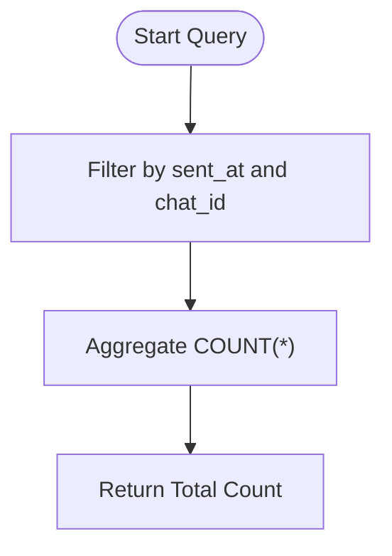
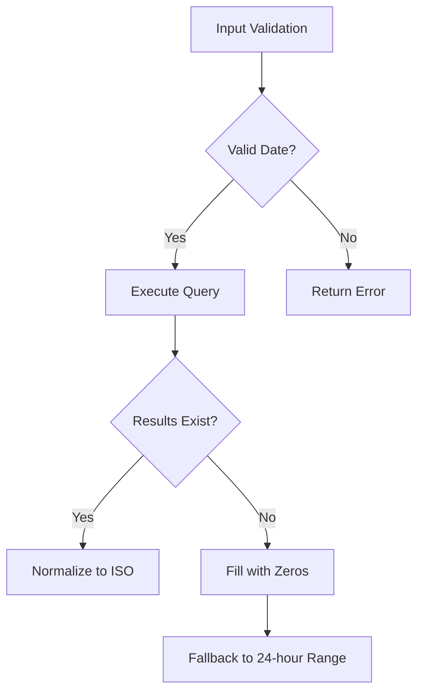
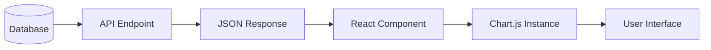

# Message Volume Metrics

<cite>
**Referenced Files in This Document**
- [app/api/overview/route.ts](file://app/api/overview/route.ts)
- [lib/report/slice.ts](file://lib/report/slice.ts)
- [app/components/charts/HourlyChart.tsx](file://app/components/charts/HourlyChart.tsx)
- [app/components/charts/DailyChart.tsx](file://app/components/charts/DailyChart.tsx)
- [app/utils/time.ts](file://app/utils/time.ts)
</cite>

## Table of Contents
1. [Introduction](#introduction)
2. [Message Count Aggregation with PostgreSQL](#message-count-aggregation-with-postgresql)
3. [Time-Based Trend Analysis](#time-based-trend-analysis)
4. [Handling Gaps in Activity with generate_series](#handling-gaps-in-activity-with-generate_series)
5. [Query Filtering and Parameter Construction](#query-filtering-and-parameter-construction)
6. [Timestamp Normalization and Edge Case Handling](#timestamp-normalization-and-edge-case-handling)
7. [Performance Considerations and Index Usage](#performance-considerations-and-index-usage)
8. [Frontend Chart Integration](#frontend-chart-integration)

## Introduction
This document details the implementation of message volume metrics in the Telegram analytics dashboard, focusing on total message counts and time-based trends (hourly/daily). The system leverages PostgreSQL for efficient aggregation using `COUNT(*)` and `date_trunc`, ensures complete time series data via `generate_series`, and integrates results into frontend visualizations. Key components include API endpoints, database queries, and client-side chart rendering.

## Message Count Aggregation with PostgreSQL
The core metric calculation relies on PostgreSQL's `COUNT(*)` function to compute total messages within a specified time window. The query filters messages based on the `sent_at` timestamp and optional `chat_id`, aggregating results efficiently.



**Section sources**
- [app/api/overview/route.ts](file://app/api/overview/route.ts#L61-L65)
- [lib/report/slice.ts](file://lib/report/slice.ts#L149-L154)

## Time-Based Trend Analysis
Hourly and daily message trends are calculated using PostgreSQL's `date_trunc` function, which groups timestamps by hour or day. This enables time-series analysis of message activity.

For hourly trends:
```sql
SELECT date_trunc('hour', sent_at) AS hour, COUNT(*)::int AS cnt
FROM messages WHERE ${baseWhere} GROUP BY 1 ORDER BY 1 ASC
```

For daily trends:
```sql
SELECT date_trunc('day', sent_at) AS day, COUNT(*)::int AS cnt
FROM messages WHERE ${baseWhere} GROUP BY 1 ORDER BY 1 ASC
```

The results are mapped to frontend charts showing message volume over time.

```mermaid
graph LR
A[Raw Messages] --> B[date_trunc('hour')]
B --> C[Grouped by Hour]
C --> D[COUNT(*) per Hour]
D --> E[Hourly Trend Data]
```

**Diagram sources**
- [app/api/overview/route.ts](file://app/api/overview/route.ts#L78-L80)
- [app/api/overview/route.ts](file://app/api/overview/route.ts#L92-L94)

**Section sources**
- [app/api/overview/route.ts](file://app/api/overview/route.ts#L78-L80)
- [app/api/overview/route.ts](file://app/api/overview/route.ts#L92-L94)

## Handling Gaps in Activity with generate_series
To ensure complete hourly data points even during periods of no activity, the system uses PostgreSQL's `generate_series` function. This creates a continuous series of hourly timestamps, which are left-joined with actual message counts, filling gaps with zero values.

```sql
WITH hours AS (
  SELECT generate_series($1::timestamptz, $2::timestamptz - interval '1 hour', interval '1 hour') AS hour
),
counts AS (
  SELECT date_trunc('hour', sent_at)::timestamptz AS hour, COUNT(*)::int AS cnt
  FROM messages WHERE ${baseWhere} GROUP BY 1
)
SELECT h.hour AS hour, COALESCE(c.cnt, 0)::int AS cnt
FROM hours h LEFT JOIN counts c ON c.hour = h.hour ORDER BY h.hour ASC
```

This approach guarantees exactly 24 data points for daily views, maintaining consistent chart dimensions.

```mermaid
graph TD
Series[generate_series] --> |Continuous Hours| Join[LEFT JOIN]
Counts[Actual Message Counts] --> Join
Join --> |COALESCE(cnt, 0)| Complete[Complete Hourly Series]
```

**Diagram sources**
- [lib/report/slice.ts](file://lib/report/slice.ts#L162-L176)

**Section sources**
- [lib/report/slice.ts](file://lib/report/slice.ts#L162-L176)

## Query Filtering and Parameter Construction
The base WHERE clause dynamically constructs time and chat filters using parameterized queries to prevent SQL injection. The filter includes:
- Time range: `sent_at >= $1 AND sent_at < $2`
- Optional chat ID: `AND chat_id::text = $3` when specified

```typescript
const baseWhere = `sent_at >= $1 AND sent_at < $2` + (useChatId ? ` AND chat_id::text = $3` : '');
```

Parameters are passed as an array `[since, until, chatId?]`, ensuring safe query execution.

**Section sources**
- [app/api/overview/route.ts](file://app/api/overview/route.ts#L52-L52)
- [lib/report/slice.ts](file://lib/report/slice.ts#L147-L148)

## Timestamp Normalization and Edge Case Handling
All timestamps are normalized to ISO format using JavaScript's `toISOString()` method for consistent frontend processing. Edge cases are handled as follows:

- **No messages**: Queries return empty result sets; frontend displays zero values
- **Incomplete hours**: `generate_series` with `COALESCE` ensures all hours are represented
- **Invalid dates**: Input validation checks date format before query execution
- **Missing chat ID**: Default chat is resolved from environment or top chat in window

The system also includes fallback logic to ensure exactly 24 hourly data points when needed.



**Section sources**
- [lib/report/slice.ts](file://lib/report/slice.ts#L108-L143)
- [lib/report/slice.ts](file://lib/report/slice.ts#L254-L274)

## Performance Considerations and Index Usage
Query performance is optimized through:
- **Index usage**: B-tree indexes on `sent_at` and `chat_id` columns enable fast filtering
- **Parameterized queries**: Prevent SQL injection and enable query plan caching
- **Batch operations**: Multiple queries executed in parallel using `Promise.all`
- **Efficient grouping**: Using `GROUP BY 1` syntax for performance

The KPI query combines multiple aggregates in a single statement to minimize database round trips:
```sql
SELECT COUNT(*)::int, COUNT(DISTINCT user_id)::int, 
       COUNT(*) FILTER (WHERE reply), COUNT(*) FILTER (WHERE http)
FROM messages WHERE ${baseWhere}
```

**Section sources**
- [lib/report/slice.ts](file://lib/report/slice.ts#L149-L158)
- [app/api/overview/route.ts](file://app/api/overview/route.ts#L61-L65)

## Frontend Chart Integration
Query results are mapped to frontend chart components using Chart.js. The `HourlyChart` and `DailyChart` components process the aggregated data:

- **HourlyChart**: Uses `build24hRange` utility to ensure complete time axis
- **DailyChart**: Directly maps daily counts to bar chart
- **Data mapping**: Server timestamps (ISO) → Client timestamps → Chart labels

The chart components handle data normalization and display formatting, including localized time representation.



**Diagram sources**
- [app/components/charts/HourlyChart.tsx](file://app/components/charts/HourlyChart.tsx)
- [app/components/charts/DailyChart.tsx](file://app/components/charts/DailyChart.tsx)

**Section sources**
- [app/components/charts/HourlyChart.tsx](file://app/components/charts/HourlyChart.tsx)
- [app/components/charts/DailyChart.tsx](file://app/components/charts/DailyChart.tsx)
- [app/utils/time.ts](file://app/utils/time.ts#L0-L18)