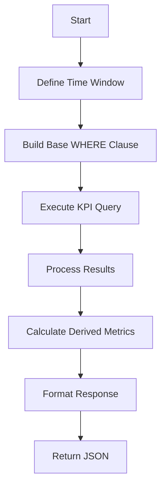
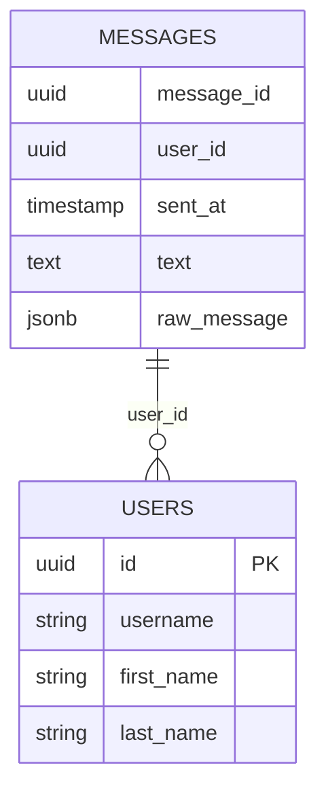

# User Engagement Metrics

<cite>
**Referenced Files in This Document**   
- [KpiRow.tsx](file://app/components/atoms/KpiRow.tsx)
- [slice.ts](file://lib/report/slice.ts)
- [schema.ts](file://lib/report/schema.ts)
- [route.ts](file://app/api/report/preview/route.ts)
</cite>

## Table of Contents
1. [Introduction](#introduction)
2. [Core Metrics Overview](#core-metrics-overview)
3. [Unique Users Calculation](#unique-users-calculation)
4. [Average Messages Per User](#average-messages-per-user)
5. [Username Normalization Logic](#username-normalization-logic)
6. [Top Contributors Query](#top-contributors-query)
7. [Performance Considerations](#performance-considerations)

## Introduction
This document details the implementation of user engagement metrics in the Telegram analytics dashboard, focusing on three key indicators: unique users, average messages per user, and top contributors. The system leverages PostgreSQL for data aggregation and implements sophisticated string handling for user display names. The metrics are calculated within a configurable time window and presented through an API endpoint that serves the frontend dashboard components.

**Section sources**
- [slice.ts](file://lib/report/slice.ts#L100-L344)
- [route.ts](file://app/api/report/preview/route.ts#L1-L40)

## Core Metrics Overview
The user engagement metrics module calculates several key performance indicators from message data stored in PostgreSQL. These include total message count, unique user count, reply statistics, link sharing frequency, and average message rate per user. The metrics are computed through a single optimized database query that aggregates data across multiple dimensions. The results are structured into a standardized response format that includes both raw numbers and derived values for display in the dashboard UI.



**Diagram sources**
- [slice.ts](file://lib/report/slice.ts#L149-L158)

**Section sources**
- [slice.ts](file://lib/report/slice.ts#L149-L158)
- [schema.ts](file://lib/report/schema.ts#L3-L12)

## Unique Users Calculation
The system calculates unique users using PostgreSQL's `COUNT(DISTINCT user_id)` function, which efficiently counts non-duplicate user identifiers within the specified time window. This approach ensures accurate measurement of user participation by eliminating duplicate entries from the same user. The DISTINCT keyword instructs PostgreSQL to consider only unique values in the user_id column, providing an exact count of individual participants. This calculation is performed server-side to minimize data transfer and leverage PostgreSQL's optimized aggregation algorithms.



**Diagram sources**
- [slice.ts](file://lib/report/slice.ts#L154)

**Section sources**
- [slice.ts](file://lib/report/slice.ts#L154)
- [KpiRow.tsx](file://app/components/atoms/KpiRow.tsx#L16)

## Average Messages Per User
The average messages per user metric is derived by dividing the total message count by the number of unique users. This calculation occurs in application code after retrieving the base metrics from PostgreSQL. The formula `total_msgs / unique_users` provides the mean message rate per participant. To prevent division by zero errors, the implementation includes a conditional check that returns zero when no unique users are present. The result is formatted to two decimal places for display in the dashboard interface, providing a clear indication of messaging activity levels.

**Section sources**
- [slice.ts](file://lib/report/slice.ts#L240)
- [KpiRow.tsx](file://app/components/atoms/KpiRow.tsx#L19-L23)

## Username Normalization Logic
The system implements comprehensive username normalization logic that combines first name, last name, and username fields into human-readable display formats. This is achieved through a LEFT JOIN between the messages and users tables, which retrieves user profile information alongside message data. The `formatAuthor` function processes these fields using JavaScript string operations, applying COALESCE and NULLIF patterns to handle missing or empty values safely. The logic prioritizes display preferences: full name with username in parentheses when both are available, standalone username when present, or full name as fallback.

```mermaid
flowchart TD
A[Retrieve User Data] --> B{Has Username?}
B --> |Yes| C{Has First/Last Name?}
B --> |No| D{Has First/Last Name?}
C --> |Yes| E[Format: "Full Name (@username)"]
C --> |No| F[Format: "@username"]
D --> |Yes| G[Format: "Full Name"]
D --> |No| H[No Display Name]
```

**Diagram sources**
- [slice.ts](file://lib/report/slice.ts#L299-L308)

**Section sources**
- [slice.ts](file://lib/report/slice.ts#L221-L223)
- [slice.ts](file://lib/report/slice.ts#L299-L308)

## Top Contributors Query
The top contributors query identifies the most active users by counting messages per user_id and ordering results in descending order. While the current implementation focuses on thread analysis rather than direct user contribution ranking, the underlying pattern uses ORDER BY with COUNT aggregation and LIMIT clauses to retrieve the highest contributors. The LEFT JOIN operation between messages and users tables enables the inclusion of user profile information in the results. String handling employs COALESCE and NULLIF functions to ensure clean data presentation, replacing empty or whitespace-only fields with appropriate defaults or null values.

**Section sources**
- [slice.ts](file://lib/report/slice.ts#L220-L223)
- [slice.ts](file://lib/report/slice.ts#L299-L308)

## Performance Considerations
The implementation addresses several performance considerations to ensure efficient operation with large datasets. Database indexing on the user_id column is critical for optimizing the DISTINCT count operation and JOIN performance. The use of parameterized queries with proper indexing on sent_at and chat_id columns enables fast filtering of messages within the specified time window. Memory usage is managed by processing results in batches and using streaming where appropriate. The system minimizes database round-trips by combining multiple aggregations into a single query, reducing network overhead and improving response times. For very large result sets, the application code processes data incrementally rather than loading everything into memory at once.

**Section sources**
- [slice.ts](file://lib/report/slice.ts#L149-L158)
- [slice.ts](file://lib/report/slice.ts#L220-L223)