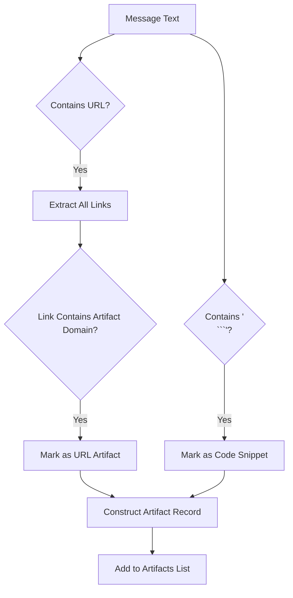
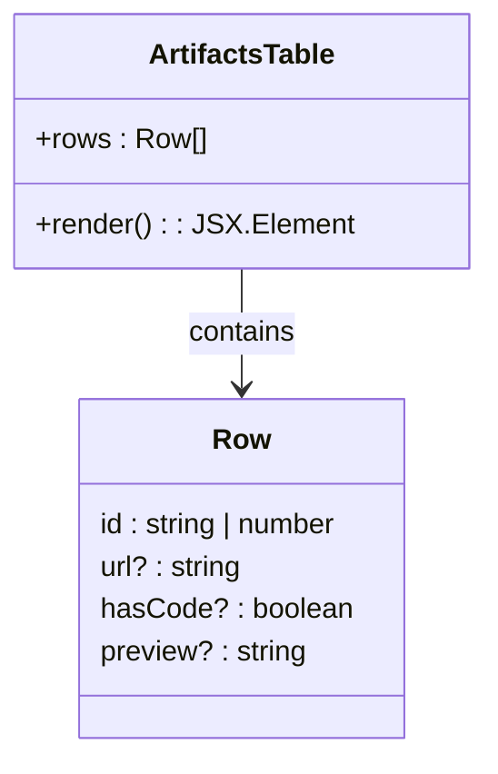

# Artifacts Tracking

<cite>
**Referenced Files in This Document**  
- [route.ts](file://app/api/overview/route.ts)
- [ArtifactsTable.tsx](file://app/components/tables/ArtifactsTable.tsx)
</cite>

## Table of Contents
1. [Introduction](#introduction)
2. [Artifact Detection Logic](#artifact-detection-logic)
3. [In-Memory Processing Pipeline](#in-memory-processing-pipeline)
4. [Data Structure and Record Construction](#data-structure-and-record-construction)
5. [UI Rendering and Preview Truncation](#ui-rendering-and-preview-truncation)
6. [Extensibility and Domain Configuration](#extensibility-and-domain-configuration)
7. [Limitations and False Positive Mitigation](#limitations-and-false-positive-mitigation)

## Introduction

The artifacts tracking feature is designed to detect development-related content within message texts, such as links to code hosting platforms or embedded code snippets. It operates as part of the dashboard's analytics pipeline, extracting meaningful signals from raw message data to surface relevant technical contributions. The system identifies two primary artifact types: external resource URLs (e.g., GitHub repositories) and inline code blocks indicated by Markdown syntax.

This document details the implementation logic, processing flow, data modeling, and extensibility mechanisms that enable robust artifact detection across chat messages.

**Section sources**  
- [route.ts](file://app/api/overview/route.ts#L261-L278)

## Artifact Detection Logic

The detection mechanism relies on two distinct but complementary signals:

1. **URL-based domain matching**: Messages containing hyperlinks are scanned for presence within a predefined list of artifact domains.
2. **Code block indicators**: Presence of triple backticks (```` ``` ````) in message text triggers code snippet classification.

Domain-based detection uses exact substring matching against a static array of known development platform domains. Code detection employs a simple string inclusion check for the triple backtick sequence, which is widely used in Markdown to delimit code blocks.



**Diagram sources**  
- [route.ts](file://app/api/overview/route.ts#L261-L278)

**Section sources**  
- [route.ts](file://app/api/overview/route.ts#L261-L278)

## In-Memory Processing Pipeline

The artifact extraction process occurs entirely in memory during the API request lifecycle. It follows a sequential scan pattern over all messages retrieved from the database within the specified time window.

For each message:
- Text content is extracted and validated
- URLs are parsed using a regular expression pattern `/https?:\/\/\S+/g`
- Each URL is tested against the configured artifact domains
- Message text is checked for code block markers
- If either condition matches, an artifact record is constructed

The pipeline processes messages synchronously within a single execution thread, leveraging JavaScript’s native string operations for performance. Results are capped at 20 entries to prevent excessive payload size.

```mermaid
sequenceDiagram
participant DB as Database
participant Processor as ArtifactProcessor
participant Memory as In-Memory Store
DB->>Processor : Fetch Messages (textsRes.rows)
loop For Each Message
Processor->>Processor : Extract Text
alt Has Text
Processor->>Processor : extractLinks(text)
Processor->>Processor : Check Domain Match
Processor->>Processor : Check for '
```'
            alt Match Found
                Processor->>Memory: Create Artifact Record
            end
        end
    end
    Processor->>Processor: Limit to 20 Results
    Processor->>API: Return artifactsLimited
```

**Diagram sources**  
- [route.ts](file://app/api/overview/route.ts#L261-L278)

**Section sources**  
- [route.ts](file://app/api/overview/route.ts#L261-L278)

## Data Structure and Record Construction

Each detected artifact is represented as a structured object with the following schema:

| Field | Type | Description |
|-------|------|-------------|
| `id` | string | Unique message identifier |
| `url` | string? | First matching artifact domain URL |
| `hasCode` | boolean? | Indicates presence of code block syntax |
| `preview` | string | Truncated message text for display |

The record construction logic ensures optional fields (`url`, `hasCode`) are only included when truthy, maintaining a clean JSON output. The `id` field maps directly to the message ID from the database, enabling traceability.

When both a qualifying URL and code indicator are present, the resulting artifact includes both pieces of metadata, allowing downstream components to render richer previews.

**Section sources**  
- [route.ts](file://app/api/overview/route.ts#L262-L262)

## UI Rendering and Preview Truncation

The frontend renders artifacts using the `ArtifactsTable` component, which displays up to 20 entries in a tabular format. Each row shows the artifact source (URL or "code snippet"), along with a contextual preview of the original message.

Message previews are truncated server-side to a maximum of 140 characters. Longer messages are sliced to 137 characters and appended with an ellipsis (`…`) to indicate truncation. This ensures consistent layout while preserving readability.

Client-side rendering handles:
- Conditional display of URL vs. code labels
- Hyperlink generation for external resources
- Safe HTML rendering within React components



**Diagram sources**  
- [ArtifactsTable.tsx](file://app/components/tables/ArtifactsTable.tsx#L2-L20)

**Section sources**  
- [ArtifactsTable.tsx](file://app/components/tables/ArtifactsTable.tsx#L2-L20)

## Extensibility and Domain Configuration

The system supports straightforward extension through configuration updates. New artifact domains can be added by modifying the `artifactsDomains` array in the route handler.

Current supported domains include:
- github
- vercel
- netlify
- replit
- pages.dev

To add support for additional platforms (e.g., GitLab, Bitbucket), developers simply append the domain substring to this list. The matching logic uses `.includes()` for flexible subdomain resolution (e.g., `github.com`, `gist.github.com`).

Pattern-based detection can also be extended by introducing new heuristics, such as:
- File extension patterns (`.ts`, `.py`)
- Syntax highlighting indicators
- Commit hash formats

Such enhancements would require modifications to the detection predicate within the message processing loop.

**Section sources**  
- [route.ts](file://app/api/overview/route.ts#L261-L261)

## Limitations and False Positive Mitigation

The current implementation has several limitations:

1. **Substring Matching Sensitivity**: Domain matching may produce false positives if non-artifact URLs contain domain substrings (e.g., `not-github.org`).
2. **No Syntax Validation**: Code block detection does not validate proper Markdown structure—any occurrence of ```` ``` ```` triggers the flag.
3. **Single URL Selection**: Only the first matching URL is recorded per message, potentially missing multiple relevant links.
4. **No Contextual Analysis**: The system lacks understanding of message intent; promotional or off-topic links may be incorrectly classified.

False positive mitigation strategies include:
- Implementing stricter regex patterns for domain matching
- Adding post-processing filters based on URL path patterns (e.g., `/user/repo`)
- Requiring minimum context around code indicators (e.g., language specifier after ```` ``` ````)
- Introducing confidence scoring based on multiple signals

Future improvements could leverage natural language processing to assess relevance before classification.

**Section sources**  
- [route.ts](file://app/api/overview/route.ts#L261-L278)