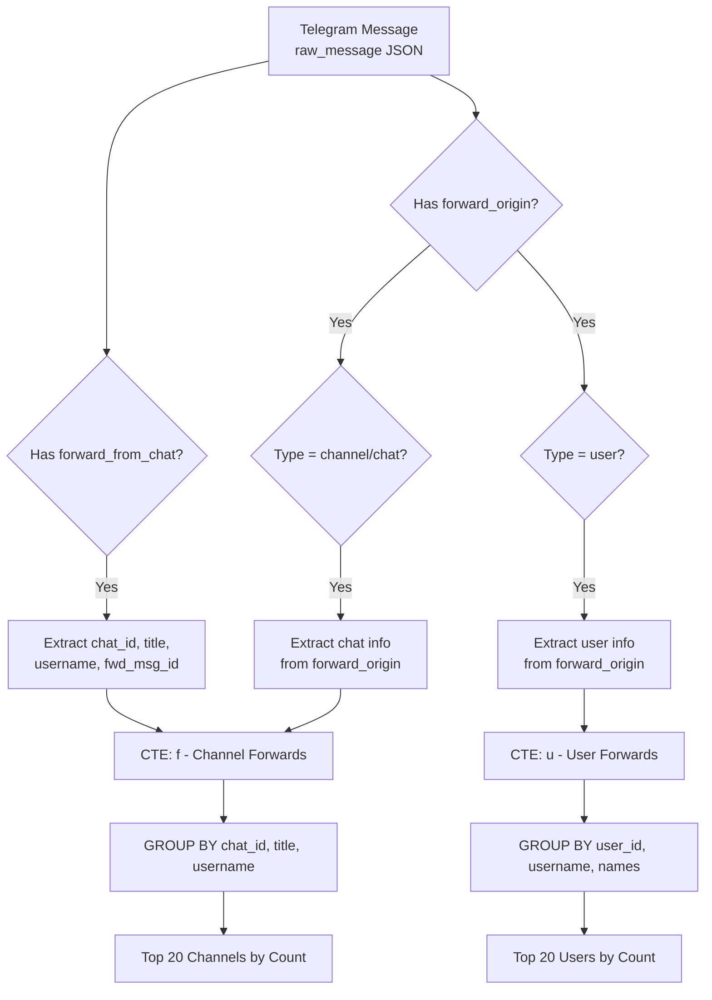
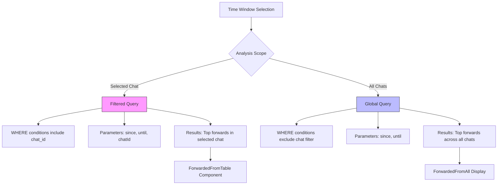

<cite>
**Referenced Files in This Document**
- [overview/route.ts](file://app/api/overview/route.ts)
- [ForwardedFromTable.tsx](file://app/components/tables/ForwardedFromTable.tsx)
</cite>

# Forwarded Content Analysis

This document provides a comprehensive analysis of the forwarded content processing system within the Telegram analytics dashboard. It details how message forwarding data from both `forward_from_chat` and `forward_origin` API fields is aggregated, normalized, and presented to users through SQL queries and frontend components.

## Data Aggregation with UNION ALL Queries

The system consolidates forwarded message data using `UNION ALL` operations to combine results from two distinct Telegram API structures: `forward_from_chat` (legacy field) and `forward_origin` (newer unified field). This approach ensures backward compatibility while supporting modern message formats.

Two primary CTEs (Common Table Expressions) are used:
- **Channel forwards**: The `f` CTE extracts chat ID, title, username, and message ID from both legacy and modern forwarding paths
- **User forwards**: The `u` CTE processes sender user information including ID, username, and name components

By using `UNION ALL`, the system efficiently merges these data sources without deduplication overhead, as each row represents a unique forward event. The consolidated result set enables unified analysis across different message types and API versions.



**Diagram sources**
- [overview/route.ts](file://app/api/overview/route.ts#L294-L389)

**Section sources**
- [overview/route.ts](file://app/api/overview/route.ts#L294-L389)

## Chat ID Normalization and URL Generation

To create direct t.me links for forwarded content, the system implements a normalization process that converts internal Telegram chat IDs into short identifiers suitable for web URLs. The `toShortId` function handles three formats:

1. **Supergroup channels** (`-100` prefix): Remove `-100` prefix (e.g., `-1001234567890` → `1234567890`)
2. **Basic groups** (`-` prefix): Remove leading `-` (e.g., `-123456789` → `123456789`)
3. **Public usernames**: Use directly without modification

The URL construction logic prioritizes username-based URLs when available, falling back to short ID URLs for private channels. For individual messages, the system appends the message ID to create deep links of the format `https://t.me/c/{shortId}/{messageId}`.

```mermaid
flowchart LR
A[Raw Chat ID] --> B{Starts with -100?}
B --> |Yes| C[Remove -100 prefix]
B --> |No| D{Starts with -?}
D --> |Yes| E[Remove - prefix]
D --> |No| F[Use as-is]
C --> G[Short ID]
E --> G
F --> G
G --> H{Username exists?}
H --> |Yes| I[https://t.me/{username}]
H --> |No| J[https://t.me/c/{shortId}]
K[Message ID available?] --> |Yes| L[Append /{messageId}]
L --> M[Deep Link URL]
J --> M
I --> M
```

**Diagram sources**
- [overview/route.ts](file://app/api/overview/route.ts#L331-L336)

**Section sources**
- [overview/route.ts](file://app/api/overview/route.ts#L331-L352)

## Separate Processing of Channel and User Forwards

The system handles channel forwards and user forwards through distinct but parallel query structures, maintaining separation while applying consistent aggregation patterns.

### Channel Forward Processing
Channel forwards are processed with full metadata extraction including:
- **Chat identification**: Internal ID and short ID conversion
- **Display information**: Title and username resolution
- **Message context**: Forwarded message ID for deep linking
- **Aggregation**: Count of forwards and sample message selection

### User Forward Processing
User forwards focus on sender identification with:
- **User identification**: Internal user ID
- **Profile information**: Username, first name, and last name
- **Name composition**: Concatenated display name generation
- **URL creation**: Direct t.me links when username is available

Both pathways use identical aggregation logic (GROUP BY, COUNT, ORDER BY) and limit results to the top 20 contributors, ensuring consistent presentation regardless of forward type.

```mermaid
classDiagram
class ChannelForward {
+string chat_id
+string title
+string username
+int cnt
+int sample_msg_id
+string url
}
class UserForward {
+string user_id
+string username
+string first_name
+string last_name
+string name
+int cnt
+string url
}
class ForwardProcessor {
+string baseWhere
+string baseWhereChatsOnly
+toShortId(chatIdRaw)
}
ForwardProcessor --> ChannelForward : "processes"
ForwardProcessor --> UserForward : "processes"
note right of ChannelForward
Extracted from :
- forward_from_chat
- forward_origin.type=channel/chat
end note
note right of UserForward
Extracted from :
- forward_from
- forward_origin.type=user
end note
```

**Diagram sources**
- [overview/route.ts](file://app/api/overview/route.ts#L294-L488)

**Section sources**
- [overview/route.ts](file://app/api/overview/route.ts#L294-L488)

## Dual-Query Approach for Filtered and Global Statistics

The system implements a dual-query strategy to provide both filtered (per-selected chat) and global (all chats) forwarding statistics. This approach uses parameterized WHERE clauses to control data scope:

### Filtered Query (Selected Chat)
- Uses `${baseWhere}` parameter including chat filter
- Parameters: `[since, until, resolvedChatId]`
- Context: Analysis within a specific chat's message stream
- Purpose: Understanding content sources within a particular community

### Global Query (All Chats)
- Uses `${baseWhereChatsOnly}` parameter excluding chat filter
- Parameters: `[since, until]`
- Context: Cross-chat forwarding patterns across the entire dataset
- Purpose: Identifying overall content distribution trends

This dual approach allows users to compare localized forwarding behavior against global patterns, revealing whether certain channels or users are disproportionately influential across the network.



**Diagram sources**
- [overview/route.ts](file://app/api/overview/route.ts#L294-L389)

**Section sources**
- [overview/route.ts](file://app/api/overview/route.ts#L294-L389)

## Performance Considerations and Indexing Requirements

Efficient querying of forwarded content relies on proper indexing of the JSON fields within the `raw_message` column. The system's performance depends on several key factors:

### Critical Indexes
- **Gin index on raw_message**: Essential for efficient JSON path queries
- **Index on sent_at**: Required for time-range filtering
- **Composite index on (sent_at, chat_id)**: Optimizes filtered queries

### Query Optimization
- **CTE usage**: Allows clear separation of data extraction and aggregation
- **Parameterized queries**: Prevent SQL injection and enable query plan caching
- **LIMIT 20**: Restricts result sets to manageable sizes
- **SELECT only needed fields**: Minimizes data transfer

### Execution Characteristics
- **Time complexity**: O(n) where n is messages in time window
- **Memory usage**: Linear with number of distinct forwarding sources
- **Best case**: Indexed JSON lookups with time-limited scans
- **Worst case**: Full table scans without proper indexing

Without appropriate indexes on the `raw_message` JSON fields, query performance would degrade significantly, especially as the message volume grows. The current implementation assumes properly indexed JSONB columns to ensure sub-second response times for typical analysis windows.

**Section sources**
- [overview/route.ts](file://app/api/overview/route.ts#L294-L488)

## Frontend Presentation and Data Formatting

The forwarded content data is presented through the `ForwardedFromTable` component, which formats and displays the aggregated results in a tabular interface. The component receives pre-processed data containing:

- **Source identification**: Chat ID, title, and username
- **Count metrics**: Number of forwarded messages
- **Navigation support**: Pre-constructed t.me URLs
- **Fallback display**: Raw chat IDs when titles are unavailable

The table renders clickable links when URLs are available, allowing users to directly navigate to the source content. For entries without URLs (private channels without usernames), it displays the chat ID in parentheses as a fallback identifier. Empty states are handled gracefully with descriptive messaging when no forwarded content exists in the selected time window.

**Section sources**
- [ForwardedFromTable.tsx](file://app/components/tables/ForwardedFromTable.tsx#L1-L40)