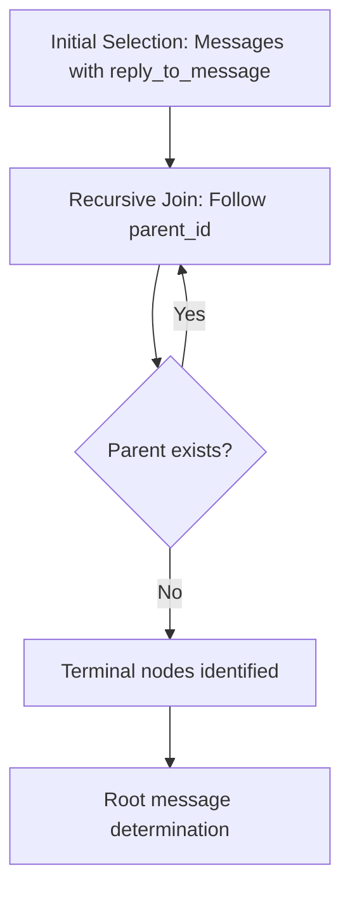
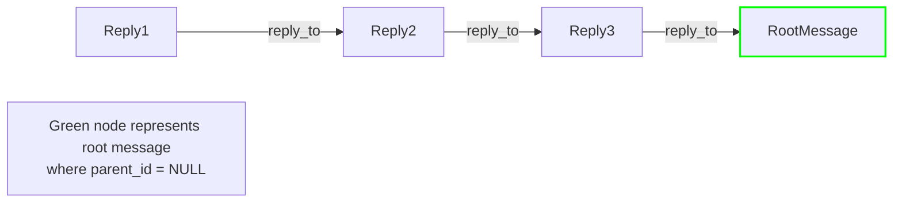
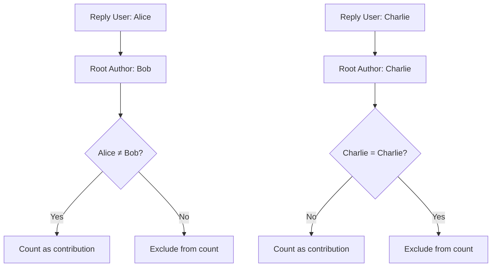
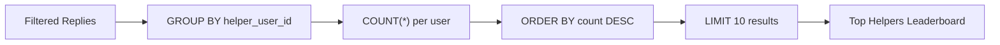
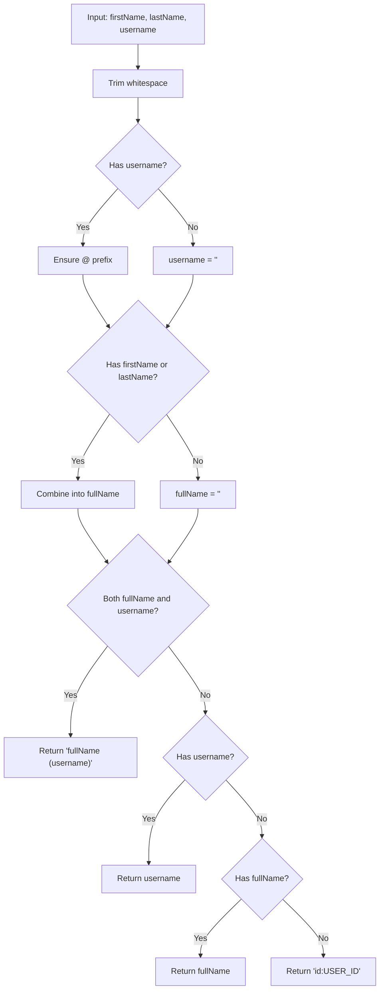
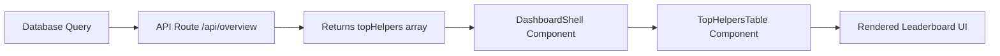

# Helper Leaderboard Computation

<cite>
**Referenced Files in This Document**   
- [route.ts](file://app/api/overview/route.ts)
- [TopHelpersTable.tsx](file://app/components/tables/TopHelpersTable.tsx)
- [DashboardShell.tsx](file://app/components/DashboardShell.tsx)
</cite>

## Table of Contents
1. [Introduction](#introduction)
2. [Recursive CTE Implementation](#recursive-cte-implementation)
3. [Root Message Identification](#root-message-identification)
4. [Cross-User Contribution Logic](#cross-user-contribution-logic)
5. [Aggregation and Ranking](#aggregation-and-ranking)
6. [Performance Optimization](#performance-optimization)
7. [User Display Name Normalization](#user-display-name-normalization)
8. [Edge Case Handling](#edge-case-handling)
9. [Component Integration](#component-integration)

## Introduction
The helper leaderboard computation system ranks users based on their contributions to others' threads within a messaging platform. This document details the implementation of this feature, focusing on the recursive Common Table Expression (CTE) that traces reply chains to identify original thread authors. The system distinguishes between self-replies and external contributions through user ID comparison, aggregates valid cross-user replies, and presents the top 10 contributors. The implementation includes performance optimizations through indexed queries and handles edge cases such as deleted users or missing profile data.

**Section sources**
- [route.ts](file://app/api/overview/route.ts#L207-L242)

## Recursive CTE Implementation
The core of the helper leaderboard computation is a recursive Common Table Expression (CTE) named `chain` that traverses reply relationships in the message database. The CTE begins by selecting all messages that contain a `reply_to_message` field, establishing the initial set of replies with their corresponding reply IDs, user IDs, current message IDs, and parent message IDs extracted from the JSON structure.

The recursive portion joins the `chain` CTE with the messages table to follow parent-child relationships, continuing until no more parent messages exist. This approach efficiently handles arbitrarily deep reply chains without requiring multiple database queries or application-level recursion.

**Diagram sources**
- [route.ts](file://app/api/overview/route.ts#L209-L218)

**Section sources**
- [route.ts](file://app/api/overview/route.ts#L209-L218)

## Root Message Identification
The system identifies the original thread author (root message) by locating terminal nodes in the reply chain where the `parent_id` is NULL. After the recursive CTE completes its traversal, the query selects from the `chain` result set where `parent_id IS NULL`, indicating these messages have no further ancestors and represent the beginning of each thread.

This root identification process ensures that contributions are attributed to the correct original thread rather than intermediate replies within a conversation. The root message's user ID becomes the reference point for determining whether subsequent replies constitute external help or self-replies.

**Diagram sources**
- [route.ts](file://app/api/overview/route.ts#L220-L223)

**Section sources**
- [route.ts](file://app/api/overview/route.ts#L220-L223)

## Cross-User Contribution Logic
The system distinguishes between self-replies and external contributions through a critical comparison between `reply_user_id` and `root_msg.user_id`. After joining the chain results with the messages table to obtain the root message information, the WHERE clause filters out cases where the reply user ID matches the root message user ID (`c.reply_user_id <> root_msg.user_id`).

This logic ensures that only genuine cross-user assistance is counted toward the leaderboard, preventing users from inflating their scores by repeatedly replying to their own threads. The comparison operates at the database level, providing efficient filtering before aggregation occurs.

**Diagram sources**
- [route.ts](file://app/api/overview/route.ts#L231)

**Section sources**
- [route.ts](file://app/api/overview/route.ts#L231)

## Aggregation and Ranking
After identifying valid cross-user replies, the system performs aggregation to rank contributors. The COUNT(*) function counts the number of valid replies per helper user, which is then grouped by the helper's user ID along with their username, first name, and last name attributes.

The results are ordered in descending order by count (ORDER BY cnt DESC) to prioritize the most active helpers, and the LIMIT 10 clause restricts output to the top 10 contributors. This aggregation occurs entirely within the database query, minimizing data transfer and leveraging PostgreSQL's optimized sorting and grouping capabilities.

**Diagram sources**
- [route.ts](file://app/api/overview/route.ts#L229-L235)

**Section sources**
- [route.ts](file://app/api/overview/route.ts#L229-L235)

## Performance Optimization
The helper leaderboard computation incorporates several performance optimizations. The recursive CTE leverages PostgreSQL's efficient handling of hierarchical queries, while the underlying database schema likely includes indexes on critical fields such as `reply_to_message` and `message_id` to accelerate the JOIN operations.

The query uses parameterized statements with the `paramsBase` array to prevent SQL injection and enable query plan caching. Additionally, the computation is scoped to a specific time window defined by the `baseWhere` condition, limiting the dataset size and improving response times. The entire processing pipeline executes within a single database transaction, reducing round-trip latency.

**Section sources**
- [route.ts](file://app/api/overview/route.ts#L207-L242)

## User Display Name Normalization
User display names are normalized through the `normalizeUsernameOrId` utility function, which processes first_name, last_name, and username fields to create consistent, readable identifiers. The function trims whitespace from all name components and ensures usernames are prefixed with '@' if not already present.

The normalization follows a hierarchy: when both full name and username exist, it displays "Full Name (@username)"; when only username exists, it shows "@username"; when only name components exist, it combines them; and as a fallback, it displays "id:USER_ID". This approach provides rich user identification while gracefully handling incomplete profile data.

**Diagram sources**
- [route.ts](file://app/api/overview/route.ts#L9-L19)

**Section sources**
- [route.ts](file://app/api/overview/route.ts#L9-L19)

## Edge Case Handling
The system addresses several edge cases related to user data completeness and deletion. When profile information is missing, the normalization function gracefully handles null or empty values through conditional checks and fallback mechanisms. Deleted users are accommodated by using LEFT JOIN with the users table, ensuring that reply records persist even if the corresponding user record has been removed.

The COALESCE and NULLIF functions protect against empty strings and null values in the SELECT clause, while the final fallback to "id:USER_ID" ensures every contributor can be uniquely identified regardless of profile completeness. The system also handles messages without text content by substituting "[no text]" in previews.

**Section sources**
- [route.ts](file://app/api/overview/route.ts#L9-L19)
- [route.ts](file://app/api/overview/route.ts#L224-L230)

## Component Integration
The helper leaderboard data flows from the API endpoint to the frontend through a well-defined integration path. The server-side route computes the leaderboard and returns it as `topHelpers` in the JSON response. The DashboardShell component receives this data and passes it to the TopHelpersTable component via props.

The TopHelpersTable renders the leaderboard in a responsive table format, formatting count values through the useNumberFormatter hook for locale-appropriate display. This separation of concerns maintains clean boundaries between data computation, API delivery, and UI presentation layers.

**Diagram sources**
- [route.ts](file://app/api/overview/route.ts#L240)
- [DashboardShell.tsx](file://app/components/DashboardShell.tsx#L95)
- [TopHelpersTable.tsx](file://app/components/tables/TopHelpersTable.tsx#L6)

**Section sources**
- [route.ts](file://app/api/overview/route.ts#L240)
- [DashboardShell.tsx](file://app/components/DashboardShell.tsx#L95)
- [TopHelpersTable.tsx](file://app/components/tables/TopHelpersTable.tsx#L6)