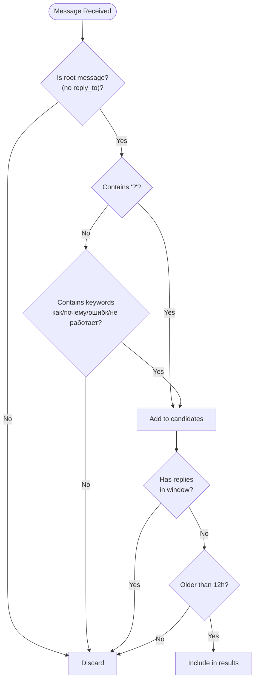
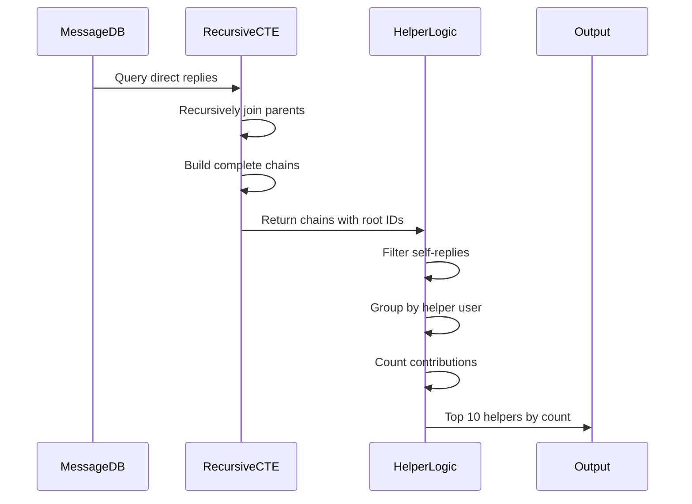
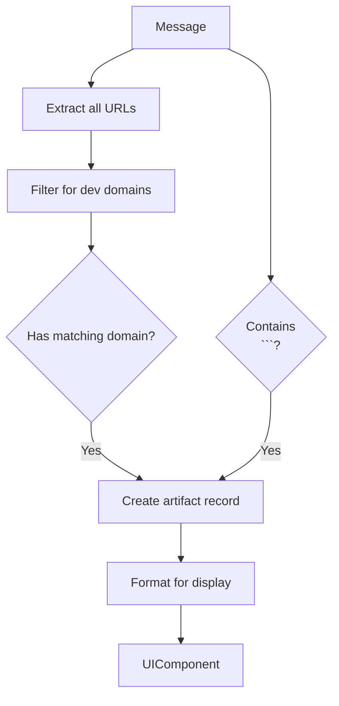
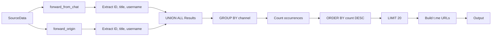

<cite>
**Referenced Files in This Document**   
- [overview/route.ts](file://app/api/overview/route.ts)
- [UnansweredTable.tsx](file://app/components/tables/UnansweredTable.tsx)
- [ArtifactsTable.tsx](file://app/components/tables/ArtifactsTable.tsx)
- [ForwardedFromTable.tsx](file://app/components/tables/ForwardedFromTable.tsx)
- [digest_schema.ts](file://lib/report/digest_schema.ts)
</cite>

# Specialized Analysis Modules

## Table of Contents
1. [Introduction](#introduction)
2. [Unanswered Questions Detection](#unanswered-questions-detection)
3. [Helper Leaderboard Computation](#helper-leaderboard-computation)
4. [Artifacts Tracking](#artifacts-tracking)
5. [Forwarded Content Analysis](#forwarded-content-analysis)
6. [Performance Optimization Techniques](#performance-optimization-techniques)
7. [Integration with LLM Processing](#integration-with-llm-processing)

## Introduction

This document provides a comprehensive analysis of the specialized modules within the Telegram analytics dashboard that enable advanced insights generation. The system implements sophisticated SQL-based analysis to detect unanswered questions, compute helper leaderboards, track development artifacts, and analyze forwarded content patterns. These modules form the foundation for generating meaningful daily digests and insights from chat data, combining heuristic rules with recursive queries and complex aggregations.

The architecture follows a server-side processing model where analytical queries are executed against a PostgreSQL database containing message data. Results are then formatted and exposed through API endpoints for consumption by the frontend components. Each analysis module employs specific techniques tailored to its domain, ranging from simple pattern matching to recursive common table expressions (CTEs).

**Section sources**
- [overview/route.ts](file://app/api/overview/route.ts#L1-L50)

## Unanswered Questions Detection

The unanswered questions detection module identifies messages that appear to be questions but have not received replies within a specified time window. This functionality is implemented through a combination of heuristic rules and database queries that determine both question characteristics and reply status.

### Question Identification Heuristics

Questions are identified using a multi-condition approach that combines syntactic and semantic indicators:

- Presence of question mark character (`?`) in the message text
- Inclusion of specific Russian language keywords commonly found in questions:
  - "как" (how)
  - "почему" (why)
  - "ошибк" (error-related terms)
  - "не работает" (not working)

These conditions are implemented as SQL WHERE clause predicates that efficiently filter potential questions from the message dataset.

### Reply Status Determination

To identify truly unanswered questions, the system uses a NOT EXISTS subquery pattern combined with direct reply mapping:

1. First, all potential root messages (messages without reply_to_message) that match the question heuristics are selected
2. A separate query aggregates direct reply counts by parent message ID
3. The final result filters out any question that has entries in the reply count map
4. Additional filtering ensures only questions older than 12 hours are included

This approach avoids expensive JOIN operations while maintaining accuracy in determining reply status.



**Diagram sources**
- [overview/route.ts](file://app/api/overview/route.ts#L167-L183)
- [overview/route.ts](file://app/api/overview/route.ts#L190-L206)

**Section sources**
- [overview/route.ts](file://app/api/overview/route.ts#L167-L206)
- [UnansweredTable.tsx](file://app/components/tables/UnansweredTable.tsx#L8-L32)

## Helper Leaderboard Computation

The helper leaderboard computation module identifies users who frequently contribute answers in other people's threads, serving as community helpers or subject matter experts. This analysis requires tracing reply chains to identify original thread authors and distinguish between self-replies and genuine assistance.

### Recursive CTE Implementation

The core of this functionality is a recursive Common Table Expression (CTE) that traces reply chains back to their origin:

```sql
WITH RECURSIVE chain AS (
  -- Base case: direct replies
  SELECT reply_id, reply_user_id, current_id, parent_id
  FROM messages 
  WHERE has reply_to_message
  
  UNION ALL
  
  -- Recursive case: traverse up the chain
  SELECT chain.reply_id, chain.reply_user_id, 
         p.message_id AS current_id,
         p.parent_id
  FROM chain
  JOIN messages p ON p.message_id = chain.parent_id
)
```

This recursive query builds complete reply chains, allowing the system to identify the root message (where parent_id IS NULL) for any reply in the system.

### Helper Identification Logic

After constructing the reply chains, the system applies the following logic to identify genuine helpers:

1. Filters chains to retain only those where the reply user differs from the root message author
2. Groups results by helper user ID to count contributions
3. Orders by contribution count in descending order
4. Limits results to the top 10 helpers

This approach ensures that users who only reply in their own threads do not appear on the leaderboard, focusing instead on cross-thread assistance.



**Diagram sources**
- [overview/route.ts](file://app/api/overview/route.ts#L208-L241)

**Section sources**
- [overview/route.ts](file://app/api/overview/route.ts#L208-L241)

## Artifacts Tracking

The artifacts tracking module identifies messages containing development artifacts such as code snippets or links to deployment platforms. This enables the system to highlight significant technical contributions like shipped features or code examples.

### Domain-Specific Artifact Detection

Artifacts are detected through two primary mechanisms:

1. **URL Pattern Matching**: Messages containing links to known development platforms:
   - github.com
   - vercel.com
   - netlify.com
   - replit.com
   - pages.dev

2. **Code Block Indicators**: Messages containing triple backticks (```) which indicate code blocks in Markdown formatting

The implementation uses JavaScript's string.includes() method to check for these indicators, combining both URL presence and code block markers to identify artifact-rich messages.

### Data Structure and Presentation

Detected artifacts are structured with the following properties:
- `id`: Message identifier
- `url`: First matching development platform URL (if present)
- `hasCode`: Boolean indicating presence of code blocks
- `preview`: Truncated message text for display

The frontend component renders URLs as hyperlinks and displays 'code snippet' indicator when code blocks are present but no qualifying URL exists.



**Diagram sources**
- [overview/route.ts](file://app/api/overview/route.ts#L261-L278)
- [ArtifactsTable.tsx](file://app/components/tables/ArtifactsTable.tsx#L5-L20)

**Section sources**
- [overview/route.ts](file://app/api/overview/route.ts#L261-L278)
- [ArtifactsTable.tsx](file://app/components/tables/ArtifactsTable.tsx#L5-L20)

## Forwarded Content Analysis

The forwarded content analysis module tracks messages that have been forwarded from other channels or users, providing insights into information flow and content sharing patterns within the community.

### Complex UNION ALL Queries

Due to Telegram API's evolving message structure, forwarded content can be represented in multiple fields:
- `forward_from_chat`: Traditional forwarding field
- `forward_origin.chat`: Newer forwarding structure with additional context

The system consolidates these sources using a UNION ALL query that normalizes data from both structures:

```sql
WITH f AS (
  -- Legacy forwarding structure
  SELECT forward_from_chat fields
  FROM messages 
  WHERE has forward_from_chat
  
  UNION ALL
  
  -- Modern forwarding structure  
  SELECT forward_origin.chat fields
  FROM messages 
  WHERE has forward_origin and type IN ('channel','chat')
)
```

This unified approach ensures comprehensive coverage regardless of how the forward was created.

### Channel URL Construction

For each detected forwarded channel, the system constructs clickable URLs using available identifiers:
- Username-based: https://t.me/username
- ID-based: https://t.me/c/chat_id/message_id

The construction logic handles both public channels (with usernames) and private/supergroups (with numeric IDs), providing direct links to the original content when possible.



**Diagram sources**
- [overview/route.ts](file://app/api/overview/route.ts#L295-L329)
- [ForwardedFromTable.tsx](file://app/components/tables/ForwardedFromTable.tsx#L7-L37)

**Section sources**
- [overview/route.ts](file://app/api/overview/route.ts#L295-L389)
- [ForwardedFromTable.tsx](file://app/components/tables/ForwardedFromTable.tsx#L7-L37)

## Performance Optimization Techniques

The analysis modules employ several performance optimization techniques to handle large message datasets efficiently while maintaining responsive query times.

### Chunked Queries for Reply Mapping

When mapping reply chains to their root messages, the system uses chunked queries to avoid database limitations:

- Root message IDs are processed in chunks of 1,000
- Each chunk generates a parameterized query with up to 1,000 IN clause values
- Results