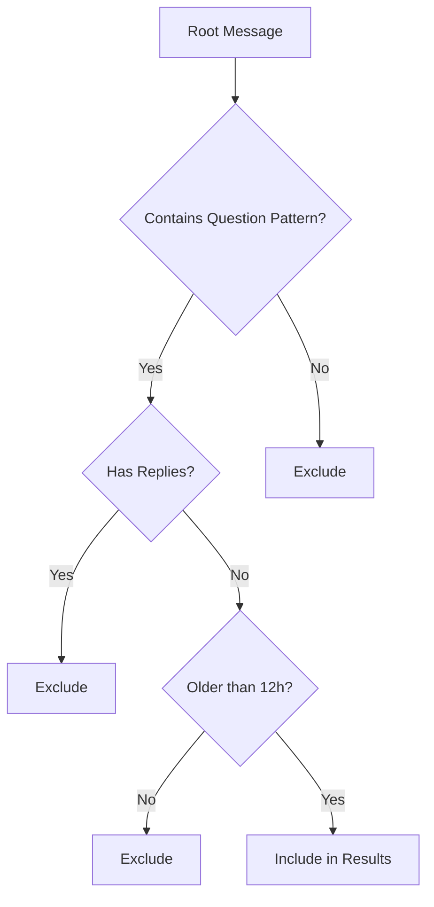

# Unanswered Questions Analysis

<cite>
**Referenced Files in This Document**   
- [UnansweredTable.tsx](file://app/components/tables/UnansweredTable.tsx)
- [route.ts](file://app/api/overview/route.ts)
</cite>

## Table of Contents
1. [Introduction](#introduction)
2. [Question Detection Heuristics](#question-detection-heuristics)
3. [Reply Verification Logic](#reply-verification-logic)
4. [Post-Processing and Filtering](#post-processing-and-filtering)
5. [UI Presentation](#ui-presentation)
6. [Performance Considerations](#performance-considerations)

## Introduction
The unanswered questions analysis feature identifies root messages that contain question-like patterns but have not received any replies within a specified time window. This functionality helps surface potentially overlooked inquiries in messaging platforms, particularly valuable in community or support channels where timely responses are critical. The system combines pattern matching, database querying, and post-processing logic to deliver accurate results while maintaining performance across large datasets.

## Question Detection Heuristics

The system employs a multi-pattern heuristic approach to identify potential questions in message content. This detection occurs at the SQL query level, leveraging both regex-like operations and keyword matching to capture a broad range of question indicators.

The primary detection criteria include:
- Presence of question marks (`?`) anywhere in the message text
- Inclusion of common Russian question words such as "как" (how), "почему" (why)
- Mentions of errors or malfunctions through terms like "ошибк" (error) and "не работает" (not working)

These conditions are implemented as OR-connected predicates in the WHERE clause of the SQL query, ensuring that any message matching at least one criterion is considered a potential question. The use of `lower()` function ensures case-insensitive matching for textual patterns, while the `position()` function efficiently detects question mark characters.

**Section sources**
- [route.ts](file://app/api/overview/route.ts#L170-L178)

## Reply Verification Logic

To determine whether a detected question has been answered, the system implements a two-step verification process using relational data from the messages table.

First, the query filters for root messages only by excluding any message that contains a `reply_to_message` field in its raw JSON structure. This ensures only original posts (not replies) are considered:

```sql
AND NOT (m.raw_message ? 'reply_to_message')
```

Second, the system verifies the absence of replies through a separate query that counts direct replies to each message:

```sql
SELECT (raw_message->'reply_to_message'->>'message_id') AS parent_id, COUNT(*)::int AS cnt
FROM messages
WHERE ${baseWhere} AND raw_message ? 'reply_to_message'
GROUP BY 1
```

The results are loaded into a Map structure (`directReplyMap`) for O(1) lookup performance. A message is considered truly unanswered if its ID does not appear as a parent_id in this map, effectively implementing a NOT EXISTS subquery pattern through application-level processing.

This approach separates the concern of identifying candidate questions from verifying their reply status, allowing for more efficient query execution and easier debugging.

**Section sources**
- [route.ts](file://app/api/overview/route.ts#L179-L188)

## Post-Processing and Filtering

After retrieving potential unanswered questions, the system applies several post-processing steps to refine the results before presentation.

The most significant transformation calculates the age of each message in hours by comparing its `sent_at` timestamp with the current time:

```javascript
const hours = Math.floor((nowTs - new Date(r.sent_at).getTime()) / 3600_000);
```

Only messages older than 12 hours are included in the final results, preventing recently posted questions from appearing as "unanswered" before sufficient time has passed for responses. This threshold balances the need to identify neglected questions while avoiding false positives for fresh inquiries.

Additional processing includes:
- Truncating long message texts to create concise previews (limited to 160 characters)
- Adding ellipsis indicators (`…`) to truncated content
- Sorting results by age (oldest first) to prioritize the most neglected questions
- Limiting output to the top 30 results for performance and usability

**Section sources**
- [route.ts](file://app/api/overview/route.ts#L189-L196)

## UI Presentation

The unanswered questions are presented to users through the `UnansweredTable` component, which displays key information in a compact, interactive format.

The table shows three primary columns:
- Message ID for reference and tracking
- Preview text showing the beginning of the question
- Age in hours indicating how long the question has gone unanswered

Users can click on any row to expand and view the full message text, providing context without cluttering the initial view. The component handles empty states gracefully by rendering nothing when no unanswered questions are found.

The UI uses localized Russian text for labels ("Вопросы без ответа (>12ч)", "Превью", "Часов"), indicating the target audience for this dashboard. Number formatting is handled through a reusable hook to ensure consistent presentation across different numeric values.



**Diagram sources**
- [route.ts](file://app/api/overview/route.ts#L165-L196)
- [UnansweredTable.tsx](file://app/components/tables/UnansweredTable.tsx#L8-L32)

**Section sources**
- [UnansweredTable.tsx](file://app/components/tables/UnansweredTable.tsx#L8-L32)

## Performance Considerations

The implementation incorporates several performance optimizations to handle potentially large message datasets efficiently.

Query chunking is employed when retrieving thread previews, processing root message IDs in batches of 1,000 to avoid overwhelming the database with excessively large IN clauses:

```javascript
const chunkSize = 1000;
for (let i = 0; i < rootIds.length; i += chunkSize) {
  const chunk = rootIds.slice(i, i + chunkSize);
  // Process chunk
}
```

While not explicitly shown in the code, optimal performance would require appropriate database indexing on key fields used in filtering and joins:
- An index on `message_id` for fast lookups
- An index on `reply_to_message` field within the `raw_message` JSON column
- Composite indexes covering `sent_at` and chat-related fields for time-range queries

The use of application-level Maps for reply tracking (`directReplyMap`) provides constant-time lookups during the filtering phase, avoiding expensive JOIN operations or subqueries that could degrade performance with large datasets.

The system also limits the final result set to 30 items, preventing excessive data transfer and rendering overhead in the UI.

**Section sources**
- [route.ts](file://app/api/overview/route.ts#L145-L155)