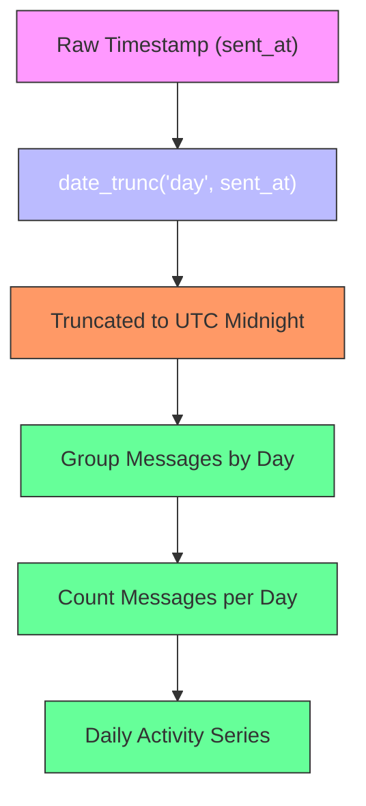
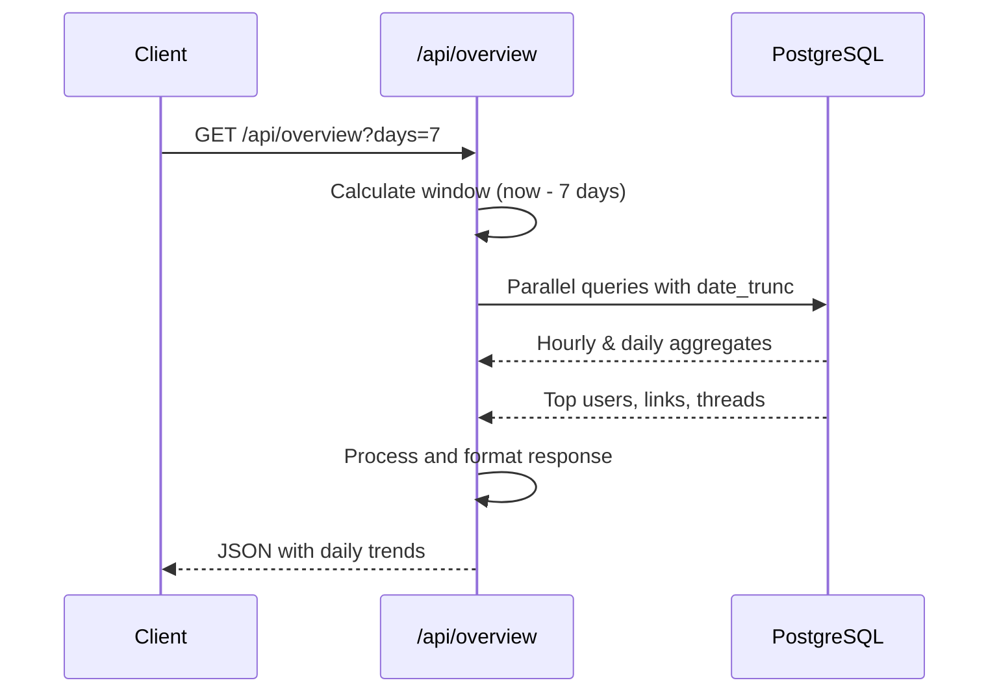

<cite>
**Referenced Files in This Document**
- [route.ts](file://app/api/overview/route.ts)
- [slice.ts](file://lib/report/slice.ts)
- [schema.ts](file://lib/report/schema.ts)
- [time.ts](file://app/utils/time.ts)
</cite>

## Table of Contents
1. [Daily Trend Analysis Implementation](#daily-trend-analysis-implementation)
2. [Date Truncation and Daily Partitioning](#date-truncation-and-daily-partitioning)
3. [UTC-Based Day Alignment](#utc-based-day-alignment)
4. [Handling Partial Days at Window Boundaries](#handling-partial-days-at-window-boundaries)
5. [ISO String Mapping for Frontend Consumption](#iso-string-mapping-for-frontend-consumption)
6. [Multi-Day Window Processing Example](#multi-day-window-processing-example)
7. [Challenges with Uneven Day Lengths](#challenges-with-uneven-day-lengths)
8. [Longitudinal Trend Presentation Strategies](#longitudinal-trend-presentation-strategies)

## Daily Trend Analysis Implementation

The daily trend analysis system aggregates message activity across calendar days using PostgreSQL's `date_trunc('day', sent_at)` function to partition data into daily intervals. The implementation is centered around the `/api/overview` endpoint, which processes multi-day windows and returns grouped metrics for frontend visualization. The system handles both single-day and multi-day analysis through parameterized queries that respect chat filters and time boundaries.

**Section sources**
- [route.ts](file://app/api/overview/route.ts#L0-L522)
- [slice.ts](file://lib/report/slice.ts#L92-L344)

## Date Truncation and Daily Partitioning

The core mechanism for daily aggregation relies on PostgreSQL's `date_trunc('day', sent_at)` function, which truncates timestamps to the start of their respective UTC days. This function effectively groups all messages within a 24-hour UTC period, creating clean daily partitions regardless of local time zones. In the overview API route, this is implemented through a SQL query that groups message counts by truncated day:

```sql
SELECT date_trunc('day', sent_at) AS day, COUNT(*)::int AS cnt
FROM messages WHERE ${baseWhere} GROUP BY 1 ORDER BY 1 ASC
```

This approach ensures consistent daily boundaries aligned to UTC midnight, enabling reliable comparison across different time zones and preventing edge cases that could arise from local time adjustments.

**Diagram sources**
- [route.ts](file://app/api/overview/route.ts#L0-L522)



## UTC-Based Day Alignment

All daily aggregations are strictly aligned to UTC time, ensuring global consistency in day boundaries. The system uses UTC throughout the pipeline, from database queries to frontend presentation. When processing a specific date string, the `getUtcWindow` function creates a 24-hour window starting at UTC midnight of the given date:

```typescript
export function getUtcWindow(dateStr: string): { since: Date; until: Date } {
  const since = new Date(`${dateStr}T00:00:00.000Z`);
  const until = new Date(since.getTime() + 24 * 3600_000);
  return { since, until };
}
```

This UTC alignment prevents issues related to daylight saving time changes and ensures that daily trends are comparable across different regions. The use of ISO 8601 format with Zulu time designator guarantees unambiguous time representation.

**Section sources**
- [slice.ts](file://lib/report/slice.ts#L92-L96)
- [time.ts](file://app/utils/time.ts#L0-L21)

## Handling Partial Days at Window Boundaries

When analyzing multi-day windows that don't align perfectly with calendar days, the system implements robust handling of partial days at window boundaries. The API accepts a `days` parameter that defines the window length, calculating the start time relative to the current moment:

```typescript
const now = new Date();
const since = new Date(now.getTime() - windowDays * 24 * 60 * 60 * 1000);
const until = now;
```

For partial days at the beginning or end of the window, the system includes only the messages that fall within the specified time range, providing an accurate representation of activity during that exact period. This approach allows for flexible window sizes while maintaining data integrity at the boundaries.

**Section sources**
- [route.ts](file://app/api/overview/route.ts#L0-L522)

## ISO String Mapping for Frontend Consumption

The system maps date-truncated timestamps to ISO strings for consistent frontend consumption. After database queries return truncated timestamps, they are converted to ISO 8601 format using JavaScript's `toISOString()` method:

```typescript
const daily = dailyRes.rows.map((r) => ({ day: r.day.toISOString(), cnt: r.cnt }));
```

This conversion ensures that timestamps are transmitted in a standardized format that can be easily parsed by the frontend components. The ISO strings maintain UTC alignment and provide millisecond precision, allowing for accurate sorting and display in chronological order. The frontend components, such as `DailyChart.tsx`, consume these ISO strings directly for rendering time-series visualizations.

**Section sources**
- [route.ts](file://app/api/overview/route.ts#L0-L522)
- [DailyChart.tsx](file://app/components/charts/DailyChart.tsx)

## Multi-Day Window Processing Example

The `/api/overview` endpoint demonstrates practical multi-day window processing through its handling of the `days` parameter. When a client requests a 7-day overview, the system:

1. Calculates the start time as 7 days before the current moment
2. Constructs a WHERE clause that filters messages within this window
3. Aggregates data at both hourly and daily granularities
4. Returns structured JSON containing KPIs, top contributors, and trend data

The implementation uses parallel queries to efficiently retrieve multiple data points:

```typescript
const [qTotal, qUnique, qReplies, qWithLinks, chatsRes] = await Promise.all([
  client.query(`SELECT COUNT(*)::int AS cnt FROM messages WHERE ${baseWhere}`, paramsBase),
  client.query(`SELECT COUNT(DISTINCT user_id)::int AS cnt FROM messages WHERE ${baseWhere}`, paramsBase),
  // ...additional parallel queries
]);
```

This approach minimizes database round-trips and ensures responsive performance even for larger time windows.

**Diagram sources**
- [route.ts](file://app/api/overview/route.ts#L0-L522)



## Challenges with Uneven Day Lengths

One significant challenge in daily trend analysis arises when comparing days of unequal length, particularly at window boundaries. When the analysis window doesn't align with calendar days, the first and last days in the series may contain incomplete data, making direct comparisons misleading. The current implementation addresses this by:

1. Including partial days in the results without padding
2. Clearly indicating the actual time window in the response metadata
3. Allowing the frontend to handle visualization of uneven day lengths

However, this approach requires careful interpretation, as a partial day with lower message volume might be mistaken for decreased engagement rather than simply representing a shorter observation period. The system does not currently normalize partial days, preserving the raw data integrity but shifting the responsibility for proper interpretation to the consumer.

**Section sources**
- [route.ts](file://app/api/overview/route.ts#L0-L522)

## Longitudinal Trend Presentation Strategies

For presenting longitudinal trends across variable time windows, the system employs several strategies:

1. **Consistent Time Alignment**: All daily buckets are aligned to UTC midnight, ensuring comparability across different periods
2. **Multiple Granularities**: Providing both hourly and daily views allows users to drill down from broad trends to specific peak times
3. **Contextual Metadata**: Including the exact `since` and `until` timestamps in the response helps interpret partial days
4. **Relative Comparisons**: The frontend can calculate percentage changes between days, enabling identification of growth patterns

The `build24hRange` utility function supports consistent time bucketing for hourly analysis, ensuring that each hour slot represents a complete 60-minute interval. For longer-term analysis, the system could be extended to support week-over-week or month-over-month comparisons by adjusting the grouping interval in the SQL queries.

**Section sources**
- [time.ts](file://app/utils/time.ts#L0-L21)
- [route.ts](file://app/api/overview/route.ts#L0-L522)