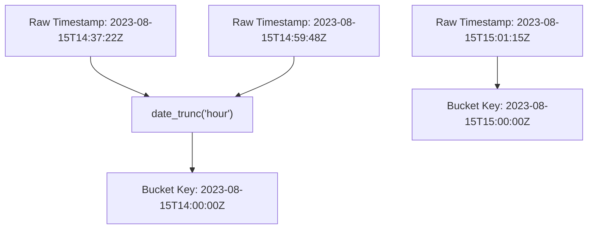
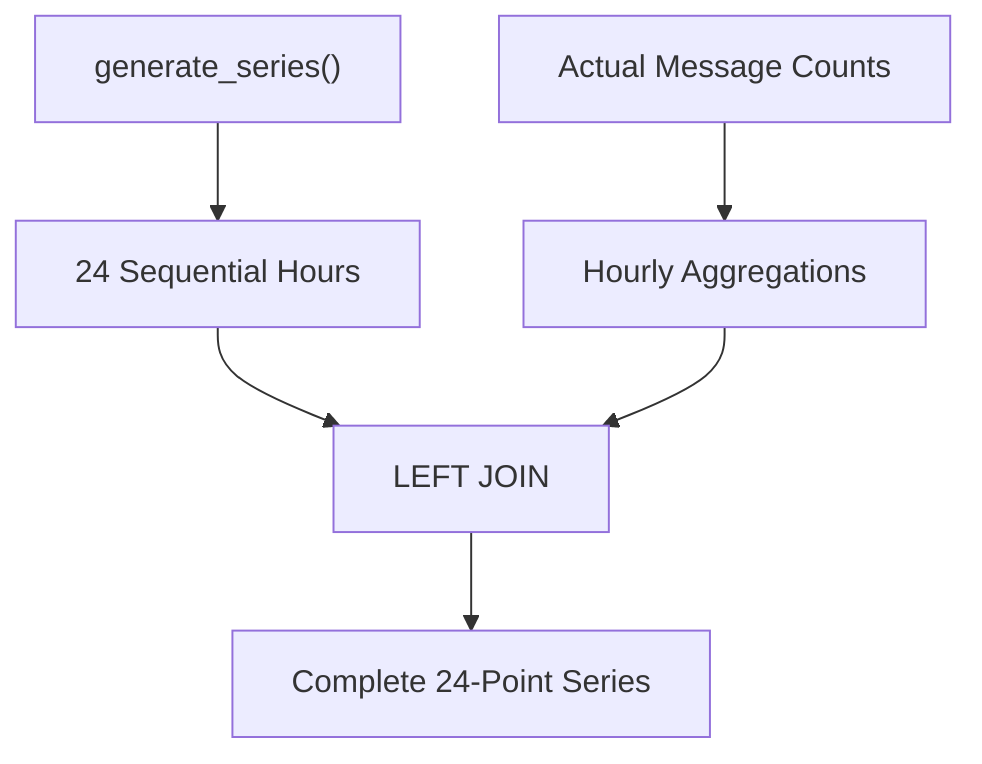
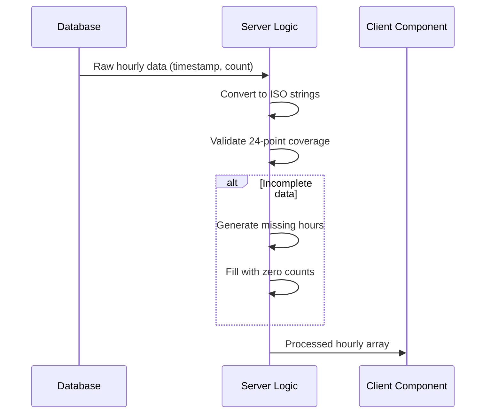
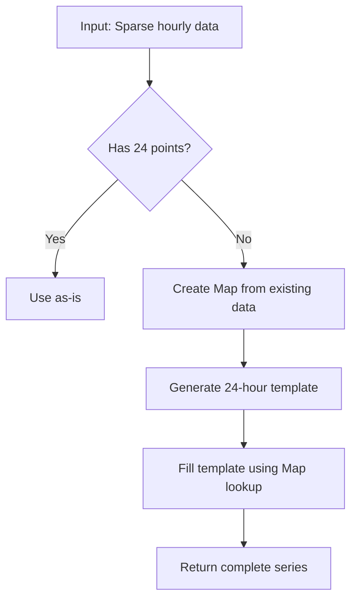
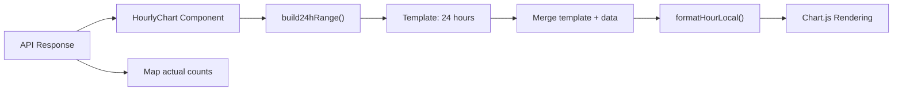

# Hourly Trend Analysis

<cite>
**Referenced Files in This Document**  
- [lib/report/slice.ts](file://lib/report/slice.ts)
- [app/api/overview/route.ts](file://app/api/overview/route.ts)
- [app/components/charts/HourlyChart.tsx](file://app/components/charts/HourlyChart.tsx)
- [app/utils/time.ts](file://app/utils/time.ts)
- [app/hooks/useTimeFormatting.ts](file://app/hooks/useTimeFormatting.ts)
</cite>

## Table of Contents
1. [Introduction](#introduction)
2. [Database-Level Time Bucketing](#database-level-time-bucketing)
3. [Complete Time Series Generation](#complete-time-series-generation)
4. [Client-Side Data Processing](#client-side-data-processing)
5. [Temporal Continuity and Zero-Filling](#temporal-continuity-and-zero-filling)
6. [Visualization Pipeline](#visualization-pipeline)
7. [Practical Implementation Examples](#practical-implementation-examples)
8. [Challenges in Low-Volume Visualization](#challenges-in-low-volume-visualization)
9. [Conclusion](#conclusion)

## Introduction

The hourly trend analysis system processes message activity by grouping timestamps into hourly intervals, ensuring consistent 24-point time series coverage for visualization. This document details the implementation across database queries, server-side processing, and client-side rendering, with emphasis on temporal alignment, data completeness, and chart rendering strategies.

**Section sources**
- [lib/report/slice.ts](file://lib/report/slice.ts#L100-L344)
- [app/api/overview/route.ts](file://app/api/overview/route.ts#L0-L522)

## Database-Level Time Bucketing

The system uses PostgreSQL's `date_trunc('hour', sent_at)` function to group message timestamps into hourly intervals. This function truncates timestamp values to the beginning of their respective hour, effectively creating time buckets where all messages within the same hour are aggregated together.

The database query groups messages by these truncated hour values and counts occurrences within each bucket. This approach ensures that temporal boundaries are consistently aligned to UTC hour markers, providing a standardized reference point for analysis across different time zones.



**Diagram sources**
- [lib/report/slice.ts](file://lib/report/slice.ts#L155-L160)

**Section sources**
- [lib/report/slice.ts](file://lib/report/slice.ts#L155-L160)

## Complete Time Series Generation

To ensure complete 24-point coverage even with sparse data, the system employs PostgreSQL's `generate_series` function. This generates a continuous sequence of hourly timestamps spanning the analysis window, guaranteeing that every hour is represented in the result set regardless of actual message volume.

The implementation creates a Common Table Expression (CTE) named "hours" that produces exactly 24 sequential hour markers. These generated hours are then left-joined with the actual message count data, ensuring temporal continuity in the output dataset.



**Diagram sources**
- [lib/report/slice.ts](file://lib/report/slice.ts#L145-L165)

**Section sources**
- [lib/report/slice.ts](file://lib/report/slice.ts#L145-L165)

## Client-Side Data Processing

After retrieval from the database, the server processes the hourly data to ensure ISO-formatted timestamps and proper numeric typing. The raw PostgreSQL results are transformed by mapping over the rows and converting the hour field to ISO string format while ensuring count values are properly typed as numbers.

This transformation step also includes a critical validation to ensure exactly 24 data points are present. If the database query fails to return a complete series, a fallback mechanism constructs the full 24-hour range programmatically based on the window start time.



**Diagram sources**
- [lib/report/slice.ts](file://lib/report/slice.ts#L213-L242)
- [lib/report/slice.ts](file://lib/report/slice.ts#L244-L265)

**Section sources**
- [lib/report/slice.ts](file://lib/report/slice.ts#L213-L265)

## Temporal Continuity and Zero-Filling

The system implements robust zero-filling logic to maintain consistent time series structure. When gaps exist in the data—either due to low message volume or potential query issues—the implementation ensures temporal continuity by explicitly filling missing hours with zero counts.

Two complementary mechanisms enforce this completeness:
1. **Database-level**: `generate_series` with LEFT JOIN ensures most gaps are filled at query time
2. **Application-level**: Explicit validation and reconstruction of 24-point series as fallback

The zero-filling process uses a Map-based lookup for efficiency, creating a key from the ISO string representation of each hour (truncated to the hour precision). This allows O(1) lookups when reconstructing the complete series.



**Diagram sources**
- [lib/report/slice.ts](file://lib/report/slice.ts#L244-L265)

**Section sources**
- [lib/report/slice.ts](file://lib/report/slice.ts#L244-L265)

## Visualization Pipeline

The client-side `HourlyChart` component receives the processed hourly data and renders it as a line chart. The visualization pipeline includes several key steps to ensure accurate temporal representation:

1. **Range construction**: Uses `build24hRange` to create a template of 24 consecutive hours
2. **Data mapping**: Populates the template with actual message counts from the API response
3. **Formatting**: Converts UTC hours to local time display format
4. **Rendering**: Draws the complete time series with smooth interpolation

The chart displays message volume per hour with visual enhancements including area fill under the curve and subtle tension in the line interpolation to improve readability of trends.



**Diagram sources**
- [app/components/charts/HourlyChart.tsx](file://app/components/charts/HourlyChart.tsx#L0-L67)
- [app/utils/time.ts](file://app/utils/time.ts#L0-L21)

**Section sources**
- [app/components/charts/HourlyChart.tsx](file://app/components/charts/HourlyChart.tsx#L0-L67)

## Practical Implementation Examples

### /api/overview Endpoint

The `/api/overview` route implements a simpler version of hourly analysis without `generate_series`. It directly queries message counts grouped by truncated hour, relying on client-side processing to handle potential gaps. This endpoint demonstrates UTC alignment in window boundaries and direct use of `date_trunc` for time bucketing.

```sql
SELECT date_trunc('hour', sent_at) AS hour, COUNT(*)::int AS cnt
FROM messages 
WHERE sent_at >= $1 AND sent_at < $2 
GROUP BY 1 ORDER BY 1 ASC
```

### buildDailyPreview Function

The `buildDailyPreview` function in `slice.ts` represents the comprehensive implementation with full `generate_series` support. It calculates peak hours by reducing the hourly array to find the maximum count, returning the UTC hour in HH:00 format. The function also ensures UTC alignment by using standardized window boundaries derived from the input date parameter.

Both implementations demonstrate consistent handling of edge cases, including validation of input parameters, error handling in date parsing, and fallback mechanisms for incomplete data.

**Section sources**
- [app/api/overview/route.ts](file://app/api/overview/route.ts#L61-L90)
- [lib/report/slice.ts](file://lib/report/slice.ts#L100-L344)

## Challenges in Low-Volume Visualization

Visualizing low-volume periods presents several challenges that the system addresses through specific design choices:

1. **Temporal discontinuity**: Without `generate_series`, charts could show broken lines or missing segments during quiet hours. The CTE-based approach prevents this by guaranteeing continuous x-axis coverage.

2. **Misleading trends**: Sparse data might create false impressions of activity patterns. Zero-filling makes absence of activity explicit rather than ambiguous.

3. **Peak hour accuracy**: The system calculates peak hours only from actual data points, ignoring artificially inserted zeros, ensuring statistical validity.

4. **Performance considerations**: For high-frequency data, the combination of database-level aggregation and application-level validation balances query complexity with data integrity.

The dual-layer approach (database generation + application validation) provides resilience against various failure modes while maintaining performance efficiency.

**Section sources**
- [lib/report/slice.ts](file://lib/report/slice.ts#L145-L165)
- [app/components/charts/HourlyChart.tsx](file://app/components/charts/HourlyChart.tsx#L0-L67)

## Conclusion

The hourly trend analysis implementation effectively combines PostgreSQL's temporal functions with application-level data integrity checks to produce reliable time series visualizations. By leveraging `date_trunc` for precise time bucketing and `generate_series` for complete coverage, the system ensures accurate representation of message activity patterns.

The client-side processing layer adds robustness through zero-filling logic and explicit validation of 24-point series completeness. This multi-layered approach successfully addresses challenges in visualizing sparse data while maintaining temporal accuracy and providing meaningful insights into communication patterns.

Key strengths include UTC alignment throughout the pipeline, graceful handling of edge cases, and a clean separation between database aggregation and client-side presentation concerns.