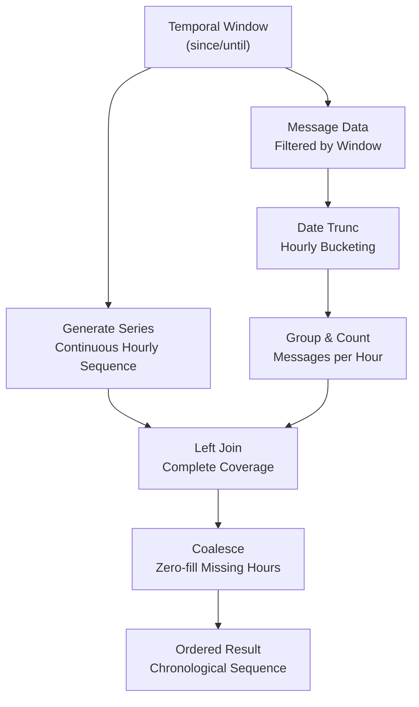
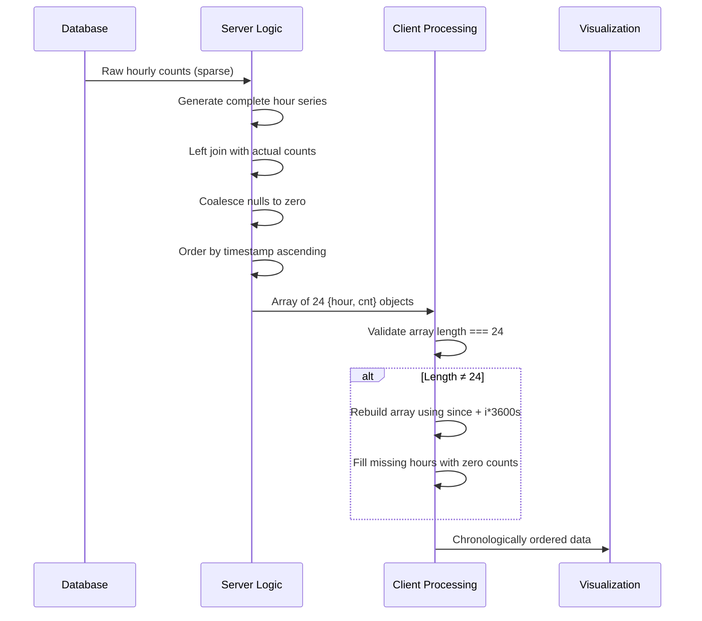
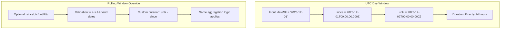

# Temporal Trend Analysis

<cite>
**Referenced Files in This Document**   
- [app/api/overview/route.ts](file://app/api/overview/route.ts)
- [lib/report/slice.ts](file://lib/report/slice.ts)
- [app/utils/time.ts](file://app/utils/time.ts)
</cite>

## Table of Contents
1. [Temporal Data Processing Pipeline](#temporal-data-processing-pipeline)
2. [Database-Level Time Bucketing](#database-level-time-bucketing)
3. [Client-Side Timestamp Mapping](#client-side-timestamp-mapping)
4. [Aggregation Logic and Chronological Integrity](#aggregation-logic-and-chronological-integrity)
5. [Window Alignment and Boundary Handling](#window-alignment-and-boundary-handling)
6. [Data Completeness Strategies](#data-completeness-strategies)

## Temporal Data Processing Pipeline

The temporal trend analysis system implements a comprehensive pipeline for generating hourly and daily activity patterns from message data. The architecture follows a two-tiered approach where database-level aggregation ensures efficient computation of time-based metrics, while client-side processing maintains chronological integrity and handles edge cases. The system processes temporal data through three primary stages: window definition, database aggregation with time bucketing, and client-side normalization.

The pipeline begins by defining temporal windows based on UTC-aligned boundaries, ensuring consistent day and hour boundaries across different time zones. These windows are then used to filter message data and apply PostgreSQL's temporal functions for grouping messages into hourly and daily buckets. The final stage involves client-side mapping of timestamps to ISO strings and validation of data completeness to ensure visualization-ready output.

**Section sources**
- [lib/report/slice.ts](file://lib/report/slice.ts#L92-L96)
- [app/api/overview/route.ts](file://app/api/overview/route.ts#L86)
- [lib/report/slice.ts](file://lib/report/slice.ts#L161-L170)

## Database-Level Time Bucketing

The system leverages PostgreSQL's `date_trunc` function to extract time buckets for both hourly and daily aggregations. For hourly patterns, the `date_trunc('hour', sent_at)` function truncates timestamp values to the beginning of their respective hour, effectively grouping all messages within the same hour into a single bucket. This operation creates natural time intervals that align with UTC hour boundaries, ensuring consistent temporal alignment across different days.

To address the challenge of sparse data, the system employs `generate_series` in conjunction with `LEFT JOIN` operations to guarantee complete hourly coverage. The `generate_series($1::timestamptz, $2::timestamptz - interval '1 hour', interval '1 hour')` function generates a continuous sequence of hourly timestamps spanning the entire analysis window. When this generated series is left-joined with actual message counts, it ensures that every hour in the 24-hour period is represented, with missing hours receiving zero counts through the `COALESCE(c.cnt, 0)` expression.

**Diagram sources**
- [lib/report/slice.ts](file://lib/report/slice.ts#L161-L170)

**Section sources**
- [lib/report/slice.ts](file://lib/report/slice.ts#L161-L170)
- [app/api/overview/route.ts](file://app/api/overview/route.ts#L86)

## Client-Side Timestamp Mapping

After database-level aggregation, the system performs client-side mapping of timestamps to ISO strings to ensure standardized datetime representation. The server response includes raw timestamp objects which are converted to ISO 8601 format using JavaScript's `toISOString()` method. This conversion ensures consistent string representation across different clients and eliminates timezone interpretation ambiguities.

The mapping process preserves the chronological order established by the database query's `ORDER BY h.hour ASC` clause. Each hourly data point is transformed into an object containing both the ISO-formatted timestamp string and the corresponding message count. This structure enables direct consumption by frontend charting components while maintaining temporal relationships between data points.

For daily patterns, a similar approach is applied using `date_trunc('day', sent_at)` to group messages by calendar day. The resulting day buckets are also converted to ISO strings, creating a uniform interface for both hourly and daily visualizations. This consistency simplifies client-side rendering logic and enables seamless switching between different temporal granularities.

**Section sources**
- [lib/report/slice.ts](file://lib/report/slice.ts#L200)
- [app/api/overview/route.ts](file://app/api/overview/route.ts#L100)

## Aggregation Logic and Chronological Integrity

The aggregation logic maintains chronological order through a combination of database sorting and client-side validation. The PostgreSQL queries explicitly include `ORDER BY h.hour ASC` clauses to ensure that results are returned in temporal sequence. This server-enforced ordering provides a reliable foundation for subsequent processing steps.

The system implements additional safeguards to verify data completeness and correct any potential gaps. After mapping database results to the client format, the code checks whether exactly 24 hourly data points were returned. If the count differs (indicating potential gaps despite the `generate_series` protection), a fallback mechanism constructs a complete 24-point array by iterating through each hour of the day and filling missing values with zeros.

This dual-layer approach—combining database-level completeness guarantees with client-side validation—ensures robust handling of edge cases such as database connectivity issues or unexpected query results. The fallback mechanism uses the original `since` timestamp as a base, incrementing by one hour for each iteration to maintain perfect alignment with the intended temporal window.

**Diagram sources**
- [lib/report/slice.ts](file://lib/report/slice.ts#L200-L215)

**Section sources**
- [lib/report/slice.ts](file://lib/report/slice.ts#L200-L215)
- [app/utils/time.ts](file://app/utils/time.ts#L0-L18)

## Window Alignment and Boundary Handling

Temporal windows are aligned to UTC days through the `getUtcWindow` function, which constructs date boundaries at midnight UTC. Given a date string in YYYY-MM-DD format, the function creates a `since` timestamp representing the beginning of that UTC day (00:00:00.000Z) and an `until` timestamp exactly 24 hours later. This approach ensures consistent day boundaries regardless of the user's local timezone.

Both `/api/overview` and `buildDailyPreview` implementations use this UTC-aligned windowing strategy, enabling accurate comparison of activity patterns across different days. The hourly analysis covers exactly 24 consecutive hours, from the start of the UTC day to the start of the following UTC day. This precise boundary definition prevents partial day artifacts and ensures that daily aggregates represent complete 24-hour periods.

The system also supports optional window overrides through the `windowOverride` parameter, allowing for rolling time windows that may not align with calendar days. When overrides are provided, the system validates that the specified `sinceUtc` and `untilUtc` timestamps represent a valid time range before applying them. This flexibility enables analysis of custom time periods while maintaining the same aggregation logic used for standard daily windows.

**Diagram sources**
- [lib/report/slice.ts](file://lib/report/slice.ts#L92-L96)
- [lib/report/slice.ts](file://lib/report/slice.ts#L105-L115)

**Section sources**
- [lib/report/slice.ts](file://lib/report/slice.ts#L92-L96)
- [lib/report/slice.ts](file://lib/report/slice.ts#L105-L115)

## Data Completeness Strategies

The system addresses challenges in visualizing irregular message distributions through multiple strategies for ensuring data completeness. The primary mechanism is the use of `generate_series` with `LEFT JOIN`, which guarantees that every hour in the analysis window appears in the result set, even when no messages were sent during that hour. This approach prevents gaps in time series visualizations and enables accurate representation of activity lulls.

A secondary safeguard is implemented in the client processing layer, where the system explicitly checks for exactly 24 hourly data points. If the database query returns fewer than 24 points (potentially due to edge cases or query failures), the code reconstructs the complete dataset by iterating through each hour of the day and assigning zero counts to any missing hours. This fallback ensures visualization integrity even when the primary database mechanism fails.

For smoothing incomplete data points, the system relies on the zero-filling strategy rather than interpolation, preserving the factual accuracy of the data. Zero counts accurately represent periods of no activity, avoiding the introduction of potentially misleading interpolated values. This conservative approach maintains data fidelity while still providing a complete dataset suitable for visualization.

**Section sources**
- [lib/report/slice.ts](file://lib/report/slice.ts#L200-L215)
- [app/utils/time.ts](file://app/utils/time.ts#L0-L18)