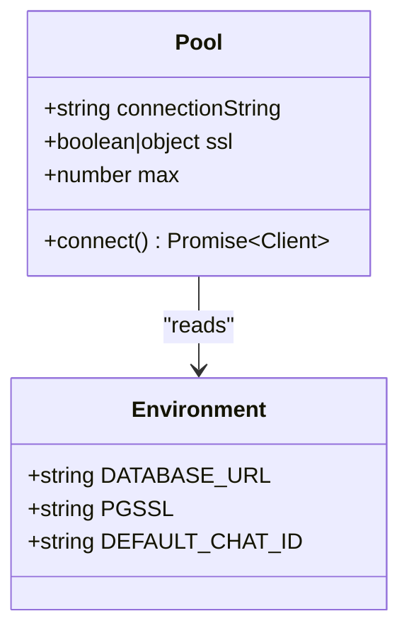
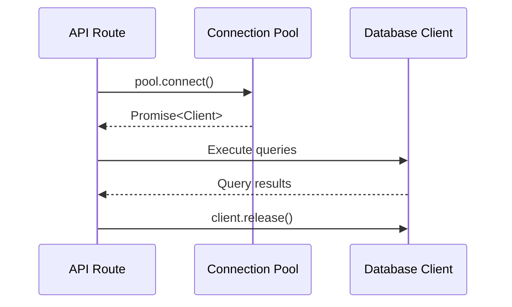
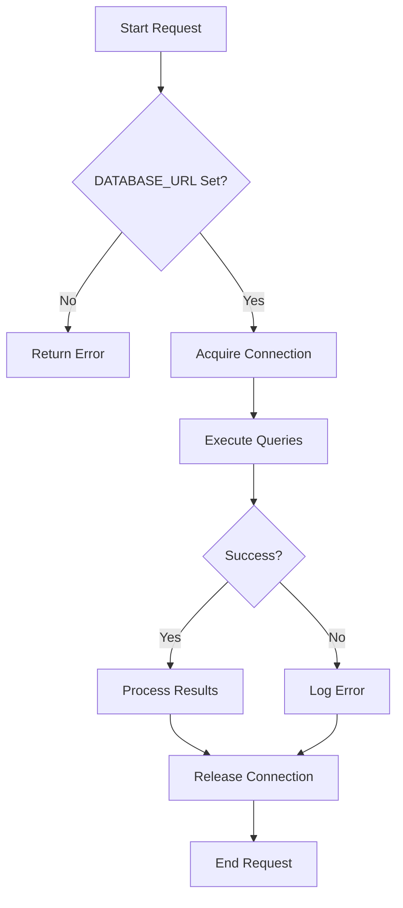

# Database Connection Management

<cite>
**Referenced Files in This Document**   
- [slice.ts](file://lib/report/slice.ts)
- [route.ts](file://app/api/overview/route.ts)
</cite>

## Table of Contents
1. [Introduction](#introduction)
2. [Pool Initialization and Configuration](#pool-initialization-and-configuration)
3. [Connection Lifecycle in API Routes](#connection-lifecycle-in-api-routes)
4. [Configuration Options and Security Implications](#configuration-options-and-security-implications)
5. [Best Practices for Connection Management](#best-practices-for-connection-management)
6. [Error Handling and Cleanup](#error-handling-and-cleanup)

## Introduction
The tg-vibecoders-dashboard application implements a robust PostgreSQL connection management system using the 'pg' library's Pool instance. This documentation details how database connections are established, managed, and secured throughout the application, with a focus on connection pooling, lifecycle management, and configuration options that ensure reliability and security.

## Pool Initialization and Configuration

The application initializes PostgreSQL connection pools in multiple locations, with consistent configuration patterns across different modules. The Pool instance is created with critical configuration parameters that control connectivity and security settings.

**Diagram sources**
- [slice.ts](file://lib/report/slice.ts#L30-L39)
- [route.ts](file://app/api/overview/route.ts#L4-L7)

**Section sources**
- [slice.ts](file://lib/report/slice.ts#L28-L39)
- [route.ts](file://app/api/overview/route.ts#L4-L7)

The Pool is initialized with two primary configuration sources: the DATABASE_URL environment variable provides authentication credentials and connection endpoints, while the PGSSL environment variable controls SSL/TLS encryption settings. When PGSSL is set to 'disable', SSL is explicitly turned off; otherwise, SSL is enabled with rejectUnauthorized set to false, allowing self-signed certificates. This configuration pattern appears in both direct Pool instantiation and through the getPool() factory function, ensuring consistent connection settings across the application.

## Connection Lifecycle in API Routes

Database connections follow a strict acquisition and release pattern within API routes to prevent connection leaks and ensure resource efficiency. The connection lifecycle consists of three phases: acquisition, usage, and guaranteed release.

**Diagram sources**
- [slice.ts](file://lib/report/slice.ts#L123)
- [route.ts](file://app/api/overview/route.ts#L55)

**Section sources**
- [slice.ts](file://lib/report/slice.ts#L122-L123)
- [route.ts](file://app/api/overview/route.ts#L55)

In API routes, connections are acquired using the pool.connect() method, which returns a Promise that resolves to a client object. This client is then used to execute one or more database queries during the request processing. Crucially, every connection acquisition is paired with a corresponding release operation in a finally block, ensuring that connections are returned to the pool even if query execution encounters errors. This try-finally pattern guarantees that connections are properly released back to the pool, preventing connection exhaustion under high load conditions.

## Configuration Options and Security Implications

The connection management system employs several configuration options that balance security, performance, and operational flexibility. These configurations have important security implications that affect how the application interacts with the database.

### Connection Pool Configuration
- **Max Connections**: The pool limits concurrent connections to 5 (configured in slice.ts), preventing database overload
- **SSL Configuration**: Controlled by PGSSL environment variable with fallback to secure defaults
- **Connection String**: Sourced entirely from DATABASE_URL environment variable

### Security Implications
The use of environment-controlled credentials via DATABASE_URL follows security best practices by avoiding hardcoded credentials. However, setting rejectUnauthorized to false in SSL configuration reduces security by accepting self-signed certificates, which could potentially expose the application to man-in-the-middle attacks. This trade-off likely accommodates development or staging environments but should be carefully evaluated for production use.

**Section sources**
- [slice.ts](file://lib/report/slice.ts#L30-L39)
- [route.ts](file://app/api/overview/route.ts#L4-L7)

## Best Practices for Connection Management

The application demonstrates several best practices for managing database connections in Node.js applications, particularly in serverless or edge runtime environments.

### Connection Reuse Pattern
The getPool() function in slice.ts implements a singleton pattern for the Pool instance, ensuring that connections are reused across requests rather than creating new pools for each invocation. This is critical for performance in serverless environments where cold starts can impact latency.

### Connection Limits
The explicit setting of max: 5 in the pool configuration prevents connection exhaustion on the database server. This conservative limit ensures the application remains stable even under heavy load, though it may require monitoring to determine optimal values based on actual usage patterns.

### Environment-Based Configuration
Using environment variables for all connection parameters allows for flexible deployment across different environments (development, staging, production) without code changes. This separation of configuration from code enhances security and operational agility.

**Section sources**
- [slice.ts](file://lib/report/slice.ts#L30-L39)

## Error Handling and Cleanup

The application implements comprehensive error handling and cleanup procedures to maintain connection pool integrity and prevent resource leaks.

### Try-Finally Pattern
All database operations are wrapped in try-finally blocks that guarantee connection release regardless of success or failure. This pattern ensures that even when queries throw exceptions, the connection is properly returned to the pool.

### Error Logging
When database operations fail, the application logs errors to the console before returning an appropriate HTTP response. This provides visibility into connection issues while maintaining API contract consistency.

### Guaranteed Release
The finally block contains the client.release() call, which is the critical safeguard against connection leaks. This release operation returns the connection to the pool for reuse by subsequent requests, maintaining the health of the connection pool over time.

**Diagram sources**
- [route.ts](file://app/api/overview/route.ts#L39-L59)

**Section sources**
- [route.ts](file://app/api/overview/route.ts#L39-L59)