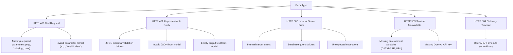
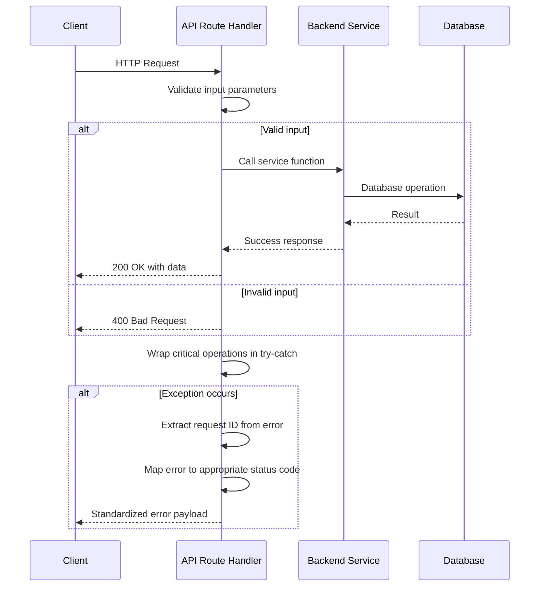
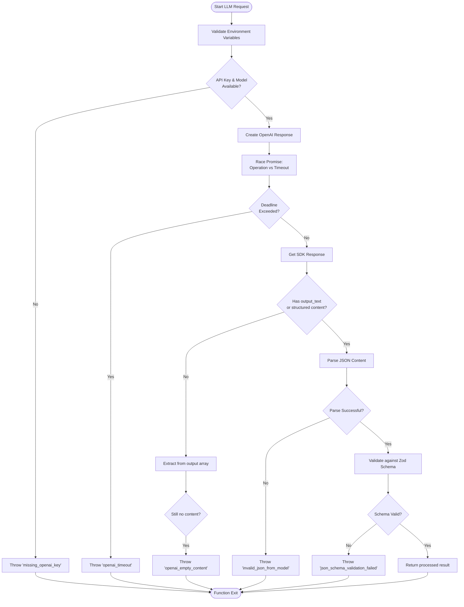
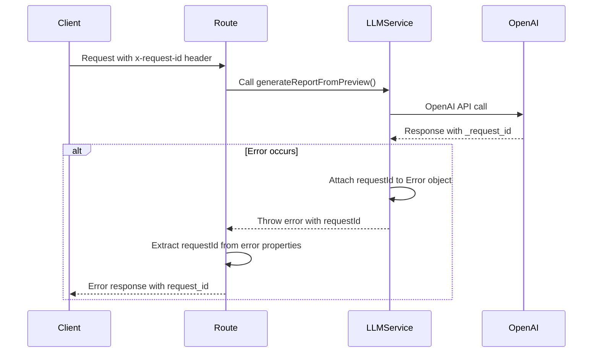

# Error Handling Strategy

<cite>
**Referenced Files in This Document**
- [app/api/report/generate/route.ts](file://app/api/report/generate/route.ts)
- [app/api/report/insights/route.ts](file://app/api/report/insights/route.ts)
- [app/api/report/preview/route.ts](file://app/api/report/preview/route.ts)
- [app/api/overview/route.ts](file://app/api/overview/route.ts)
- [lib/llm/report.ts](file://lib/llm/report.ts)
- [lib/report/slice.ts](file://lib/report/slice.ts)
</cite>

## Table of Contents
1. [Introduction](#introduction)
2. [Core Error Types and HTTP Status Mapping](#core-error-types-and-http-status-mapping)
3. [API Route Error Wrapping Strategy](#api-route-error-wrapping-strategy)
4. [LLM Service Error Handling](#llm-service-error-handling)
5. [Request ID Propagation and Debugging](#request-id-propagation-and-debugging)
6. [Logging Practices and Error Enrichment](#logging-practices-and-error-enrichment)
7. [Extending Error Handling for New Endpoints](#extending-error-handling-for-new-endpoints)

## Introduction
The tg-vibecoders-dashboard backend implements a comprehensive error handling strategy across its API routes and LLM services. The system employs defensive programming patterns to handle various failure modes including configuration issues, input validation errors, database connectivity problems, and external API failures. Errors are wrapped in try-catch blocks at critical operation boundaries and transformed into standardized JSON payloads with appropriate HTTP status codes. This document analyzes the error handling implementation, focusing on how different error types are detected, categorized, and communicated to clients while maintaining consistency across the codebase.

## Core Error Types and HTTP Status Mapping
The system categorizes errors into distinct types and maps them to appropriate HTTP status codes following REST conventions:

**Diagram sources**
- [app/api/report/generate/route.ts](file://app/api/report/generate/route.ts#L7-L9)
- [app/api/report/insights/route.ts](file://app/api/report/insights/route.ts#L7-L9)
- [lib/llm/report.ts](file://lib/llm/report.ts#L33-L58)

**Section sources**
- [app/api/report/generate/route.ts](file://app/api/report/generate/route.ts#L7-L51)
- [app/api/report/insights/route.ts](file://app/api/report/insights/route.ts#L7-L52)
- [app/api/overview/route.ts](file://app/api/overview/route.ts#L0-L522)

## API Route Error Wrapping Strategy
API routes implement a consistent error wrapping pattern using try-catch blocks around critical operations. Each route defines a `badRequest` helper function that returns standardized 400 responses for client-side input errors:

The error handling logic in API routes specifically checks for:
- Missing or invalid date parameters (400)
- Missing OPENAI_API_KEY environment variable (503)
- AbortError from OpenAI operations (504)
- Other internal errors (500)

**Diagram sources**
- [app/api/report/generate/route.ts](file://app/api/report/generate/route.ts#L7-L51)
- [app/api/report/insights/route.ts](file://app/api/report/insights/route.ts#L7-L52)

**Section sources**
- [app/api/report/generate/route.ts](file://app/api/report/generate/route.ts#L7-L51)
- [app/api/report/insights/route.ts](file://app/api/report/insights/route.ts#L7-L52)

## LLM Service Error Handling
The LLM service layer implements sophisticated error handling for OpenAI API interactions, addressing multiple potential failure points:

The LLM functions handle specific error conditions:
- Missing OPENAI_API_KEY or OPENAI_MODEL environment variables
- OpenAI API timeouts using Promise.race with deadline enforcement
- Empty or missing content in OpenAI responses
- Invalid JSON parsing from model output
- JSON schema validation failures using Zod

**Diagram sources**
- [lib/llm/report.ts](file://lib/llm/report.ts#L16-L96)
- [lib/llm/report.ts](file://lib/llm/report.ts#L98-L144)

**Section sources**
- [lib/llm/report.ts](file://lib/llm/report.ts#L16-L144)

## Request ID Propagation and Debugging
The system captures and propagates request IDs throughout the error handling chain to facilitate debugging and tracing:

Request IDs are extracted from multiple possible sources in the error object:
- `e.requestId`
- `e._request_id`
- `e.headers.get('x-request-id')`

When an error occurs in the LLM service, the request ID from the OpenAI response is attached to the thrown error object, ensuring it flows back through the call stack to the API route, which includes it in the final error response to the client.

**Diagram sources**
- [app/api/report/generate/route.ts](file://app/api/report/generate/route.ts#L40-L50)
- [lib/llm/report.ts](file://lib/llm/report.ts#L70-L75)

**Section sources**
- [app/api/report/generate/route.ts](file://app/api/report/g