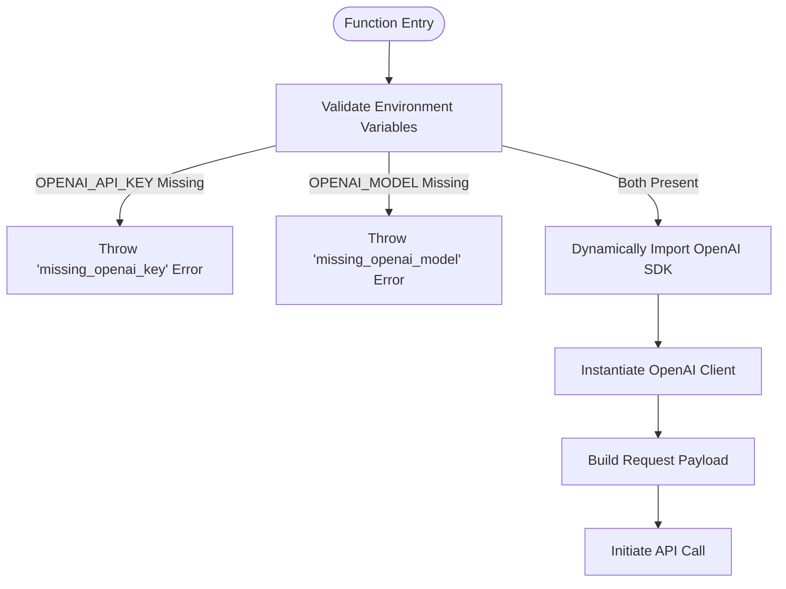
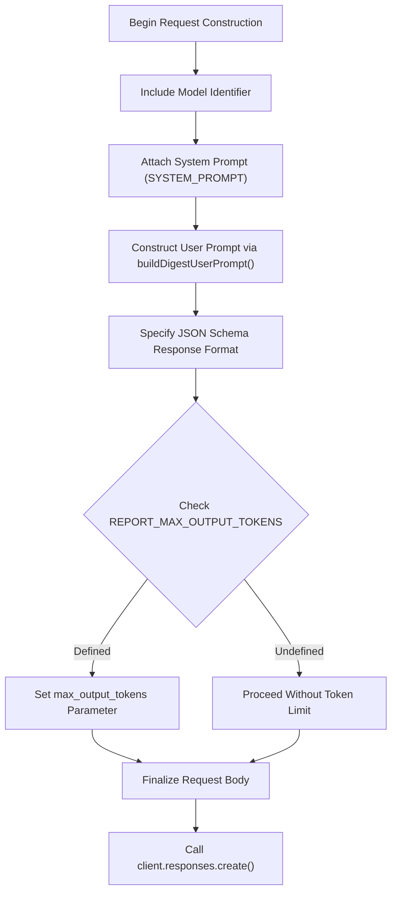
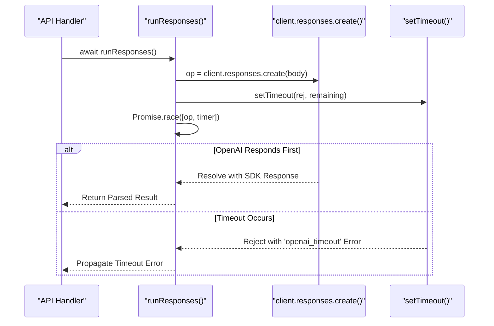
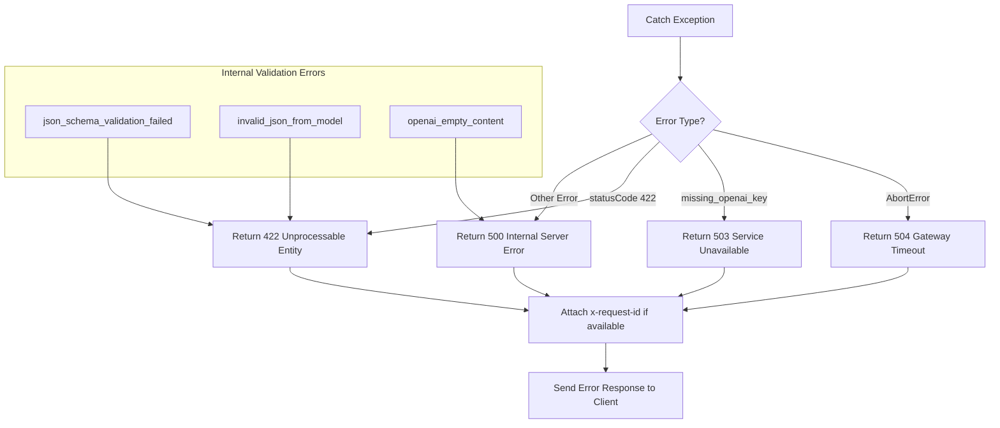

# API Execution and Timeout Management

<cite>
**Referenced Files in This Document**   
- [lib/llm/report.ts](file://lib/llm/report.ts)
- [app/api/report/generate/route.ts](file://app/api/report/generate/route.ts)
</cite>

## Table of Contents
1. [Introduction](#introduction)
2. [API Client Initialization](#api-client-initialization)
3. [Request Construction and Model Parameters](#request-construction-and-model-parameters)
4. [Timeout Mechanism Implementation](#timeout-mechanism-implementation)
5. [Error Handling for Timeouts and Failures](#error-handling-for-timeouts-and-failures)
6. [Configuration Options](#configuration-options)
7. [Performance Tuning Guidance](#performance-tuning-guidance)
8. [Debugging Strategies](#debugging-strategies)
9. [Monitoring Techniques](#monitoring-techniques)

## Introduction

This document provides comprehensive documentation for the API execution layer within the LLM integration pipeline, focusing on the `generateReportFromPreview` function. The system orchestrates OpenAI model interactions with robust timeout management, error handling, and configuration flexibility. It demonstrates a production-ready approach to managing external AI service dependencies while maintaining reliability and observability.

The core functionality revolves around generating structured reports from data previews using OpenAI's API, with critical safeguards against hanging requests and malformed responses. The implementation emphasizes environment-controlled configuration, graceful failure modes, and detailed error reporting for operational visibility.

## API Client Initialization

The API execution layer initializes the OpenAI client securely using environment-controlled credentials, ensuring sensitive information remains decoupled from application code.

**Diagram sources**
- [lib/llm/report.ts](file://lib/llm/report.ts#L18-L22)

**Section sources**
- [lib/llm/report.ts](file://lib/llm/report.ts#L18-L22)

The initialization process begins by validating the presence of required environment variables `OPENAI_API_KEY` and `OPENAI_MODEL`. If either is missing, the function throws a descriptive error that propagates through the call stack. Upon successful validation, the OpenAI SDK is dynamically imported and the client is instantiated with the provided API key. This approach ensures that the SDK is only loaded when needed and credentials are never hardcoded.

## Request Construction and Model Parameters

The request construction process builds a structured payload with model-specific parameters, including optional token limits for output control.

**Diagram sources**
- [lib/llm/report.ts](file://lib/llm/report.ts#L40-L50)

**Section sources**
- [lib/llm/report.ts](file://lib/llm/report.ts#L40-L50)

The request body includes several critical components: the target model identifier, system instructions, user input constructed from the preview data, and a strict JSON schema definition for response formatting. The `max_output_tokens` parameter is conditionally included based on the `REPORT_MAX_OUTPUT_TOKENS` environment variable, allowing administrators to control response length and associated costs.

## Timeout Mechanism Implementation

The system implements a robust timeout mechanism using `Promise.race` to enforce hard deadlines and prevent hanging API requests, with a default timeout of 120 seconds.

**Diagram sources**
- [lib/llm/report.ts](file://lib/llm/report.ts#L52-L60)

**Section sources**
- [lib/llm/report.ts](file://lib/llm/report.ts#L52-L60)

The timeout mechanism calculates the remaining time until the deadline and uses `Promise.race` to compete between the actual API call and a delayed rejection promise. The minimum timeout is capped at 5 seconds to prevent immediate timeouts during high-latency conditions. This approach ensures that the system will not hang indefinitely on unresponsive API endpoints, maintaining overall application responsiveness.

## Error Handling for Timeouts and Failures

The system implements comprehensive error handling for various failure scenarios, including timeouts, empty responses, JSON parsing errors, and schema validation failures.

**Diagram sources**
- [app/api/report/generate/route.ts](file://app/api/report/generate/route.ts#L40-L50)
- [lib/llm/report.ts](file://lib/llm/report.ts#L70-L85)

**Section sources**
- [app/api/report/generate/route.ts](file://app/api/report/generate/route.ts#L40-L50)
- [lib/llm/report.ts](file://lib/llm/report.ts#L70-L85)

When a timeout occurs, the `AbortError` is caught in the route handler and translated to an HTTP 504 status with the error code 'openai_timeout'. Other error types are similarly mapped to appropriate HTTP status codes with detailed error messages and request identifiers for tracing. The system preserves the original request ID from the OpenAI response when available, enabling correlation between frontend errors and backend logs.

## Configuration Options

The API execution layer supports several environment variables that allow operators to tune behavior without code changes:

<cite>
**Configuration Options**
| Environment Variable | Purpose | Default Value | Scope |
|----------------------|---------|---------------|-------|
| OPENAI_API_KEY | Authentication credential for OpenAI API | Required | Global |
| OPENAI_MODEL | Identifier of the OpenAI model to use | Required | Global |
| REPORT_TIMEOUT_MS | Maximum time to wait for API response in milliseconds | 120,000 (120s) | Report Generation |
| REPORT_MAX_OUTPUT_TOKENS | Maximum number of tokens in model output | undefined (no limit) | Request Level |
| DEFAULT_CHAT_ID | Fallback chat identifier when none specified | Optional | Preview Building |
</cite>

**Section sources**
- [lib/llm/report.ts](file://lib/llm/report.ts#L24-L30)
- [app/api/report/generate/route.ts](file://app/api/report/generate/route.ts#L16-L20)

These configuration options provide flexibility in deployment scenarios, allowing teams to adjust timeout thresholds and output limits based on their specific requirements, performance characteristics, and cost considerations.

## Performance Tuning Guidance

When tuning the API execution parameters, consider the following guidance:

- **REPORT_TIMEOUT_MS**: Set this value based on your service level objectives (SLOs). A value too low may cause premature timeouts during peak load, while a value too high may degrade user experience. Monitor your 95th percentile response times and set the timeout 2-3x higher than this baseline.

- **REPORT_MAX_OUTPUT_TOKENS**: Use this to control costs and prevent excessively long responses. For report generation, typical values range from 2000-4000 tokens. Test with representative data to find the optimal balance between completeness and cost.

- **Model Selection**: The `OPENAI_MODEL` environment variable allows switching between different OpenAI models. Newer models may offer better quality but at higher cost and potentially longer response times. Conduct A/B testing to evaluate trade-offs.

- **Caching Strategy**: Consider implementing response caching for frequently requested reports, especially when the underlying data changes infrequently. This can dramatically reduce API calls and improve response times.

**Section sources**
- [lib/llm/report.ts](file://lib/llm/report.ts#L24-L30)

## Debugging Strategies

Effective debugging of failed API calls involves several techniques:

1. **Request ID Correlation**: Always capture and log the `x-request-id` from OpenAI responses. This enables cross-referencing with OpenAI's internal logs when investigating issues.

2. **Structured Logging**: The system logs detailed error information including message, request ID, and stack context. Use these logs to trace the full lifecycle of problematic requests.

3. **Local Testing**: Use the provided test scripts (`scripts/test-report.mjs`) to reproduce issues in a controlled environment. These scripts simulate real API calls with configurable parameters.

4. **Payload Inspection**: When encountering JSON parsing or schema validation errors, examine the raw content snippet included in the error message to understand what the model actually returned.

5. **Environment Parity**: Ensure development, staging, and production environments use consistent configuration values to avoid environment-specific failures.

**Section sources**
- [app/api/report/generate/route.ts](file://app/api/report/generate/route.ts#L40-L50)
- [scripts/test-report.mjs](file://scripts/test-report.mjs)

## Monitoring Techniques

To effectively monitor the health and performance of the API execution layer:

- **Success Rate Tracking**: Monitor the ratio of successful API calls to total attempts. A sudden drop indicates potential issues with authentication, network connectivity, or OpenAI service availability.

- **Latency Metrics**: Track request duration percentiles (p50, p95, p99) to identify performance degradation. Set up alerts for sustained increases in latency.

- **Error Classification**: Categorize errors by type ('openai_timeout', 'missing_openai_key', 'json_schema_validation_failed', etc.) to identify recurring issues and prioritize fixes.

- **Token Usage Monitoring**: Track the number of input and output tokens to understand cost patterns and identify opportunities for optimization.

- **Timeout Rate**: Monitor the percentage of requests that hit the timeout threshold, which may indicate the need to adjust `REPORT_TIMEOUT_MS` or investigate upstream performance issues.

These monitoring practices enable proactive detection of issues and data-driven decisions for system optimization.