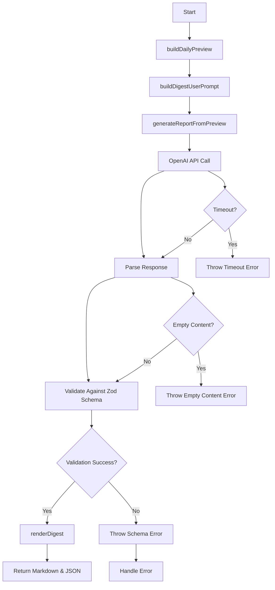
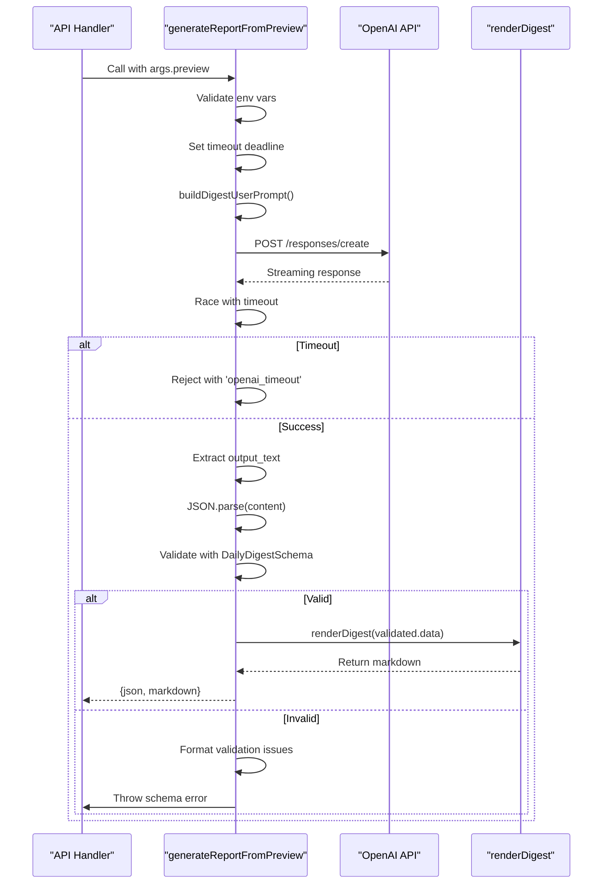
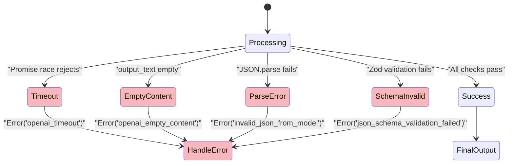

# LLM Integration Pipeline

<cite>
**Referenced Files in This Document**   
- [lib/llm/report.ts](file://lib/llm/report.ts)
- [lib/report/digest_schema.ts](file://lib/report/digest_schema.ts)
- [lib/report/digest_render.ts](file://lib/report/digest_render.ts)
- [lib/llm/shared.ts](file://lib/llm/shared.ts)
- [lib/report/slice.ts](file://lib/report/slice.ts)
</cite>

## Table of Contents
1. [Introduction](#introduction)
2. [Core Components](#core-components)
3. [Architecture Overview](#architecture-overview)
4. [Detailed Component Analysis](#detailed-component-analysis)
5. [Error Handling Strategies](#error-handling-strategies)
6. [Security and Configuration](#security-and-configuration)
7. [Conclusion](#conclusion)

## Introduction

The LLM integration pipeline in the tg-vibecoders-dashboard orchestrates the generation of structured daily digest reports through a robust sequence of data preparation, model interaction, validation, and rendering. At its core, the `generateReportFromPreview` function coordinates this workflow by leveraging OpenAI's Responses API with strict JSON schema enforcement via `DailyDigestJsonSchemaForLLM`. This document details the end-to-end flow from preview construction to final markdown output, emphasizing reliability, predictability, and developer safety.

**Section sources**
- [lib/llm/report.ts](file://lib/llm/report.ts#L16-L96)
- [lib/report/slice.ts](file://lib/report/slice.ts#L100-L344)

## Core Components

The pipeline consists of several key functions that handle distinct responsibilities: `buildDailyPreview` prepares input data, `buildDigestUserPrompt` constructs the prompt, `generateReportFromPreview` manages the API interaction, and `renderDigest` produces the final human-readable output. These components work together to ensure consistent, validated results while handling common failure modes gracefully.

**Section sources**
- [lib/llm/report.ts](file://lib/llm/report.ts#L16-L96)
- [lib/report/slice.ts](file://lib/report/slice.ts#L100-L344)
- [lib/llm/shared.ts](file://lib/llm/shared.ts#L65-L77)
- [lib/report/digest_render.ts](file://lib/report/digest_render.ts#L2-L32)

## Architecture Overview



**Diagram sources**
- [lib/llm/report.ts](file://lib/llm/report.ts#L16-L96)
- [lib/report/slice.ts](file://lib/report/slice.ts#L100-L344)

## Detailed Component Analysis

### Report Generation Workflow

The `generateReportFromPreview` function serves as the orchestration point for the entire LLM pipeline. It begins by validating environment configuration (API key and model), then proceeds through a time-limited execution window to prevent hanging operations.

#### Prompt Construction and API Execution


**Diagram sources**
- [lib/llm/report.ts](file://lib/llm/report.ts#L16-L96)
- [lib/llm/shared.ts](file://lib/llm/shared.ts#L65-L77)
- [lib/report/digest_render.ts](file://lib/report/digest_render.ts#L2-L32)

#### Data Flow and Validation
```mermaid
flowchart LR
Preview[ReportPreview] --> PromptBuilder[buildDigestUserPrompt]
PromptBuilder --> JSONStr[JSON.stringify(payload)]
JSONStr --> UserPrompt[Formatted User Prompt]
UserPrompt --> APIRequest[OpenAI Request Body]
APIRequest --> OpenAI[OpenAI Responses API]
OpenAI --> RawText[Raw output_text]
RawText --> JSONParse[JSON.parse()]
JSONParse --> ParsedObject[Parsed JSON Object]
ParsedObject --> ZodValidator[DailyDigestSchema.safeParse]
ZodValidator --> Validated[Validated DailyDigest]
Validated --> Render[renderDigest]
Render --> FinalMarkdown[Final Markdown Output]
```

**Diagram sources**
- [lib/llm/report.ts](file://lib/llm/report.ts#L16-L96)
- [lib/report/digest_schema.ts](file://lib/report/digest_schema.ts#L11-L23)
- [lib/report/digest_render.ts](file://lib/report/digest_render.ts#L2-L32)

### Schema Validation System

The pipeline employs a dual-schema approach for maximum reliability. The `DailyDigestJsonSchemaForLLM` enforces strict output format at the API level, while `DailyDigestSchema` provides runtime type checking using Zod.

```mermaid
classDiagram
class DailyDigestJsonSchemaForLLM {
+type : object
+additionalProperties : false
+required : string[]
+properties : object
}
class DailyDigestSchema {
+discussions : z.array(DiscussionItemSchema)
+resources : z.array(z.string())
+unanswered_questions : z.array(z.string())
+stats : z.object({messages_count, participants_count})
+insights : z.array(z.string()).optional()
}
class DiscussionItemSchema {
+topic : z.string()
+question : z.string()
+participants : z.array(z.string())
+outcome : z.string()
}
DailyDigestSchema --> DiscussionItemSchema : "contains"
DailyDigestJsonSchemaForLLM ..> DailyDigestSchema : "mirrors structure"
```

**Diagram sources**
- [lib/report/digest_schema.ts](file://lib/report/digest_schema.ts#L11-L63)

**Section sources**
- [lib/report/digest_schema.ts](file://lib/report/digest_schema.ts#L11-L63)

## Error Handling Strategies

The pipeline implements comprehensive error handling for various failure modes, each with appropriate context preservation for debugging.



**Diagram sources**
- [lib/llm/report.ts](file://lib/llm/report.ts#L16-L96)

**Section sources**
- [lib/llm/report.ts](file://lib/llm/report.ts#L16-L96)

## Security and Configuration

The system maintains security through environment-controlled configuration. API keys and model selection are sourced exclusively from environment variables, preventing hardcoding risks. Additional parameters like `MAX_OUTPUT_TOKENS` and `EFFECTIVE_TIMEOUT` are also configurable through environment settings, allowing operational tuning without code changes.

**Section sources**
- [lib/llm/report.ts](file://lib/llm/report.ts#L16-L96)