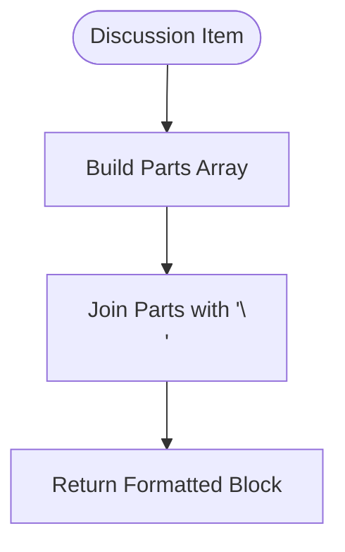
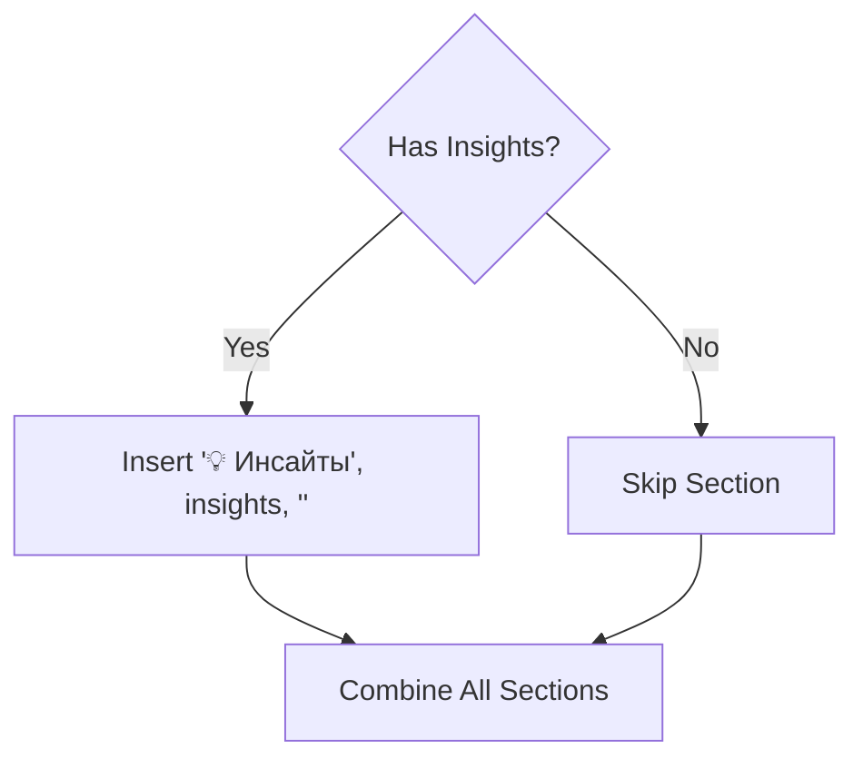
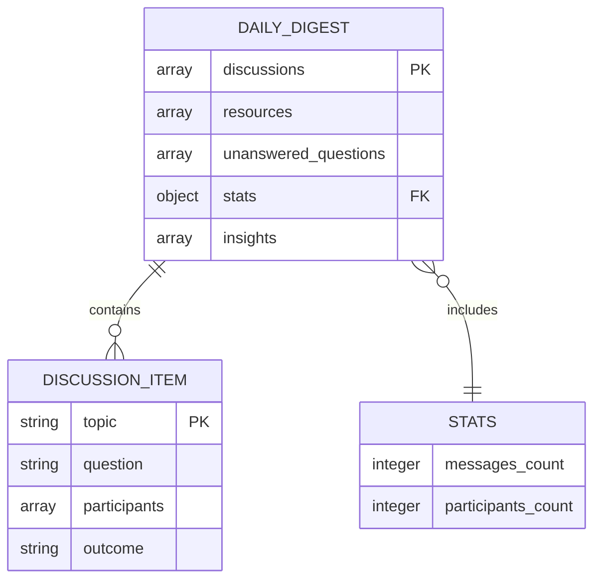
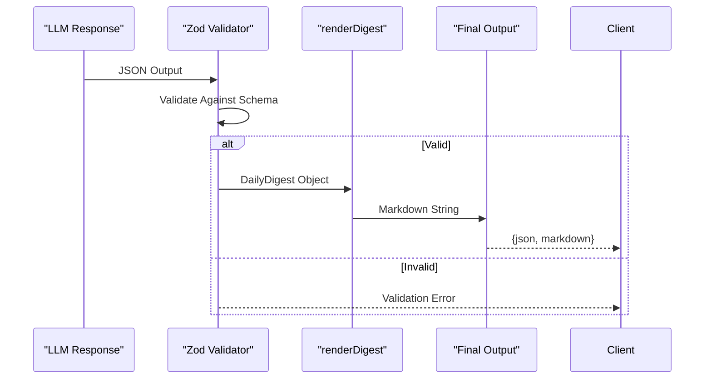

# Markdown Rendering and Output Formatting

<cite>
**Referenced Files in This Document**  
- [digest_render.ts](file://lib/report/digest_render.ts)
- [digest_schema.ts](file://lib/report/digest_schema.ts)
- [report.ts](file://lib/llm/report.ts)
</cite>

## Table of Contents
1. [Introduction](#introduction)  
2. [Core Components](#core-components)  
3. [Rendering Logic and String Construction](#rendering-logic-and-string-construction)  
4. [Conditional Section Inclusion](#conditional-section-inclusion)  
5. [Data Structure and Schema Definition](#data-structure-and-schema-definition)  
6. [Integration with LLM Pipeline](#integration-with-llm-pipeline)  
7. [Design Decisions for Chat Readability](#design-decisions-for-chat-readability)  
8. [Extensibility and Template Customization](#extensibility-and-template-customization)  
9. [Performance Considerations](#performance-considerations)  
10. [Conclusion](#conclusion)

## Introduction

This document details the final stage of the LLM pipeline: transforming a validated `DailyDigest` object into a human-readable, Telegram-optimized Markdown format. The rendering process is handled by the `renderDigest` function, which converts structured JSON data into a compact, visually coherent message suitable for chat consumption. The output includes key discussion summaries, optional insights, and essential statistics, all formatted with emoji indicators and consistent section headers.

The design prioritizes brevity, clarity, and visual hierarchy to ensure readability on mobile devices and within messaging platforms like Telegram. This document explores the implementation logic, integration points, formatting rules, and extensibility options for developers looking to customize or extend the rendering behavior.

## Core Components

The rendering functionality is implemented across two primary files:
- `digest_render.ts`: Contains the `renderDigest` function responsible for string construction.
- `digest_schema.ts`: Defines the `DailyDigest` type and Zod schema used for validation.

These components work in tandem to ensure that only valid, well-structured data is rendered, maintaining consistency and preventing malformed outputs.

**Section sources**
- [digest_render.ts](file://lib/report/digest_render.ts#L2-L32)
- [digest_schema.ts](file://lib/report/digest_schema.ts#L25-L25)

## Rendering Logic and String Construction

The `renderDigest` function constructs the final Markdown string using array-based joining logic. Each section—discussions, insights, and stats—is built independently and then combined into a single output via `join('\n')`.

### Discussion Formatting

Each discussion item is transformed into a multi-line block containing:
- Topic (numbered)
- Question
- Participant list (joined with commas)
- Outcome

The participant list uses JavaScript’s `Array.join(', ')` method to create a readable comma-separated string. This approach ensures consistent formatting regardless of participant count.

**Diagram sources**
- [digest_render.ts](file://lib/report/digest_render.ts#L4-L12)

**Section sources**
- [digest_render.ts](file://lib/report/digest_render.ts#L4-L12)

## Conditional Section Inclusion

The insights section is conditionally included based on whether the `insights` array contains any elements. This prevents empty sections from appearing in the output.

The ternary operator within the template array uses the spread syntax `...(insights ? ['💡 Инсайты', insights, ''] : [])` to dynamically insert the section header, content, and trailing newline only when insights are present.

This pattern avoids conditional string concatenation and keeps the main structure declarative and easy to read.

**Diagram sources**
- [digest_render.ts](file://lib/report/digest_render.ts#L14-L16)

**Section sources**
- [digest_render.ts](file://lib/report/digest_render.ts#L14-L16)

## Data Structure and Schema Definition

The `DailyDigest` type is defined using Zod, providing both runtime validation and TypeScript type inference. The schema enforces required fields such as `discussions`, `stats`, and `resources`, while marking `insights` as optional.

The schema also allows passthrough properties in the `stats` object, enabling flexibility for additional numeric metrics without breaking validation.

**Diagram sources**
- [digest_schema.ts](file://lib/report/digest_schema.ts#L5-L20)

**Section sources**
- [digest_schema.ts](file://lib/report/digest_schema.ts#L5-L20)

## Integration with LLM Pipeline

The `renderDigest` function is invoked immediately after successful JSON validation in the `generateReportFromPreview` workflow. If the LLM-generated JSON passes schema validation via `DailyDigestSchema.safeParse()`, the resulting `DailyDigest` object is passed to `renderDigest` to produce the final Markdown output.

This tight coupling ensures that only semantically correct data reaches the rendering phase, reducing error surface area.

**Diagram sources**
- [report.ts](file://lib/llm/report.ts#L85-L91)

**Section sources**
- [report.ts](file://lib/llm/report.ts#L85-L91)

## Design Decisions for Chat Readability

Several design choices enhance readability in chat environments:

- **Emoji Indicators**: Visual markers (`📊`, `💬`, `💡`, `📈`) provide immediate context recognition.
- **Consistent Headers**: Standardized section titles improve scannability.
- **Brevity Focus**: Minimal whitespace and concise phrasing reduce message length.
- **Numbered Lists**: Ordered presentation of discussions aids navigation.

These decisions align with Telegram's UI constraints, where long messages may be truncated or harder to parse on small screens.

**Section sources**
- [digest_render.ts](file://lib/report/digest_render.ts#L18-L32)

## Extensibility and Template Customization

Developers can customize the rendering template by modifying the `renderDigest` function. To add new sections:
1. Ensure the corresponding field exists in the `DailyDigestSchema`.
2. Add conditional logic similar to the insights section.
3. Use consistent emoji and header formatting.

For localization, string literals should be extracted into a translation layer. Currently, Russian text is hardcoded, but future versions could support locale-specific templates via parameterization or internationalization libraries.

To maintain backward compatibility, optional fields should remain optional in the schema, and rendering logic should gracefully handle missing data.

**Section sources**
- [digest_render.ts](file://lib/report/digest_render.ts#L2-L32)
- [digest_schema.ts](file://lib/report/digest_schema.ts#L1-L66)

## Performance Considerations

Rendering occurs synchronously on every successful digest generation, making performance critical under high load. Key optimizations include:

- **Minimal Computation**: Uses native `Array.map` and `join` operations with O(n) complexity.
- **No External Dependencies**: Pure function with no I/O or async calls.
- **Early Returns**: Short-circuits empty arrays efficiently.
- **Flat Structure**: Avoids deep nesting or recursion.

Given that rendering follows potentially expensive LLM inference and validation steps, keeping this phase lightweight ensures low-latency delivery of digests.

**Section sources**
- [digest_render.ts](file://lib/report/digest_render.ts#L2-L32)

## Conclusion

The `renderDigest` function serves as the final transformation layer in the LLM pipeline, converting validated JSON into a user-friendly Markdown format optimized for Telegram. Its design emphasizes clarity, consistency, and efficiency, ensuring that daily digests are both informative and easy to consume. By leveraging schema-driven validation and modular string construction, the system maintains robustness while allowing for future customization and localization.