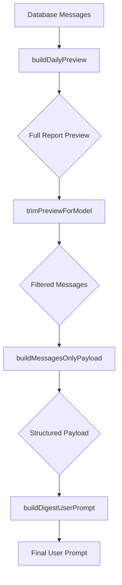
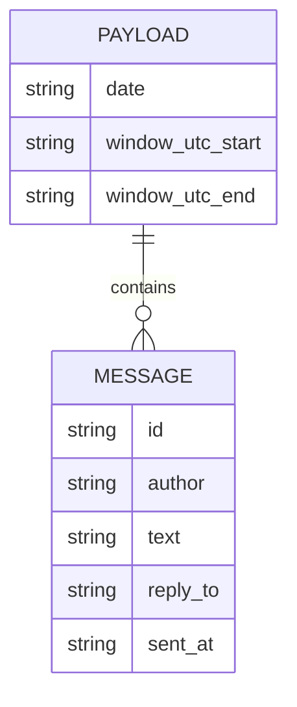
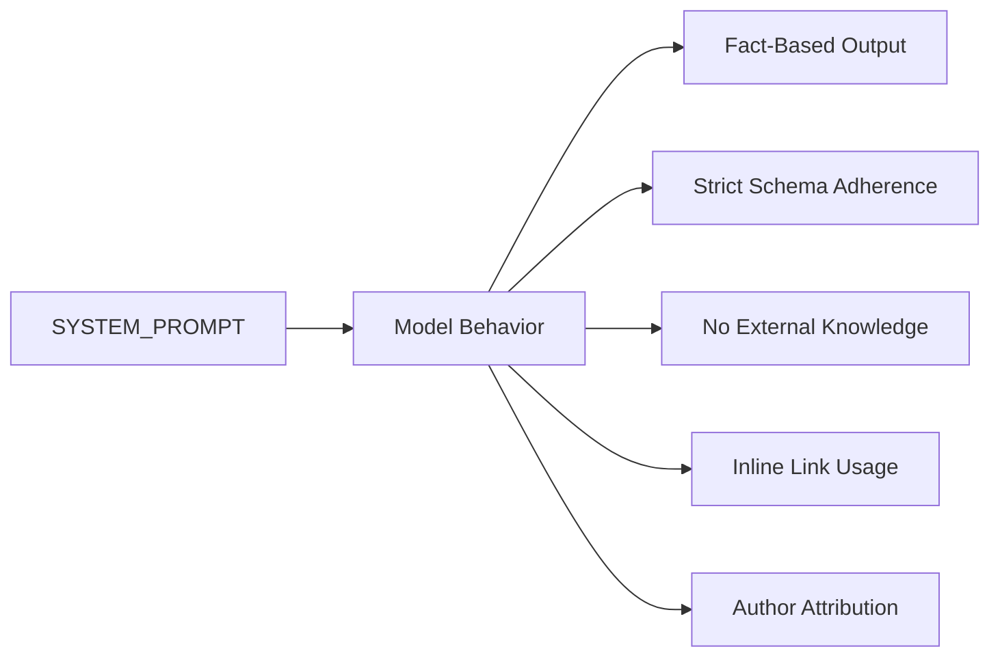
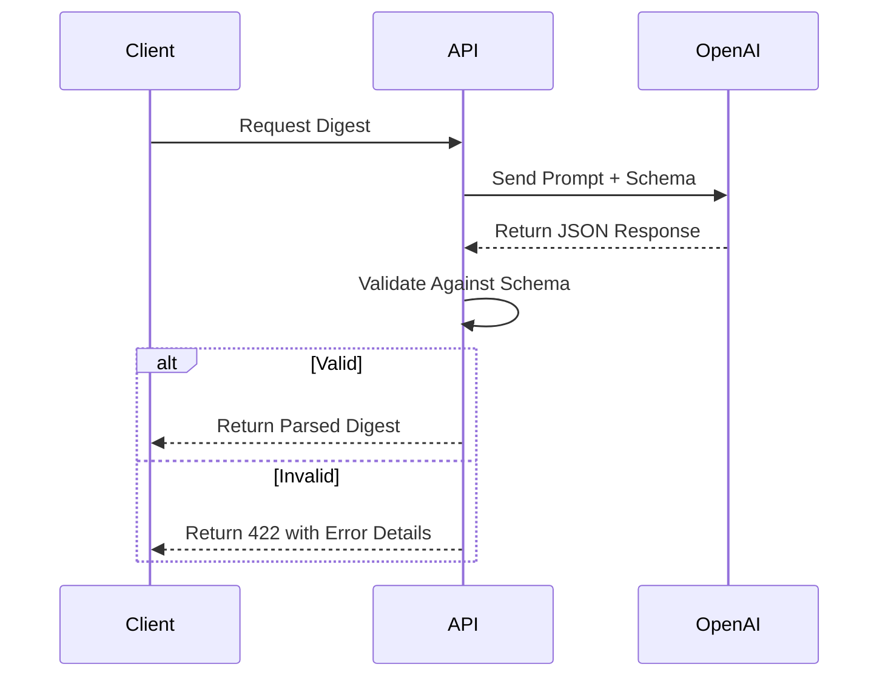

# Prompt Construction

<cite>
**Referenced Files in This Document**   
- [shared.ts](file://lib/llm/shared.ts)
- [slice.ts](file://lib/report/slice.ts)
- [digest_schema.ts](file://lib/report/digest_schema.ts)
- [report.ts](file://lib/llm/report.ts)
</cite>

## Table of Contents
1. [Introduction](#introduction)
2. [Core Components](#core-components)
3. [Prompt Construction Process](#prompt-construction-process)
4. [Payload Structure and Data Injection](#payload-structure-and-data-injection)
5. [System Prompt Role and Guidelines](#system-prompt-role-and-guidelines)
6. [Best Practices for Prompt Engineering](#best-practices-for-prompt-engineering)
7. [Troubleshooting and Validation](#troubleshooting-and-validation)
8. [Localization Considerations](#localization-considerations)

## Introduction

This document details the prompt construction process within the LLM integration pipeline of the dashboard application. It focuses on how structured data from `buildDailyPreview` is transformed into a well-formed user prompt via `buildDigestUserPrompt`, which serves as input to the OpenAI Responses API. The process ensures strict adherence to a predefined JSON schema (DAILY_DIGEST_SCHEMA), enabling reliable parsing and downstream processing. Special attention is given to the role of system instructions, payload formatting, and engineering practices that prevent hallucinations by restricting model access to source data only.

## Core Components

The prompt construction pipeline relies on several key functions and schemas defined across the codebase. The process begins with `buildDailyPreview`, which extracts and structures message data from the database. This preview is then processed by `buildMessagesOnlyPayload` and ultimately formatted into a user-readable prompt by `buildDigestUserPrompt`. The entire flow is governed by validation rules expressed in `DailyDigestSchema` and enforced through the OpenAI Responses API's strict JSON mode.

**Section sources**
- [slice.ts](file://lib/report/slice.ts#L100-L344)
- [shared.ts](file://lib/llm/shared.ts#L65-L77)
- [digest_schema.ts](file://lib/report/digest_schema.ts#L11-L23)

## Prompt Construction Process

The prompt construction process follows a sequential transformation of raw message data into a model-ready instruction set. First, `buildDailyPreview` retrieves comprehensive message statistics and content for a specified date window, filtering and enriching data such as author names, links, and error tokens. This rich preview object contains more information than needed for LLM processing.

To optimize token usage and focus the model’s attention, `trimPreviewForModel` reduces the dataset to only messages with non-empty text, limiting the history to the most recent 400 messages (or 250 if token estimates exceed 18,000). This trimmed data is then passed to `buildMessagesOnlyPayload`, which constructs a minimal JSON structure containing only the date context, time window boundaries in UTC, and essential message fields: ID, author, text, reply-to reference, and timestamp.

Finally, `buildDigestUserPrompt` formats this payload into a multi-line string prompt. It begins with human-readable metadata about the report date and time window, followed by the serialized JSON payload enclosed in Markdown-style code blocks. The prompt concludes with explicit instructions requiring the model to return exactly one JSON object conforming to DAILY_DIGEST_SCHEMA, using only facts present in the input messages.

**Diagram sources**
- [slice.ts](file://lib/report/slice.ts#L100-L344)
- [shared.ts](file://lib/llm/shared.ts#L31-L77)

**Section sources**
- [shared.ts](file://lib/llm/shared.ts#L31-L77)
- [slice.ts](file://lib/report/slice.ts#L100-L344)

## Payload Structure and Data Injection

The injected JSON payload generated by `buildMessagesOnlyPayload` has a precise structure designed for clarity and consistency. It includes three top-level fields: `date`, `window_utc`, and `messages`. The `date` field provides the report date in ISO format, while `window_utc` is an array of two timestamps indicating the start and end of the analysis period in UTC. This temporal context ensures the model understands the scope of the data it is analyzing.

The `messages` array contains cleaned message objects, each including the message ID, formatted author identifier (prioritizing username or full name when available), original text, optional reply-to reference, and ISO-formatted timestamp. By stripping away non-essential metadata, the payload minimizes noise and focuses the model on linguistic content and conversational patterns.

This structured injection allows the LLM to correlate events over time, identify participants in discussions, and extract outcomes based solely on message content. The use of consistent field names and predictable types enables robust schema validation after model output.

**Diagram sources**
- [shared.ts](file://lib/llm/shared.ts#L47-L63)
- [digest_schema.ts](file://lib/report/digest_schema.ts#L11-L23)

## System Prompt Role and Guidelines

The `SYSTEM_PROMPT` constant plays a critical role in guiding model behavior and ensuring output consistency. Written in Russian, it defines the model’s persona as a daily digest editor whose sole input is a list of messages with authors and replies. The prompt explicitly instructs the model to produce structured JSON according to DAILY_DIGEST_SCHEMA, maximizing utility for readers of the morning digest.

Key requirements include extracting key discussions with topics, questions, participants (using @username or full names), and concrete outcomes—preferably with inline links from the messages. The prompt mandates empty arrays for `resources` and `unanswered_questions`, directing all link references to appear within discussion outcomes. Statistical fields like `messages_count` and `participants_count` must be derived directly from the input data.

Crucially, the system prompt enforces factual fidelity: the model must use only information present in the input messages, avoiding external knowledge or speculation. Author attribution must reflect actual message authors, and links must originate from message text. These constraints minimize hallucinations and ensure auditability of the generated digest.

**Diagram sources**
- [shared.ts](file://lib/llm/shared.ts#L3-L21)

**Section sources**
- [shared.ts](file://lib/llm/shared.ts#L3-L29)

## Best Practices for Prompt Engineering

Effective prompt engineering in this pipeline emphasizes clarity, precision, and constraint enforcement. The dual-prompt strategy separates concerns: `SYSTEM_PROMPT` governs structural and behavioral rules, while the user prompt (`buildDigestUserPrompt`) delivers contextual data and task-specific directives. This separation enhances maintainability and allows independent tuning of style versus content.

Precision is achieved through explicit formatting instructions ("return exactly one JSON object"), field-specific guidance ("participants: use @username or «Имя Фамилия (@username)»"), and outcome expectations ("concrete result, not just 'open'"). Temporal context (date and UTC window) anchors the model’s understanding of event sequencing.

To prevent hallucinations, the pipeline strictly limits the model’s source data to the provided message subset. No supplementary knowledge bases or historical context beyond the filtered messages are exposed. Token estimation via `estimateTokensForGeneration` helps avoid truncation-related data loss by dynamically adjusting message history length.

Additionally, the use of OpenAI’s Responses API with strict JSON schema mode ensures syntactic validity before any application-level processing occurs, reducing error surface area.

**Section sources**
- [shared.ts](file://lib/llm/shared.ts#L79-L105)
- [digest_schema.ts](file://lib/report/digest_schema.ts#L45-L66)

## Troubleshooting and Validation

Common issues in prompt construction typically stem from malformed JSON payloads or schema violations in model output. When debugging, verify that the input messages contain properly escaped strings and valid UTF-8 encoding, as unescaped quotes or control characters can break JSON serialization.

The application validates model responses using Zod via `DailyDigestSchema.safeParse()`. If validation fails, detailed error messages indicate which path and rule were violated (e.g., "discussions.0.participants: expected array of strings"). Developers should inspect both the request ID and the raw model output snippet to diagnose whether the issue originated from incorrect prompting or model deviation.

Rate limiting, authentication errors, or network timeouts may also interrupt the pipeline. Monitoring tools should capture OpenAI request IDs for traceability. Scripts like `smoke-openai.mjs` and `smoke-digest.mjs` provide lightweight validation of API connectivity and schema compliance, useful for deployment verification.

**Diagram sources**
- [report.ts](file://lib/llm/report.ts#L60-L96)
- [digest_schema.ts](file://lib/report/digest_schema.ts#L45-L66)

**Section sources**
- [report.ts](file://lib/llm/report.ts#L60-L96)
- [digest_schema.ts](