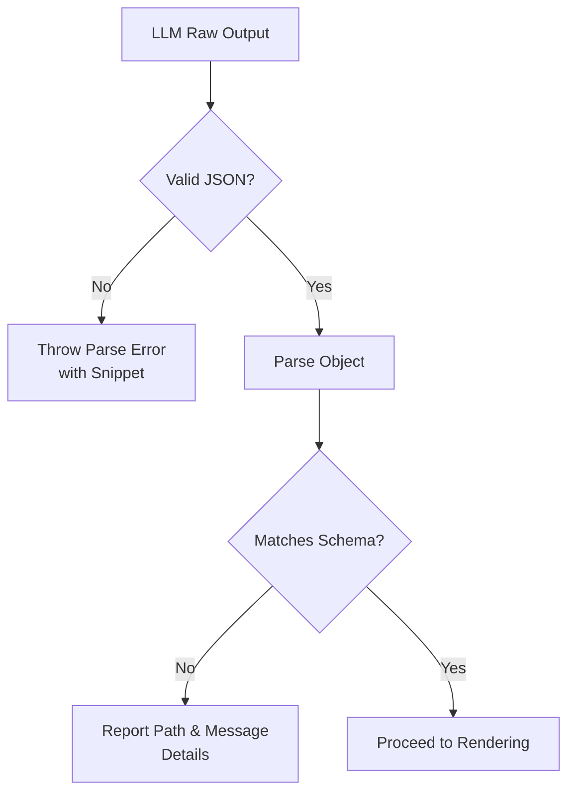

# Response Parsing and Schema Validation

<cite>
**Referenced Files in This Document**   
- [report.ts](file://lib/llm/report.ts)
- [digest_schema.ts](file://lib/report/digest_schema.ts)
- [schema.ts](file://lib/report/schema.ts)
- [digest_render.ts](file://lib/report/digest_render.ts)
- [shared.ts](file://lib/llm/shared.ts)
- [route.ts](file://app/api/report/generate/route.ts)
</cite>

## Table of Contents
1. [Introduction](#introduction)
2. [Two-Step Validation Process](#two-step-validation-process)
3. [JSON Parsing: First Line of Defense](#json-parsing-first-line-of-defense)
4. [Schema Validation with Zod](#schema-validation-with-zod)
5. [Complementary Schemas: DailyDigestJsonSchemaForLLM vs DailyDigestSchema](#complementary-schemas-dailydigestjsonschemaforllm-vs-dailydigestschema)
6. [Error Reporting and Debugging](#error-reporting-and-debugging)
7. [Error Recovery and Logging Practices](#error-recovery-and-logging-practices)
8. [Common Issues and Mitigation Strategies](#common-issues-and-mitigation-strategies)
9. [Conclusion](#conclusion)

## Introduction
The LLM pipeline in this application relies on a robust response validation mechanism to ensure data integrity between the model output and downstream processing. This document details the two-step validation process used when generating structured reports from large language models, focusing on how raw JSON responses are parsed and validated against strict schemas before being rendered into user-facing content.

**Section sources**
- [report.ts](file://lib/llm/report.ts#L16-L96)
- [digest_schema.ts](file://lib/report/digest_schema.ts#L11-L63)

## Two-Step Validation Process
The system employs a dual-layer validation strategy for all LLM-generated JSON outputs:
1. **Raw JSON parsing** – Ensuring syntactic correctness of the model's output
2. **Runtime schema validation** – Confirming semantic and structural compliance using Zod

This layered approach ensures that only valid, well-formed data proceeds to rendering or API responses.



**Diagram sources**
- [report.ts](file://lib/llm/report.ts#L65-L75)
- [report.ts](file://lib/llm/report.ts#L85-L88)

## JSON Parsing: First Line of Defense
Before any schema validation occurs, the raw string output from the OpenAI Responses API is subjected to `JSON.parse()`. This step catches syntax errors such as malformed quotes, unescaped characters, or incomplete structures—common issues when dealing with free-form text generation.

When parsing fails, the system captures a contextual snippet (first 400 characters) of the invalid output to aid debugging:

```mermaid
flowchart LR
Input[String Output] --> TryParse[try JSON.parse()]
TryParse --> Success[Parsed Object]
TryParse --> Failure[Catch SyntaxError]
Failure --> ExtractSnippet[Extract First 400 Chars]
Failure --> ConstructError[Build Error with Snippet]
ConstructError --> ThrowError
```

**Diagram sources**
- [report.ts](file://lib/llm/report.ts#L65-L75)

**Section sources**
- [report.ts](file://lib/llm/report.ts#L65-L75)

## Schema Validation with Zod
After successful JSON parsing, the resulting object undergoes runtime type checking via `DailyDigestSchema.safeParse()`, which uses Zod for validation. This step verifies:
- Required fields exist
- Data types match expectations (e.g., numbers vs strings)
- Arrays contain correct element types
- Optional fields conform if present

If validation fails, detailed issue information—including path and message—is extracted and formatted into a human-readable error string.

```mermaid
flowchart TD
ParsedObj[Parsed JSON Object] --> Validate[DailyDigestSchema.safeParse()]
Validate --> |Success| ValidData[Return .data]
Validate --> |Failure| Issues[Access .error.issues]
Issues --> Format[Join path + message]
Format --> CreateError[New Error with Details]
CreateError --> Throw422[Throw 422 with requestId]
```

**Diagram sources**
- [report.ts](file://lib/llm/report.ts#L85-L88)
- [digest_schema.ts](file://lib/report/digest_schema.ts#L11-L23)

**Section sources**
- [report.ts](file://lib/llm/report.ts#L85-L88)
- [digest_schema.ts](file://lib/report/digest_schema.ts#L11-L23)

## Complementary Schemas: DailyDigestJsonSchemaForLLM vs DailyDigestSchema
Two distinct but related schemas play critical roles at different stages:

### DailyDigestJsonSchemaForLLM
Used during the **API request phase**, this schema is passed directly to the OpenAI Responses API in strict mode. It enforces:
- All top-level properties listed in `required`, even optional ones
- No additional properties allowed (`additionalProperties: false`)
- Explicit field definitions compatible with JSON Schema standard

Its purpose is to guide the LLM toward producing correctly structured output from the start.

### DailyDigestSchema
Used during **runtime validation**, this Zod-based schema:
- Allows passthrough of extra numeric fields in `stats`
- Correctly marks `insights` as optional
- Provides precise TypeScript typing via `z.infer<>`

It acts as the final gatekeeper, ensuring runtime safety regardless of upstream behavior.

```mermaid
classDiagram
class DailyDigestJsonSchemaForLLM {
+type : "object"
+required : string[]
+properties : object
+additionalProperties : false
}
class DailyDigestSchema {
+discussions : z.array(DiscussionItemSchema)
+resources : z.array(z.string())
+unanswered_questions : z.array(z.string())
+stats : z.object({...}).passthrough()
+insights : z.array(z.string()).optional()
}
DailyDigestJsonSchemaForLLM --> "Guides" OpenAI
OpenAI --> "Produces" RawOutput
RawOutput --> "Parsed by" JSON.parse
JSON.parse --> "Validated by" DailyDigestSchema
```

**Diagram sources**
- [digest_schema.ts](file://lib/report/digest_schema.ts#L11-L23)
- [digest_schema.ts](file://lib/report/digest_schema.ts#L29-L63)

**Section sources**
- [digest_schema.ts](file://lib/report/digest_schema.ts#L11-L63)

## Error Reporting and Debugging
Errors are categorized and reported with actionable context:

### JSON Parse Errors
- **Cause**: Invalid syntax in model output
- **Message Format**: `invalid_json_from_model: <parse_error> | snippet: <first_400_chars>`
- **Status Code**: 422 Unprocessable Entity
- **Debug Value**: The snippet helps identify truncation, escaping, or formatting issues

### Schema Validation Errors
- **Cause**: Type mismatch, missing required fields, unexpected nulls
- **Message Format**: `json_schema_validation_failed: path.to.field: expected number, got string; ...`
- **Status Code**: 422 Unprocessable Entity
- **Precision**: Each issue includes exact path and descriptive message

Both error types preserve the `requestId` for traceability across logs and monitoring systems.

**Section sources**
- [report.ts](file://lib/llm/report.ts#L70-L75)
- [report.ts](file://lib/llm/report.ts#L87-L88)
- [route.ts](file://app/api/report/generate/route.ts#L35-L36)

## Error Recovery and Logging Practices
The system implements resilient error handling with full observability:

### Request ID Propagation
Every error carries a `requestId` extracted from the OpenAI SDK response, enabling end-to-end tracing:
- Captured from `_request_id` in SDK response
- Attached to thrown errors
- Logged and returned in API responses (when safe)

This allows correlating frontend requests with backend LLM calls and logs.

### Structured Logging
All validation failures are logged with structured metadata:
```json
{
  "message": "report_generate_error",
  "details": {
    "requestId": "req_abc123",
    "error": "json_schema_validation_failed: stats.messages_count: expected integer, got string"
  }
}
```

### Graceful API Responses
The API route translates internal errors into appropriate HTTP responses:
- 422 for validation issues
- 504 for timeouts
- 503 for missing credentials
All include `request_id` where available for client-side diagnostics.

**Section sources**
- [report.ts](file://lib/llm/report.ts#L60-L64)
- [report.ts](file://lib/llm/report.ts#L74-L75)
- [route.ts](file://app/api/report/generate/route.ts#L35-L36)

## Common Issues and Mitigation Strategies
Developers extending the schema should anticipate these common pitfalls:

### Missing Fields
Even optional fields must be declared in `required` array for `DailyDigestJsonSchemaForLLM`. Omission can lead to LLM omitting them entirely.

**Mitigation**: Always update both `required` and property definition when adding new fields.

### Type Mismatches
LLMs may return strings instead of numbers, especially under load or with ambiguous prompts.

**Mitigation**: Use `.transform()` in Zod schema to coerce types safely when appropriate.

### Unexpected Nulls
Some models emit `null` values for empty arrays or missing data.

**Mitigation**: Define defaults using `.default([])` in Zod schema to normalize inputs.

### Schema Drift
Divergence between `DailyDigestJsonSchemaForLLM` and `DailyDigestSchema` can cause silent failures.

**Mitigation**: Maintain both schemas in same file and add comments linking them. Consider automated tests that validate sample payloads against both.

**Section sources**
- [digest_schema.ts](file://lib/report/digest_schema.ts#L11-L63)
- [report.ts](file://lib/llm/report.ts#L85-L88)

## Conclusion
The two-step validation process—parsing followed by schema checking—ensures robust handling of LLM outputs in this pipeline. By combining syntactic validation with semantic type checking, and leveraging complementary schemas for API guidance and runtime safety, the system achieves high reliability in production. Proper error reporting, requestId propagation, and structured logging enable effective debugging and monitoring, making it easier to maintain data integrity as the application evolves.