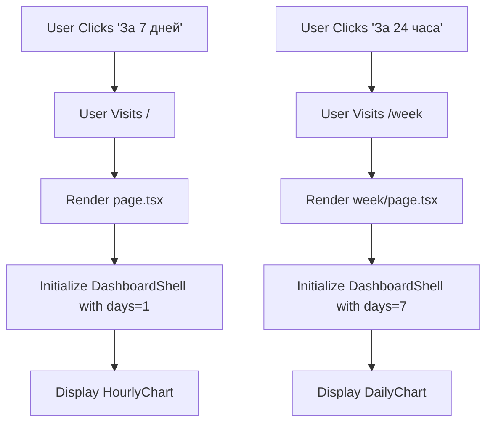
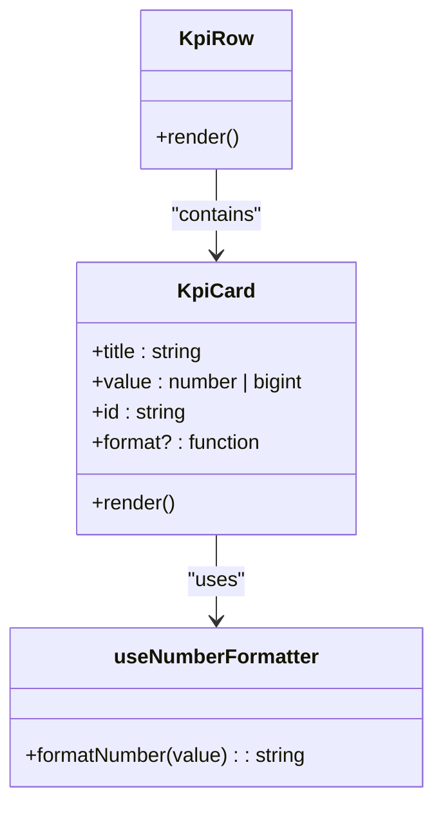
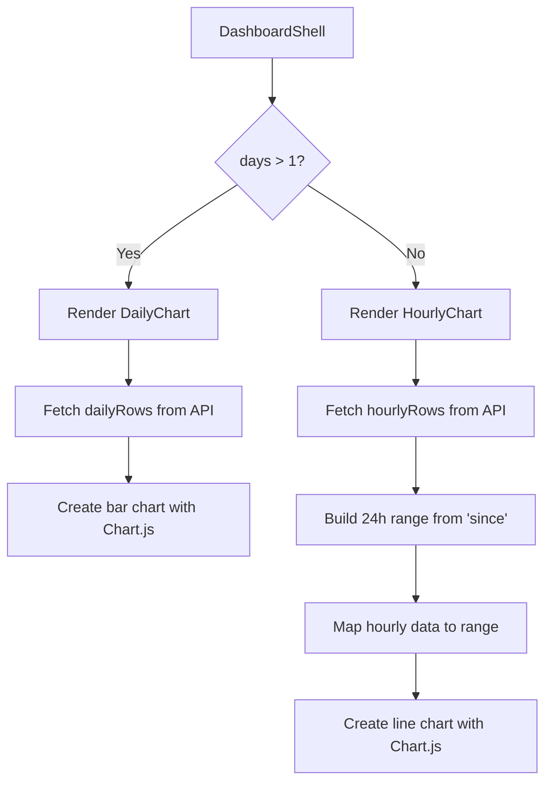
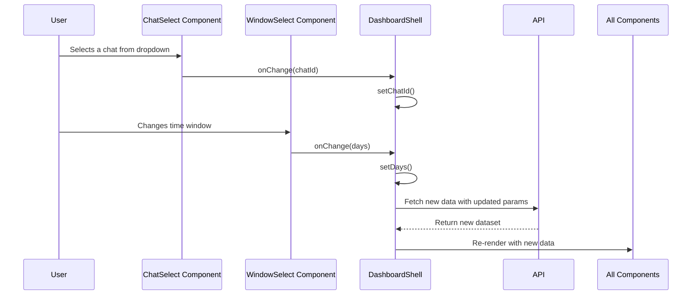

<cite>
**Referenced Files in This Document**   
- [KpiCard.tsx](file://app/components/atoms/KpiCard.tsx)
- [KpiRow.tsx](file://app/components/atoms/KpiRow.tsx)
- [HourlyChart.tsx](file://app/components/charts/HourlyChart.tsx)
- [DailyChart.tsx](file://app/components/charts/DailyChart.tsx)
- [ChatSelect.tsx](file://app/components/filters/ChatSelect.tsx)
- [WindowSelect.tsx](file://app/components/filters/WindowSelect.tsx)
- [DashboardShell.tsx](file://app/components/DashboardShell.tsx)
- [UnansweredTable.tsx](file://app/components/tables/UnansweredTable.tsx)
- [TopErrorsTable.tsx](file://app/components/tables/TopErrorsTable.tsx)
- [ForwardedFromTable.tsx](file://app/components/tables/ForwardedFromTable.tsx)
- [HashtagsTable.tsx](file://app/components/tables/HashtagsTable.tsx)
- [page.tsx](file://app/page.tsx)
- [week/page.tsx](file://app/week/page.tsx)
</cite>

## Table of Contents
1. [Introduction](#introduction)
2. [Time-Windowed Analytics and Navigation](#time-windowed-analytics-and-navigation)
3. [Core KPI Tracking System](#core-kpi-tracking-system)
4. [Temporal Activity Visualization](#temporal-activity-visualization)
5. [Entity Ranking and Content Analysis Tables](#entity-ranking-and-content-analysis-tables)
6. [Filtering and Data Control Interface](#filtering-and-data-control-interface)
7. [Data Flow and Real-Time Updates](#data-flow-and-real-time-updates)

## Introduction

The Telegram Vibecoders Dashboard is a comprehensive analytics platform designed to provide deep insights into chat activity, user engagement, and content trends. Built with Next.js and React, the dashboard offers a rich, interactive interface for monitoring key performance indicators (KPIs), analyzing temporal patterns, and inspecting specific message artifacts. This document details the core analytical features of the dashboard, focusing on its time-windowed views, real-time metric updates, filtering capabilities, and specialized data visualization components. The system enables users to switch between 24-hour and 7-day perspectives, select specific chats, and explore detailed rankings of users, links, words, threads, and other entities.

**Section sources**
- [page.tsx](file://app/page.tsx)
- [week/page.tsx](file://app/week/page.tsx)

## Time-Windowed Analytics and Navigation

The dashboard provides two primary temporal views: a default 24-hour window and an extended 7-day view. These are accessible via distinct routes: the root `/` path for the 24-hour view and `/week` for the 7-day view. Each route renders a nearly identical interface but initializes the `DashboardShell` component with different time parameters (`days=1` vs `days=7`). The navigation between these views is facilitated by prominent buttons in the page headers, allowing users to seamlessly switch contexts. The 24-hour view emphasizes hourly activity patterns using the `HourlyChart`, while the 7-day view aggregates data into daily summaries with the `DailyChart`. This dual-view architecture allows for both granular, real-time monitoring and broader trend analysis over a week-long period.

**Diagram sources**
- [page.tsx](file://app/page.tsx)
- [week/page.tsx](file://app/week/page.tsx)

**Section sources**
- [page.tsx](file://app/page.tsx#L0-L23)
- [week/page.tsx](file://app/week/page.tsx#L0-L20)

## Core KPI Tracking System

The dashboard's central metrics are displayed through a combination of the `KpiRow` and `KpiCard` components. The `KpiRow` acts as a container that organizes five individual `KpiCard` elements into a responsive grid layout. Each `KpiCard` presents a single Key Performance Indicator with a title and a formatted value. The tracked KPIs include:
- **Total Messages**: The overall count of messages in the selected time window.
- **Unique Users**: The number of distinct participants in the conversation.
- **Average per User**: The mean number of messages sent by each user.
- **Replies**: The total number of reply interactions.
- **Messages with Links**: The count of messages containing URLs.

These values are dynamically updated based on the current filter state. The `KpiCard` component uses the `useNumberFormatter` hook to ensure consistent and localized number formatting, enhancing readability. Some cards, like "Average per User," apply custom formatting functions to display decimal precision.

**Diagram sources**
- [KpiRow.tsx](file://app/components/atoms/KpiRow.tsx#L14-L29)
- [KpiCard.tsx](file://app/components/atoms/KpiCard.tsx#L11-L20)
- [useNumberFormatter.ts](file://app/hooks/useNumberFormatter.ts#L2-L9)

**Section sources**
- [KpiRow.tsx](file://app/components/atoms/KpiRow.tsx#L14-L29)
- [KpiCard.tsx](file://app/components/atoms/KpiCard.tsx#L11-L20)

## Temporal Activity Visualization

To illustrate activity patterns over time, the dashboard employs two specialized chart components: `HourlyChart` and `DailyChart`. The choice between them is determined by the selected time window. For the 24-hour view, the `HourlyChart` renders a line graph showing message volume per hour. It uses the Chart.js library to create a smooth, filled line chart with a tension effect, providing a clear visual representation of peaks and troughs in activity throughout the day. For the 7-day view, the `DailyChart` displays a bar chart that aggregates message counts on a per-day basis, making it easier to compare activity levels across multiple days. Both charts are responsive and leverage the `useTimeFormatting` hook to properly localize date and time labels according to the user's locale.

**Diagram sources**
- [DashboardShell.tsx](file://app/components/DashboardShell.tsx#L22-L99)
- [DailyChart.tsx](file://app/components/charts/DailyChart.tsx#L12-L42)
- [HourlyChart.tsx](file://app/components/charts/HourlyChart.tsx#L14-L64)

**Section sources**
- [DailyChart.tsx](file://app/components/charts/DailyChart.tsx#L12-L42)
- [HourlyChart.tsx](file://app/components/charts/HourlyChart.tsx#L14-L64)

## Entity Ranking and Content Analysis Tables

The dashboard includes a suite of specialized tables for deep content inspection and entity ranking. These tables present ranked lists of various message attributes:

- **Top Users**: `TopHelpersTable` ranks users by their contribution level.
- **Top Links**: `TopLinksTable` identifies the most frequently shared URLs.
- **Top Words**: `TopWordsTable` highlights the most common words used in messages.
- **Top Threads**: `TopThreadsTable` shows the most active conversation threads.
- **Hashtags**: `HashtagsTable` tracks the popularity of hashtags.
- **Mentions**: `MentionsTable` records the frequency of user mentions.

Additionally, the dashboard features diagnostic tables:
- **Unanswered Questions**: `UnansweredTable` lists questions that have not received a reply within 12 hours, with expandable rows to view the full message text.
- **Top Errors**: `TopErrorsTable` monitors recurring error tokens, which can be crucial for debugging bot or system issues.
- **Forwarded Content**: `ForwardedFromTable` analyzes the sources of forwarded messages, revealing external channels that influence the chat.

All these tables share a common design pattern: they accept a `rows` prop, conditionally render based on data availability, and use the `useNumberFormatter` hook for consistent number formatting. They are organized in a flexible grid layout within the `DashboardShell`.

**Section sources**
- [UnansweredTable.tsx](file://app/components/tables/UnansweredTable.tsx#L8-L32)
- [TopErrorsTable.tsx](file://app/components/tables/TopErrorsTable.tsx#L7-L23)
- [ForwardedFromTable.tsx](file://app/components/tables/ForwardedFromTable.tsx#L7-L37)
- [HashtagsTable.tsx](file://app/components/tables/HashtagsTable.tsx#L7-L23)

## Filtering and Data Control Interface

User interaction with the dashboard is centered around two key filtering components: `ChatSelect` and `WindowSelect`. The `ChatSelect` component is a dropdown menu that allows users to filter the analytics data by a specific chat. It is populated with a list of available chats retrieved from the API, displaying each chat's title and ID. Selecting a chat triggers a re-fetch of all data, scoped to that chat. The `WindowSelect` component provides a simple toggle between the 24-hour ("24 часа") and 7-day ("7 дней") time windows. Changing this selection also triggers a complete data refresh. These two controls are rendered side-by-side at the top of the dashboard, forming the primary interface for data manipulation. Their state is managed within the `DashboardShell` component using React hooks (`useState`), ensuring that changes are propagated to all dependent components.

**Diagram sources**
- [ChatSelect.tsx](file://app/components/filters/ChatSelect.tsx#L10-L29)
- [WindowSelect.tsx](file://app/components/filters/WindowSelect.tsx#L7-L21)
- [DashboardShell.tsx](file://app/components/DashboardShell.tsx#L22-L99)

**Section sources**
- [ChatSelect.tsx](file://app/components/filters/ChatSelect.tsx#L10-L29)
- [WindowSelect.tsx](file://app/components/filters/WindowSelect.tsx#L7-L21)

## Data Flow and Real-Time Updates

The entire dashboard is driven by the `DashboardShell`