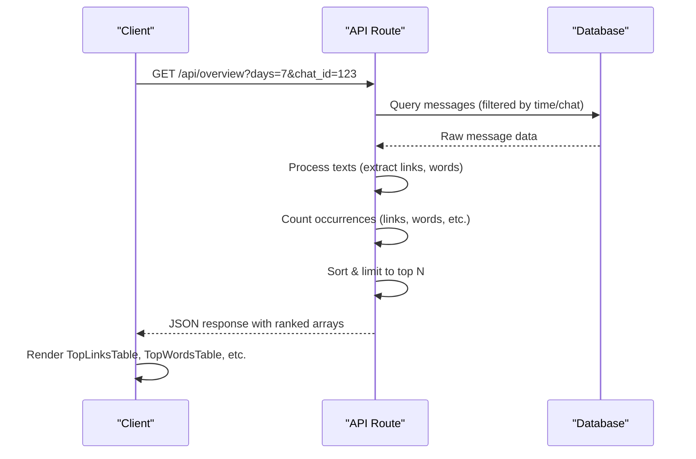

# Entity Rankings

<cite>
**Referenced Files in This Document**   
- [TopLinksTable.tsx](file://app/components/tables/TopLinksTable.tsx)
- [TopWordsTable.tsx](file://app/components/tables/TopWordsTable.tsx)
- [TopThreadsTable.tsx](file://app/components/tables/TopThreadsTable.tsx)
- [TopHelpersTable.tsx](file://app/components/tables/TopHelpersTable.tsx)
- [route.ts](file://app/api/overview/route.ts)
- [slice.ts](file://lib/report/slice.ts)
- [schema.ts](file://lib/report/schema.ts)
</cite>

## Table of Contents
1. [Introduction](#introduction)
2. [Core Ranking Tables](#core-ranking-tables)
3. [Data Flow and Backend Processing](#data-flow-and-backend-processing)
4. [Shared Patterns and Consistency](#shared-patterns-and-consistency)
5. [Field Mappings and Data Structures](#field-mappings-and-data-structures)
6. [Extensibility and Enhancement Guidance](#extensibility-and-enhancement-guidance)
7. [Potential Issues and Mitigations](#potential-issues-and-mitigations)

## Introduction

The entity ranking system provides insights into the most active and influential elements within the chat ecosystem. It identifies top-performing users, links, words, threads, and other entities through backend aggregation and presents them via dedicated table components. These tables enable quick analysis of viral content, key contributors, and trending topics across configurable time windows and chat selections.

The system follows a consistent pattern: backend endpoints aggregate message data, compute rankings by count, limit results to top N entries, and serve sorted arrays to frontend table components that render them in a uniform paginated format.

## Core Ranking Tables

The dashboard features several specialized table components for displaying ranked entities, each following a shared design and rendering pattern.

### Top Links Table

Displays the most frequently shared URLs within the selected time window and chat context. Each entry shows the full URL as a clickable link and its occurrence count.

**Section sources**
- [TopLinksTable.tsx](file://app/components/tables/TopLinksTable.tsx#L8-L29)

### Top Words Table

Renders the most commonly used words (excluding stopwords) from message texts. The table shows each word alongside its frequency count, providing insight into trending vocabulary and discussion themes.

**Section sources**
- [TopWordsTable.tsx](file://app/components/tables/TopWordsTable.tsx#L6-L22)

### Top Threads Table

Shows conversation threads with the highest number of replies. Each row displays the thread's root message ID, reply count, and a text preview of the original message, helping identify the most engaged discussions.

**Section sources**
- [TopThreadsTable.tsx](file://app/components/tables/TopThreadsTable.tsx#L6-L22)

### Top Helpers Table

Ranks users who contribute answers in others' threads (not their own). This metric identifies community helpers and knowledge sharers by counting cross-thread responses attributed to each user.

**Section sources**
- [TopHelpersTable.tsx](file://app/components/tables/TopHelpersTable.tsx#L6-L22)

## Data Flow and Backend Processing

Rankings are generated server-side through SQL queries and in-memory processing of message data, ensuring efficient computation and consistent results.



**Diagram sources**
- [route.ts](file://app/api/overview/route.ts#L280-L292)
- [slice.ts](file://lib/report/slice.ts#L279-L308)

## Shared Patterns and Consistency

All ranking tables follow identical structural and behavioral patterns to ensure UI consistency and maintainability.

### Common Rendering Pattern

Each table component:
- Accepts a `rows` prop with optional array type
- Returns null if no data is present
- Uses consistent styling (panel, max height, overflow behavior)
- Formats counts using `useNumberFormatter`
- Maps over rows with index-based keys
- Renders within semantic HTML table structure

### Limit Enforcement

The backend enforces strict limits on returned results:
- Top 10–15 entries for most entities
- Configurable via `.slice(0, N)` in processing logic
- Prevents performance degradation from large datasets

### Sorting Logic

All rankings use descending order by count:
- Primary sort: `cnt` field (highest first)
- Achieved via `.sort((a, b) => b[1] - a[1])` for map entries
- Ensures most significant entities appear at the top

### Global Filter Integration

Tables respond to two primary filters:
- **Chat Selection**: Filters data to specific Telegram chat
- **Time Window**: Restricts analysis to recent days (1–30)

These filters are applied at the SQL query level before any ranking computation.

**Section sources**
- [route.ts](file://app/api/overview/route.ts#L280-L292)
- [slice.ts](file://lib/report/slice.ts#L213-L242)

## Field Mappings and Data Structures

The API response structure defines the shape of data consumed by ranking tables, with clear mappings between backend fields and UI display.

### API Response Structure

```json
{
  "topLinks": [{ "url": "string", "cnt": "number" }],
  "topWords": [{ "word": "string", "cnt": "number" }],
  "topThreads": [{ "root_id": "string", "replies": "number", "root_preview": "string" }],
  "topHelpers": [{ "user": "string", "cnt": "number" }]
}
```

### Component Prop Interfaces

| Component | Props Interface | Fields |
|---------|----------------|--------|
| `TopLinksTable` | `TopLinksTableProps` | `url`, `cnt` |
| `TopWordsTable` | `TopWordsTableProps` | `word`, `cnt` |
| `TopThreadsTable` | `TopThreadsTableProps` | `root_id`, `replies`, `root_preview` |
| `TopHelpersTable` | `TopHelpersTableProps` | `user`, `cnt` |

**Section sources**
- [TopLinksTable.tsx](file://app/components/tables/TopLinksTable.tsx#L4-L6)
- [TopWordsTable.tsx](file://app/components/tables/TopWordsTable.tsx#L4-L4)
- [TopThreadsTable.tsx](file://app/components/tables/TopThreadsTable.tsx#L4-L4)
- [TopHelpersTable.tsx](file://app/components/tables/TopHelpersTable.tsx#L4-L4)

## Extensibility and Enhancement Guidance

The ranking table system can be extended with additional interactive features while maintaining consistency.

### Sorting Headers

To add sortable headers:
1. Introduce state for sort column and direction
2. Implement click handlers on `<th>` elements
3. Re-sort rows before rendering
4. Add visual indicators (arrows) for active sort

### Tooltips and Hover Details

Enhance data visibility with:
- Truncated text tooltips showing full content
- URL domain extraction for cleaner display
- User profile popovers on hover
- Thread context previews

### Additional Ranking Types

New entity types can be added by:
1. Creating new backend aggregation logic
2. Defining corresponding Zod schema in `schema.ts`
3. Building a new table component with matching props
4. Integrating into the main API response

## Potential Issues and Mitigations

Several edge cases require consideration when working with entity rankings.

### Truncated Text Handling

Long URLs or message previews may overflow table cells:
- Solution