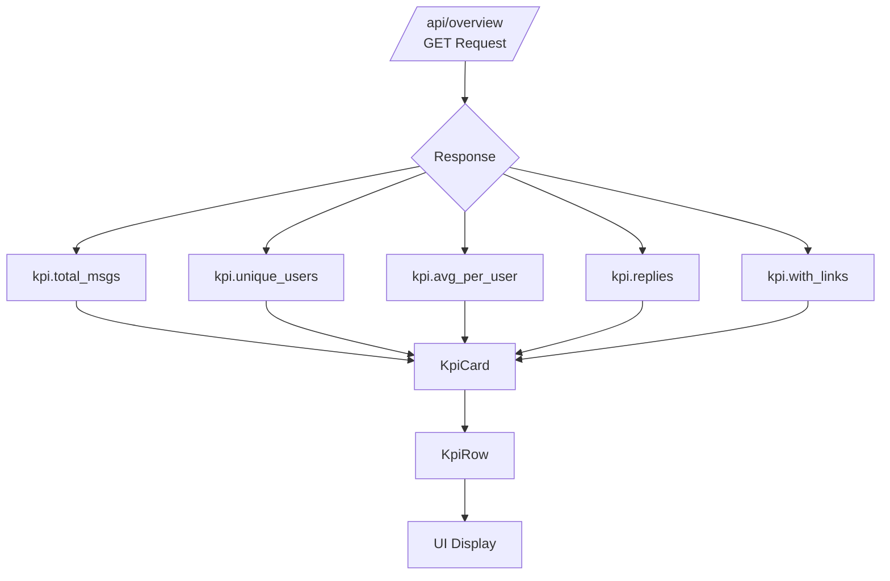
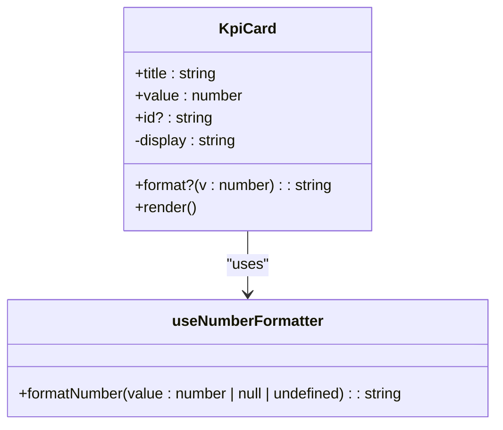
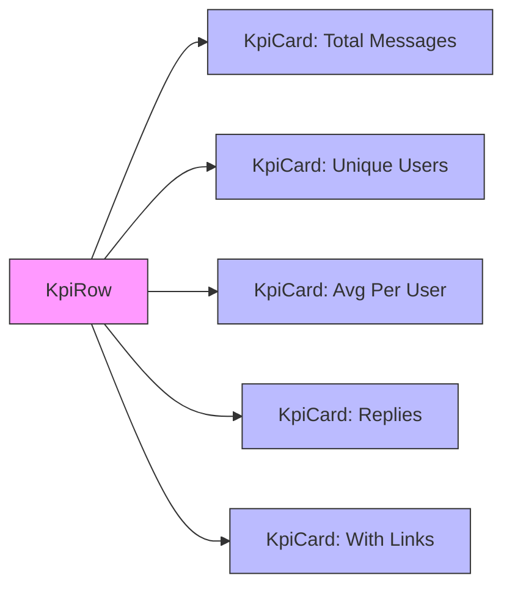
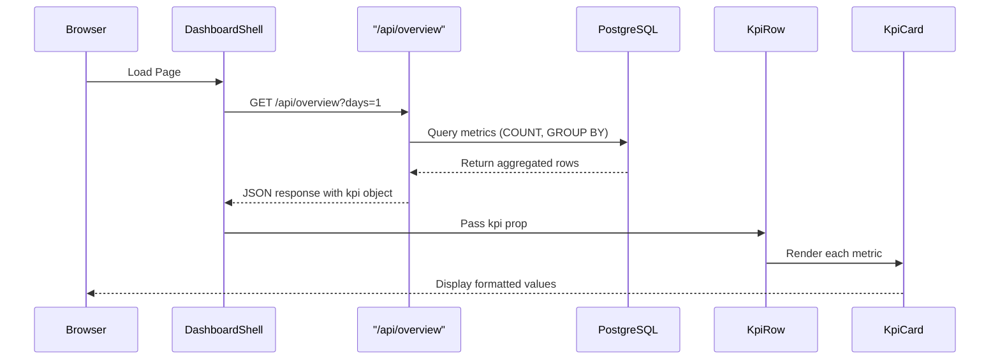

# KPI Metrics

<cite>
**Referenced Files in This Document**   
- [KpiCard.tsx](file://app/components/atoms/KpiCard.tsx)
- [KpiRow.tsx](file://app/components/atoms/KpiRow.tsx)
- [useNumberFormatter.ts](file://app/hooks/useNumberFormatter.ts)
- [route.ts](file://app/api/overview/route.ts)
- [schema.ts](file://lib/report/schema.ts)
- [DashboardShell.tsx](file://app/components/DashboardShell.tsx)
</cite>

## Table of Contents
1. [Introduction](#introduction)
2. [Core Components Overview](#core-components-overview)
3. [KpiCard Component Structure and Reusability](#kpircard-component-structure-and-reusability)
4. [KpiRow Layout Composition](#kpirow-layout-composition)
5. [Data Flow from Backend to Frontend](#data-flow-from-backend-to-frontend)
6. [Value Formatting and Number Transformation](#value-formatting-and-number-transformation)
7. [Accessibility and Testing Considerations](#accessibility-and-testing-considerations)
8. [Customization and Styling Options](#customization-and-styling-options)
9. [Troubleshooting Common Issues](#troubleshooting-common-issues)
10. [Conclusion](#conclusion)

## Introduction
The Key Performance Indicator (KPI) system in the Telegram Dashboard provides a concise summary of core engagement metrics for community analysis. It displays critical data points including total messages, unique users, average messages per user, reply rates, and link-sharing volume. These metrics are rendered using reusable React components (`KpiCard` and `KpiRow`) that support dynamic formatting, responsive layouts, and accessibility standards. The data originates from a PostgreSQL-backed API endpoint and flows through a typed schema to ensure consistency across frontend rendering.

**Section sources**
- [KpiRow.tsx](file://app/components/atoms/KpiRow.tsx#L1-L32)
- [DashboardShell.tsx](file://app/components/DashboardShell.tsx#L1-L102)

## Core Components Overview
The KPI system is built around two primary UI components: `KpiCard` and `KpiRow`. The `KpiCard` component renders an individual metric with a title and formatted value, while `KpiRow` composes multiple `KpiCard` instances into a responsive grid layout. Together, they form a flexible and scalable way to present numerical insights derived from chat analytics.



**Diagram sources**
- [route.ts](file://app/api/overview/route.ts#L1-L522)
- [KpiRow.tsx](file://app/components/atoms/KpiRow.tsx#L1-L32)

**Section sources**
- [KpiCard.tsx](file://app/components/atoms/KpiCard.tsx#L1-L23)
- [KpiRow.tsx](file://app/components/atoms/KpiRow.tsx#L1-L32)

## KpiCard Component Structure and Reusability
The `KpiCard` component is designed as a reusable atom that accepts four props: `title`, `value`, optional `id`, and an optional `format` function. It uses the `useNumberFormatter` hook by default to format numbers according to locale rules (defaulting to "ru-RU"). If a custom `format` function is provided, it takes precedence over the default formatter.

Each card displays the title in uppercase small text and the value in large bold font, ensuring visual hierarchy and readability. The optional `id` attribute supports automated testing via ARIA identifiers.



**Diagram sources**
- [KpiCard.tsx](file://app/components/atoms/KpiCard.tsx#L1-L23)
- [useNumberFormatter.ts](file://app/hooks/useNumberFormatter.ts#L1-L12)

**Section sources**
- [KpiCard.tsx](file://app/components/atoms/KpiCard.tsx#L1-L23)
- [useNumberFormatter.ts](file://app/hooks/useNumberFormatter.ts#L1-L12)

## KpiRow Layout Composition
The `KpiRow` component renders five `KpiCard` instances in a responsive CSS grid. On mobile devices, it displays two columns; on tablets, three; and on desktops, five—ensuring optimal space utilization across screen sizes. Each card corresponds to a specific KPI field defined in the backend response schema.

It expects a single `kpi` object containing exactly five numeric fields: `total_msgs`, `unique_users`, `avg_per_user`, `replies`, and `with_links`. This structure ensures alignment between backend data and frontend presentation.



**Diagram sources**
- [KpiRow.tsx](file://app/components/atoms/KpiRow.tsx#L1-L32)

**Section sources**
- [KpiRow.tsx](file://app/components/atoms/KpiRow.tsx#L1-L32)

## Data Flow from Backend to Frontend
The KPI data originates from the `/api/overview` endpoint, which queries a PostgreSQL database to compute real-time metrics over a configurable time window (default: 24 hours). The backend aggregates data such as message count, unique users, replies, and links using SQL queries and returns them in a structured JSON format.

This response is validated against the `PreviewSchema` defined in `lib/report/schema.ts`, ensuring type safety and consistency. The frontend's `DashboardShell` component fetches this data and passes the `kpi` object directly to `KpiRow`.



**Diagram sources**
- [route.ts](file://app/api/overview/route.ts#L1-L522)
- [DashboardShell.tsx](file://app/components/DashboardShell.tsx#L1-L102)
- [schema.ts](file://lib/report/schema.ts#L1-L57)

**Section sources**
- [route.ts](file://app/api/overview/route.ts#L1-L522)
- [schema.ts](file://lib/report/schema.ts#L1-L57)
- [DashboardShell.tsx](file://app/components/DashboardShell.tsx#L1-L102)

## Value Formatting and Number Transformation
Numeric values are formatted either via the default `useNumberFormatter` or through inline formatting functions. For example, the average messages per user (`avg_per_user`) uses a custom formatter that rounds the value to two decimal places:

```typescript
format={(v) => (Math.round((v || 0) * 100) / 100).toFixed(2)}
```

This ensures precision and consistent display even when dealing with floating-point averages. Other values like total messages or unique users rely on the locale-aware `Intl.NumberFormat` instance created by `useNumberFormatter`, which applies thousands separators appropriate to the Russian locale ("ru-RU").

**Section sources**
- [KpiRow.tsx](file://app/components/atoms/KpiRow.tsx#L1-L32)
- [useNumberFormatter.ts](file://app/hooks/useNumberFormatter.ts#L1-L12)

## Accessibility and Testing Considerations
Each `KpiCard` includes an optional `id` attribute, enabling reliable targeting in end-to-end tests and assistive technologies. Semantic HTML is used throughout: `<div>` elements with meaningful class names maintain clarity without relying on non-semantic wrappers.

ARIA IDs such as `"k_total"`, `"k_unique"`, `"k_avg"`, etc., allow test automation tools to verify expected values. Additionally, the use of relative units (`text-xs`, `text-2xl`) and high-contrast colors enhances readability for users with visual impairments.

**Section sources**
- [KpiCard.tsx](file://app/components/atoms/KpiCard.tsx#L1-L23)

## Customization and Styling Options
While the current implementation uses fixed titles in Russian, the