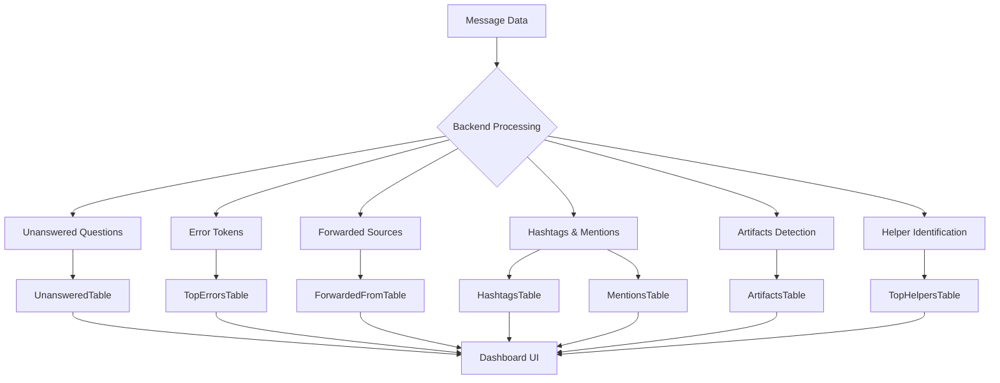
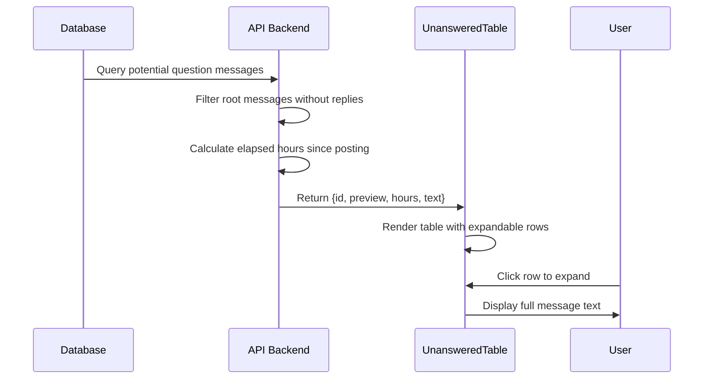
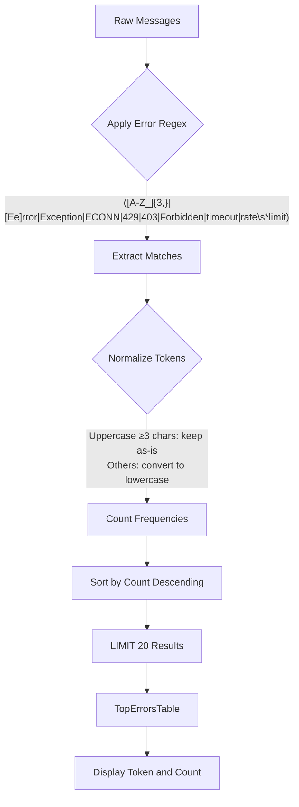
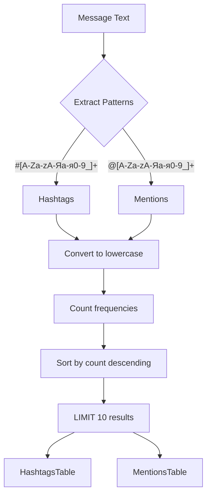

# Specialized Analysis Modules

<cite>
**Referenced Files in This Document**
- [UnansweredTable.tsx](file://app/components/tables/UnansweredTable.tsx)
- [TopErrorsTable.tsx](file://app/components/tables/TopErrorsTable.tsx)
- [ForwardedFromTable.tsx](file://app/components/tables/ForwardedFromTable.tsx)
- [HashtagsTable.tsx](file://app/components/tables/HashtagsTable.tsx)
- [MentionsTable.tsx](file://app/components/tables/MentionsTable.tsx)
- [ArtifactsTable.tsx](file://app/components/tables/ArtifactsTable.tsx)
- [TopHelpersTable.tsx](file://app/components/tables/TopHelpersTable.tsx)
- [overview/route.ts](file://app/api/overview/route.ts)
- [slice.ts](file://lib/report/slice.ts)
- [useNumberFormatter.ts](file://app/hooks/useNumberFormatter.ts)
</cite>

## Table of Contents
1. [Introduction](#introduction)
2. [Core Components](#core-components)
3. [Unanswered Questions Detection](#unanswered-questions-detection)
4. [Error Message Analysis](#error-message-analysis)
5. [Content Source Tracking](#content-source-tracking)
6. [Social Graph and Topic Monitoring](#social-graph-and-topic-monitoring)
7. [Generated Content Identification](#generated-content-identification)
8. [Helper Recognition System](#helper-recognition-system)
9. [Limitations and Scalability Considerations](#limitations-and-scalability-considerations)
10. [Conclusion](#conclusion)

## Introduction
This document provides comprehensive documentation for the specialized analysis modules within the Telegram community analytics dashboard. These modules extract nuanced insights from chat data beyond basic metrics, enabling enhanced operational awareness and community management. Each module combines backend query logic with frontend presentation to surface actionable intelligence about unanswered questions, frequent errors, content origins, social interactions, generated artifacts, and user contributions.

## Core Components

The specialized analysis modules are implemented as React components in the `app/components/tables/` directory, each responsible for rendering specific insights derived from processed message data. These components consume structured data passed as props and present it through consistent UI patterns using formatted tables within panel containers. All components leverage the `useNumberFormatter` hook for locale-aware number formatting and implement responsive design principles for optimal display across devices.



**Diagram sources**
- [UnansweredTable.tsx](file://app/components/tables/UnansweredTable.tsx)
- [TopErrorsTable.tsx](file://app/components/tables/TopErrorsTable.tsx)
- [ForwardedFromTable.tsx](file://app/components/tables/ForwardedFromTable.tsx)
- [HashtagsTable.tsx](file://app/components/tables/HashtagsTable.tsx)
- [MentionsTable.tsx](file://app/components/tables/MentionsTable.tsx)
- [ArtifactsTable.tsx](file://app/components/tables/ArtifactsTable.tsx)
- [TopHelpersTable.tsx](file://app/components/tables/TopHelpersTable.tsx)
- [overview/route.ts](file://app/api/overview/route.ts)

**Section sources**
- [UnansweredTable.tsx](file://app/components/tables/UnansweredTable.tsx#L8-L32)
- [TopErrorsTable.tsx](file://app/components/tables/TopErrorsTable.tsx#L7-L23)
- [ForwardedFromTable.tsx](file://app/components/tables/ForwardedFromTable.tsx#L7-L37)

## Unanswered Questions Detection

The `UnansweredTable` module identifies questions posed in chat that have not received replies after 12 hours, enabling moderators to follow up on unresolved inquiries. The backend detection uses a multi-step process: first identifying potential questions through text heuristics (presence of "?" or keywords like "как", "почему", "ошибк", "не работает"), then filtering out messages that are replies themselves, and finally excluding any messages that have received direct replies within the analysis window.

The frontend component presents these unanswered questions in a collapsible table format, showing message ID, preview text, and elapsed time in hours. Users can click on a row to expand and view the full message content, facilitating quick assessment of context. The elapsed time is calculated relative to the current timestamp, providing real-time urgency indicators.



**Diagram sources**
- [overview/route.ts](file://app/api/overview/route.ts#L165-L196)
- [slice.ts](file://lib/report/slice.ts#L244-L277)
- [UnansweredTable.tsx](file://app/components/tables/UnansweredTable.tsx#L8-L32)

**Section sources**
- [overview/route.ts](file://app/api/overview/route.ts#L165-L196)
- [slice.ts](file://lib/report/slice.ts#L244-L277)
- [UnansweredTable.tsx](file://app/components/tables/UnansweredTable.tsx#L8-L32)

## Error Message Analysis

The `TopErrorsTable` module detects and ranks frequent error messages to aid debugging and system monitoring. The backend implementation uses regular expression pattern matching to identify error-related tokens in message text, capturing uppercase sequences (3+ characters), common error terms ("Error", "Exception"), network error codes (ECONN, 429, 403), and performance-related keywords ("timeout", "rate limit"). Detected tokens are normalized (uppercase sequences preserved, others converted to lowercase) and aggregated with frequency counts.

The frontend component displays the top 20 most frequent error tokens with their occurrence counts, presented in descending order of frequency. This allows developers and support teams to quickly identify recurring issues and prioritize troubleshooting efforts. The table automatically hides when no errors are detected in the analysis window, maintaining a clean interface.



**Diagram sources**
- [overview/route.ts](file://app/api/overview/route.ts#L244-L278)
- [TopErrorsTable.tsx](file://app/components/tables/TopErrorsTable.tsx#L7-L23)

**Section sources**
- [overview/route.ts](file://app/api/overview/route.ts#L244-L278)
- [TopErrorsTable.tsx](file://app/components/tables/TopErrorsTable.tsx#L7-L23)

## Content Source Tracking

The `ForwardedFromTable` module tracks external content sources by analyzing forwarded messages, revealing information flow origins within the community. The backend processes both legacy (`forward_from_chat`) and modern (`forward_origin`) Telegram message formats to extract forwarding metadata, including channel ID, title, username, and message count. It constructs clickable URLs to the original content when possible, using either the username (@channel) or short channel ID format (t.me/c/{id}).

The implementation distinguishes between forwards within the selected chat and those across all monitored chats, providing both focused and comprehensive views of content sourcing. The frontend table displays channels with their identification (title with ID, or @username), occurrence count, and interactive links, allowing users to trace information back to its source. A fallback message appears when no forwarded content is detected during the analysis period.

```mermaid
flowchart LR
A[Messages] --> B{Contains forward_* fields?}
B --> |Yes| C[Extract chat_id, title, username]
C --> D[Normalize chat_id to short format]
D --> E[Build URL: t.me/{username} or t.me/c/{shortId}]
E --> F[Include message link if available]
F --> G[Aggregate by channel]
G --> H[ForwardedFromTable]
H --> I[Display Channel Name/ID, Count, Link]
```

**Diagram sources**
- [overview/route.ts](file://app/api/overview/route.ts#L294-L352)
- [ForwardedFromTable.tsx](file://app/components/tables/ForwardedFromTable.tsx#L7-L37)

**Section sources**
- [overview/route.ts](file://app/api/overview/route.ts#L294-L352)
- [ForwardedFromTable.tsx](file://app/components/tables/ForwardedFromTable.tsx#L7-L37)

## Social Graph and Topic Monitoring

The `HashtagsTable` and `MentionsTable` modules enable social graph analysis and topic tracking by identifying and ranking hashtags and user mentions within the chat ecosystem. The backend processes message text to extract all occurrences of #hashtag and @mention patterns using regular expressions, normalizing them to lowercase for consistent aggregation. Frequency counts are generated and sorted in descending order, with the top 10 results displayed in the frontend tables.

These modules provide valuable insights into trending topics and active participants within the community. Hashtags reveal popular discussion themes and project names, while mentions highlight collaboration patterns and frequently referenced users. The tables automatically hide when no relevant patterns are detected, ensuring interface clarity. Both components use identical presentation patterns with appropriate column headers (#Хэштег / @Упоминание) and formatted count values.



**Diagram sources**
- [overview/route.ts](file://app/api/overview/route.ts#L280-L292)
- [HashtagsTable.tsx](file://app/components/tables/HashtagsTable.tsx#L7-L23)
- [MentionsTable.tsx](file://app/components/tables/MentionsTable.tsx#L7-L23)

**Section sources**
- [overview/route.ts](file://app/api/overview/route.ts#L280-L292)
- [HashtagsTable.tsx](file://app/components/tables/HashtagsTable.tsx#L7-L23)
- [MentionsTable.tsx](file://app/components/tables/MentionsTable.tsx#L7-L23)

## Generated Content Identification

The `ArtifactsTable` module identifies generated content such as code blocks and deployment links, supporting knowledge capture and resource discovery. The backend scans message text for two primary artifact types: links to known development platforms (GitHub, Vercel, Netlify, Replit, pages.dev) and code snippets indicated by triple backticks (```). When either condition is met, the message is cataloged as an artifact with relevant metadata.

The frontend component displays artifacts with message ID, type indicator (URL or "code snippet"), and content preview. URLs are rendered as clickable hyperlinks, enabling one-click access to external resources. This functionality helps surface valuable technical contributions and deployed projects ("Ship-it" moments), making them easily discoverable for team members who may have missed the original conversation.

```mermaid
flowchart TD
A[Message Text] --> B{Contains Links?}
B --> |Yes| C[Check domains: github, vercel, etc.]
A --> D{Contains
``` ?}
    D -->|Yes| E[Mark as code snippet]
    C -->|"Match found"| F[Record URL]
    E --> G[Create Artifact Entry]
    F --> G
    G --> H[Add ID, Preview]
    H --> I[ArtifactsTable]
    I --> J[Display ID, Type (link/code), Preview]
```

**Diagram sources**
- [overview/route.ts](file://app/api/overview/route.ts#L244-L278)
- [ArtifactsTable.tsx](file://app/components/tables/ArtifactsTable.tsx#L5-L20)

**Section sources**
- [overview/route.ts](file://app/api/overview/route.ts#L244-L278)
- [ArtifactsTable.tsx](file://app/components/tables/ArtifactsTable.tsx#L5-L20)

## Helper Recognition System

The `TopHelpersTable` module recognizes users who frequently respond to others' messages, highlighting community contributors and support personnel. The backend implements a recursive SQL query to trace reply chains back to their root messages, identifying users who participate in threads initiated by others. It excludes self-replies by comparing helper user ID with the root message author, ensuring only genuine assistance is counted.

The implementation uses a Common Table Expression (CTE) with recursive traversal to handle nested reply threads of arbitrary depth. Results are grouped by helper user, including their username and name if available, with response counts aggregated and sorted in descending order. The frontend displays the top 10 helpers with their identifiers and contribution counts, celebrating active community members and identifying potential subject matter experts.

```mermaid
sequenceDiagram
    participant DB as Messages Table
    participant Recursive as CTE Chain
    participant