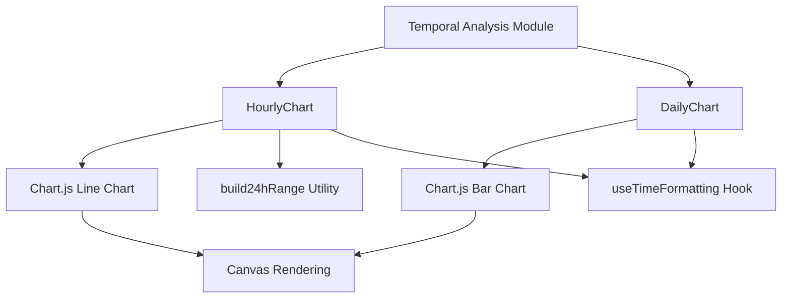
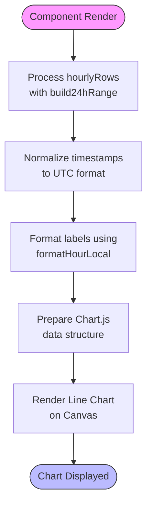
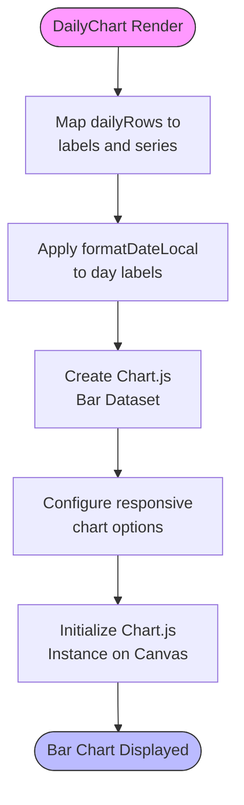
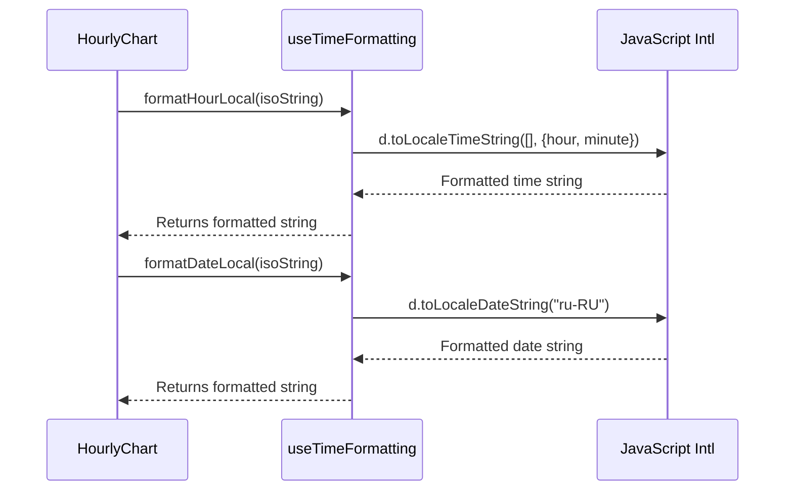

# Temporal Analysis

<cite>
**Referenced Files in This Document**  
- [HourlyChart.tsx](file://app/components/charts/HourlyChart.tsx)
- [DailyChart.tsx](file://app/components/charts/DailyChart.tsx)
- [useTimeFormatting.ts](file://app/hooks/useTimeFormatting.ts)
- [time.ts](file://app/utils/time.ts)
- [slice.ts](file://lib/report/slice.ts)
</cite>

## Table of Contents
1. [Introduction](#introduction)
2. [Core Components Overview](#core-components-overview)
3. [HourlyChart Component Analysis](#hourlychart-component-analysis)
4. [DailyChart Component Analysis](#dailychart-component-analysis)
5. [Data Processing and Normalization](#data-processing-and-normalization)
6. [Time Formatting and Localization](#time-formatting-and-localization)
7. [Chart Lifecycle Management](#chart-lifecycle-management)
8. [Performance Optimization Strategies](#performance-optimization-strategies)
9. [Error Handling and Edge Cases](#error-handling-and-edge-cases)
10. [Integration with Data Pipeline](#integration-with-data-pipeline)

## Introduction

The temporal analysis module provides visual insights into message activity patterns over time through two primary components: `HourlyChart` and `DailyChart`. These components render interactive charts that display message volume trends across 24-hour and weekly periods respectively, enabling users to identify peak engagement times and daily/weekly patterns within Telegram chat data. Built using Chart.js for visualization, the module emphasizes performance, responsiveness, and accurate time representation through UTC normalization and local formatting.

**Section sources**
- [HourlyChart.tsx](file://app/components/charts/HourlyChart.tsx#L1-L67)
- [DailyChart.tsx](file://app/components/charts/DailyChart.tsx#L1-L45)

## Core Components Overview

The temporal analysis system consists of two React components designed to visualize message frequency over different time scales:

- **HourlyChart**: Renders a line chart showing message counts per hour across a 24-hour window
- **DailyChart**: Displays a bar chart representing daily message volumes over a week

Both components follow a client-side rendering pattern, receiving pre-aggregated data from API endpoints and transforming it into chart-ready formats. They share common architectural patterns including canvas-based rendering via Chart.js, lifecycle management through React hooks, and integration with time formatting utilities for consistent date display.



**Diagram sources**
- [HourlyChart.tsx](file://app/components/charts/HourlyChart.tsx#L1-L67)
- [DailyChart.tsx](file://app/components/charts/DailyChart.tsx#L1-L45)

**Section sources**
- [HourlyChart.tsx](file://app/components/charts/HourlyChart.tsx#L1-L67)
- [DailyChart.tsx](file://app/components/charts/DailyChart.tsx#L1-L45)

## HourlyChart Component Analysis

The `HourlyChart` component visualizes hourly message activity using a smooth line chart. It accepts a `since` timestamp and an array of `hourlyRows` containing message counts per hour, then processes this data to ensure complete 24-hour coverage even when source data contains gaps.

Key features include:
- Automatic gap filling using `build24hRange` utility
- UTC timestamp normalization for consistent timezone handling
- Local time formatting for user-friendly display
- Responsive design with fixed height container
- Smooth interpolation between data points (tension: 0.3)

The component uses `useMemo` to memoize the processed data transformation, preventing unnecessary recalculations when props remain unchanged. This optimization ensures efficient re-rendering when the parent component updates for reasons unrelated to the chart data.



**Diagram sources**
- [HourlyChart.tsx](file://app/components/charts/HourlyChart.tsx#L14-L64)
- [time.ts](file://app/utils/time.ts#L0-L21)

**Section sources**
- [HourlyChart.tsx](file://app/components/charts/HourlyChart.tsx#L14-L64)

## DailyChart Component Analysis

The `DailyChart` component presents daily message volume trends using a vertical bar chart. Unlike the hourly counterpart, it operates on daily aggregates without requiring gap filling, as it directly maps available data points to chart bars.

Key characteristics:
- Simpler data transformation pipeline compared to HourlyChart
- Direct mapping of `dailyRows` to chart datasets
- Minimal preprocessing required before rendering
- Consistent styling with blue color scheme matching application theme
- X-axis grid lines disabled for cleaner appearance

The component follows the same lifecycle management pattern as `HourlyChart`, ensuring proper cleanup of Chart.js instances during unmounting or reconfiguration. Its implementation prioritizes simplicity and performance, avoiding unnecessary data transformations when the source already provides complete daily aggregates.



**Diagram sources**
- [DailyChart.tsx](file://app/components/charts/DailyChart.tsx#L12-L42)

**Section sources**
- [DailyChart.tsx](file://app/components/charts/DailyChart.tsx#L12-L42)

## Data Processing and Normalization

Both chart components rely on properly structured data from backend services, specifically arrays of objects containing timestamps and count values (`hourlyRows` and `dailyRows`). The data processing pipeline ensures consistency and completeness before visualization.

For hourly data, the system addresses potential sparsity by:
1. Generating a complete 24-hour range using `build24hRange`
2. Creating a Map to store counts keyed by normalized ISO timestamps
3. Populating known values from API response
4. Filling missing hours with zero counts
5. Converting final data to chart-ready labels and series arrays

This approach guarantees that the line chart always displays exactly 24 data points, maintaining visual consistency regardless of actual message distribution throughout the day.

```mermaid
classDiagram
class build24hRange {
+build24hRange(sinceIso : string) : string[]
-base : Date
-start : Date
-out : string[]
}
class HourlyChart {
-hourlyRows : Array{hour : string, cnt : number}
-rangeHours : string[]
-map : Map<string, number>
-labels : string[]
-series : number[]
}
build24hRange --> HourlyChart : "used by"
note right of HourlyChart
Processes hourlyRows by aligning with
24-hour range and filling gaps with zeros
end note
```

**Diagram sources**
- [time.ts](file://app/utils/time.ts#L0-L21)
- [HourlyChart.tsx](file://app/components/charts/HourlyChart.tsx#L14-L64)

**Section sources**
- [time.ts](file://app/utils/time.ts#L0-L21)
- [HourlyChart.tsx](file://app/components/charts/HourlyChart.tsx#L14-L64)

## Time Formatting and Localization

Time representation is handled consistently across both components through the `useTimeFormatting` hook, which provides localized formatting functions while maintaining UTC-based data integrity.

The hook exports two key functions:
- `formatHourLocal`: Converts ISO timestamps to localized hour-minute strings (e.g., "14:30")
- `formatDateLocal`: Formats dates according to the specified locale (default: ru-RU)

This separation of concerns allows the components to:
- Store and process all timestamps in standardized UTC format
- Display times in user-friendly local format
- Support internationalization through configurable locale parameter
- Maintain consistent formatting across different chart types

The implementation leverages JavaScript's built-in `toLocaleTimeString` and `toLocaleDateString` methods, ensuring native browser support for various locales and formatting conventions.



**Diagram sources**
- [useTimeFormatting.ts](file://app/hooks/useTimeFormatting.ts#L0-L17)
- [HourlyChart.tsx](file://app/components/charts/HourlyChart.tsx#L14-L64)
- [DailyChart.tsx](file://app/components/charts/DailyChart.tsx#L12-L42)

**Section sources**
- [useTimeFormatting.ts](file://app/hooks/useTimeFormatting.ts#L0-L17)

## Chart Lifecycle Management

Both chart components implement robust lifecycle management to prevent memory leaks and ensure optimal performance. This is achieved through careful coordination of React hooks and Chart.js instance handling.

Key aspects of lifecycle management:
- Use of `useRef` to maintain references to both canvas elements and Chart.js instances
- Implementation of `useEffect` with cleanup function to destroy existing chart instances
- Prevention of multiple simultaneous chart instances
- Proper null checks before DOM manipulation

The cleanup function returned by `useEffect` calls `destroy()` on the current chart instance, releasing all event listeners and freeing