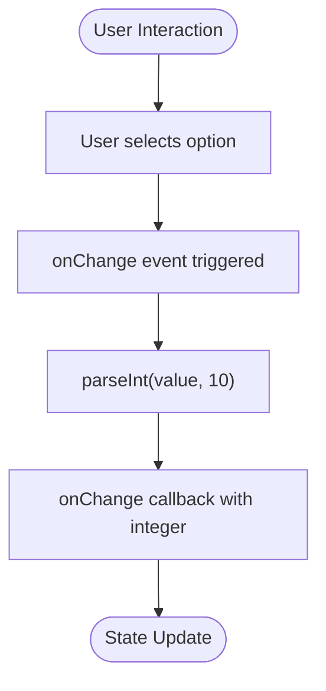
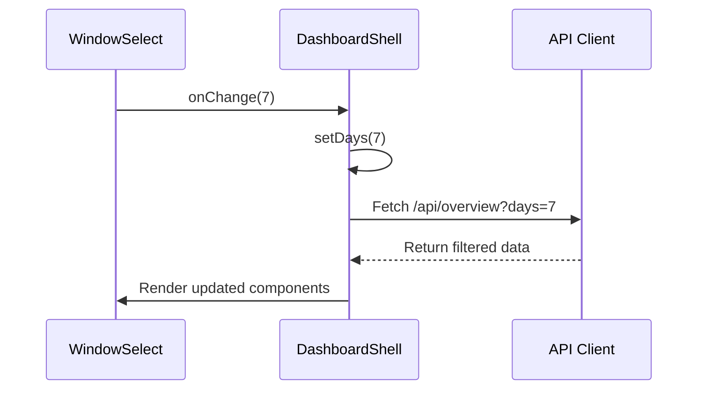
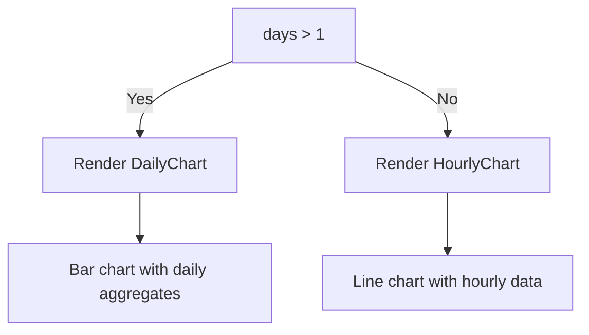

# Time Window Analytics

<cite>
**Referenced Files in This Document**   
- [WindowSelect.tsx](file://app/components/filters/WindowSelect.tsx)
- [useTimeFormatting.ts](file://app/hooks/useTimeFormatting.ts)
- [page.tsx](file://app/page.tsx)
- [week/page.tsx](file://app/week/page.tsx)
- [DashboardShell.tsx](file://app/components/DashboardShell.tsx)
- [route.ts](file://app/api/overview/route.ts)
- [time.ts](file://app/utils/time.ts)
</cite>

## Table of Contents
1. [Introduction](#introduction)
2. [Route Entry Points and URL Patterns](#route-entry-points-and-url-patterns)
3. [WindowSelect Component Implementation](#windowselect-component-implementation)
4. [State Management and Data Propagation](#state-management-and-data-propagation)
5. [Backend Data Filtering Logic](#backend-data-filtering-logic)
6. [Time-Based Visualization Switching](#time-based-visualization-switching)
7. [Timezone Handling and Formatting](#timezone-handling-and-formatting)
8. [Performance Implications](#performance-implications)
9. [Edge Cases and Error Handling](#edge-cases-and-error-handling)

## Introduction

The time window analytics feature enables users to analyze Telegram chat activity across two distinct temporal scopes: 24-hour (default) and 7-day views. This functionality is implemented through a combination of frontend routing, interactive UI controls, state management, and backend data filtering. The system allows users to dynamically switch between time windows, with all downstream KPIs, charts, and tables automatically adjusting their datasets based on the selected period. This document details the implementation architecture, focusing on how user interactions propagate through the system to deliver contextually relevant analytics.

## Route Entry Points and URL Patterns

The application exposes two primary entry points for accessing different time windows:

- **Default route (`/`)**: Serves the 24-hour view with minimal configuration required
- **Week route (`/week`)**: Provides access to the 7-day analytical perspective

These routes are implemented as separate Next.js pages that initialize the dashboard with different default parameters. The `/` route renders a header indicating "Telegram Dashboard — последние 24 часа" (last 24 hours), while the `/week` route displays "Telegram Dashboard — последние 7 дней" (last 7 days). Both pages serve as thin wrappers around the shared `DashboardShell` component, differing primarily in their initial time window configuration.

```mermaid
graph TD
A[/] --> B[page.tsx]
C[/week] --> D[week/page.tsx]
B --> E[DashboardShell with days=1]
D --> F[DashboardShell with days=7]
```

**Diagram sources**
- [page.tsx](file://app/page.tsx#L1-L23)
- [week/page.tsx](file://app/week/page.tsx#L1-L20)

**Section sources**
- [page.tsx](file://app/page.tsx#L1-L23)
- [week/page.tsx](file://app/week/page.tsx#L1-L20)

## WindowSelect Component Implementation

The `WindowSelect` component provides an interactive dropdown control that allows users to switch between time windows directly within the dashboard interface. Implemented as a client-side React component, it renders a select element with two options: "24 часа" (24 hours) and "7 дней" (7 days), corresponding to values of 1 and 7 respectively.

The component accepts two props:
- `value`: The currently selected number of days (1 or 7)
- `onChange`: A callback function invoked when the user selects a different time window

When a user changes the selection, the component parses the string value from the HTML select element back into an integer and propagates it through the onChange callback. This design ensures type safety while maintaining compatibility with HTML form elements.



**Diagram sources**
- [WindowSelect.tsx](file://app/components/filters/WindowSelect.tsx#L7-L21)

**Section sources**
- [WindowSelect.tsx](file://app/components/filters/WindowSelect.tsx#L1-L24)

## State Management and Data Propagation

The time window selection is managed through React's useState hook within the `DashboardShell` component, which serves as the central orchestrator for the analytics dashboard. When initialized, `DashboardShell` receives an optional `days` prop that sets the initial state value. This state variable is then passed down to the `WindowSelect` component as its value prop and updated whenever the user makes a new selection.

The reactivity pattern follows a unidirectional data flow:
1. User interacts with `WindowSelect`
2. `onChange` callback updates `days` state in `DashboardShell`
3. State change triggers re-render and API refetch
4. Updated data flows to all dependent components

This approach ensures that all visualizations and metrics remain synchronized with the current time window selection without requiring complex state management libraries.



**Diagram sources**
- [DashboardShell.tsx](file://app/components/DashboardShell.tsx#L22-L99)
- [WindowSelect.tsx](file://app/components/filters/WindowSelect.tsx#L7-L21)

**Section sources**
- [DashboardShell.tsx](file://app/components/DashboardShell.tsx#L22-L99)

## Backend Data Filtering Logic

The backend implements time-based filtering through the `/api/overview` route, which accepts an optional `days` query parameter to specify the analysis window. When no parameter is provided, the default 24-hour window (1 day) is used. The route validates the input to ensure it falls within acceptable bounds (1-30 days) before processing.

The core filtering logic calculates a `since` timestamp by subtracting the specified number of days from the current time. This creates a dynamic time range where:
- `since` = current time - (windowDays × 24 hours)
- `until` = current time

All database queries use this time range in their WHERE clauses to filter messages appropriately. For example, message counts, hourly/daily distributions, and top entities are all calculated based on messages falling within this window. The backend also returns metadata including the actual `since` and `until` timestamps used, allowing the frontend to display precise time ranges.

**Section sources**
- [route.ts](file://app/api/overview/route.ts#L45-L50)

## Time-Based Visualization Switching

The dashboard adapts its visualizations based on the selected time window, providing appropriate chart types for each scope:

- **24-hour window**: Displays `HourlyChart` showing message activity broken down by hour
- **7-day window**: Renders `DailyChart` presenting message counts aggregated by day

This conditional rendering occurs within the `DashboardShell` component using a simple ternary operator based on the `days` state value. The `HourlyChart` requires additional context including the `since` timestamp to properly label its x-axis, while the `DailyChart` works directly with pre-aggregated daily counts from the API response.

The switching mechanism ensures users receive the most appropriate visualization for their selected time scale, avoiding overly granular hourly data for longer periods or insufficient detail for short-term analysis.



**Diagram sources**
- [DashboardShell.tsx](file://app/components/DashboardShell.tsx#L70-L75)
- [HourlyChart.tsx](file://app/components/charts/HourlyChart.tsx#L14-L64)
- [DailyChart.tsx](file://app/components/charts/DailyChart.tsx#L12-L42)

**Section sources**
- [DashboardShell.tsx](file://app/components/DashboardShell.tsx#L70-L75)

## Timezone Handling and Formatting

Timezone handling is managed through the `useTimeFormatting` custom hook, which provides localized date and time formatting functions. The hook leverages JavaScript's built-in `toLocaleTimeString` and `toLocaleDateString` methods with explicit configuration to ensure consistent formatting across different environments.

The hook exports two primary functions:
- `formatHourLocal`: Formats ISO timestamps into 24-hour time strings (HH:mm)
- `formatDateLocal`: Converts dates into locale-specific date representations

By default, the hook uses Russian locale ("ru-RU"), but this can be overridden