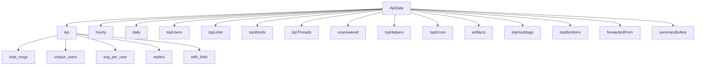
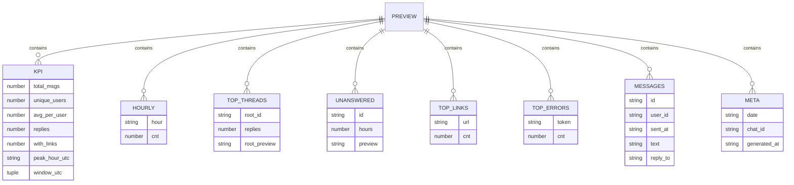
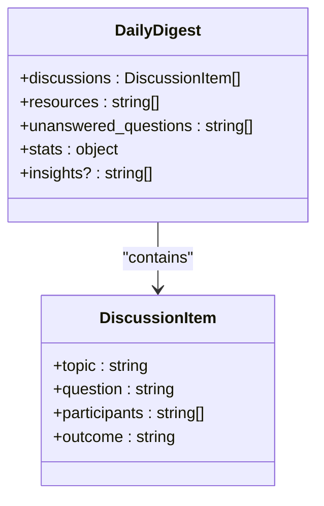
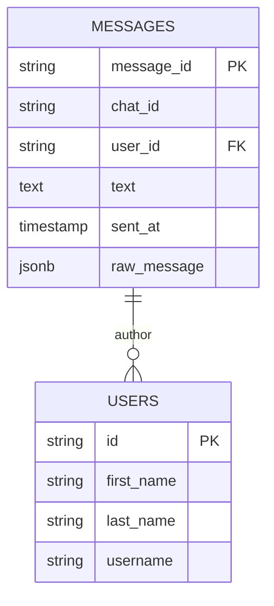
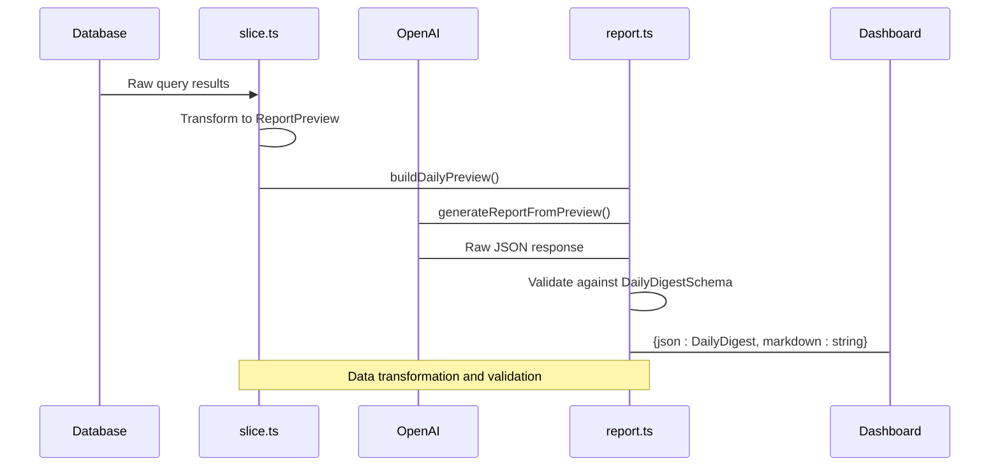

<cite>
**Referenced Files in This Document**   
- [schema.ts](file://lib/report/schema.ts)
- [digest_schema.ts](file://lib/report/digest_schema.ts)
- [DashboardShell.tsx](file://app/components/DashboardShell.tsx)
- [route.ts](file://app/api/overview/route.ts)
- [route.ts](file://app/api/report/generate/route.ts)
- [slice.ts](file://lib/report/slice.ts)
- [report.ts](file://lib/llm/report.ts)
</cite>

# Data Models and Schemas

## Table of Contents
1. [Introduction](#introduction)
2. [Core API Response Structure](#core-api-response-structure)
3. [Zod Schema Definitions](#zod-schema-definitions)
4. [Data Model Entities](#data-model-entities)
5. [Database Schema Inference](#database-schema-inference)
6. [Data Validation and Transformation Pipeline](#data-validation-and-transformation-pipeline)
7. [API Endpoints and Sample Payloads](#api-endpoints-and-sample-payloads)
8. [Data Lifecycle and Performance Considerations](#data-lifecycle-and-performance-considerations)

## Introduction

This document provides comprehensive documentation for the data models and schemas used in the tg-vibecoders-dashboard application. The system leverages Zod for schema definition and validation, with data flowing from PostgreSQL database queries through transformation pipelines to frontend components. The primary data structures are defined in `schema.ts` and `digest_schema.ts`, with corresponding TypeScript interfaces used throughout the application. This documentation details the entity relationships, field constraints, validation rules, and data flow from database to UI.

## Core API Response Structure

The dashboard's core data model is centered around the `ApiData` interface defined in `DashboardShell.tsx`, which represents the complete dataset returned by the `/api/overview` endpoint. This structure contains KPIs, time-series data, top entities, and summary information that powers all visualizations in the dashboard.



**Diagram sources**
- [DashboardShell.tsx](file://app/components/DashboardShell.tsx#L20)

**Section sources**
- [DashboardShell.tsx](file://app/components/DashboardShell.tsx#L20)
- [route.ts](file://app/api/overview/route.ts#L0-L522)

## Zod Schema Definitions

The application uses Zod for runtime type checking and validation of API responses and LLM outputs. Two primary schema files define the expected data shapes: `schema.ts` for internal preview data and `digest_schema.ts` for final LLM-generated reports.

### Preview Schema (schema.ts)

The `PreviewSchema` defines the structure of intermediate data used for generating daily digests. It includes KPIs, hourly trends, top threads, unanswered questions, and other metrics derived from message analysis.



**Diagram sources**
- [schema.ts](file://lib/report/schema.ts#L2-L19)

### Daily Digest Schema (digest_schema.ts)

The `DailyDigestSchema` defines the final output structure for AI-generated daily reports. This schema is stricter and designed to ensure LLM outputs conform to a consistent format with required fields like discussions, resources, and statistics.



**Diagram sources**
- [digest_schema.ts](file://lib/report/digest_schema.ts#L11-L23)

## Data Model Entities

### ApiData Interface

The `ApiData` interface in `DashboardShell.tsx` serves as the primary data contract between the backend API and frontend components. Although currently typed as `any`, it effectively represents a rich structure containing multiple entity collections:

- **KPIs**: Key performance indicators including message counts, unique users, reply rates, and link sharing metrics
- **Time Series**: Hourly and daily message volume trends
- **Top Entities**: Leaderboards for users, links, words, threads, helpers, errors, hashtags, mentions, and forwarded content
- **Unanswered Questions**: Messages identified as questions that haven't received replies within 12+ hours
- **Artifacts**: Messages containing code blocks or links to development platforms
- **Forwarded Content**: Aggregation of messages forwarded from other channels or users

The `topUsers` field maps user identifiers to message counts and display names, with the display name resolved through the `normalizeUsernameOrId` function which combines first name, last name, and username when available.

**Section sources**
- [DashboardShell.tsx](file://app/components/DashboardShell.tsx#L20)
- [route.ts](file://app/api/overview/route.ts#L0-L522)

### DailyDigest Type

The `DailyDigest` type, inferred from `DailyDigestSchema`, represents the final AI-generated report structure. It enforces strict requirements on critical fields while allowing flexibility for additional numeric statistics:

- **discussions**: Required array of discussion items, each with topic, question, participants, and outcome
- **resources**: Required array of resource URLs or references
- **unanswered_questions**: Required array of unresolved questions from the day
- **stats**: Required object containing `messages_count` and `participants_count` with `.passthrough()` allowing additional numeric fields
- **insights**: Optional array of AI-generated insights

This schema uses Zod's `.passthrough()` method on the stats object to maintain compatibility with source data while ensuring core metrics are present.

**Section sources**
- [digest_schema.ts](file://lib/report/digest_schema.ts#L11-L23)

## Database Schema Inference

Based on SQL queries in the codebase, the following database schema can be inferred:



### Table: messages
- **message_id**: Primary identifier for each message (string)
- **chat_id**: Identifier for the Telegram chat/channel (string)
- **user_id**: Foreign key referencing the sender in users table (string)
- **text**: Message content, nullable (text)
- **sent_at**: Timestamp of message creation (timestamp)
- **raw_message**: Full JSON payload from Telegram API (jsonb)

### Table: users
- **id**: Primary identifier matching Telegram user IDs (string)
- **first_name**: User's first name (string)
- **last_name**: User's last name (string)
- **username**: Telegram username (string)

The application performs left joins between these tables to enrich message data with user display information, using the `normalizeUsernameOrId` function to create human-readable author representations.

**Section sources**
- [route.ts](file://app/api/overview/route.ts#L0-L522)
- [slice.ts](file://lib/report/slice.ts#L100-L344)

## Data Validation and Transformation Pipeline

The system implements a multi-stage data processing pipeline that transforms raw database results into validated, structured outputs suitable for both UI rendering and LLM consumption.



### Key Stages:

1. **Database Querying**: Direct PostgreSQL queries extract raw message and user data within specified time windows
2. **In-Memory Processing**: Application logic in `slice.ts` processes text content to extract links, error tokens, and other derived metrics
3. **Preview Construction**: The `buildDailyPreview` function assembles a comprehensive `ReportPreview` object with KPIs, trends, and top entities
4. **LLM Generation**: The `generateReportFromPreview` function sends the preview to OpenAI with strict JSON schema requirements
5. **Validation**: The LLM response is validated against `DailyDigestSchema` using Zod's safeParse method
6. **Serialization**: Validated data is returned as both structured JSON and rendered Markdown

The pipeline includes robust error handling for cases such as missing OpenAI keys, timeout conditions, invalid JSON responses, and schema validation failures, with appropriate HTTP status codes returned to clients.

**Diagram sources**
- [slice.ts](file://lib/report/slice.ts#L100-L344)
- [report.ts](file://lib/llm/report.ts#L16-L96)

**Section sources**
- [slice.ts](file://lib/report/slice.ts#L100-L344)
- [report.ts](file://lib/llm/report.ts#L16-L96)

## API Endpoints and Sample Payloads

### GET /api/overview

Returns the complete dashboard data for a specified time window (default: 1 day).

**Request Parameters:**
- `days`: Number of days to include (1-30)
- `chat_id`: Specific chat to filter by (optional)

**Sample Response Structure:**
```json
{
  "kpi": {
    "total_msgs": 1542,
    "unique_users": 89,
    "avg_per_user": 17.3,
    "replies": 342,
    "with_links": 128
  },
  "hourly": [
    {"hour": "2023-12-01T09:00:00.000Z", "cnt": 45},
    {"hour": "2023-12-01T10:00:00.000Z", "cnt": 67}
  ],
  "topUsers": [
    {"user": "@alice", "cnt": 124},
    {"user": "Bob Smith (@bob)", "cnt": 98}
  ],
  "topLinks": [
    {"url": "https://github.com/example", "cnt": 23}
  ],
  "summaryBullets": [
    "Всего 1542 сообщений",
    "Пик активности в 15:00 UTC — 89"
  ]
}
```

### GET /api/report/generate

Generates an AI-powered daily digest report for a specific date.

**Request Parameters:**
- `date`: ISO date string (YYYY-MM-DD)
- `chat_id`: Chat to generate report for (optional)
- `since`: Custom start time override (optional)
- `until`: Custom end time override (optional)

**Sample Response Structure:**
```json
{
  "json": {
    "discussions": [
      {
        "topic": "API Integration",
        "question": "How to authenticate with the new endpoint?",
        "participants": ["@dev1", "@dev2"],
        "outcome": "Documented OAuth2 flow in README"
      }
    ],
    "resources": ["https://docs.example.com/v2"],
    "unanswered_questions": ["Need help with deployment script"],
    "stats": {
      "messages_count": 1542,
      "participants_count": 89,
      "reply_rate": 0.22
    }
  },
  "markdown": "# Daily Digest\n\n## Discussions\n..."
}
```

**Section sources**
- [route.ts](file://app/api/overview/route.ts#L0-L522)
- [route.ts](file://app/api/report/generate/route.ts#L0-L51)

## Data Lifecycle and Performance Considerations

The application handles data lifecycle considerations across several dimensions:

### Caching Potential

While the current implementation does not include explicit caching, several opportunities exist:
- **API Response Caching**: The `/api/overview` endpoint could cache results for common time windows (e.g., last 24 hours) given that historical data rarely changes
- **LLM Response Caching**: Generated reports could be cached to avoid repeated OpenAI calls for the same date
- **Database Query Caching**: Frequent queries like top users and links could