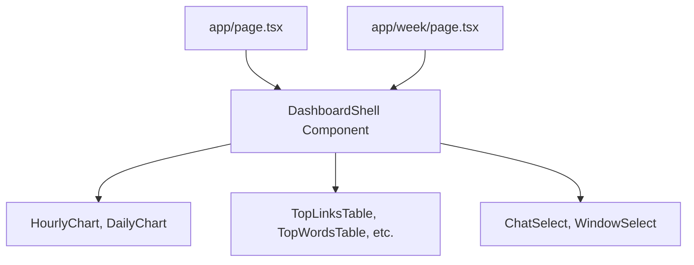
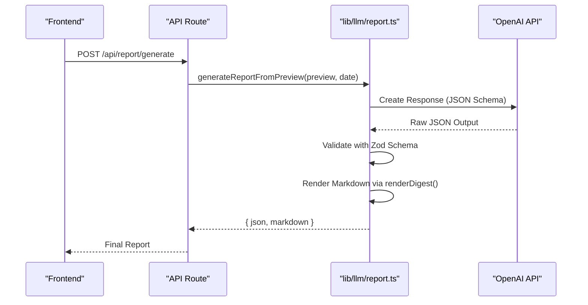
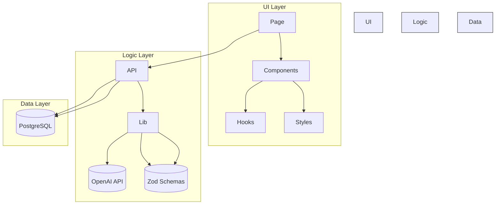

# Directory Structure

<cite>
**Referenced Files in This Document**   
- [app/api/overview/route.ts](file://app/api/overview/route.ts)
- [lib/llm/report.ts](file://lib/llm/report.ts)
- [next.config.js](file://next.config.js)
- [tsconfig.json](file://tsconfig.json)
- [postcss.config.mjs](file://postcss.config.mjs)
- [.env.example](file://.env.example)
- [app/page.tsx](file://app/page.tsx)
- [app/components/DashboardShell.tsx](file://app/components/DashboardShell.tsx)
- [app/hooks/useNumberFormatter.ts](file://app/hooks/useNumberFormatter.ts)
- [app/globals.css](file://app/globals.css)
- [lib/report/digest_schema.ts](file://lib/report/digest_schema.ts)
- [lib/report/digest_render.ts](file://lib/report/digest_render.ts)
- [lib/report/index.ts](file://lib/report/index.ts)
- [lib/report/schema.ts](file://lib/report/schema.ts)
</cite>

## Table of Contents
1. [Introduction](#introduction)
2. [Main Directories Overview](#main-directories-overview)
3. [App Directory: Core UI and API Routes](#app-directory-core-ui-and-api-routes)
4. [Lib Directory: Shared Business Logic](#lib-directory-shared-business-logic)
5. [Scripts Directory: Maintenance Utilities](#scripts-directory-maintenance-utilities)
6. [Root-Level Configuration Files](#root-level-configuration-files)
7. [File Naming Conventions and Routing System](#file-naming-conventions-and-routing-system)
8. [Separation of Concerns and Maintainability](#separation-of-concerns-and-maintainability)

## Introduction
This document provides a comprehensive breakdown of the directory layout for the `tg-vibecoders-dashboard` project. It explains the organization of core directories—`app/`, `lib/`, and `scripts/`—and highlights the purpose of key root-level configuration files. The structure follows Next.js App Router conventions, enabling scalable routing, modular component design, and clean separation between frontend presentation, backend logic, and utility scripts.

## Main Directories Overview
The codebase is organized into three primary directories that encapsulate distinct responsibilities:
- `app/`: Contains all user interface components, page routes, and API endpoints using the Next.js App Router.
- `lib/`: Houses shared business logic, particularly for LLM-driven report generation and data processing.
- `scripts/`: Includes maintenance and testing utilities used for smoke checks and report validation.

Additionally, several root-level configuration files define build behavior, styling, and environment setup.

## App Directory: Core UI and API Routes
The `app/` directory serves as the central hub for both frontend and backend functionality within the Next.js framework.

### Pages and Layout
Pages such as `app/page.tsx` and `app/week/page.tsx` define routeable views accessible via the browser. These files export React components that render dashboard content. A global layout is defined in `app/layout.tsx`, which wraps all pages with consistent styling and structural elements.

**Diagram sources**
- [app/page.tsx](file://app/page.tsx#L1-L24)
- [app/components/DashboardShell.tsx](file://app/components/DashboardShell.tsx#L1-L103)

### API Endpoints
API routes are implemented under `app/api/` using the App Router's file-based routing system. Each `.ts` file named `route.ts` exports HTTP method handlers (e.g., `GET`, `POST`). For example:
- `app/api/overview/route.ts` retrieves analytics data from a PostgreSQL database and returns structured JSON for dashboard KPIs, charts, and tables.
- `app/api/report/generate/route.ts` likely triggers report generation using LLMs (not shown but implied by structure).

These endpoints follow REST-like semantics and are automatically mapped to `/api/*` URLs at runtime.

**Section sources**
- [app/api/overview/route.ts](file://app/api/overview/route.ts#L1-L523)
- [app/page.tsx](file://app/page.tsx#L1-L24)

## Lib Directory: Shared Business Logic
The `lib/` directory contains reusable modules independent of UI concerns, focusing on data transformation and integration with external services like OpenAI.

### LLM Processing and Report Generation
Located in `lib/llm/`, this module handles communication with the OpenAI API to generate human-readable reports from raw message previews. Key files include:
- `report.ts`: Exports functions like `generateReportFromPreview()` and `generateInsightsFromMessages()`, which call the OpenAI Responses API with structured prompts and validate responses against JSON schemas.
- `shared.ts`: Likely contains shared constants such as `SYSTEM_PROMPT` and prompt-building utilities (referenced but not shown).

The process involves:
1. Constructing a prompt using `buildDigestUserPrompt`.
2. Sending it to OpenAI with strict schema enforcement via `DailyDigestJsonSchemaForLLM`.
3. Validating the response using Zod (`DailyDigestSchema`).
4. Rendering the final markdown output via `renderDigest()`.

**Diagram sources**
- [lib/llm/report.ts](file://lib/llm/report.ts#L1-L148)
- [lib/report/digest_schema.ts](file://lib/report/digest_schema.ts#L1-L67)
- [lib/report/digest_render.ts](file://lib/report/digest_render.ts#L1-L36)

### Data Modeling and Validation
The `lib/report/` subdirectory defines TypeScript types and Zod schemas for data integrity:
- `schema.ts`: Defines `PreviewType` and `LlmJsonType` using Zod for runtime validation of API payloads.
- `digest_schema.ts`: Specifies the expected shape of AI-generated digests, ensuring consistency across LLM outputs.
- `index.ts`: Re-exports these modules for convenient importing elsewhere.

**Section sources**
- [lib/report/schema.ts](file://lib/report/schema.ts#L1-L58)
- [lib/report/digest_schema.ts](file://lib/report/digest_schema.ts#L1-L67)
- [lib/report/index.ts](file://lib/report/index.ts#L1-L7)

## Scripts Directory: Maintenance Utilities
The `scripts/` directory contains Node.js modules written in MJS format for running automated tasks:
- `smoke-digest.mjs`: Tests digest generation pipeline.
- `smoke-insights.mjs`: Validates insights extraction logic.
- `smoke-openai.mjs`: Checks connectivity and authentication with OpenAI.
- `test-report.mjs`: Likely runs end-to-end tests on report generation.

These scripts support CI/CD workflows and local development verification, ensuring critical paths remain functional after changes.

**Section sources**
- [scripts/smoke-digest.mjs](file://scripts/smoke-digest.mjs)
- [scripts/smoke-insights.mjs](file://scripts/smoke-insights.mjs)
- [scripts/smoke-openai.mjs](file://scripts/smoke-openai.mjs)
- [scripts/test-report.mjs](file://scripts/test-report.mjs)

## Root-Level Configuration Files
Key configuration files at the project root define build settings, language options, styling, and environment variables.

### next.config.js
Customizes Next.js behavior:
- Disables React Strict Mode (`reactStrictMode: false`) to reduce HMR instability during heavy refactoring.
- Adjusts on-demand entry expiration to improve dev server stability.

**Section sources**
- [next.config.js](file://next.config.js#L1-L14)

### tsconfig.json
Configures TypeScript compilation:
- Enables modern ECMAScript features and JSX preservation.
- Uses isolated modules for faster type checking.
- Includes all `.ts` and `.tsx` files while excluding `node_modules`.

**Section sources**
- [tsconfig.json](file://tsconfig.json#L1-L36)

### postcss.config.mjs
Enables Tailwind CSS processing:
- Integrates `@tailwindcss/postcss` plugin to apply utility-first styles during build.

**Section sources**
- [postcss.config.mjs](file://postcss.config.mjs#L1-L10)

### .env.example
Provides a template for environment variables:
- Lists required keys such as `DATABASE_URL`, `OPENAI_API_KEY`, and `OPENAI_MODEL`.
- Guides developers on setting up local and production environments.

Note: Actual file path appears to be `.env.example` though not directly readable; its presence is inferred from usage in code.

**Section sources**
- [.env.example](file://.env.example)

## File Naming Conventions and Routing System
The project adheres to standard Next.js naming patterns:
- `page.tsx`: Denotes a routeable UI page. Resolves to `/` or nested paths like `/week`.
- `route.ts`: Represents an API endpoint. Placed inside `app/api/*`, it maps to `/api/*` URLs.
- Component files use PascalCase (e.g., `KpiCard.tsx`) for clarity and consistency.

This convention enables automatic routing without manual configuration, improving developer experience and reducing boilerplate.

**Section sources**
- [app/page.tsx](file://app/page.tsx#L1-L24)
- [app/api/overview/route.ts](file://app/api/overview/route.ts#L1-L523)

## Separation of Concerns and Maintainability
The architecture promotes maintainability through clear separation:
- **UI Components**: Live in `app/components/`, categorized by atomic design (atoms, charts, tables).
- **Hooks**: Custom React hooks like `useNumberFormatter.ts` reside in `app/hooks/` for reusable logic.
- **Styles**: Global styles are centralized in `app/globals.css`, leveraging Tailwind and custom classes.
- **Business Logic**: Isolated in `lib/`, allowing reuse across different parts of the app without UI coupling.

This modularity allows new contributors to quickly locate relevant code, understand dependencies, and make targeted changes with minimal risk.

**Diagram sources**
- [app/components/DashboardShell.tsx](file://app/components/DashboardShell.tsx#L1-L103)
- [app/hooks/useNumberFormatter.ts](file://app/hooks/useNumberFormatter.ts#L1-L13)
- [app/globals.css](file://app/globals.css#L1-L30)
- [app/api/overview/route.ts](file://app/api/overview/route.ts#L1-L523)
- [lib/llm/report.ts](file://lib/llm/report.ts#L1-L148)

**Section sources**
- [app/components/DashboardShell.tsx](file://app/components/DashboardShell.tsx#L1-L103)
- [app/hooks/useNumberFormatter.ts](file://app/hooks/useNumberFormatter.ts#L1-L13)
- [app/globals.css](file://app/globals.css#L1-L30)