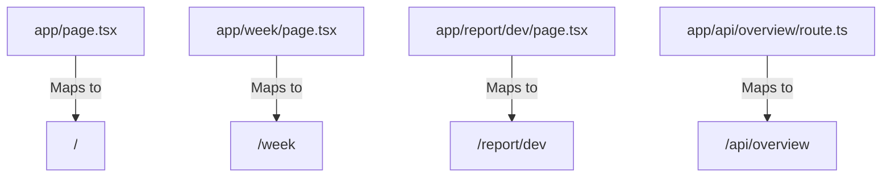
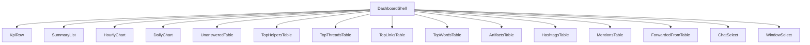
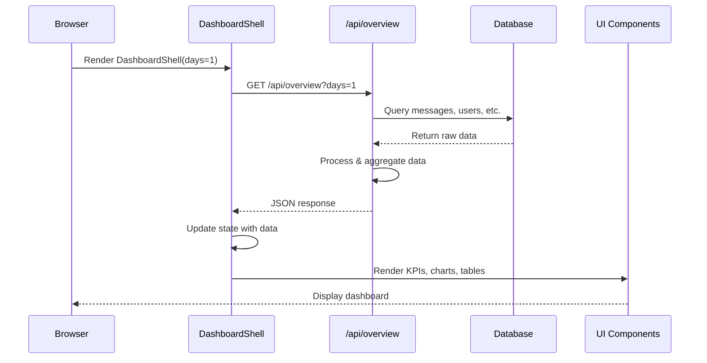

<cite>
**Referenced Files in This Document**   
- [app/page.tsx](file://app/page.tsx)
- [app/layout.tsx](file://app/layout.tsx)
- [app/components/DashboardShell.tsx](file://app/components/DashboardShell.tsx)
- [app/api/overview/route.ts](file://app/api/overview/route.ts)
- [app/hooks/useTimeFormatting.ts](file://app/hooks/useTimeFormatting.ts)
- [app/utils/time.ts](file://app/utils/time.ts)
- [app/components/atoms/KpiRow.tsx](file://app/components/atoms/KpiRow.tsx)
- [app/components/charts/HourlyChart.tsx](file://app/components/charts/HourlyChart.tsx)
- [app/components/tables/TopLinksTable.tsx](file://app/components/tables/TopLinksTable.tsx)
- [app/components/filters/WindowSelect.tsx](file://app/components/filters/WindowSelect.tsx)
</cite>

## Table of Contents
1. [Introduction](#introduction)
2. [Core Routing and Page Structure](#core-routing-and-page-structure)
3. [Shared Layout with layout.tsx](#shared-layout-with-layouttsx)
4. [API Endpoints in api/](#api-endpoints-in-api)
5. [Component Architecture](#component-architecture)
6. [Reusable Logic with Hooks](#reusable-logic-with-hooks)
7. [Utility Functions](#utility-functions)
8. [Client-Server Interaction Flow](#client-server-interaction-flow)
9. [File Naming and Routing Conventions](#file-naming-and-routing-conventions)
10. [Separation of Concerns and Scalability](#separation-of-concerns-and-scalability)

## Introduction

The `app/` directory serves as the central hub for the Next.js App Router architecture within the tg-vibecoders-dashboard application. It organizes all user-facing pages, API routes, shared UI components, reusable logic hooks, and utility functions into a cohesive structure that enables efficient development and maintainable code organization. This directory leverages Next.js conventions to automatically map file paths to application routes, enabling intuitive navigation and scalable growth.

**Section sources**
- [app/page.tsx](file://app/page.tsx#L1-L24)
- [app/layout.tsx](file://app/layout.tsx#L1-L23)

## Core Routing and Page Structure

The routing system is defined by `page.tsx` files located throughout the `app/` directory. Each `page.tsx` corresponds directly to a URL route. For example, `app/page.tsx` defines the root `/` route, which displays a 24-hour analytics view, while `app/week/page.tsx` defines the `/week` route for a 7-day overview. These page components serve as entry points that render specific UI layouts by composing higher-level components like `DashboardShell`. The presence of `app/report/dev/page.tsx` further demonstrates how nested directories create deeper routes (`/report/dev`) for specialized views.

**Diagram sources**
- [app/page.tsx](file://app/page.tsx#L1-L24)
- [app/week/page.tsx](file://app/week/page.tsx)
- [app/report/dev/page.tsx](file://app/report/dev/page.tsx)

**Section sources**
- [app/page.tsx](file://app/page.tsx#L1-L24)

## Shared Layout with layout.tsx

The `layout.tsx` file provides a consistent structural foundation across all pages in the application. It defines the outermost HTML document structure, including `<html>`, `<head>`, and `<body>` tags, along with global metadata such as the page title "Telegram Dashboard". The layout also renders persistent UI elements like the header navigation bar containing links to Home and Report Dev, ensuring these elements remain visible during client-side navigation between routes. Child page content is injected via the `children` prop, allowing individual pages to define their unique content while inheriting the shared shell.

**Section sources**
- [app/layout.tsx](file://app/layout.tsx#L1-L23)

## API Endpoints in api/

The `app/api/` subdirectory contains server-side endpoints that handle data retrieval and processing. Each `route.ts` file exports HTTP method handlers (e.g., `GET`) that respond to client requests. For instance, `app/api/overview/route.ts` implements the `/api/overview` endpoint, which queries a PostgreSQL database to fetch comprehensive analytics data including message counts, user activity, top links, hashtags, mentions, unanswered questions, and forwarded content. The endpoint supports query parameters like `days` and `chat_id` to filter results dynamically. Other API routes under `report/` suggest additional functionality for generating reports, insights, and previews.

**Section sources**
- [app/api/overview/route.ts](file://app/api/overview/route.ts#L1-L523)

## Component Architecture

Components are organized within `app/components/` using an atomic design pattern that promotes reusability and clarity. The hierarchy includes:

- **Atoms**: Foundational UI elements like `KpiCard.tsx` and `KpiRow.tsx` that display key performance indicators.
- **Charts**: Visualization components such as `HourlyChart.tsx` and `DailyChart.tsx` that render time-series data using Chart.js.
- **Tables**: Data display components including `TopLinksTable.tsx`, `TopWordsTable.tsx`, and others that present ranked lists.
- **Filters**: Interactive controls like `ChatSelect.tsx` and `WindowSelect.tsx` that allow users to modify dashboard views.

The `DashboardShell.tsx` component orchestrates these subcomponents, arranging them into a responsive grid layout and managing state for data fetching and display preferences.

**Diagram sources**
- [app/components/DashboardShell.tsx](file://app/components/DashboardShell.tsx#L1-L103)
- [app/components/atoms/KpiRow.tsx](file://app/components/atoms/KpiRow.tsx#L1-L33)
- [app/components/charts/HourlyChart.tsx](file://app/components/charts/HourlyChart.tsx#L1-L68)
- [app/components/tables/TopLinksTable.tsx](file://app/components/tables/TopLinksTable.tsx#L1-L33)

**Section sources**
- [app/components/DashboardShell.tsx](file://app/components/DashboardShell.tsx#L1-L103)

## Reusable Logic with Hooks

Custom React hooks in `app/hooks/` encapsulate reusable client-side logic. The `useTimeFormatting.ts` hook provides localized date and time formatting functions (`formatHourLocal`, `formatDateLocal`) that ensure consistent presentation of temporal data across components. Another hook, `useNumberFormatter.ts`, offers number formatting capabilities used in tables like `TopLinksTable` to display large counts in a readable format. These hooks abstract presentation logic away from UI components, promoting consistency and reducing duplication.

**Section sources**
- [app/hooks/useTimeFormatting.ts](file://app/hooks/useTimeFormatting.ts#L1-L18)

## Utility Functions

The `app/utils/` directory contains pure utility functions independent of React rendering. Currently, `time.ts` exports `build24hRange()`, which generates an array of ISO timestamp strings representing each hour in a 24-hour window. This function is consumed by `HourlyChart.tsx` to construct complete time axes even when some hours lack corresponding data points, ensuring accurate visual representation of activity patterns over time.

**Section sources**
- [app/utils/time.ts](file://app/utils/time.ts#L1-L22)

## Client-Server Interaction Flow

Client-server interaction occurs through a well-defined flow orchestrated by `DashboardShell.tsx`. When rendered, this component initiates a `fetch` request to `/api/overview`, optionally passing `days` and `chat_id` parameters based on user selection via `WindowSelect` and `ChatSelect`. The server processes this request by querying the database and returning structured JSON data. Upon receiving the response, `DashboardShell` updates its internal state using `useState`, triggering a re-render where various child components consume different slices of the data—such as `KpiRow` displaying metrics or `HourlyChart` plotting time-series values—demonstrating effective separation between data fetching, state management, and UI rendering.

**Diagram sources**
- [app/components/DashboardShell.tsx](file://app/components/DashboardShell.tsx#L1-L103)
- [app/api/overview/route.ts](file://app/api/overview/route.ts#L1-L523)

**Section sources**
- [app/components/DashboardShell.tsx](file://app/components/DashboardShell.tsx#L1-L103)

## File Naming and Routing Conventions

The application follows strict Next.js App Router conventions for file-based routing:
- `page.tsx`: Defines navigable UI routes (e.g., `/`, `/week`)
- `route.ts`: Defines API endpoints (e.g., `/api/overview`)
- Directory names directly translate to URL path segments
- Special files like `layout.tsx` provide shared UI without creating new routes

These conventions eliminate the need for manual route configuration, making the URL structure predictable and easy to extend by simply adding new files or directories.

**Section sources**
- [app/page.tsx](file://app/page.tsx#L1-L24)
- [app/api/overview/route.ts](file://app/api/overview/route.ts#L1-L523)

## Separation of Concerns and Scalability

The `app/` directory exemplifies clean separation of concerns through its modular organization:
- **Routing**: Handled by `page.tsx` and `route.ts` files
- **Layout**: Managed by `layout.tsx`
- **Business Logic**: Encapsulated in API route handlers
- **UI Components**: Structured atomically for reuse
- **State & Formatting**: Abstracted into custom hooks
- **Utilities**: Isolated in pure functions

This architecture enhances maintainability by localizing changes to specific modules and improves scalability by allowing new features to be added without disrupting existing functionality—for example, introducing new dashboard views or API endpoints follows established patterns with minimal coupling.