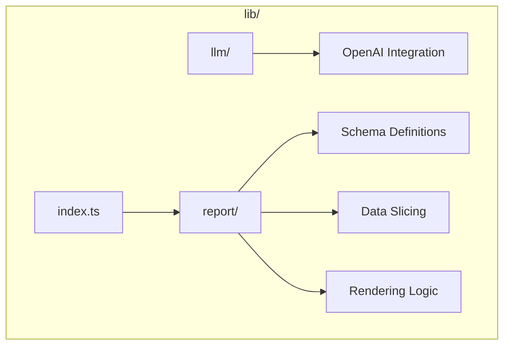
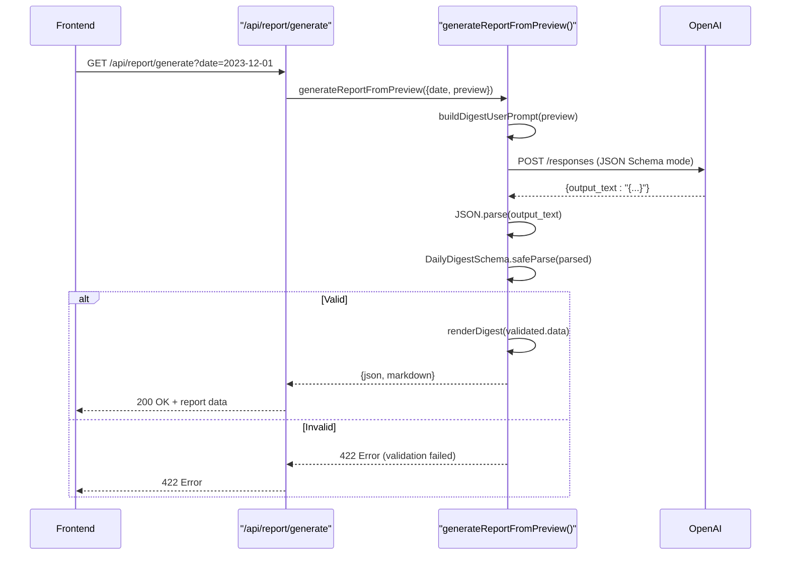

# lib/ Directory

<cite>
**Referenced Files in This Document**   
- [lib/llm/report.ts](file://lib/llm/report.ts)
- [lib/llm/shared.ts](file://lib/llm/shared.ts)
- [lib/report/digest_schema.ts](file://lib/report/digest_schema.ts)
- [lib/report/digest_render.ts](file://lib/report/digest_render.ts)
- [lib/report/index.ts](file://lib/report/index.ts)
- [lib/report/schema.ts](file://lib/report/schema.ts)
- [lib/report/slice.ts](file://lib/report/slice.ts)
- [app/api/report/generate/route.ts](file://app/api/report/generate/route.ts)
</cite>

## Table of Contents
1. [Introduction](#introduction)
2. [Core Structure and Purpose](#core-structure-and-purpose)
3. [Subdirectory: llm/](#subdirectory-llm)
4. [Subdirectory: report/](#subdirectory-report)
5. [Integration with API Routes](#integration-with-api-routes)
6. [Data Flow Example](#data-flow-example)
7. [Benefits of Abstraction](#benefits-of-abstraction)

## Introduction

The `lib/` directory in the tg-vibecoders-dashboard serves as a modular business logic layer, intentionally decoupled from presentation components and routing concerns. It encapsulates core application functionality such as data retrieval, transformation, LLM integration, and structured output generation. This separation enables clean architecture, promotes code reuse, simplifies testing, and allows frontend and backend teams to work independently using well-defined interfaces.

**Section sources**
- [lib/llm/report.ts](file://lib/llm/report.ts#L1-L147)
- [lib/report/slice.ts](file://lib/report/slice.ts#L1-L347)

## Core Structure and Purpose

The `lib/` directory is organized into two primary subdirectories: `llm/` and `report/`. These modules handle distinct but interconnected responsibilities:

- **`llm/`**: Manages interactions with the OpenAI API, including prompt construction, response handling, and error management.
- **`report/`**: Contains logic for generating and formatting reports, including schema definitions, data slicing from the database, and rendering functions.

The `index.ts` file in the `report/` directory re-exports all key modules, enabling clean and consistent imports across the application (e.g., `import { buildDailyPreview } from 'lib/report'`). This design supports modularity and prevents deep import paths.



**Diagram sources**
- [lib/report/index.ts](file://lib/report/index.ts#L1-L7)
- [lib/llm/report.ts](file://lib/llm/report.ts#L1-L147)
- [lib/report/slice.ts](file://lib/report/slice.ts#L1-L347)

## Subdirectory: llm/

The `llm/` subdirectory contains logic specific to interacting with large language models via the OpenAI API. It includes two main files:

- **`report.ts`**: Exports the `generateReportFromPreview` function, which orchestrates the full LLM request lifecycle. It constructs the API payload using predefined prompts and schemas, sends the request, handles timeouts, parses the JSON response, validates it against a Zod schema (`DailyDigestSchema`), and returns both structured JSON and rendered Markdown.
- **`shared.ts`**: Defines shared constants and utilities used across LLM operations, including:
  - `SYSTEM_PROMPT` and `INSIGHTS_SYSTEM_PROMPT`: Instruction templates guiding the LLM's behavior.
  - `buildDigestUserPrompt()` and `buildInsightsUserPrompt()`: Functions that format input data for the LLM.
  - `trimPreviewForModel()`: Reduces payload size to stay within token limits.

This separation ensures that prompt engineering and API interaction logic are reusable and testable in isolation.



**Diagram sources**
- [lib/llm/report.ts](file://lib/llm/report.ts#L16-L96)
- [lib/llm/shared.ts](file://lib/llm/shared.ts#L1-L108)
- [app/api/report/generate/route.ts](file://app/api/report/generate/route.ts#L1-L51)

**Section sources**
- [lib/llm/report.ts](file://lib/llm/report.ts#L1-L147)
- [lib/llm/shared.ts](file://lib/llm/shared.ts#L1-L108)

## Subdirectory: report/

The `report/` directory houses the core report generation logic, focusing on data modeling, extraction, and presentation.

### Schema Definitions

- **`schema.ts`**: Defines `PreviewType` using Zod, representing the raw data structure retrieved from the database. This includes KPIs, top threads, unanswered messages, and message lists.
- **`digest_schema.ts`**: Defines `DailyDigestSchema`, a Zod schema that validates the structure of the LLM-generated JSON output. It ensures fields like `discussions`, `stats`, and `insights` conform to expected types. The `DailyDigestJsonSchemaForLLM` export provides a compatible JSON Schema for OpenAI’s strict mode, enforcing type safety at the API level.

### Data Processing and Rendering

- **`slice.ts`**: Exports `buildDailyPreview()`, which queries the PostgreSQL database to extract and aggregate daily chat data. It computes metrics, identifies top content, and formats messages with enriched author information.
- **`digest_render.ts`**: Contains `renderDigest()`, which transforms validated `DailyDigest` objects into human-readable Markdown strings suitable for Telegram or UI display.

### Module Re-exporting

- **`index.ts`**: Re-exports all public APIs from `schema.ts`, `slice.ts`, `digest_schema.ts`, and `digest_render.ts`, providing a single entry point for consumers.

```mermaid
classDiagram
class DailyDigestSchema {
+discussions : DiscussionItem[]
+resources : string[]
+unanswered_questions : string[]
+stats : Object
+insights? : string[]
}
class PreviewType {
+kpi : Object
+hourly : {hour, cnt}[]
+topThreads : Object[]
+unanswered : Object[]
+messages? : Message[]
+meta : Object
}
class buildDailyPreview {
+returns PreviewType
}
class generateReportFromPreview {
+returns {json : DailyDigest, markdown : string}
}
class renderDigest {
+returns string (Markdown)
}
DailyDigestSchema <-- generateReportFromPreview : uses for validation
PreviewType <-- buildDailyPreview : returns
buildDailyPreview --> generateReportFromPreview : provides input
generateReportFromPreview --> renderDigest : provides input
```

**Diagram sources**
- [lib/report/digest_schema.ts](file://lib/report/digest_schema.ts#L1-L66)
- [lib/report/schema.ts](file://lib/report/schema.ts#L1-L57)
- [lib/report/slice.ts](file://lib/report/slice.ts#L100-L344)
- [lib/report/digest_render.ts](file://lib/report/digest_render.ts#L1-L35)
- [lib/report/index.ts](file://lib/report/index.ts#L1-L7)

**Section sources**
- [lib/report/digest_schema.ts](file://lib/report/digest_schema.ts#L1-L66)
- [lib/report/schema.ts](file://lib/report/schema.ts#L1-L57)
- [lib/report/slice.ts](file://lib/report/slice.ts#L1-L347)
- [lib/report/digest_render.ts](file://lib/report/digest_render.ts#L1-L35)
- [lib/report/index.ts](file://lib/report/index.ts#L1-L7)

## Integration with API Routes

The `lib/` directory is directly consumed by API routes such as `/api/report/generate`. This route