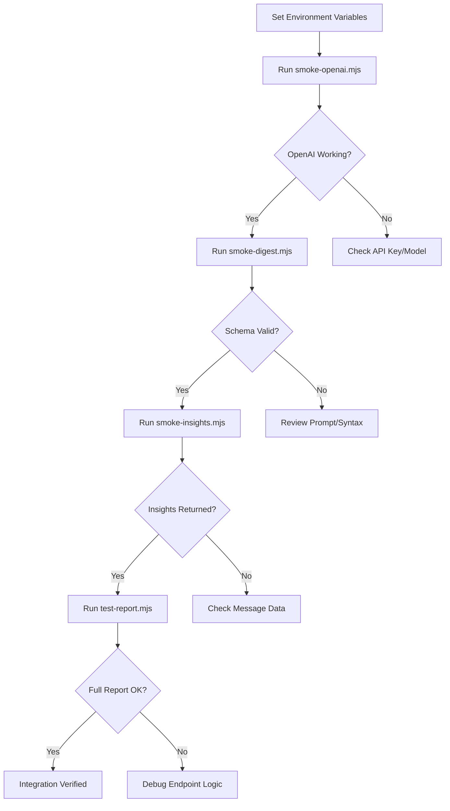

# scripts/ Directory

<cite>
**Referenced Files in This Document**   
- [smoke-digest.mjs](file://scripts/smoke-digest.mjs)
- [smoke-insights.mjs](file://scripts/smoke-insights.mjs)
- [smoke-openai.mjs](file://scripts/smoke-openai.mjs)
- [test-report.mjs](file://scripts/test-report.mjs)
- [digest_schema.ts](file://lib/report/digest_schema.ts)
- [route.ts](file://app/api/report/insights/route.ts)
- [route.ts](file://app/api/report/generate/route.ts)
- [slice.ts](file://lib/report/slice.ts)
- [report.ts](file://lib/llm/report.ts)
- [shared.ts](file://lib/llm/shared.ts)
</cite>

## Table of Contents
1. [Introduction](#introduction)
2. [Core Scripts Overview](#core-scripts-overview)
3. [Script Usage and Execution](#script-usage-and-execution)
4. [Integration Testing Workflow](#integration-testing-workflow)
5. [Troubleshooting and Output Interpretation](#troubleshooting-and-output-interpretation)
6. [Best Practices for CI/CD Integration](#best-practices-for-ci-cd-integration)

## Introduction
The `scripts/` directory in the tg-vibecoders-dashboard project contains a suite of standalone Node.js scripts designed to validate critical integration points, particularly those involving external APIs and LLM-generated content. These scripts serve as smoke tests that ensure core functionality remains intact during development, debugging, and continuous integration workflows. By simulating real-world API interactions and validating response structures, these tools help catch integration failures early—such as authentication issues, rate limiting, schema mismatches, or service outages—before they impact end users.

These scripts are essential for maintaining reliability in a system that depends heavily on OpenAI's Responses API for structured output generation and internal endpoints for report previews and insights. They provide developers with fast feedback loops and enable automated verification in both local environments and CI/CD pipelines.

**Section sources**
- [smoke-openai.mjs](file://scripts/smoke-openai.mjs#L1-L103)
- [test-report.mjs](file://scripts/test-report.mjs#L1-L93)

## Core Scripts Overview

### smoke-openai.mjs
This script validates connectivity and correct usage of the OpenAI Responses API. It sends a minimal request using strict JSON schema formatting to verify that:
- The `OPENAI_API_KEY` and `OPENAI_MODEL` environment variables are correctly set
- The API responds with valid structured output
- JSON parsing and response handling logic function properly

It uses the OpenAI SDK to create a response with a predefined schema requiring `{ json: { ok: true }, markdown: "..." }`, then verifies the output conforms to expectations. This is the first line of defense against configuration errors or service disruptions.

**Section sources**
- [smoke-openai.mjs](file://scripts/smoke-openai.mjs#L1-L103)

### smoke-digest.mjs
This script specifically targets the LLM-powered digest generation pipeline. It tests whether the model can produce a response that strictly adheres to the `DailyDigestSchema` defined in the application. The test includes:
- A synthetic input message set
- A precise system instruction in Russian (to match production context)
- Validation against the full JSON schema used by the `/api/report/generate` endpoint

The script confirms that the generated JSON matches the expected structure—including required fields like `discussions`, `stats`, and `insights`—and fails if any schema violations occur.

**Section sources**
- [smoke-digest.mjs](file://scripts/smoke-digest.mjs#L1-L117)
- [digest_schema.ts](file://lib/report/digest_schema.ts#L1-L67)

### smoke-insights.mjs
This script verifies the `/api/report/insights` endpoint, which generates free-form textual insights from chat messages. It checks:
- Server availability via `waitForServer`
- Successful HTTP response from the insights API
- Minimum length of the returned markdown content (ensuring meaningful output)

It accepts optional command-line arguments for date and chat ID, defaulting to yesterday’s data if not provided. A short or empty response triggers a failure, indicating potential issues with the LLM call or preprocessing logic.

**Section sources**
- [smoke-insights.mjs](file://scripts/smoke-insights.mjs#L1-L81)
- [route.ts](file://app/api/report/insights/route.ts#L1-L53)

### test-report.mjs
This comprehensive script performs end-to-end validation of the report generation workflow by testing two key endpoints:
- `/api/report/preview`: Ensures preview data is correctly retrieved and structured
- `/api/report/generate`: Validates full report generation including JSON and Markdown outputs

It confirms:
- Preview returns valid KPIs and hourly data
- Generated report has correct shape (`{ json, markdown }`)
- Both responses are well-formed and non-empty

This script acts as a final integration check before deployment.

**Section sources**
- [test-report.mjs](file://scripts/test-report.mjs#L1-L93)
- [route.ts](file://app/api/report/generate/route.ts#L1-L52)
- [slice.ts](file://lib/report/slice.ts#L1-L348)

## Script Usage and Execution

### Prerequisites
Ensure the following environment variables are set:
```
OPENAI_API_KEY=your_api_key_here
OPENAI_MODEL=gpt-4.1-mini
BASE_URL=http://localhost:3000
```

A `.env` file at the root of the project should contain these values.

### Running the Scripts
All scripts can be executed directly using Node.js:

```bash
# Test OpenAI API connectivity
node scripts/smoke-openai.mjs

# Test LLM digest pipeline with schema validation
node scripts/smoke-digest.mjs

# Test insights endpoint (uses BASE_URL)
node scripts/smoke-insights.mjs [YYYY-MM-DD] [chat_id]

# Run full report generation test
node scripts/test-report.mjs [YYYY-MM-DD] [chat_id]
```

Optional parameters `[YYYY-MM-DD]` and `[chat_id]` allow targeting specific dates and chats. If omitted, scripts use defaults (typically yesterday's date).

### Expected Output Examples
Successful runs emit JSON or plain text indicating success:
```json
{"ok":true,"request_id":"req_abc123","markdown_len":123}
```
or
```
insights_ok { length: 456, snippet: 'Team decided to...' }
```

Failures log error details to stderr and exit with non-zero status codes.

**Section sources**
- [smoke-openai.mjs](file://scripts/smoke-openai.mjs#L1-L103)
- [smoke-digest.mjs](file://scripts/smoke-digest.mjs#L1-L117)
- [smoke-insights.mjs](file://scripts/smoke-insights.mjs#L1-L81)
- [test-report.mjs](file://scripts/test-report.mjs#L1-L93)

## Integration Testing Workflow

These scripts are designed to be run in sequence to validate the entire reporting stack:



**Diagram sources**
- [smoke-openai.mjs](file://scripts/smoke-openai.mjs#L1-L103)
- [smoke-digest.mjs](file://scripts/smoke-digest.mjs#L1-L117)
- [smoke-insights.mjs](file://scripts/smoke-insights.mjs#L1-L81)
- [test-report.mjs](file://scripts/test-report.mjs#L1-L93)

This workflow ensures each layer—from external API access to internal endpoint behavior—is validated before proceeding to more complex integrations.

## Troubleshooting and Output Interpretation

### Common Failure Modes

| Exit Code | Meaning | Likely Cause | Resolution |
|---------|--------|-------------|-----------|
| 1 | Missing credentials | `OPENAI_API_KEY` or `OPENAI_MODEL` not set | Verify `.env` file contents |
| 2 | Empty response | No output from OpenAI | Check network, retry, inspect request ID |
| 3 | Invalid JSON | Model returned malformed JSON | Review prompt clarity, schema constraints |
| 4 | Shape mismatch | Response doesn't match expected structure | Validate schema alignment |
| 10 | Script error | Unhandled exception in script | Check Node.js version, dependencies |

### Interpreting Error Output
When a script fails, it outputs structured JSON to stderr:
```json
{
  "error": "invalid_json_from_model",
  "request_id": "req_xyz789",
  "snippet": "{\"discussio"
}
```
Use the `request_id` to trace logs in OpenAI's dashboard. The `snippet` helps identify parsing issues like truncated or corrupted JSON.

For HTTP-level failures:
```
insights_failed 500 { "error": "internal_error" }
```
Check backend logs for exceptions in `generateInsightsFromMessages`.

### Debugging Tips
- Use `console.log` statements sparingly; prefer structured