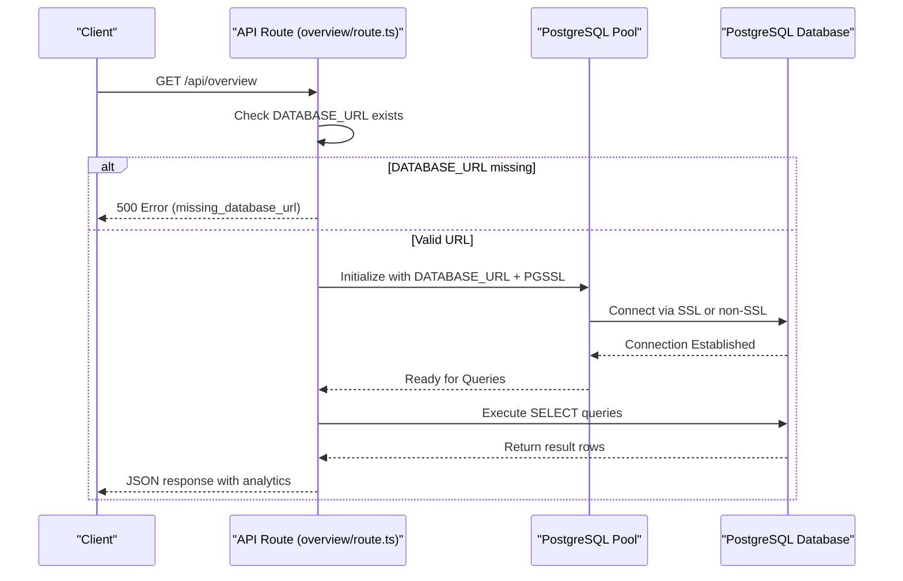

# Environment Configuration

<cite>
**Referenced Files in This Document**   
- [app/api/overview/route.ts](file://app/api/overview/route.ts)
- [lib/report/slice.ts](file://lib/report/slice.ts)
- [lib/llm/report.ts](file://lib/llm/report.ts)
- [package.json](file://package.json)
- [.env.example](file://.env.example)
- [README.md](file://README.md)
</cite>

## Table of Contents
1. [Introduction](#introduction)
2. [Required Environment Variables](#required-environment-variables)
3. [Configuration File Setup](#configuration-file-setup)
4. [Database Connection Usage in API Routes](#database-connection-usage-in-api-routes)
5. [Configuration Best Practices](#configuration-best-practices)
6. [Deployment-Specific Settings](#deployment-specific-settings)
7. [Troubleshooting Common Issues](#troubleshooting-common-issues)
8. [Conclusion](#conclusion)

## Introduction
This document provides comprehensive guidance on environment configuration for the `tg-vibecoders-dashboard` application. It covers essential environment variables, setup procedures, usage patterns within the codebase, best practices, deployment considerations, and troubleshooting tips to ensure smooth operation across different environments.

## Required Environment Variables
The following environment variables are required or optional for proper application functionality:

- **DATABASE_URL**: PostgreSQL connection string compatible with Railway. This is mandatory for database connectivity.
- **PORT**: Port number on which the server binds (default: 3000). Optional; if not specified, defaults to 3000.
- **PGSSL=disable**: Optional flag to disable SSL when connecting to the PostgreSQL database. When set, SSL verification is turned off.

These variables control core application behavior including database access and network binding.

**Section sources**
- [README.md](file://README.md#L25-L35)
- [package.json](file://package.json#L10-L15)

## Configuration File Setup
The project includes a template file `.env.example` that serves as a blueprint for local development setup. Developers should copy this file to `.env` and populate it with actual values:

```bash
cp .env.example .env
```

The `.env` file is used by the `dotenv` library to load environment variables into `process.env`, making them accessible throughout the Node.js application. The `dotenv` package is listed as a dependency in `package.json`, confirming its integration into the project.

It is critical to never commit the `.env` file to version control systems like Git, as it may contain sensitive credentials. Instead, only the `.env.example` file should be committed, providing a safe template for team members.

**Section sources**
- [README.md](file://README.md#L20-L24)
- [package.json](file://package.json#L25-L30)

## Database Connection Usage in API Routes
The `DATABASE_URL` environment variable is consumed directly in API route handlers to establish connections to the PostgreSQL database using the `pg` client library.

In `app/api/overview/route.ts`, a `Pool` instance is created using the connection string from `process.env.DATABASE_URL`. Additionally, the `PGSSL` flag determines whether SSL is enabled during the connection:

```ts
const pool = new Pool({
  connectionString: process.env.DATABASE_URL,
  ssl: process.env.PGSSL === 'disable' ? false : { rejectUnauthorized: false },
});
```

Before executing queries, the code validates the presence of `DATABASE_URL`. If missing, it returns a 500 error response:

```ts
if (!process.env.DATABASE_URL) {
  return NextResponse.json({ error: 'missing_database_url' }, { status: 500 });
}
```

Similar logic is implemented in `lib/report/slice.ts`, where the same environment variables are used to configure the database pool, ensuring consistent behavior across modules.



**Diagram sources**
- [app/api/overview/route.ts](file://app/api/overview/route.ts#L5-L40)
- [lib/report/slice.ts](file://lib/report/slice.ts#L33-L101)

**Section sources**
- [app/api/overview/route.ts](file://app/api/overview/route.ts#L1-L50)
- [lib/report/slice.ts](file://lib/report/slice.ts#L1-L50)

## Configuration Best Practices
To maintain security and operational stability, follow these configuration best practices:

- **Never commit `.env` files**: Always exclude `.env` from version control using `.gitignore`. Only share templates like `.env.example`.
- **Use distinct URLs per environment**: Employ separate database URLs for development, staging, and production to prevent data leakage or accidental modifications.
- **Validate connections at startup**: Ensure the application checks for valid `DATABASE_URL` before attempting any database operations, failing fast if misconfigured.
- **Secure secrets management**: Avoid hardcoding credentials. Use secure secret storage mechanisms provided by deployment platforms.
- **Default values for non-sensitive settings**: Use reasonable defaults (e.g., PORT=3000) while allowing overrides through environment variables.

These practices help prevent configuration drift and reduce the risk of runtime failures due to incorrect settings.

**Section sources**
- [README.md](file://README.md#L20-L35)
- [app/api/overview/route.ts](file://app/api/overview/route.ts#L40-L45)

## Deployment-Specific Settings
When deploying to platforms such as Vercel, Render, or Railway, environment variables must be configured manually through the platform's dashboard or CLI tools.

For example:
- On **Vercel**, use the project settings UI or `vercel env add` command to inject `DATABASE_URL`, `PORT`, and `PGSSL`.
- On **Render**, define these variables under the "Environment" section of the service configuration.
- On **Railway**, set variables directly in the service settings panel, ensuring the PostgreSQL database is linked correctly.

Ensure that the runtime environment matches the expected Node.js version (>=18), as specified in the `engines` field of `package.json`.

Additionally, verify that the deployed environment allows outbound connections to the PostgreSQL host, especially if SSL is disabled or custom ports are used.

**Section sources**
- [README.md](file://README.md#L70-L75)
- [package.json](file://package.json#L7-L9)

## Troubleshooting Common Issues
Common configuration-related issues and their resolutions include:

- **Connection timeouts**: Verify that the `DATABASE_URL` is correct and the database accepts connections from the application’s IP address. Check firewall rules and network policies.
- **SSL errors**: If encountering certificate validation errors, set `PGSSL=disable` temporarily for testing. However, re-enable SSL in production unless explicitly unnecessary.
- **Invalid credentials**: Double-check username, password, host, and port in the `DATABASE_URL`. A malformed URL will prevent connection.
- **Missing DATABASE_URL error**: Confirm that the environment variable is properly set in the deployment environment and accessible to the Node.js process.
- **Port binding conflicts**: If another service uses the default port (3000), change the `PORT` variable to an available port.

Logs from the application (e.g., console output) can provide further insight into connection attempts and failure reasons.

**Section sources**
- [README.md](file://README.md#L76-L82)
- [app/api/overview/route.ts](file://app/api/overview/route.ts#L40-L45)

## Conclusion
Proper environment configuration is crucial for the reliable operation of `tg-vibecoders-dashboard`. By adhering to the guidelines outlined—using `.env` safely, validating configurations early, managing secrets securely, and understanding deployment requirements—you can avoid common pitfalls and ensure seamless operation across all environments.