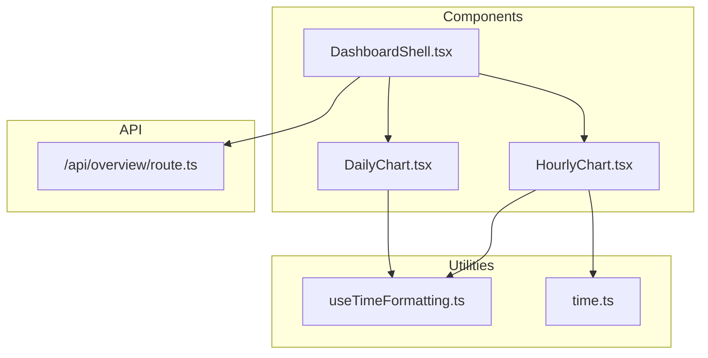
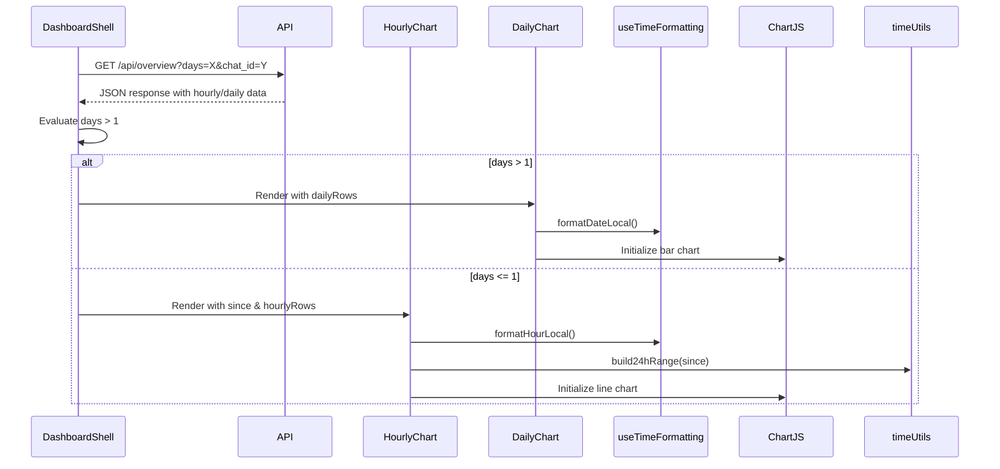
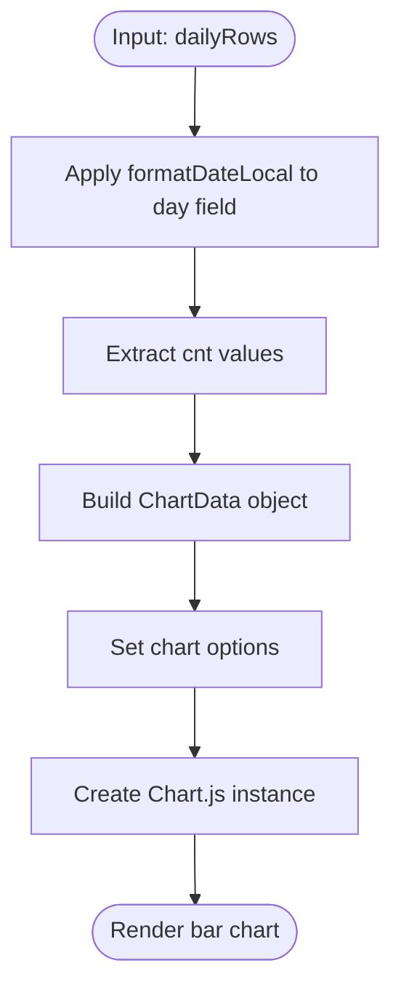
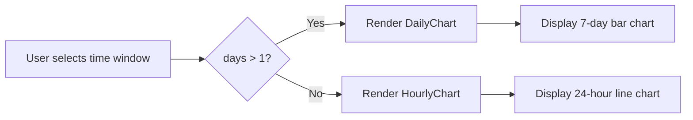
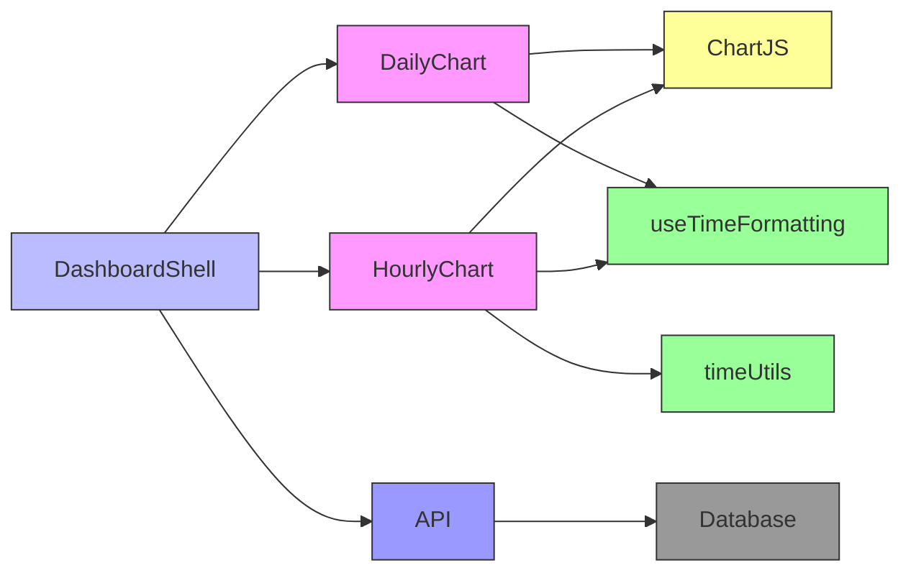

# Chart Components

<cite>
**Referenced Files in This Document**
- [DailyChart.tsx](file://app/components/charts/DailyChart.tsx)
- [HourlyChart.tsx](file://app/components/charts/HourlyChart.tsx)
- [DashboardShell.tsx](file://app/components/DashboardShell.tsx)
- [useTimeFormatting.ts](file://app/hooks/useTimeFormatting.ts)
- [time.ts](file://app/utils/time.ts)
- [route.ts](file://app/api/overview/route.ts)
</cite>

## Table of Contents
1. [Introduction](#introduction)
2. [Project Structure](#project-structure)
3. [Core Components](#core-components)
4. [Architecture Overview](#architecture-overview)
5. [Detailed Component Analysis](#detailed-component-analysis)
6. [Dependency Analysis](#dependency-analysis)
7. [Performance Considerations](#performance-considerations)
8. [Troubleshooting Guide](#troubleshooting-guide)
9. [Conclusion](#conclusion)

## Introduction
This document provides comprehensive documentation for the charting system in the tg-vibecoders-dashboard application, focusing on temporal message activity visualization through `DailyChart.tsx` and `HourlyChart.tsx`. The components render message trends using Chart.js, with `HourlyChart` displaying 24-hour patterns and `DailyChart` showing 7-day activity. Data is sourced from the `/api/overview` endpoint and processed using time formatting utilities to ensure proper localization.

## Project Structure
The chart components are located within the `app/components/charts/` directory and are integrated into the main dashboard via `DashboardShell`. They consume data derived from API responses and utilize hooks and utility functions for time manipulation and formatting.



**Diagram sources**
- [DailyChart.tsx](file://app/components/charts/DailyChart.tsx)
- [HourlyChart.tsx](file://app/components/charts/HourlyChart.tsx)
- [DashboardShell.tsx](file://app/components/DashboardShell.tsx)
- [useTimeFormatting.ts](file://app/hooks/useTimeFormatting.ts)
- [time.ts](file://app/utils/time.ts)
- [route.ts](file://app/api/overview/route.ts)

**Section sources**
- [DailyChart.tsx](file://app/components/charts/DailyChart.tsx)
- [HourlyChart.tsx](file://app/components/charts/HourlyChart.tsx)
- [DashboardShell.tsx](file://app/components/DashboardShell.tsx)

## Core Components
The core charting components are `DailyChart` and `HourlyChart`, both implemented as React client components using Chart.js for rendering. These components receive pre-aggregated temporal data (`dailyRows`, `hourlyRows`) from the `/api/overview` endpoint and transform it into visual representations of message activity over time.

**Section sources**
- [DailyChart.tsx](file://app/components/charts/DailyChart.tsx#L1-L45)
- [HourlyChart.tsx](file://app/components/charts/HourlyChart.tsx#L1-L67)

## Architecture Overview
The charting system follows a data-flow architecture where the `DashboardShell` component fetches aggregated message statistics from the backend API and conditionally renders either the hourly or daily chart based on user-selected time window. The charts process timestamped data using formatting hooks and construct Chart.js configurations for responsive rendering.



**Diagram sources**
- [DashboardShell.tsx](file://app/components/DashboardShell.tsx#L22-L99)
- [route.ts](file://app/api/overview/route.ts#L1-L522)
- [DailyChart.tsx](file://app/components/charts/DailyChart.tsx#L12-L42)
- [HourlyChart.tsx](file://app/components/charts/HourlyChart.tsx#L14-L64)

## Detailed Component Analysis

### DailyChart Analysis
The `DailyChart` component visualizes weekly message activity using a bar chart. It receives an array of daily message counts and formats dates using the `useTimeFormatting` hook for localized display.

#### Data Transformation Process


**Diagram sources**
- [DailyChart.tsx](file://app/components/charts/DailyChart.tsx#L12-L42)

**Section sources**
- [DailyChart.tsx](file://app/components/charts/DailyChart.tsx#L12-L42)

### HourlyChart Analysis
The `HourlyChart` component displays 24-hour message trends using a line chart. It implements data normalization to ensure all hours in a day are represented, even when no messages were sent during certain periods.

#### Data Normalization Logic
```mermaid
classDiagram
class HourlyChart {
+since : string
+hourlyRows : Array<{hour : string; cnt : number}>
-rangeHours : string[]
-map : Map<string, number>
-labels : string[]
-series : number[]
+build24hRange(since) : string[]
+formatHourLocal(iso) : string
}
class timeUtils {
+build24hRange(since? : string) : string[]
}
class useTimeFormatting {
+formatHourLocal(iso : string) : string
}
HourlyChart --> timeUtils : uses
HourlyChart --> useTimeFormatting : uses
```

**Diagram sources**
- [HourlyChart.tsx](file://app/components/charts/HourlyChart.tsx#L14-L64)
- [time.ts](file://app/utils/time.ts#L1-L21)
- [useTimeFormatting.ts](file://app/hooks/useTimeFormatting.ts#L2-L14)

**Section sources**
- [HourlyChart.tsx](file://app/components/charts/HourlyChart.tsx#L14-L64)

### Conditional Rendering in DashboardShell
The `DashboardShell` component determines which chart to render based on the selected time window (days parameter).



**Diagram sources**
- [DashboardShell.tsx](file://app/components/DashboardShell.tsx#L22-L99)

**Section sources**
- [DashboardShell.tsx](file://app/components/DashboardShell.tsx#L22-L99)

## Dependency Analysis
The chart components depend on several key modules for proper functionality:



**Diagram sources**
- [DailyChart.tsx](file://app/components/charts/DailyChart.tsx)
- [HourlyChart.tsx](file://app/components/charts/HourlyChart.tsx)
- [DashboardShell.tsx](file://app/components/DashboardShell.tsx)
- [useTimeFormatting.ts](file://app/hooks/useTimeFormatting.ts)
- [time.ts](file://app/utils/time.ts)
- [route.ts](file://app/api/overview/route.ts)

**Section sources**
- [DailyChart.tsx](file://app/components/charts/DailyChart.tsx)
- [HourlyChart.tsx](file://app/components/charts/HourlyChart.tsx)
- [DashboardShell.tsx](file://app/components/DashboardShell.tsx)

## Performance Considerations
The `HourlyChart` component implements performance optimization through `useMemo` to prevent unnecessary recalculations of the normalized hourly data. The chart instances are properly cleaned up using useEffect cleanup functions to avoid memory leaks. Both charts use responsive configuration to adapt to different screen sizes while maintaining aspect ratio.

**Section sources**
- [HourlyChart.tsx](file://app/components/charts/HourlyChart.tsx#L14-L64)

## Troubleshooting Guide
Common issues and their solutions:

- **Empty chart display**: Ensure API response contains valid `hourly` or `daily` arrays. Check network tab for successful `/api/overview` request.
- **Incorrect time zones**: Verify that timestamps are properly formatted using UTC in ISO format. The `useTimeFormatting` hook handles client-side localization.
- **Missing data points**: For `HourlyChart`, confirm that `since` prop is provided and valid. The `build24hRange` utility requires a valid starting timestamp.
- **Chart not updating**: Ensure dependencies in useEffect and useMemo are correctly specified, including `formatHourLocal` and `formatDateLocal` from the hook.
- **Memory leaks**: Chart instances are destroyed on unmount and before recreation, preventing accumulation of unused chart objects.

**Section sources**
- [DailyChart.tsx](file://app/components/charts/DailyChart.tsx)
- [HourlyChart.tsx](file://app/components/charts/HourlyChart.tsx)
- [useTimeFormatting.ts](file://app/hooks/useTimeFormatting.ts)

## Conclusion
The charting system in tg-vibecoders-dashboard effectively visualizes temporal message activity through two specialized components: `DailyChart` for weekly patterns and `HourlyChart` for daily trends. The implementation leverages Chart.js for rendering, with careful attention to data normalization, time formatting, and performance optimization. The conditional rendering logic in `DashboardShell` ensures appropriate chart selection based on user preferences, while the modular design allows for easy maintenance and extension.