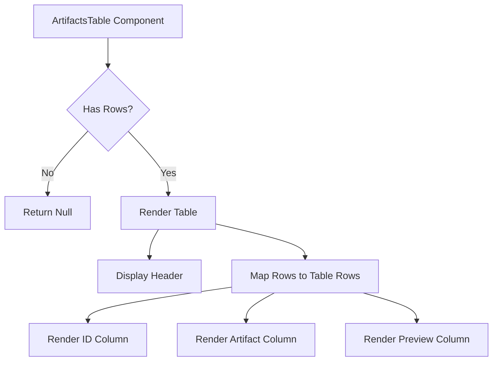
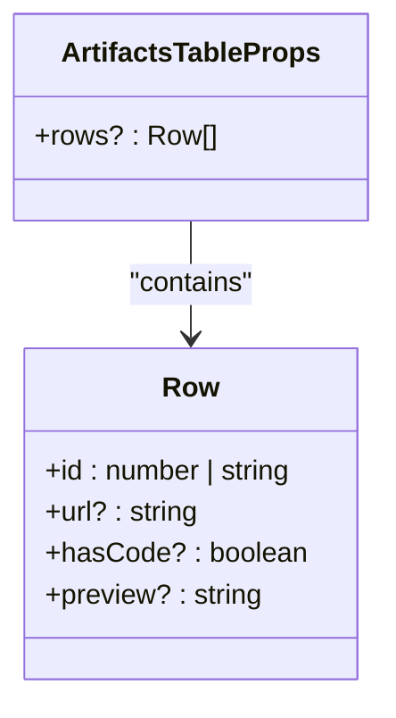

# Artifacts Table

<cite>
**Referenced Files in This Document**  
- [ArtifactsTable.tsx](file://app/components/tables/ArtifactsTable.tsx)
- [DashboardShell.tsx](file://app/components/DashboardShell.tsx)
- [route.ts](file://app/api/overview/route.ts)
</cite>

## Table of Contents
1. [Introduction](#introduction)
2. [Component Overview](#component-overview)
3. [Props Structure and Data Model](#props-structure-and-data-model)
4. [Conditional Rendering Logic](#conditional-rendering-logic)
5. [Integration with Dashboard System](#integration-with-dashboard-system)
6. [Data Source and Artifact Detection](#data-source-and-artifact-detection)
7. [UI Behavior and Responsive Design](#ui-behavior-and-responsive-design)
8. [Localization and Header Labels](#localization-and-header-labels)
9. [Example Usage Scenarios](#example-usage-scenarios)
10. [Integration Opportunities](#integration-opportunities)
11. [Enhancement Suggestions](#enhancement-suggestions)

## Introduction

The ArtifactsTable component serves as a specialized UI element within the Vibecoders dashboard system, designed to track and display project artifacts and significant "ship-it" moments. These artifacts represent tangible outputs from development activities, such as code deployments, GitHub repositories, or inline code snippets shared within communication channels. The component plays a crucial role in capturing evidence of progress and technical output across team communications.

**Section sources**
- [ArtifactsTable.tsx](file://app/components/tables/ArtifactsTable.tsx#L1-L20)

## Component Overview

The ArtifactsTable is a client-side React component that renders a tabular view of project artifacts extracted from message data. It functions as part of a larger dashboard ecosystem, specifically integrated into the main dashboard layout through the DashboardShell component. The table displays three primary columns: identifier (ID), artifact reference, and preview content.

When no artifacts are present, the component returns null rather than rendering an empty state, effectively hiding itself from the UI. This behavior ensures a clean interface by only showing relevant sections when data is available.



**Diagram sources**
- [ArtifactsTable.tsx](file://app/components/tables/ArtifactsTable.tsx#L5-L20)

**Section sources**
- [ArtifactsTable.tsx](file://app/components/tables/ArtifactsTable.tsx#L5-L20)

## Props Structure and Data Model

The component accepts a single prop `rows` which conforms to the `ArtifactsTableProps` interface. The `Row` type defines the structure of each artifact entry with four key fields:

- `id`: A unique identifier that can be either a number or string, representing the message ID from which the artifact was extracted
- `url`: An optional string containing a web link to external resources like GitHub repositories or deployment URLs
- `hasCode`: An optional boolean flag indicating whether the message contains code snippets (detected by triple backticks)
- `preview`: An optional string containing a truncated version of the original message text for context

Notably, the component does not apply number formatting to the ID field since it represents identifiers rather than numerical metrics. This design choice preserves the exact message identification without any formatting transformations.



**Diagram sources**
- [ArtifactsTable.tsx](file://app/components/tables/ArtifactsTable.tsx#L2-L4)

**Section sources**
- [ArtifactsTable.tsx](file://app/components/tables/ArtifactsTable.tsx#L2-L4)

## Conditional Rendering Logic

The ArtifactsTable employs conditional rendering to handle different types of artifacts based on their properties. For each row, the component evaluates the presence of a URL and the `hasCode` flag to determine how to display the artifact reference:

- If a `url` is present, it renders an anchor tag with the URL as both href and displayed text, opening in a new tab with appropriate security attributes (`target="_blank"` and `rel="noreferrer noopener"`)
- If no URL exists but `hasCode` is true, it displays the static text "code snippet" to indicate inline code sharing
- When neither condition is met, the cell remains empty

This logic enables the table to accommodate mixed artifact types within the same dataset, providing appropriate visual treatment for external links versus internal code contributions.

```mermaid
flowchart TD
A[Process Artifact Row] --> B{URL Present?}
B --> |Yes| C[Render Link with URL]
B --> |No| D{Has Code?}
D --> |Yes| E[Render "code snippet"]
D --> |No| F[Render Empty Cell]
```

**Diagram sources**
- [ArtifactsTable.tsx](file://app/components/tables/ArtifactsTable.tsx#L10-L15)

**Section sources**
- [ArtifactsTable.tsx](file://app/components/tables/ArtifactsTable.tsx#L10-L15)

## Integration with Dashboard System

The ArtifactsTable is seamlessly integrated into the main dashboard layout through the DashboardShell component. It receives its data from the API response via the dashboard's data fetching mechanism, specifically consuming the `artifacts` array from the overview endpoint response.

Within the dashboard grid layout, the component occupies one cell in a five-column responsive grid alongside other analytical tables. This positioning places it among peer components that analyze different aspects of team communication and productivity.

```mermaid
graph TB
subgraph DashboardLayout
Direction: LR
KPI[KpiRow]
Summary[SummaryList]
Charts[Hourly/Daily Chart]
Tables[Grid of Tables]
subgraph TablesGrid
T1[TopLinksTable]
T2[TopWordsTable]
T3[ArtifactsTable]
T4[HashtagsTable]
T5[MentionsTable]
end
KPI --> Charts
Summary --> Charts
Charts --> Tables
end
API[(API Endpoint)] --> DashboardLayout
API --> |artifacts| ArtifactsTable
```

**Diagram sources**
- [DashboardShell.tsx](file://app/components/DashboardShell.tsx#L66-L99)

**Section sources**
- [DashboardShell.tsx](file://app/components/DashboardShell.tsx#L66-L99)

## Data Source and Artifact Detection

The artifact data displayed by the component originates from the `/api/overview` endpoint, where a dedicated processing block identifies potential artifacts from message content. The detection algorithm looks for two primary indicators:

1. **External Links**: Messages containing URLs that match known developer platforms including github.com, vercel.app, netlify.com, replit.com, or pages.dev domains
2. **Code Snippets**: Messages containing triple backtick sequences (```) which typically denote code blocks in Markdown formatting

For each qualifying message, the backend constructs an artifact object with the message ID as identifier, the detected URL (if any), a boolean flag for code presence, and a truncated preview of the message text. The system limits results to the 20 most recent artifacts.

**Section sources**
- [route.ts](file://app/api/overview/route.ts#L244-L278)

## UI Behavior and Responsive Design

The ArtifactsTable implements several responsive design features to ensure usability across different screen sizes:

- **Overflow Management**: The container uses `overflow-auto` with a maximum height of 64 units (`max-h-64`), enabling vertical scrolling when content exceeds available space
- **Spacing**: Consistent vertical spacing (`space-y-2`) between table elements improves readability
- **Responsive Grid**: As part of a larger grid system, the table adapts to different viewport widths, transitioning from single-column to multi-column layouts

The panel styling provides a consistent visual treatment matching other dashboard components, maintaining design cohesion throughout the interface.

**Section sources**
- [ArtifactsTable.tsx](file://app/components/tables/ArtifactsTable.tsx#L7-L8)

## Localization and Header Labels

The component uses Russian language for its header labels, reflecting the primary language of the target user base. The section header "Артефакты / Ship-it" combines Russian ("Артефакты") with English ("Ship-it") terminology, acknowledging both local language preferences and common tech industry jargon.

Table column headers are also in Russian:
- "ID" (English, retained as universal identifier term)
- "Артефакт" (Artifact)
- "Превью" (Preview)

This bilingual approach facilitates understanding while maintaining consistency with technical conventions.

**Section sources**
- [ArtifactsTable.tsx](file://app/components/tables/ArtifactsTable.tsx#L9-L11)

## Example Usage Scenarios

The ArtifactsTable handles various artifact types through its conditional rendering:

1. **GitHub Repository Link**: A message containing "Check out our new feature: https://github.com/team/project/pull/123" would render with the full URL as a clickable link in the artifact column
2. **Vercel Deployment**: A message with "Staging deployed: https://project-name.vercel.app" would similarly display the Vercel URL as an active link
3. **Inline Code Snippet**: A message containing "```javascript\nconst x = 42;\n```" would show "code snippet" in the artifact column without a link
4. **Combined Artifact**: A message with both a Vercel link and code block would be captured and display the URL as the primary artifact reference

Each entry includes the message ID and a text preview showing the context in which the artifact appeared.

**Section sources**
- [ArtifactsTable.tsx](file://app/components/tables/ArtifactsTable.tsx#L10-L15)
- [route.ts](file://app/api/overview/route.ts#L244-L278)

## Integration Opportunities

The ArtifactsTable presents several opportunities for enhanced integration with CI/CD systems:

- **Automated Artifact Enrichment**: Could integrate with build systems to add deployment status badges or environment indicators
- **Pull Request Detection**: Could enhance GitHub URL parsing to extract PR numbers and statuses from linked repositories
- **Build Status Integration**: Could fetch and display current build status from connected CI platforms
- **Deployment Tracking**: Could correlate artifacts with specific deployment events and environments

Such integrations would transform the component from a passive display into an active monitoring tool for development workflow visibility.

## Enhancement Suggestions

Several improvements could enhance the ArtifactsTable's functionality and user experience:

1. **Artifact Type Icons**: Add visual indicators distinguishing between link types (GitHub, Vercel, Netlify) and code snippets
2. **Status Badges**: Implement badges showing deployment status, PR review state, or build health
3. **Type Filtering**: Add controls to filter artifacts by type (links vs code snippets)
4. **Expanded Previews**: Implement hover or click interactions to show more of the message context
5. **Source Context**: Include additional metadata such as sender information or timestamp
6. **Direct Actions**: Add buttons for common actions like copying the URL or viewing the full message
7. **Customizable Domains**: Allow configuration of additional artifact domains beyond the hardcoded list

These enhancements would increase the component's utility while maintaining its focused purpose of tracking development artifacts and milestones.